Testomat.io offers comprehensive features for managing test runs, catering to both manual and automated testing. Here's how to manage runs within the system:

1. **Update Test Runs:** Add new test cases directly from Test Run, **Relaunch** finished Test Runs to update tests statuses, or **Launch a copy**. Find more information in the sections below.

2. **Filter Test Runs:** Filter runs and **share the filter parameters** with your teammates directly via URL. find more information added in the sections below.

3. **Group Runs:** Organize your runs into **RunGroups** based on criteria like sprint, release, functional area, or any other logical grouping. Read more on the [RunGroups](https://docs.testomat.io/project/runs/rungroups) page.

4. **Select a Merge Strategy:** Aggregate the results of the individual test runs within a RunGroup. Find more information on the [Merge Strategies](https://docs.testomat.io/project/runs/merge-strategies) page.

5. **Archive Runs & RunGroups:** Maintain a clean and organized main board tailored to your ongoing testing priorities. Read how to archive Runs & RunGroups on the [Archive Runs & RunGroups](https://docs.testomat.io/project/runs/archive-runs-and-groups) page.

6. **Share Run Reports:** Share test results with your teammates or stakeholders. You can find detail information about Reports on the [Run Reports](https://docs.testomat.io/project/runs/reports) page.

## How to Create a Test Case within a Run

You can create test cases directly within a test Run, avoiding additional navigation and ensuring the new tests are automatically included in the associated test plan.

1. Go to the **'Runs'** page.
2. Start the desired test run.
3. Click the **'Add test to suite'** button.

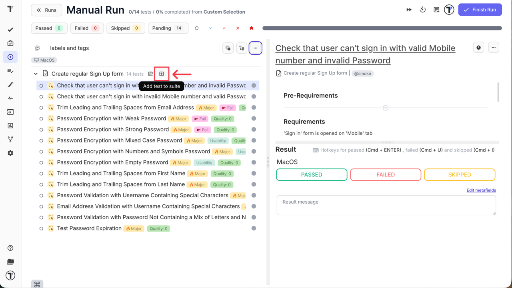

4. Enter the test case title in the **'Test Title'** field on **'Create manual test in suite'** window.
5. Click **'Add description'** button if you want to add more details to a test case.
6. Click **'Save test'** button to add the new test case.

OR

7. Click the **'Cancel'** button to discard it.

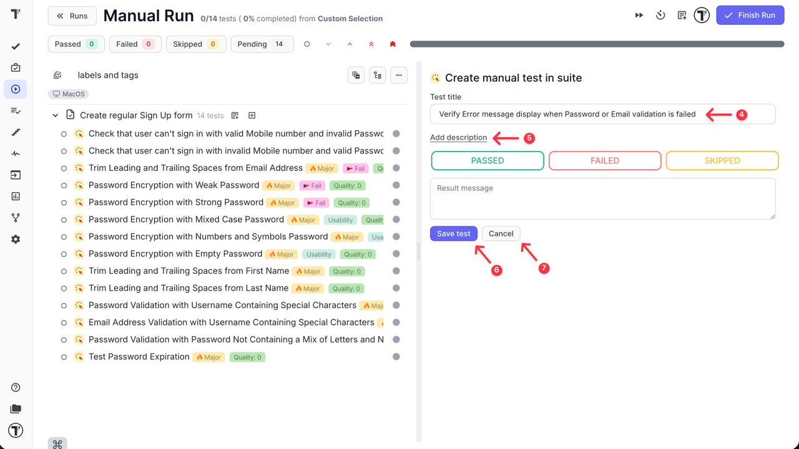

:::note

The **'Add test to suite'** button can be hidden via the **'Hide Creation Buttons'** option in the **'Extra menu'** dropdown menu.

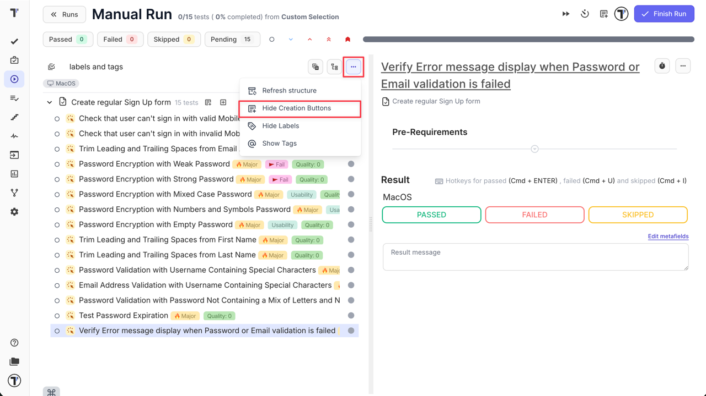

:::

**Use Cases for Creating Test Cases Within a Run:**

- **Identifying gaps in test coverage during execution:** While performing manual testing, a tester discovers an untested scenario. They can instantly add it to the run and repository without switching context.
- **Capturing exploratory test cases:** Testers conducting exploratory testing can log and formalize new test cases as they go, ensuring useful insights are not lost.
- **Collaborative test planning in real time:** During team sessions or test reviews, testers can collectively identify and add new tests based on discussion or observed issues.

## Tags and Labels on Manual Run Page

On Manual Run page you can enable/disable the view of tags and labels for your test. To do that, follow next steps:

1. Go to the **'Runs'** page.
2. Start the desired test run.
3. Click the **'Extra menu'** button.
4. Select desired option for labels 'Show/hide Labels'.
5.  Select desired option for tags 'Show/hide Tags'.

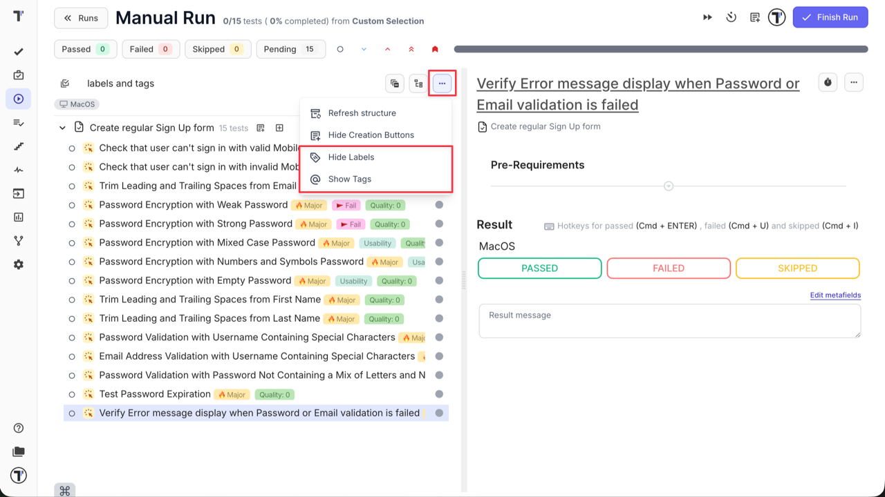

## Test Case History

When you launch a test run and make changes to test case title or description, a new entry is added to the test case's history. This entry records who made the edit and when it occurred.

1. Navigate to the **'Runs'** page.
2. Launch a new Run or continue an existing Run.

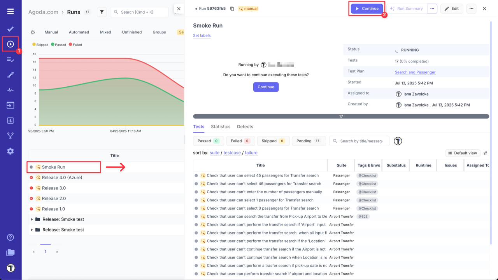

3. Click the **'Extra menu'** button next to the test case you want to edit.
4. Select **Edit**.

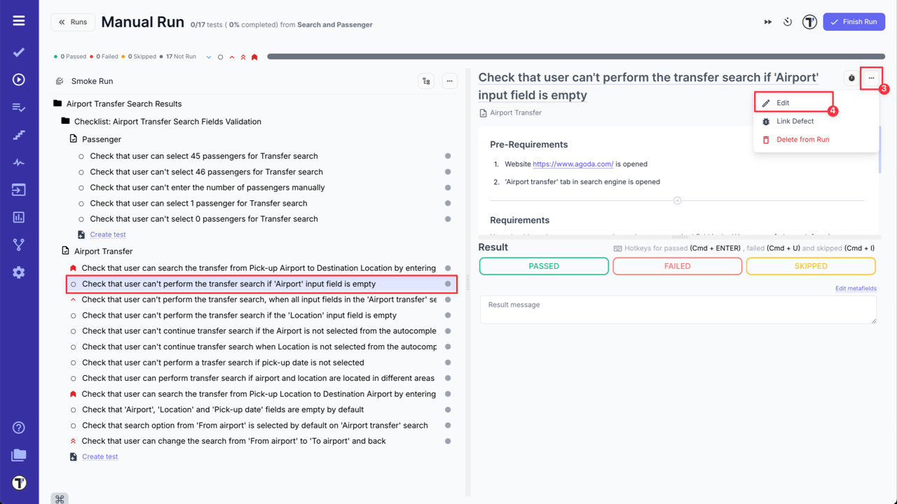

5. Modify the test case title or description as needed.
6. Click **Save** to apply the changes.

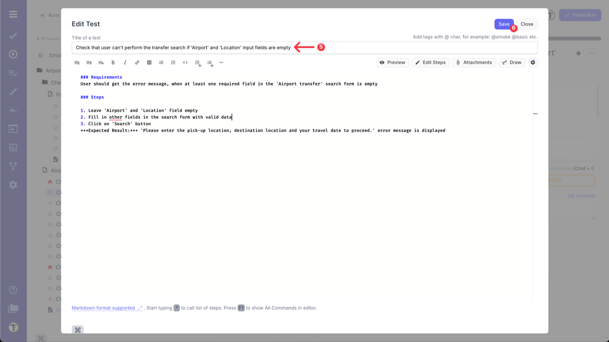

7. The new history entry will appear directly in the test case block, showing who edited the test case and the date and time of the change.

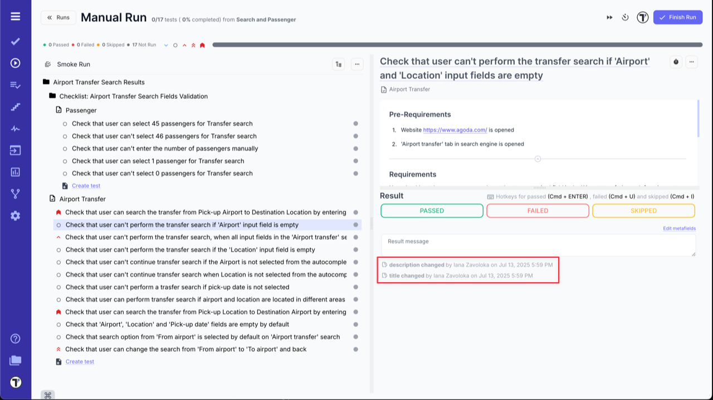

:::note

The test case history is only available while the test run is in progress.

:::

## How to Pin a Run or RunGroup

Testomat.io allows users to pin RunGroups or individual Runs to the top of the Dashboard for quick access to critical or frequently used tests or test runs, helping teams stay focused on the most relevant tasks. This supports faster navigation, improved focus, and customizable workflows — ideal for monitoring regression tests, environment-specific runs, or production hotfixes.

**Use Cases for Pinning:**

- **Faster Access:** Quickly access important or active test runs without searching through lists. Example: Pin ongoing regression tests for easy monitoring during a sprint.

- **Improved Focus:** Keeps high-priority RunGroups or Runs in view, reducing distractions. Example: Pin runs for specific environments or features during critical phases.

- **Customizable Dashboard:** Tailors the Dashboard to individual team workflows and priorities. Example: Pin runs related to production hotfixes or high-impact bugs.

**To Pin Run or RunGroup:**

1. Go to the **'Runs'** page.
2. Find the Run or RunGroup you want to pin.
3. Click the **'Extra menu'** button aligned next to the item.
4. Choose **'Pin'** from the dropdown options.

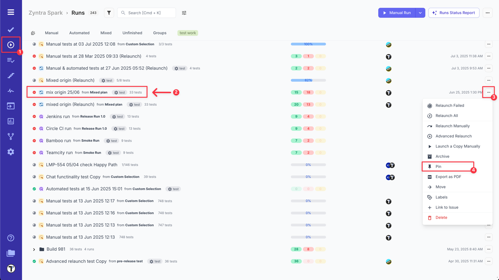

The **'Pin'** option is also available in the detailed run view menu.

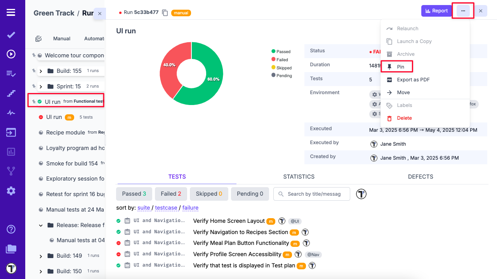

The selected Run or RunGroup will now appear **pinned at the top** of the list for quick and easy access.

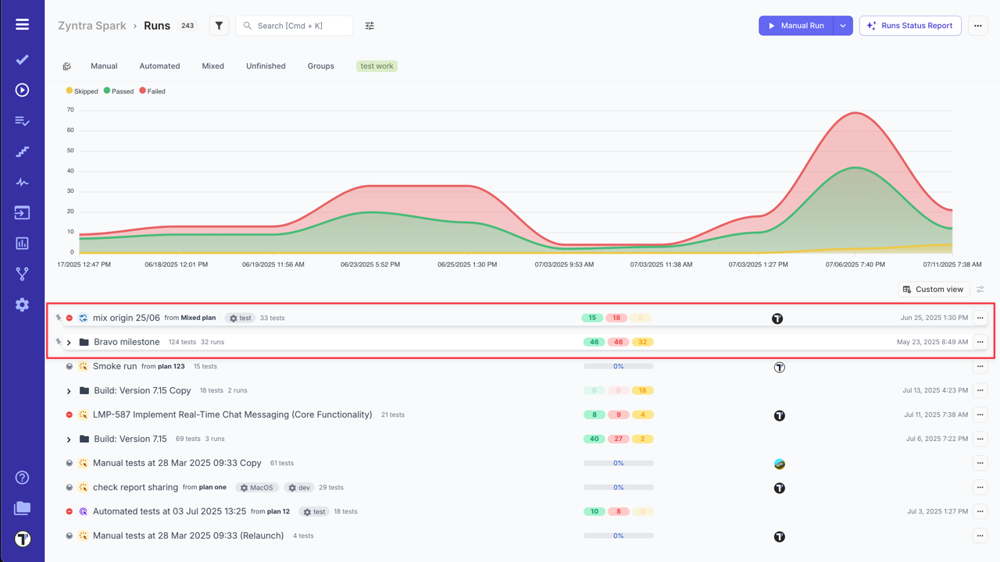

## How to Relaunch Runs

For some reason, you may need to re-check some tests in your Run. Testomat.io offers several options to relaunch your Test Run, depending on the run type and your needs.

### Basic Relaunch for Manual Run

Select the basic relauch option to restart your manual test run with all test cases and their current statuses:

1. On the **'Runs'** page, select the run that you need to re-check.
2. Click the **'Extra menu'** button.
3. Select **'Relaunch'** option from the dropdown menu.

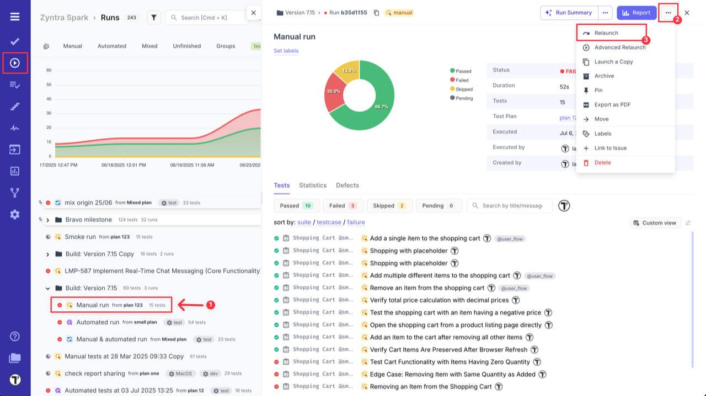

The **'Relaunch'** option is also available on the main Dashboard.

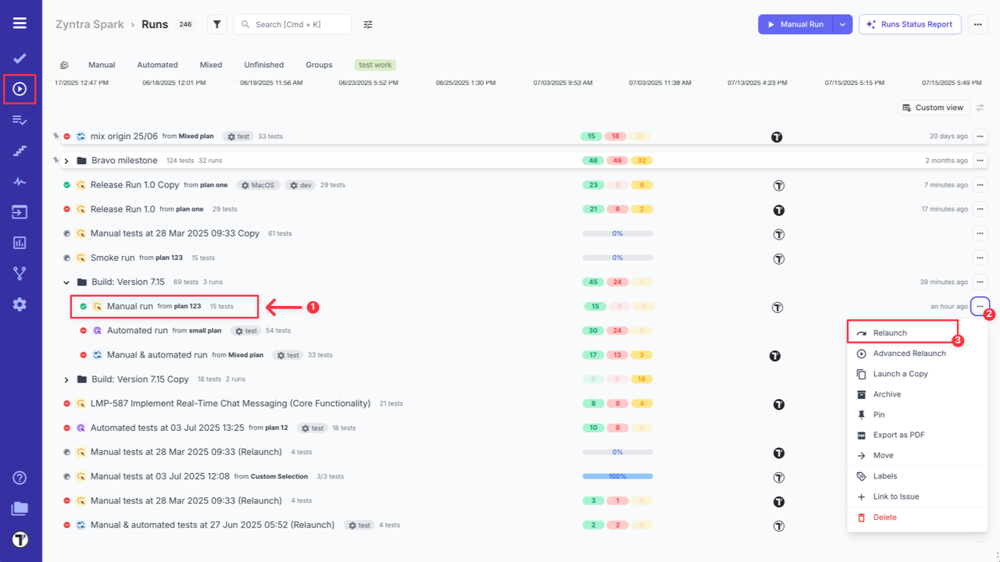

Your Test Run will open in Manual Run window, allowing you to re-check tests and change their statuses:

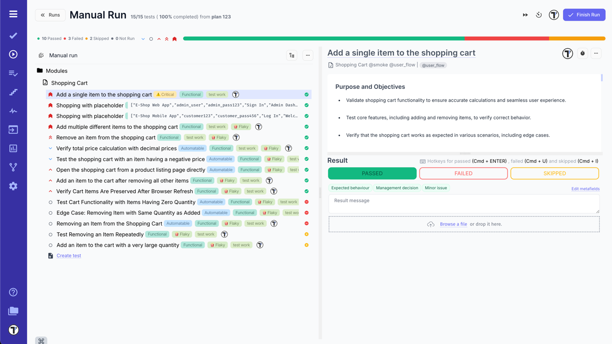

When finished, click the **'Finish'** button. You will see tests with new statuses and updated Run Report.

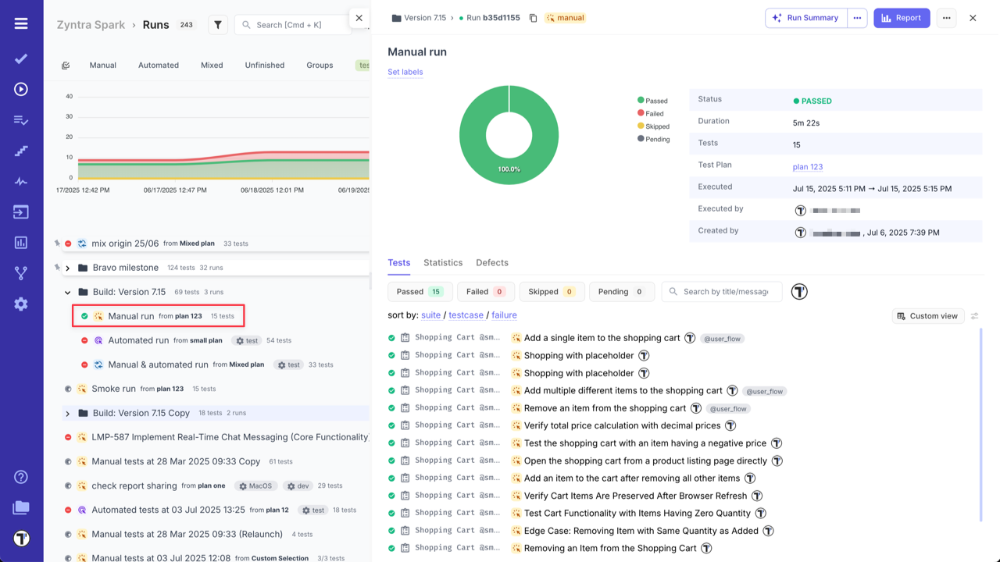

Your Test Run will also contain updated information on its results, including a changed tag and Run status.

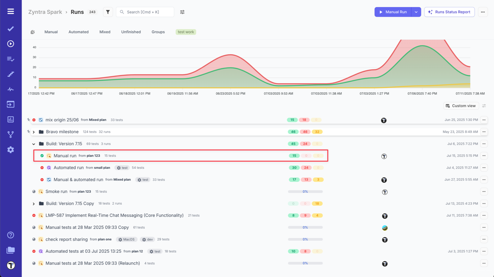

### Relaunch Failed Test Cases for Automated Runs

For your automated or mixed runs, select **'Relaunch Failed on CI'** option to relaunch only failed test cases from the selected run.

1. On the **'Runs'** page, select the automated or mixed run that you need to re-check.
2. Click the **'Extra menu'** button.
3. Select **'Relaunch Failed on CI'** option from the dropdown menu.

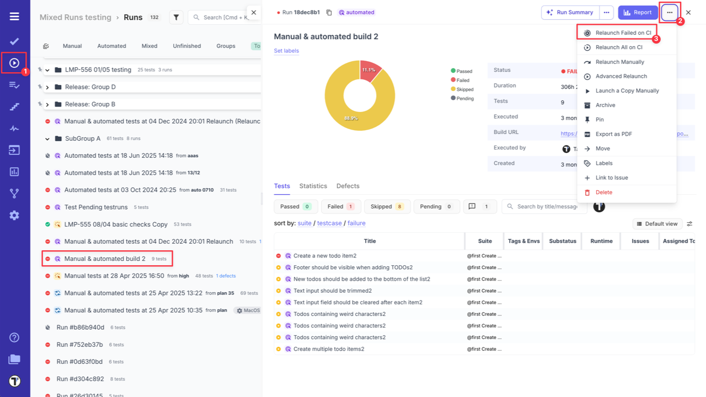

After selecting **'Relaunch Failed on CI'** option, failed automated test cases will automatically re-run on CI and Manual Run window will open for re-checking manual failed test cases. The same test run with updated statuses will be displayed after run is finished.

### Relaunch All Test Cases for Automated Runs

For your automated or mixed runs, you can also select **'Relaunch All on CI'** option to relaunch all test cases from the selected run.

1. On the **'Runs'** page, select the automated or mixed run that you need to re-check.
2. Click the **'Extra menu'** button.
3. Select **'Relaunch All on CI'** option from the dropdown menu.

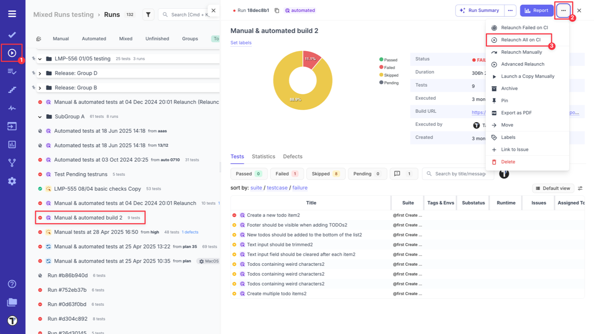

All automated tests cases will automatically re-run on CI.
If you relauch mixed run, your Test Run will open in Manual Run window and you will be able to re-check manual tests and change their statuses, while automated test cases re-run on CI simultaneously.

### Relaunch Automated Runs Manually

With **'Relaunch Manually'** option you can as well re-check your automated test cases manually.

1. On the **'Runs'** page, select the automated or mixed run that you need to re-check.
2. Click the **'Extra menu'** button.
3. Select **'Relaunch Manually'** option from the dropdown menu.

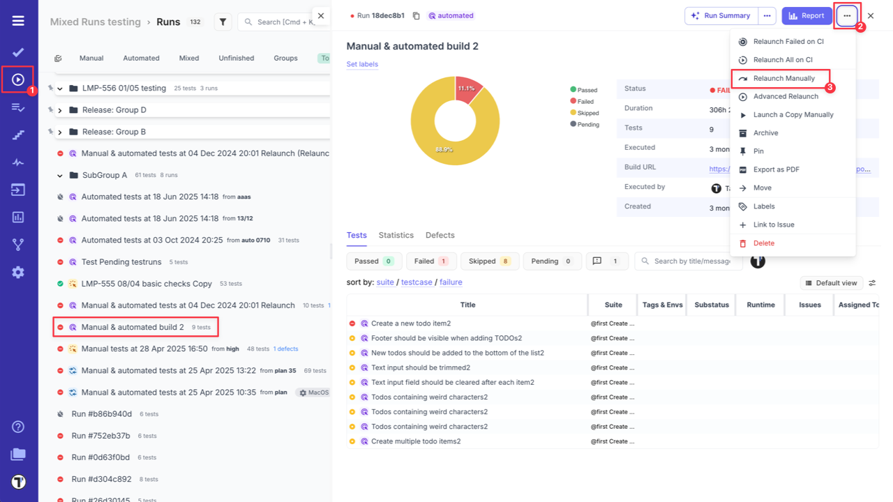

In this case, your Test Run will open in Manual Run window, allowing you to manually re-check all tests (manual and automated) and change their statuses if needed.

### Advanced Relaunch

The **'Advanced Relaunch'** option offers more flexibility when relaunching tests.
It allows you to select specific tests to relaunch, instead of repeating the full run. This enables more targeted, efficient workflows — whether you’re rerunning failed tests or just need to retest a subset of scenarios.

**'Advanced Relaunch'** option is available for all types of test runs.

1. On the **'Runs'** page, select the run that you need to re-check.
2. Click the **'Extra menu'** button.
3. Select **'Advanced Relaunch'** option from the dropdown menu.

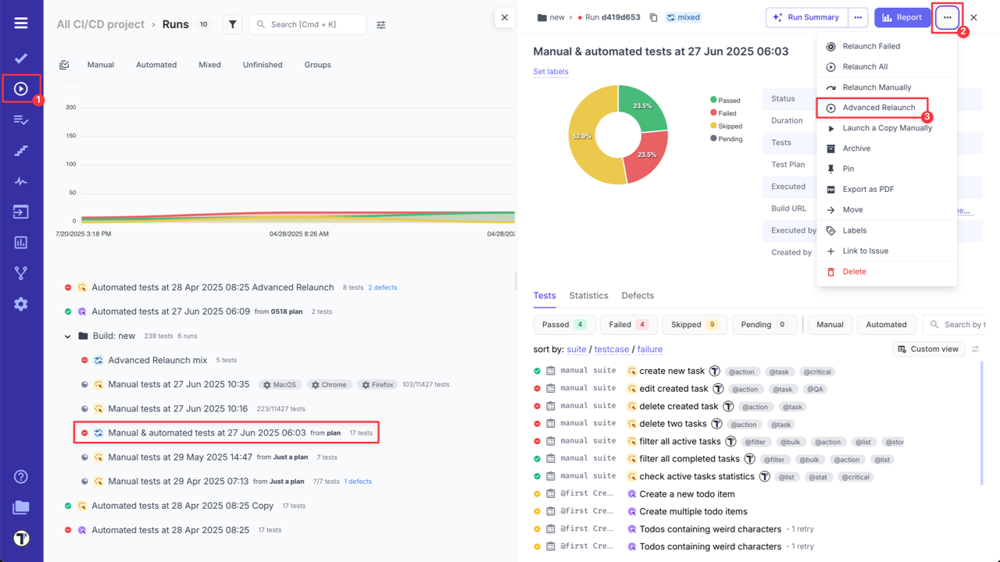

In the opened sidebar window, configure your relaunch (optional):

1. Enter a custom run title.
2. Enable **'Create new run'** option (if needed).
3. Enable **'Keep values'** option (available only if **'Create new run'** is enabled; this shows previous statuses for test cases).
4. Select the tests that you want to include in your relaunched run one by one (use filtering, sorting, or search options).
5. Click the **'Relaunch'** button.

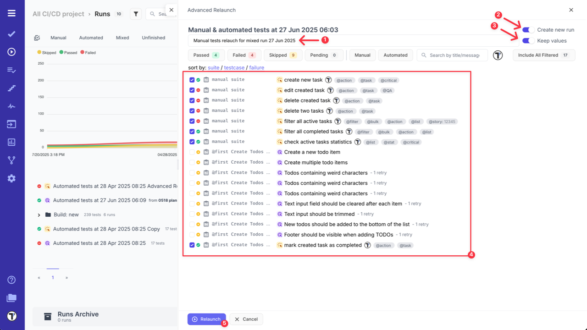

#### Create New Run

The **'Create new run'** checkbox controls whether the relaunch creates a separate copy or updates the original run.

|                                   | **Create new run ON**                                                                                            | **Create new run OFF**                                                                                        |
| --------------------------------- | ---------------------------------------------------------------------------------------------------------------- | ------------------------------------------------------------------------------------------------------------- |
| **Run ID**                        | A new run is created with a new ID. The original run remains unchanged.                                          | The original run is reused — same run ID.                                                                     |
| **Selected tests**                | Only selected tests are included in the new run and reset to Pending status (unless **Keep values** is enabled). | All tests are included with their current statuses kept. Only selected tests are reset to **Pending** status. |
| **Unselected tests / Select all** | All tests are reset to Pending status in the new run (unless **Keep values** is enabled).                        | All tests retain their existing results.                                                                      |

:::note

When re-running tests, selecting **Select all** or leaving no tests selected produces the same result: all tests in the run are included automatically.

:::

#### Scheduled Runs

Create a run test in advance without launching it immediately. After creating and configuring the run:

1. Click **Save** to store the Run in a **Scheduled** state.
2. At execution time, open the run and click **Start**.

Scheduled Runs are useful for:

* Release regression testing
* Planned testing activities
* Recurring QA cycles
* Coordinating testing across multiple team members

#### Keep Values

The **'Keep values'** option is only available when **'Create new run'** is enabled. It controls whether test results are carried over into the new run.

|                      | **Keep values ON**                                              | **Keep values OFF**                  |
| -------------------- | --------------------------------------------------------------- | ------------------------------------ |
| **Selected tests**   | Results are preserved in the new run (Passed, Failed, Skipped). | Results are reset to Pending status. |
| **Unselected tests** | Results are preserved in the new run.                           | Results are reset to Pending status. |

#### Select All Tests

There are two ways to select all tests for relaunch — the top-level **Checkbox** and the **Select All** option from the dropdown.

| **Scenario**                          | **Checkbox** (top-level)                                                                                     | **Select All** (dropdown)                                                                 |
| ------------------------------------- | ------------------------------------------------------------------------------------------------------------ | ----------------------------------------------------------------------------------------- |
| **No filter applied**                 | Selects all tests in the run — passed, failed, and skipped.                                                  | Selects all tests in the run — passed, failed, and skipped.                               |
| **Filter applied (e.g. failed only)** | Selects only tests matching the active filter. Tests outside the filter are not included.                    | Selects only tests matching the active filter. Tests outside the filter are not included. |
| **Switch to another filter**          | The previous checkbox selection is cleared only when tests are selected in the new filter.                   | Selection updates automatically to the new filter. Previous selection is cleared.         |
| **Add individual tests manually**     | Individual tests from other statuses can be added manually. All selected tests are included in the relaunch. | Individual tests cannot be added or removed manually.                                     |
| **Clear selection**                   | Uncheck the checkbox.                                                                                        | Use **'None'** from the dropdown.                                                         |

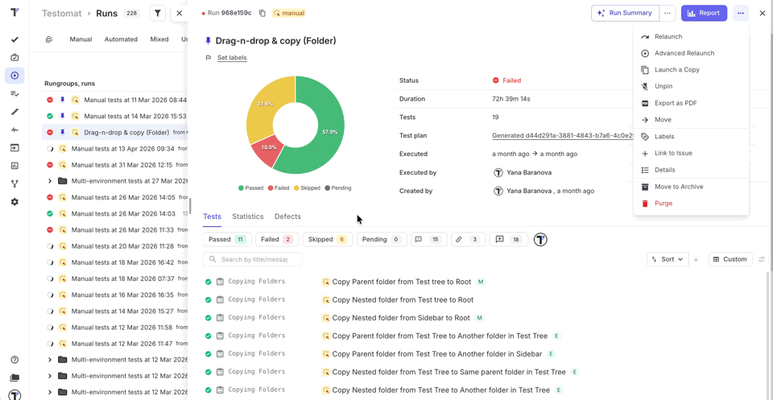

:::note

When using the Checkbox, only the tests that are loaded on the page are selected — scroll through the full list first to ensure all tests are included.

:::

**Key benefits of Advanced Relaunch:**

- Customize relaunches to better fit your team's workflow
- Simplify recovery after CI failures or flaky test results
- Avoid redundant test executions and manual reconfiguration

## How to Launch a Run Copy

If you need need to re-check tests in your Run, but for some reason, you want to save this Test Run separately, use the **'Launch a copy'** option.

**To Lauch a Run Copy you need:**

1. On the **'Runs'** page, select the run that you need to copy and re-check.
2. Click the **'Extra menu'** button.
3. Select **'Launch a Copy'** option from the dropdown menu.

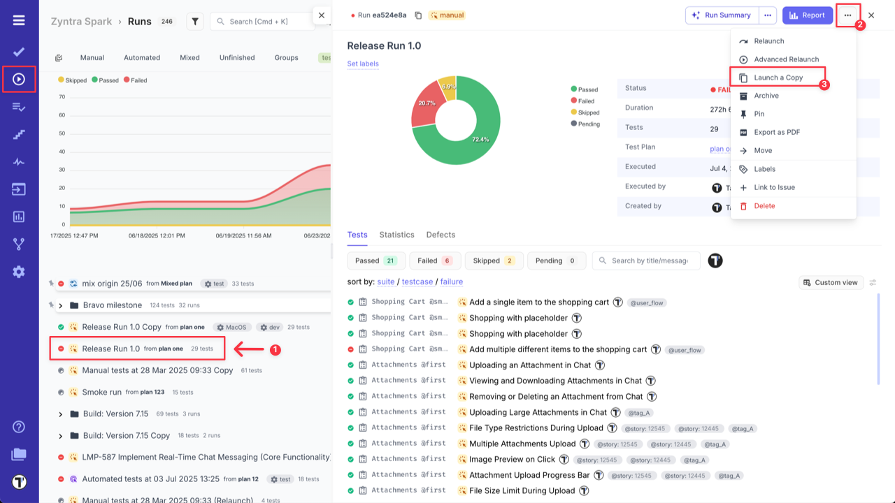

The **'Launch a Copy'** option is also available on the main Dashboard.

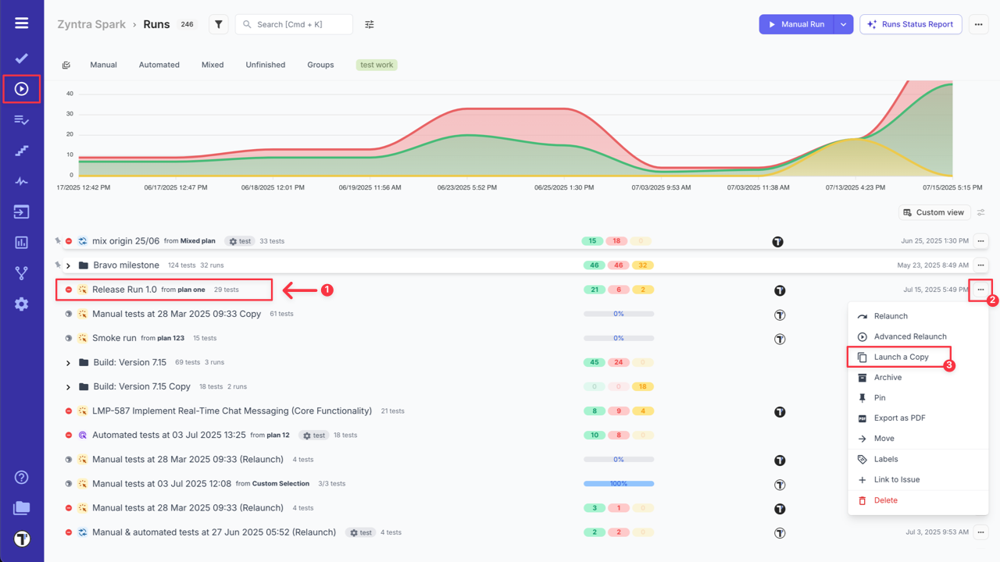

Your Test Run will open in Manual Run window, allowing you to re-check tests and change their statuses:

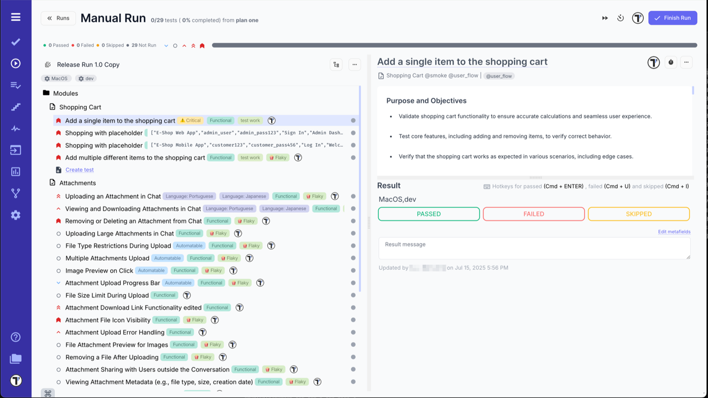

When finished, click on **'Finish'** button. A new Test Run with new test statuses and a new Run Report will display:

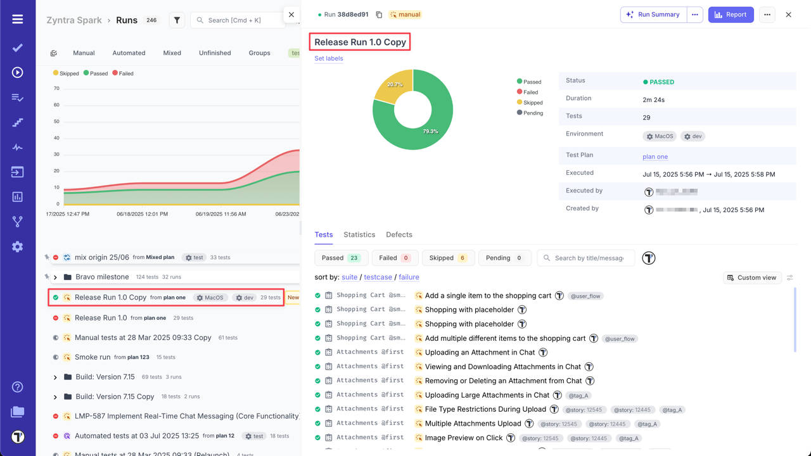

On the main Runs Dashboard, you will see both Tests Runs: the original run with old test results and the copy with new test results.

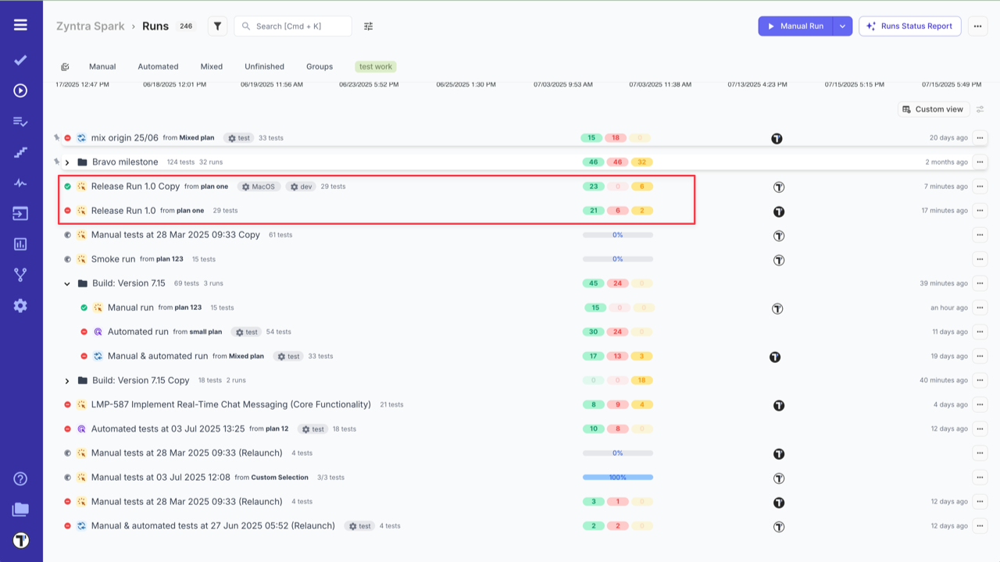

## Multiselection For Runs

Multiselection allows the bulk application options to many runs with one click. Click the **'Multi-select'** icon and select a few runs to see multi-select menu panel.

**Multi-select Options Overview:**

1. **'Select all'** - select all runs on the Runs page.
2. **'Archive'** - archive selected runs.
3. **'Labels'** - apply/remove [labels](https://docs.testomat.io/usage/labels-and-custom-fields/#how-to-setup-a-label) from runs.
4. **'Compare'** - open Compare runs view.
5. **'Extra menu'** - access additional options.
6. **'Purge icon'** - purge selected runs [see more details here](https://docs.testomat.io/project/runs/managing-runs/#purge-runs).

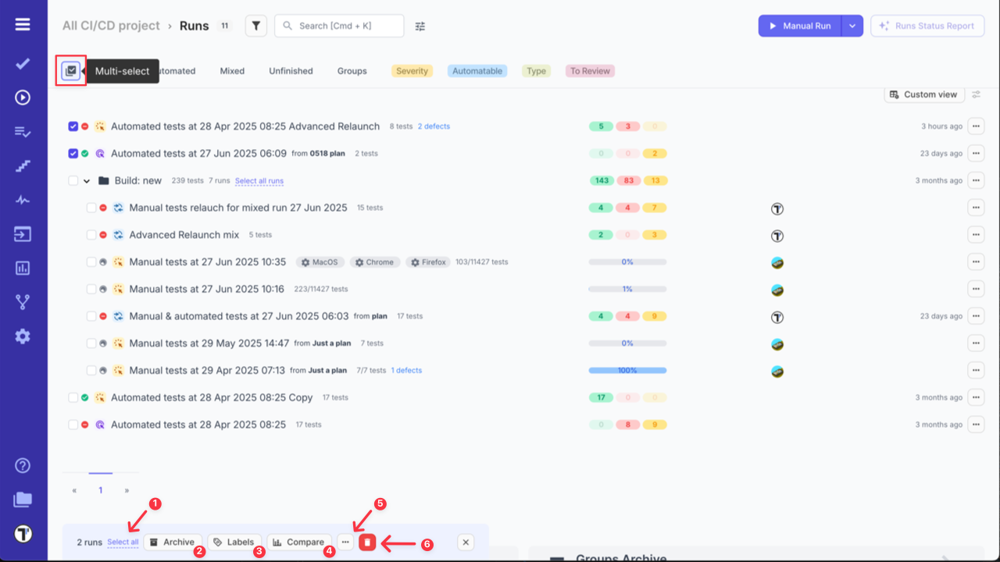

Click the **'Extra menu'** button on multi-select menu panel to see additonal options:

1. **'Link'** - link selected runs to [JIRA](https://docs.testomat.io/integration/jira/#connecting-to-jira-project), [GitHub](https://docs.testomat.io/integration/issues-management-systems/#github-issues-configuration), [Azure](https://docs.testomat.io/integration/issues-management-systems/#azure-devops-configuration),[Linear](https://docs.testomat.io/integration/issues-management-systems/#linear-configuration) or other [issues management system](https://docs.testomat.io/integrations/issues-management/).
2. **'Download'** - export selected run reports to spreadsheet.
3. **'Merge'** - merge selected runs (read more in the [Merge runs](https://docs.testomat.io/project/runs/merge-strategies/#merge-runs) section).
4. **'Move'** - move Runs to/from RunGroups.

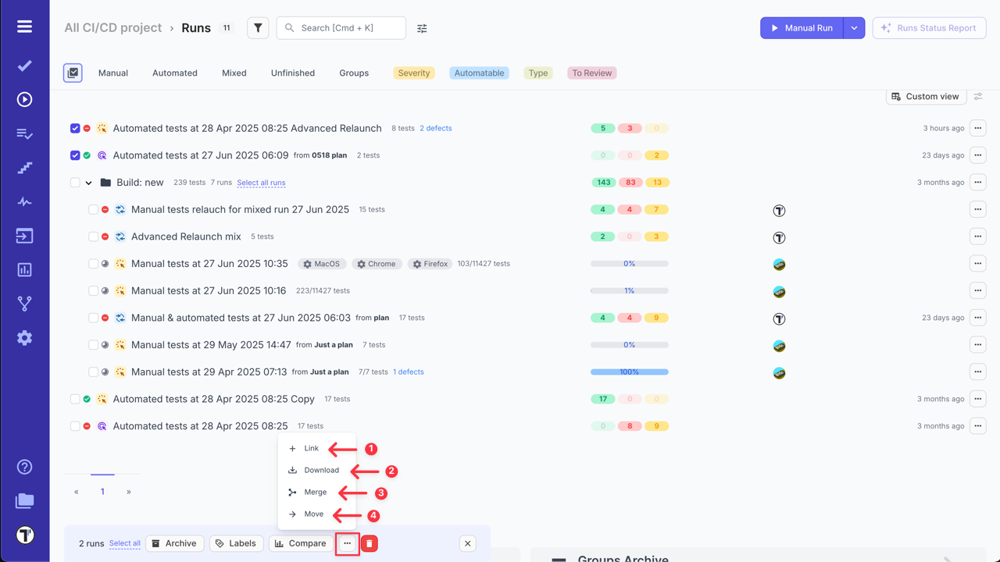

## Filtering Test Runs

Testomat.io provides filtering capabilities for Runs and RunGroups. On the Runs page, you can find **Basic filters** and **Additional filters**.

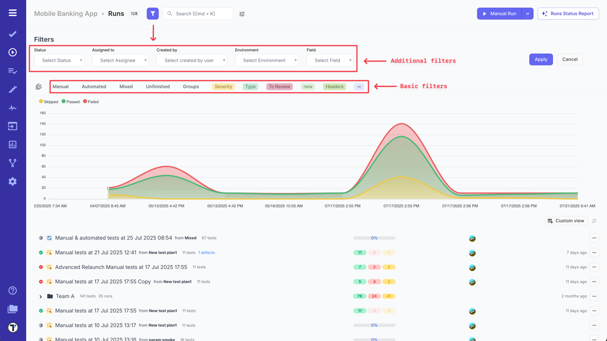

## Filter Runs by TQL

Testomat.io Query Language (TQL) for Runs enables more flexible searches, allowing users to filter Test Runs by criteria like `finished_at`, `passed_count`, `has_test_label` and many others. This helps quickly find relevant runs and improves test analysis.

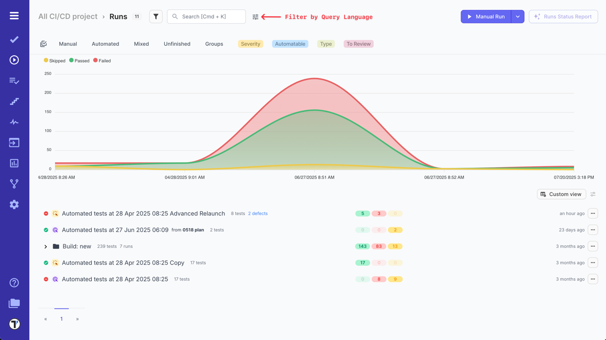

Visit a separate section of the documentation - [Runs Variables](https://docs.testomat.io/usage/query-language/#runs-variables), if you want to find out more about the Runs Variable.

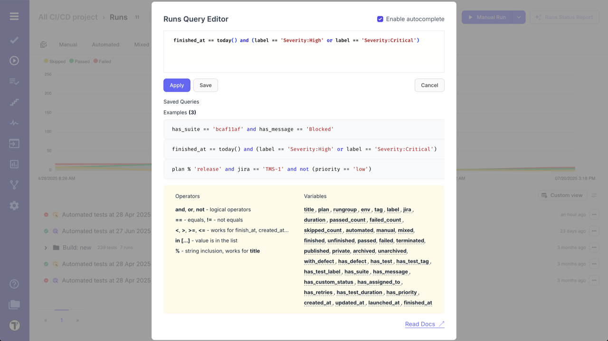

## Share Runs Filter

This feature allows you to pass **Runs** and **Runs Archive** filter parameters directly through the URL. This improves collaboration by enabling teams to quickly access relevant test results without manually adjusting filters.

Specify the necessary filtering parameters on the **Runs** or **Runs Archive** page, then copy the URL and share it with interested members.

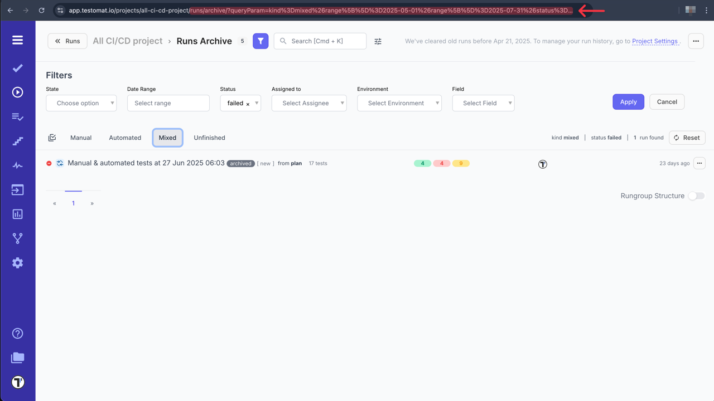

## Purge Runs

Starting from September 2025, Testomat.io introduces a new approach to managing old and unused Runs.

The **Delete** option for Runs is now replaced with a **Purge** option.

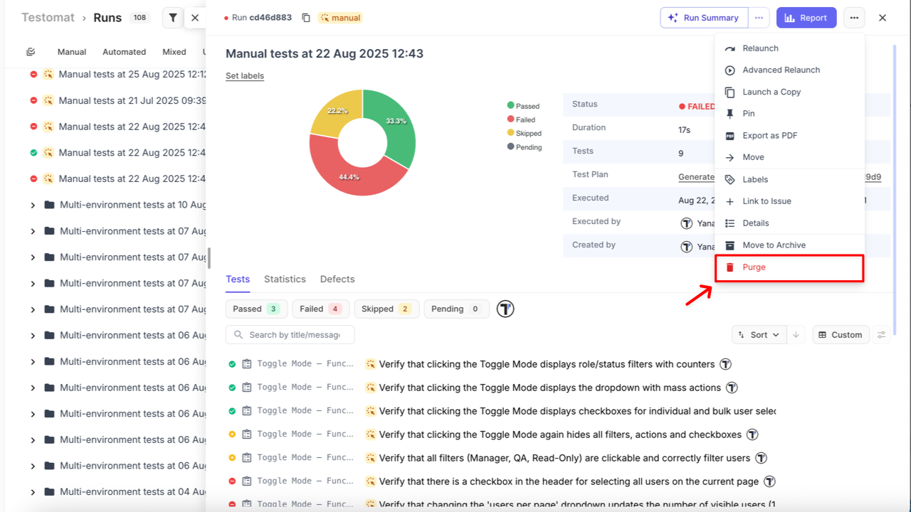

This change provides a safer and more flexible way to manage Run data by introducing a two-step deletion strategy instead of immediate and irreversible removal.

### Compress and Move to Archive (Purge)

When a Run is purged (either manually or automatically), it is first compressed and moved to the [Archive](https://docs.testomat.io/project/runs/archive-runs-and-groups/).

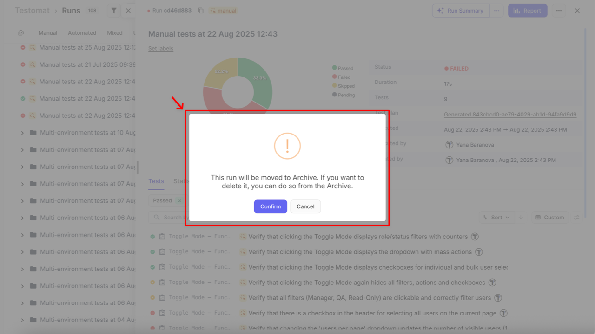

Runs that are moved to the Archive receive a specific badge:

- **Purged** – when a run is purged (manually or automatically)
- **Archived** – when a run is archived manually

During this step:

- Stack traces are removed to reduce storage size.
- Essential data is preserved, including:
  - Test results
  - Artifacts (attachments, logs, screenshots)
  - Custom statuses
- Archived Runs remain available for as long as needed and can be restored at any time.

### Purge Logic for Ongoing Runs

The purge process also applies to **ongoing (in-progress) Runs**, ensuring consistency across all run states.

When a Run (either inside a Run Group or standalone) is **purged while still ongoing**, the following logic applies:

- The Run is automatically **terminated**
- Test results that were already recorded (e.g., **Passed**, **Failed**, **Skipped**) remain preserved
- All **Pending** test cases are automatically marked as **Skipped**
- The Run receives a **terminated** status flag, which remains visible even after restoration
- The Run is then **compressed and moved to the Archive**, following the same purge-to-archive flow as completed runs

:::note

Restored Runs that were terminated during purge **cannot be resumed**. They retain the **terminated** state but can still be viewed and analyzed in the Archive or after restoration.

:::

This ensures that no partial or inconsistent test data remains in the system and that all purged Runs — even those in progress — are preserved in a clean, final state.

### Automatic Purge Flow

The same **two-step purge-to-archive logic** applies to automatically purged **Runs** via **Project Settings → [Purge Old Runs](https://docs.testomat.io/management/project/settings/#purge-old-runs)**.

When an automatic purge is triggered:

- The **Run** is compressed and moved to the **Archive** page
- It receives the **purged** badge
- The Run remains restorable from the Archive, but permanent deletion must still be performed **manually**

### Permanent Deletion from Archive

:::note

If you remove a Run from the Archive, it is permanently deleted. This step is irreversible — once **deleted**, the Run cannot be restored.

:::

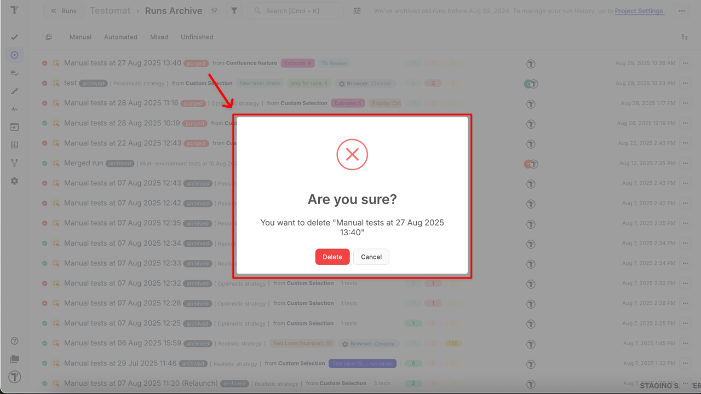

### Runs Activity Tracked in Pulse

All actions related to purging or permanently deleting Runs are recorded in [Pulse](https://docs.testomat.io/project/pulse/) under the **Deleted Run** activity type. This ensures full transparency and traceability of Run lifecycle events.

Pulse displays different activity messages depending on how the Run was removed:

1. **Automatic purge**  
   When a Run is purged automatically by the system due to expiration, Pulse records an entry similar to:  
   _“Manual tests at 20 Nov 2025 11:56 have been purged by system on expiration (moved to Archive).”_
2. **User-initiated purge**  
   When a Run is purged manually, Pulse records the event:  
   _“Manual run has been purged by user (moved to Archive).”_

3. **Permanent deletion from Archive**  
   When a Run is permanently removed from the Archive, Pulse displays the event indicating that the manual run has been permanently deleted.

   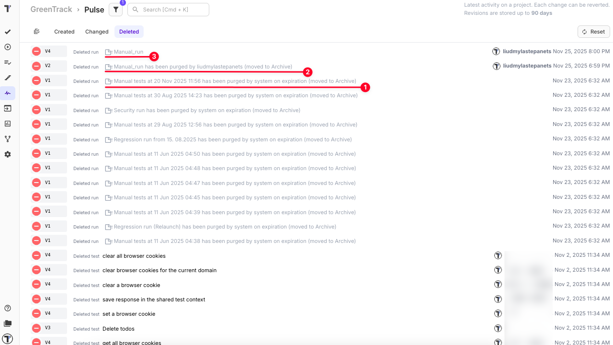

These Pulse records provide a clear audit trail for all purge-related actions, mirroring the two-step deletion flow and ensuring accountability across both manual and automated processes.

### Summary

By introducing the Purge option, Testomat.io ensures that Run data is handled with more safety and flexibility. You can keep your workspace clean and optimize storage, while still maintaining the ability to restore important Runs from the Archive when needed.
