## Merge Strategies

Testomat.io provides different **'Merge Strategies'** to aggregate the results of the individual test runs within a **RunGroup**. This is crucial when you have multiple executions of the same tests (e.g., retries, parallel execution, runs on different environments) and need a single, representative status for tests within that group.

You need to select a **Merge Strategy** when you create a new RunGroup:

1. Go to **'Runs'** page.
2. Click the **'New Group'** button.

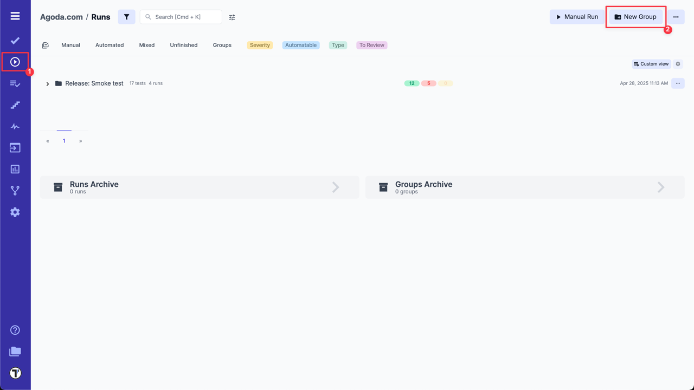

3. Select **Merge strategy**.

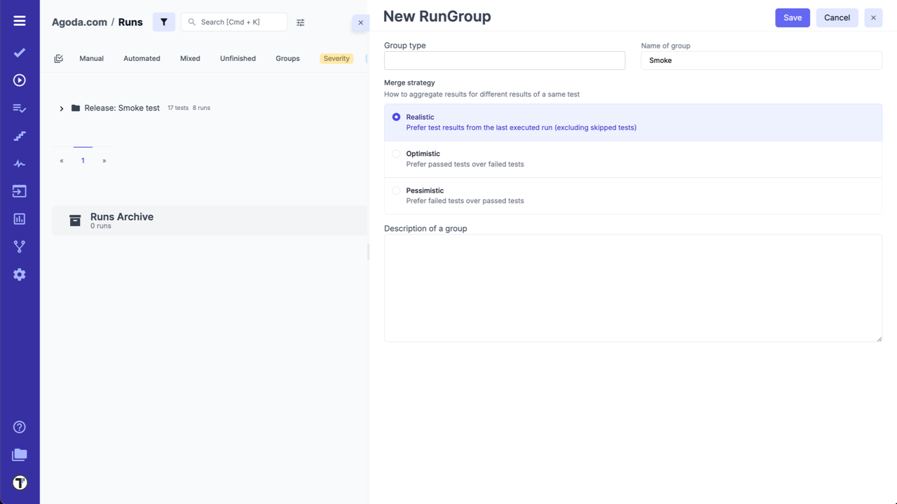

:::note

You can change **Merge Strategy** at any time after the RunGroup is created.

:::

**Change an Existing RunGroup's Merge Strategy:**

1. Select the RunGroup.
2. Click the **'Extra menu'** button.
3. Click the **'Edit'** option.

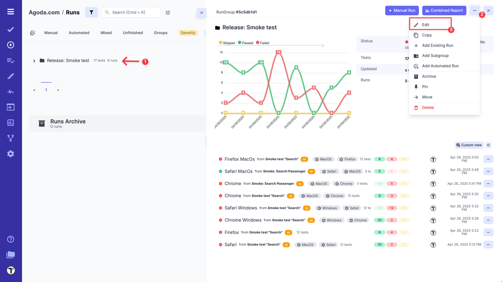

You also need to select the **Merge Strategy** when merging multiple runs into one:

1. Go to **'Runs'** page.
2. Click the **'Multi-select'** icon.
3. Select a few runs that you want to merge.
4. Click the **'Extra menu'** button in the bottom menu.
5. Select **'Merge'** option.

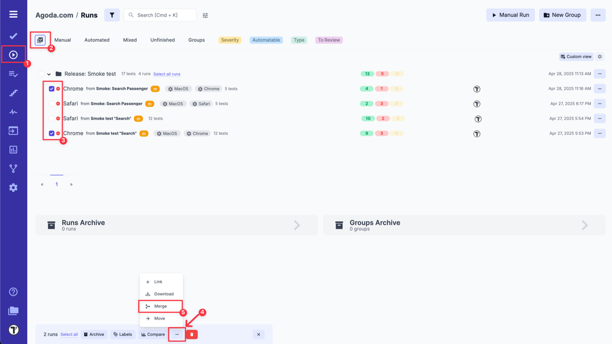

6. Select a **Merge Strategy**.

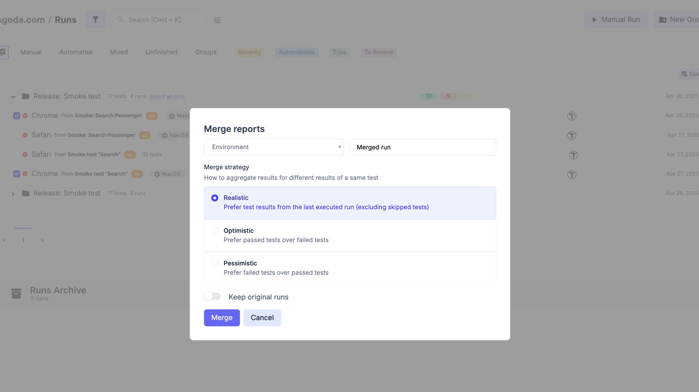

**Testomat.io offers three different Merge strategies:**

For instance, let's say we have 2 runs inside a Rungroup with the same tests A and B:

- Run 1: A - failed, B - failed
- Run 2: A - passed, B - passed

How should the RunGroup's counters display results? Both answers: "Passed: 2, Failed: 0" or "Failed 2, Passed 0" are absolutely valid depending on how you calculate those numbers. That's why Testomat.io provides customizable Merge strategies:

- **Realistic:** this strategy is based on test results from the **last executed run** (excluding skipped tests). If your RunGroup includes test runs with different test cases, it will summarize and display the results from the last executed runs with unique test cases. 

In our example, results will be next: **Passed: 2, Failed: 0**, as Run 2 was executed last.

- **Optimistic:** this strategy will mark a test as **passed if it passed in at least one run** within the group, even if it failed in others. This approach provides a more lenient view, focusing on the positive outcomes. 

In other words, it prefers passed tests over failed ones: **Passed: 2, Failed: 0** in our example.

- **Pessimistic:** unlike the optimistic strategy, this strategy will mark a test as **failed if it failed in at least one run** within the group. It prioritizes identifying potential issues. 

Simply to say, it prefers failed tests over passed ones: **Passed: 0, Failed: 2**.

### Merge Strategy Examples

**Example #1: Same Test Cases Across Different Environments**

Let's imagine that you have 2 Test Runs with the same test cases for different environments. In one Test Run, the first 3 test cases failed while the others passed, and in another Test Run last 2 test cases failed and the others - passed.
In this case, the results with the different strategies will be as follows:

1. **Realistic** - the result will match the result of the last executed test run, in this case 2 test cases - failed, and the others - passed.

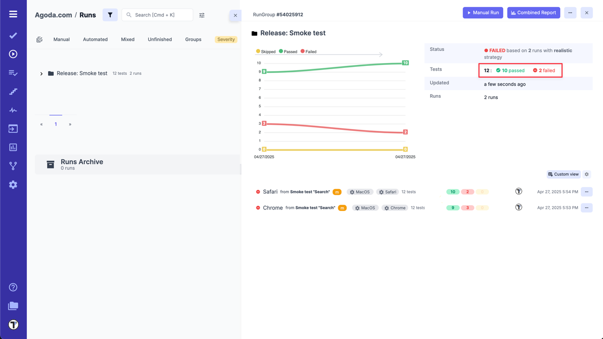

2. **Optimistic** - all test cases will show as passed, as each test case passed in at least one test run.

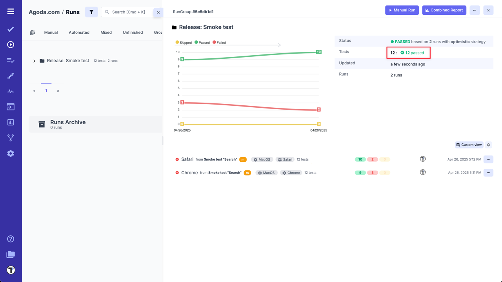

3. **Pessimistic** - by this strategy 5 test cases will show as failed, as a total of five unique test cases failed across these 2 test runs.

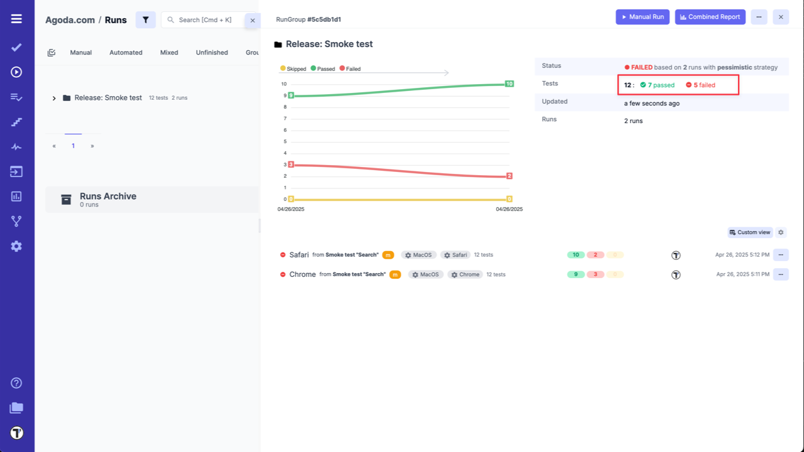

**Example #2: Adding Runs with Unique Test Cases**

In this example, you added 2 more Test Runs with unique test cases (for instance, to test another feature in the module under test) to your previous 2 Test Runs. In one added Test Runs, the last 2 test cases failed, and in the other, the first 3 test cases failed. In these 2 runs, each test case failed and passed at least once.
As a result, the outcome with the different strategies will be as follows:

1. **Realistic** - 5 test cases will show as failed, as it summarizes the results of the last two runs with unique test cases.

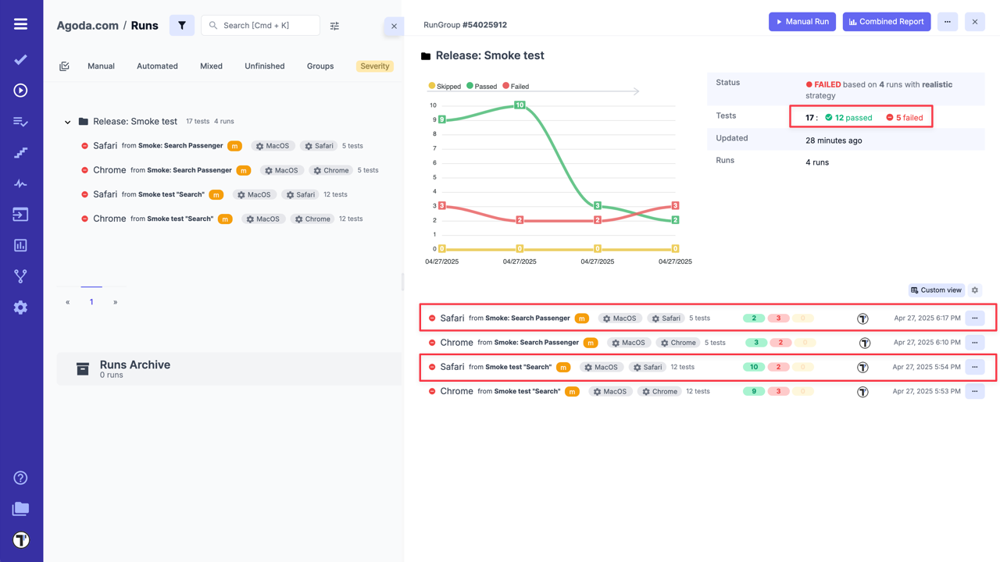

2. **Optimistic** - all test cases will show as passed, as each test case passed in at least one test run.

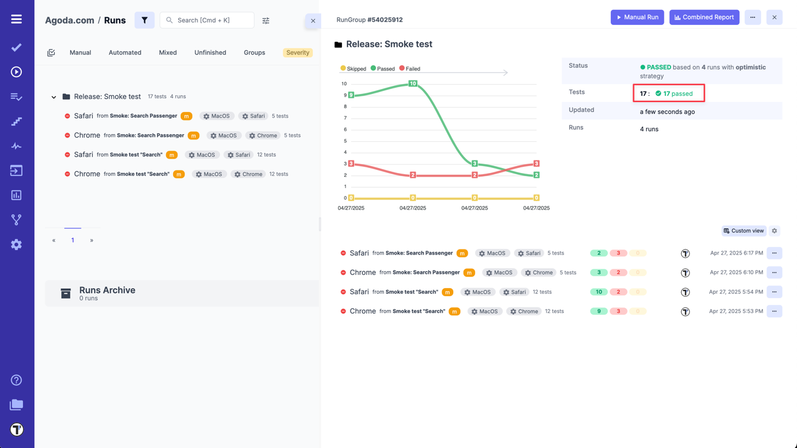

3. **Pessimistic** - by this strategy 10 test cases will show as failed, because a total of 10 unique test cases failed across all 4 test runs.

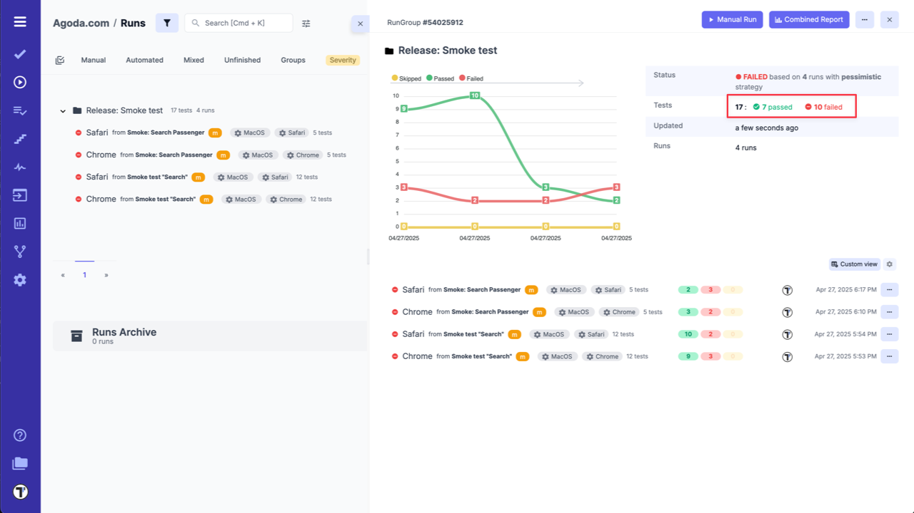

As you can see, **Merge Strategies** for RunGroups in Testomat.io help you aggregate and analyze test results from multiple runs. They define how the system determines the final status of a test case within a RunGroup, providing a unified view of your overall testing outcomes.

## Merge Runs

With Testomat.io you can merge your Test Runs. To do this you need:

1. Enable multi-selection.
2. Choose the Test Runs you want to merge.
3. Click the **'Extra menu'** button in the menu panel at the bottom of the page.
4. Select **'Merge'** option.

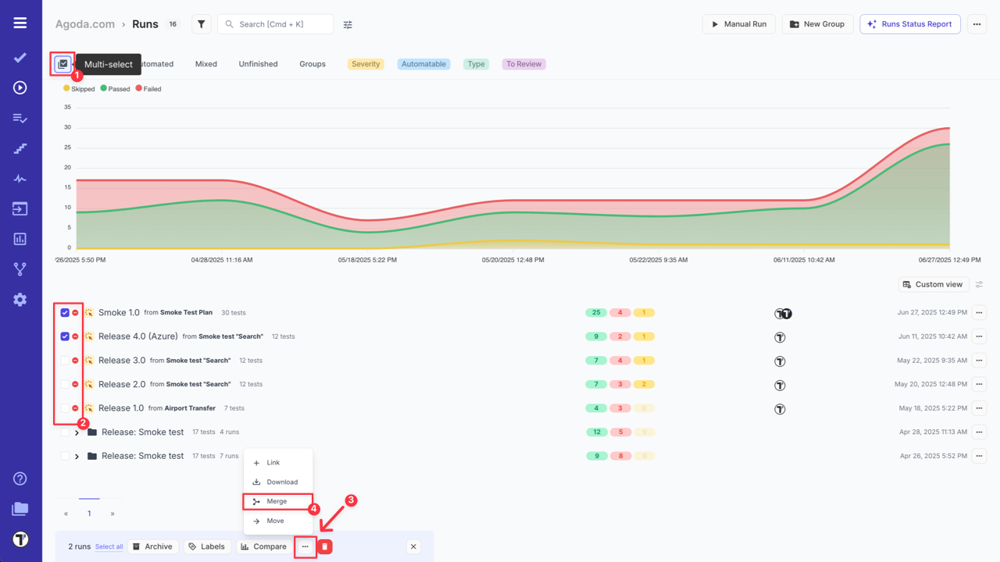

On the displayed modal you will need to:

1. Select testing Environment.
2. Enter a name for merged run.
3. Choose a **Merging Strategy**.
4. Decide whether to keep original runs or not.
5. Click the **'Merge'** button.

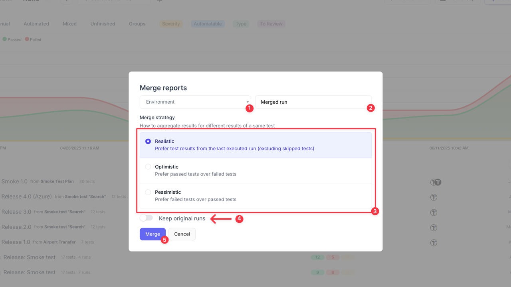

Your merged run will appear in the list of runs on the **Runs** page and will combine unique test cases from the merged runs.

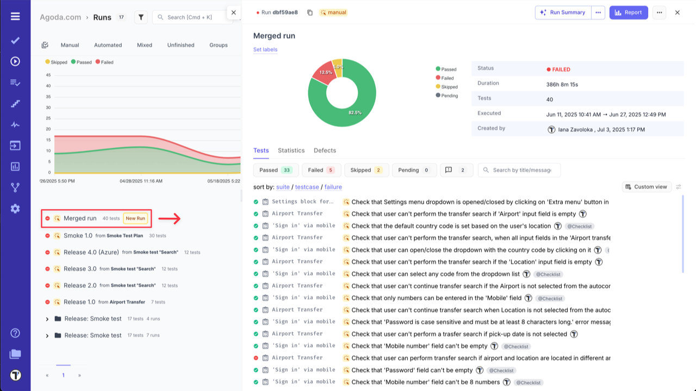