First, let's clarify what **'RunGroups'** are in Testomat.io. 
**RunGroups** allows you to organize and group multiple test runs together based on criteria like sprint, release, functional area, or any other logical grouping. This helps in analyzing aggregated results and providing a consolidated view of your testing efforts.

## How to Create a RunGroup

**To create a new RunGroup:**

1. Open **'Runs'** page.
2. Click the **'Additional options'** arrow button next to the 'Manual run' button.
3. Select **'New group'** option from the dropdown menu.

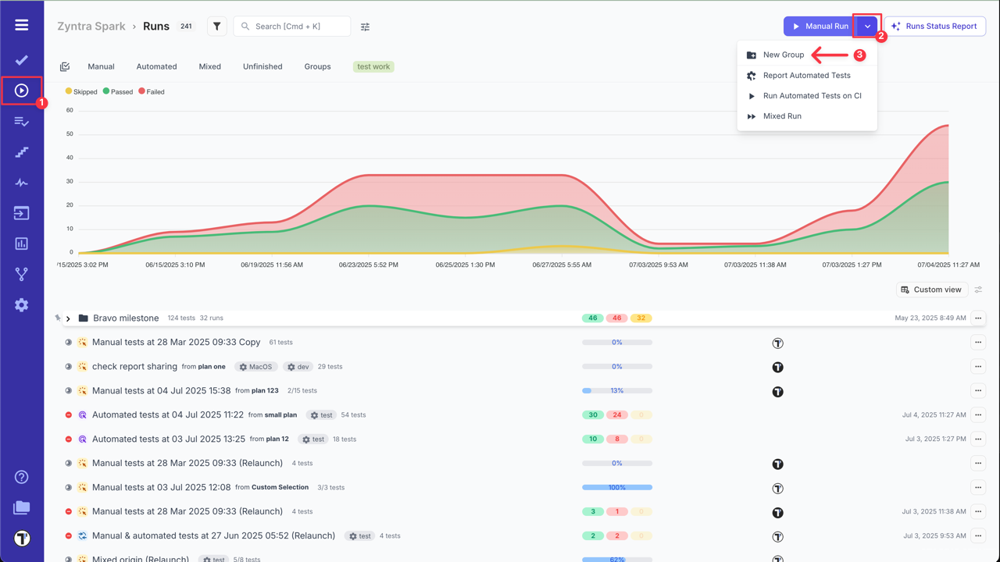

On New RunGroup screen you need:

1. Choose a **'Group Type'** (optional).
2. Add a **'Name of a Group'**.
3. Select **'Merge strategy'** (For more details, refer to the [Merge Strategies](https://docs.testomat.io/project/runs/merge-strategies) page in documentation).
4. Add **'Description of a group'**, if needed.
5. Click the **'Save'** button.

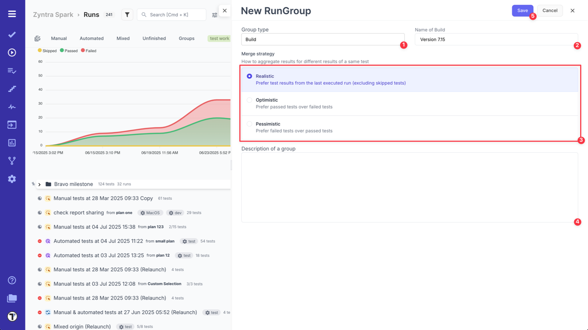

The new RunGroup will appear on Runs page and will open automatically after creation.

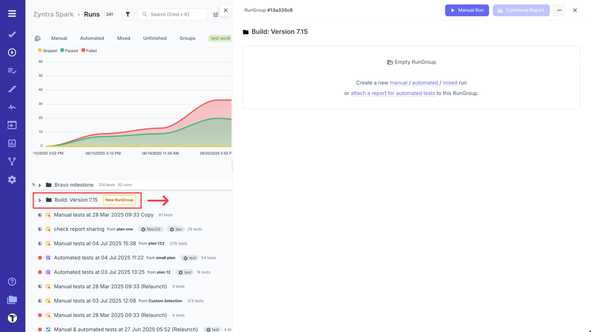

After RunGroup is added, you can create new Manual/Automated/Mixed Runs inside it.

- To create a new **Manual Run**, open the RunGroup and click on **'Manual Run'** button.

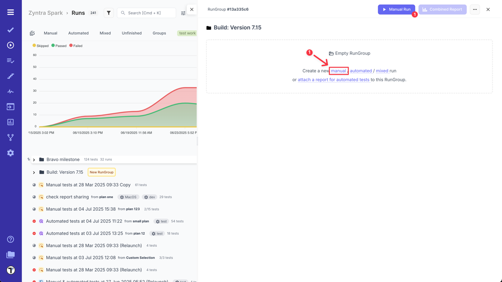

- To add a new **Automated Run** to a RunGroup, execute your tests with Testomat.io, providing TESTOMATIO_RUNGROUP_TITLE="Build ${BUILD_ID}".

Now you can view Test Runs within your created RunGroup.

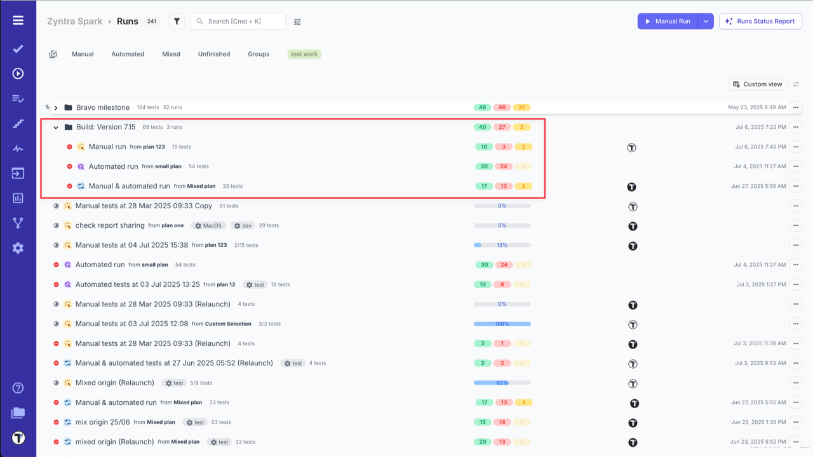

## How to Move a Run to a RunGroup

You may need to move a Run to a specific RunGroup (e.g., to associate it with a particular release or build). Use the **'Move'** functionality for this purpose:

1. Navigate to the **'Runs'** page.
2. Select the Run you want to move.
3. Click the **'Extra menu'** button.
4. Select **'Move'** from the dropdown menu.

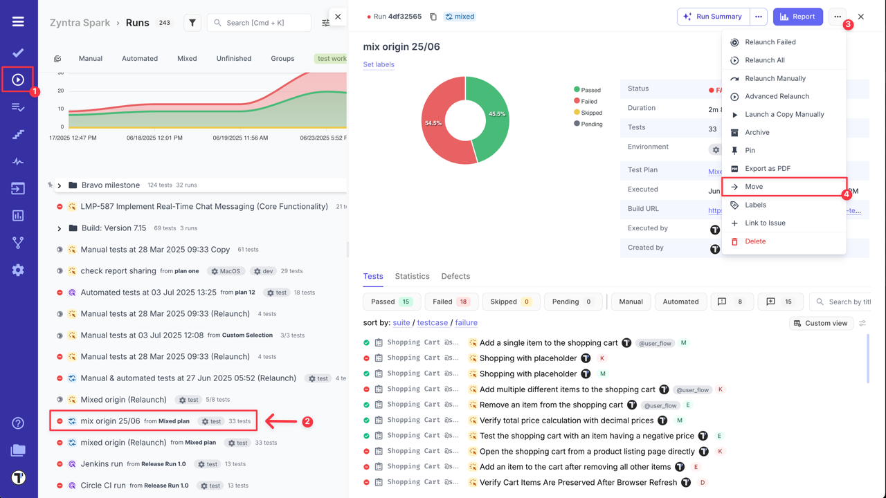

5. In the pop-up window, choose the **destination RunGroup**.
6. Click the **'Move'** button to confirm action.

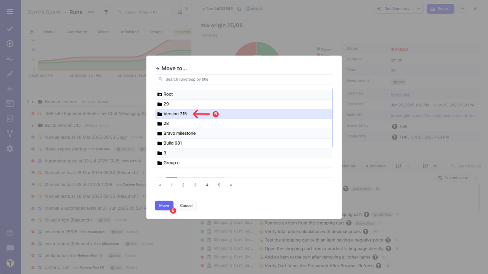

## How to Customize Runs List View 

When working with test runs inside RunGroup or Runs Dashboard Flow, you can adjust the table layout to fit your needs. Instead of using the default view, you can customize the runs table layout within **RunGroup** page or directly from the main **Runs Dashboard**.

**RunGroup Flow**

1. Go to **'Runs'** page.
2. Select RunGroup.
3. Click the **'Custom view'** button.

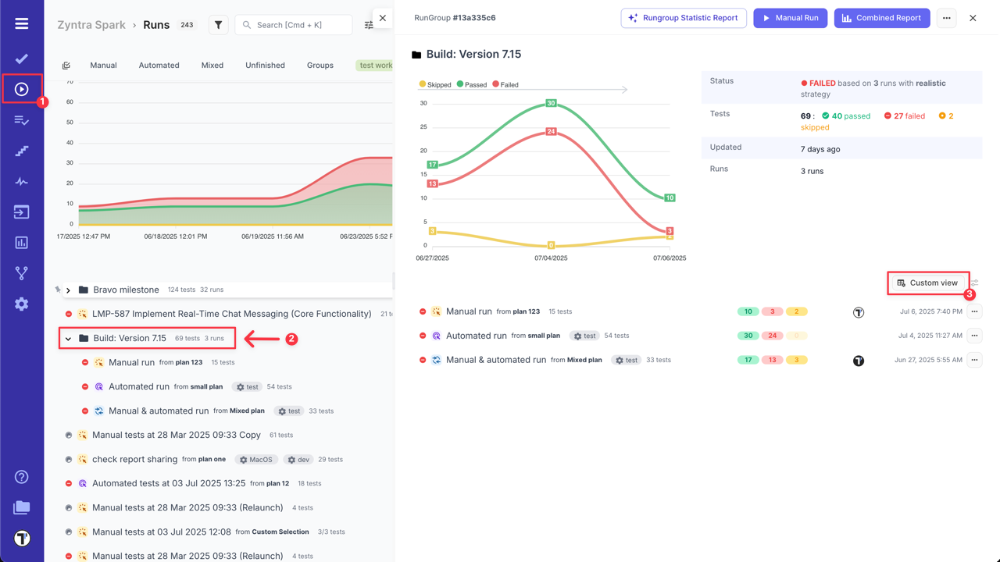

You can use the default custom view or personalize the table layout:

4. Click the **'Settings'** icon to access **'Runs List Settings'**.

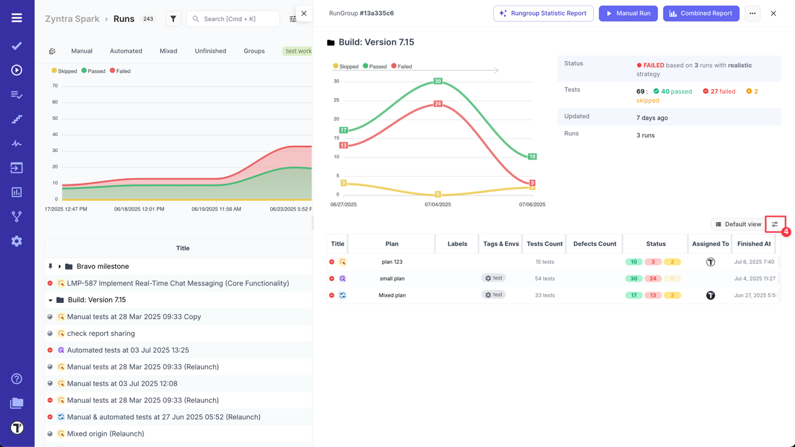

5. Select or deselect columns to show only the data you need.
6. Set the column width (px), if needed, to improve readability.
7. Click the **'Save'** button to apply your changes.

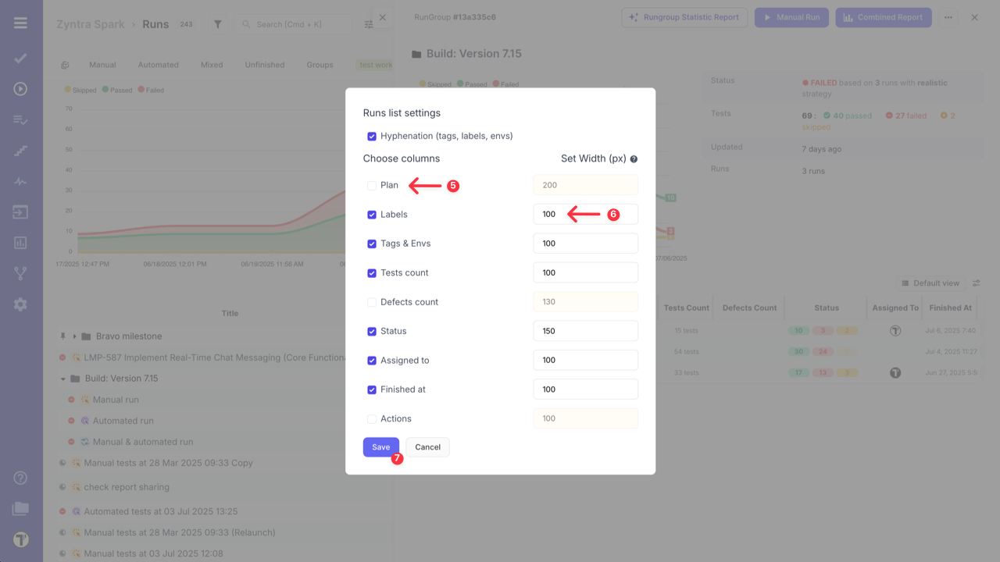

Here's how your customized table within a RunGroup will appear after customization:

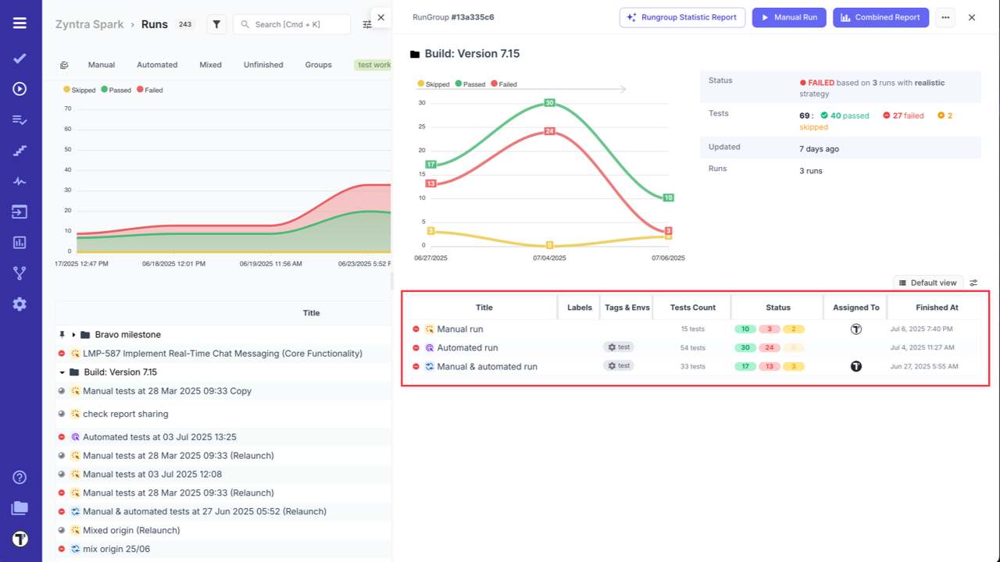

**Runs Dashboard Flow**

Similarly, customize the runs view from the main Runs Dashboard:

1. Go to **'Runs'** page.
2. Click the **'Custom view'** button.

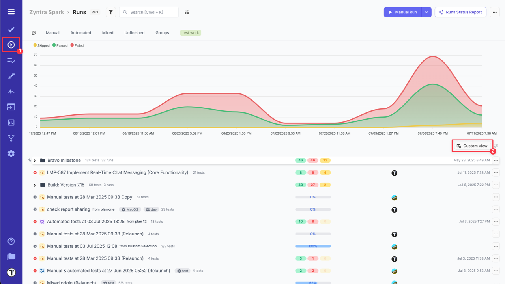

3. Click the **'Settings'** icon to access **'Runs List Settings'**.
4. Customize your view in the **'Runs list settings'**.
5. Click the **'Save'** button to apply your changes.

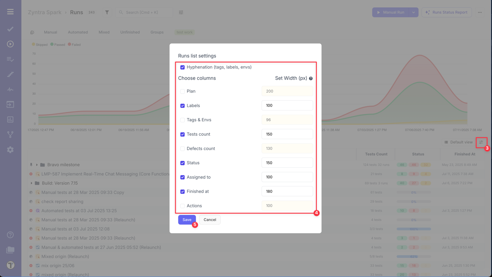

Here's how your customized table will appear.

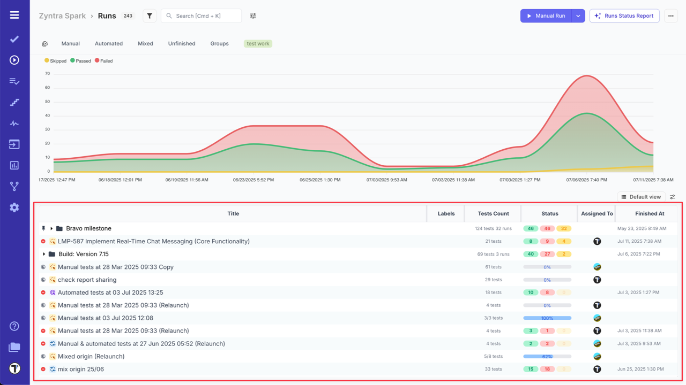

These customization options allow you to tailor the Runs View to display only the most relevant details, improving clarity and efficiency.

:::note

A customized runs list view automatically applies to all your RunGroups and main Runs Dashboard.

:::

## RunGroup Chart

The chart displays up to 50 of the latest test runs belonging to the group. If you have more runs, use the pagination arrows to view the results of the previous runs.

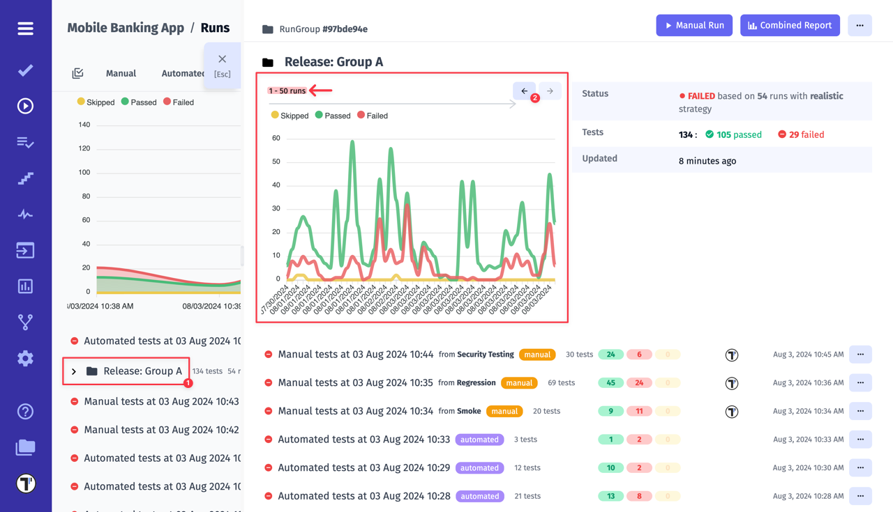

## How to Copy RunGroup

You can easily create a new RunGroup, completely independent of any previous runs, by copying all relevant tests exactly as they are. You can configure what data should be copied, namely:

- **Assignee**: Define assignee details separately, preventing them from being copied.
- **Issues**: Choose whether to include or exclude linked issues during duplication.
- **Labels**: Decide whether labels should be duplicated or omitted in the new test run.
- **Environments**: Control the duplication of environment settings based on your requirements.
- **Nested Structure**: Preserve or exclude the nested structure of your test groups as you duplicate them.

Follow these steps: 

1. Open the RunGroup. 
2. Click the **'Extra menu'** button.
3. Select **'Copy'** option form the dropdown menu.

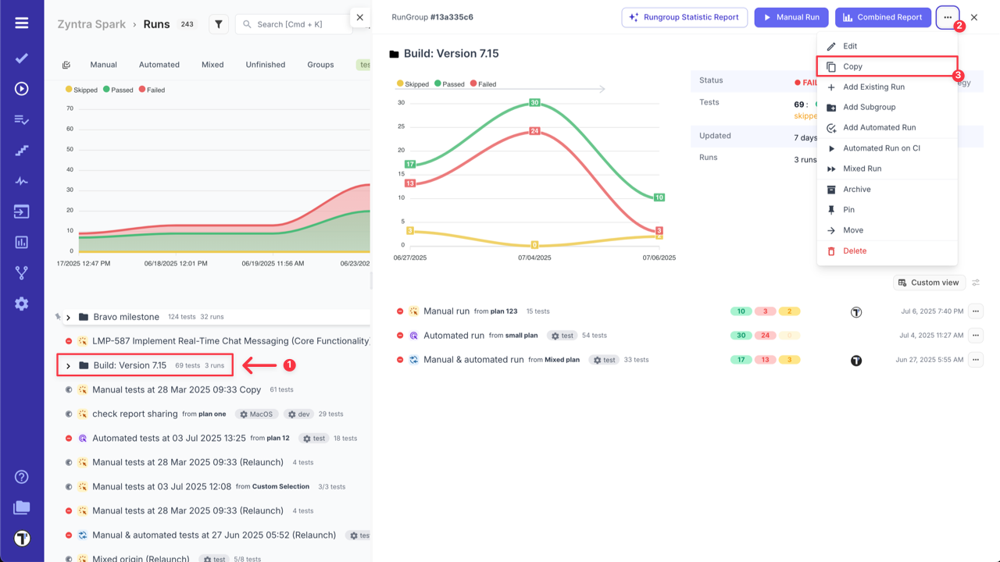

4. Select configuration options.
5. Click the **'Copy'** button. 

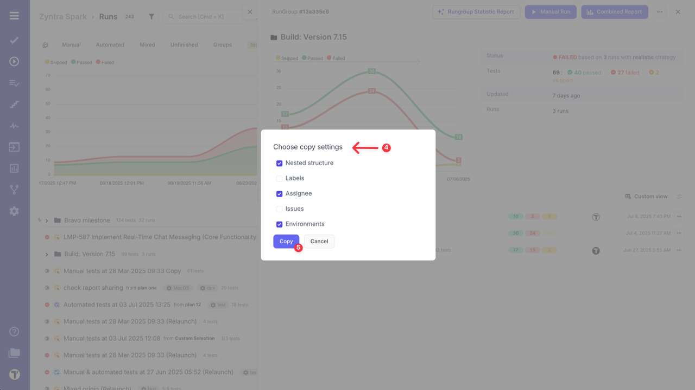

6. Verify the created RunGroup.

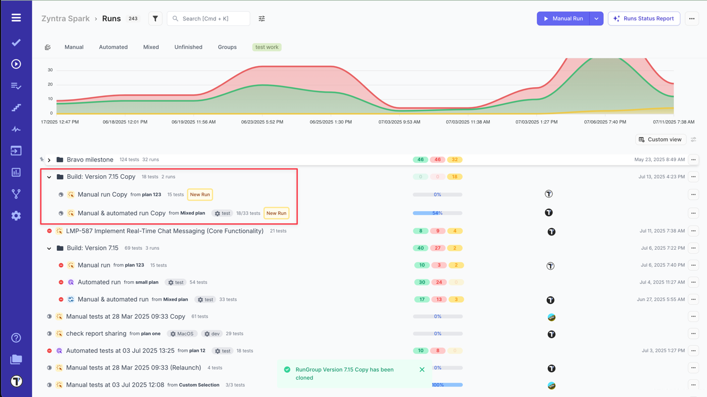

:::note

Only manual runs will be copied with the RunGroup. If a copied RunGroup contains a mixed test run, automated test cases will be marked as skipped by default.

:::

## How to Pin a RunGroup

Testomat.io allows users to pin RunGroups to the top of the Dashboard. This provides quick access to critical or frequently used tests or test runs, helping teams stay focused on the most relevant tasks. Pinning supports faster navigation, improved focus, and customizable workflows—ideal for monitoring regression tests, environment-specific runs, or production hotfixes.

For more details, refer to the [How to Pin a Run or RunGroup](https://docs.testomat.io/project/runs/managing-runs/#how-to-pin-a-run-or-rungroup) section.

## How to Archive RunGroup

Testomat.io gives you an opportunity to archive a RunGroup, including all its contained Test Runs. This helps maintain better visibility on your main Run Dashboard.

For more information on archiving, visit the [Archive Runs & RunGroups](https://docs.testomat.io/project/runs/archive-runs-and-groups) page. 

## How to Unarchive RunGroup

Archived RunGroups can be unarchive and moved back to the main Run Dashboard. Restoring a RunGroup also restores all its archived runs.

Read more in the [How to Unarchive Runs & RunGroups](https://docs.testomat.io/project/runs/archive-runs-and-groups/#how-to-unarchive-runs-&-groups) section. 