**Mixed Run** allows teams to execute manual and automated tests together within a single execution session, combining results into one unified report.

It is designed for real-world QA workflows where releases require validation across both automated pipelines and manual verification.

Key Benefits:

- Execute manual and automated testing in one place
- Unified reporting across execution types
- Real-time visibility into release readiness
- Flexible execution via CI pipelines or local CLI
- Supports exploratory and structured testing flows
- Centralized results for stakeholders and QA teams

In a Mixed Run:

- Manual tests are executed directly in the Testomat.io interface
- Automated tests run via CI or locally using CLI
- All results are placed into a single report

## Execution Types

When launching a Mixed Run, you must choose **how automated tests will be executed**.

Mixed Run supports two execution types.

| Execution Type           | Automated Tests           | Requirements                  |
| ------------------------ | ------------------------- | ----------------------------- |
| **Mixed Run on CI**      | Executed in a CI pipeline | CI profile must be configured |
| **Mixed Run without CI** | Executed locally via CLI  | No CI setup required          |

### Mixed Run on CI

Automated tests are executed through a configured **CI pipeline**.

Characteristics:

- automated tests start automatically after the run is launched
- results are reported from CI to Testomat.io
- manual tests are completed in the UI

Typical use cases:

- regression pipelines
- build validation
- automated testing triggered by commits or pull requests

Learn more in the [Continuous Integration guide](https://docs.testomat.io/integrations/continuous-integration/).

### Mixed Run without CI

Automated tests are executed **locally using the Testomat.io CLI**.

Characteristics:

- no CI setup required
- tests run from a local machine or testing environment
- results are reported to Testomat.io via CLI

Typical use cases:

- early automation adoption
- local debugging of automated tests
- hybrid workflows combining manual and automated testing

## How to Launch Mixed Runs

Mixed Runs can be started in **2 ways** depending on how much configuration is required.

- from the **Tests** page - for quick execution; ideal when you need to run specific tests or suites quickly, with minimal configuration
- from the **Runs** page - for fully configured execution; allows selecting test plans, assigning users, setting environments, and other advanced options before launch

### Launch Mixed Run from Tests Page

You can start a Mixed Run directly from the **Tests** page for quick execution of selected tests or suites.

- Run **a single suite** via **'...'** menu
- Run **multiple suites/tests** using **bulk selection**

Both options follow the same launch flow.

#### Launch a Suite from Tests Page

1. Go to the **Tests** page
2. Open a suite with manual and automated tests
3. Click the **'...'** menu
4. Select the **Run Tests** option

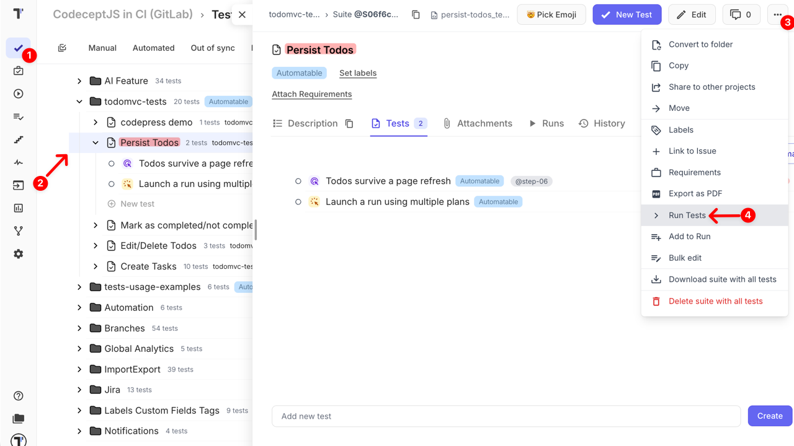

In the **Run** modal window,

5. Open the **Mixed Run** tab
6. Choose execution type:
   - **On CI** → Select [CI Profile](https://docs.testomat.io/integrations/continuous-integration/)
   - **Without CI** → disable CI build
7. Click the **Launch** button

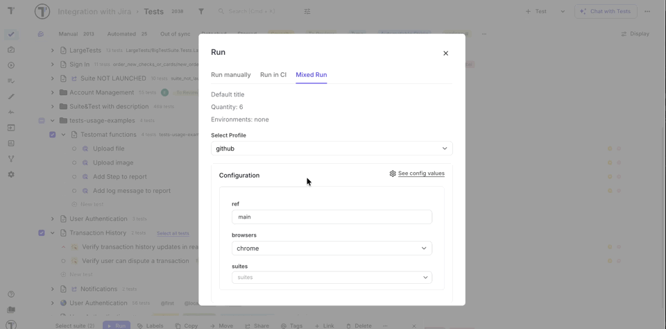

#### Launch Tests Using Bulk Selection

1. Go to the **Tests** page
2. Enable the **multi-select** mode
3. Select tests or suites
4. Click the **Run** button

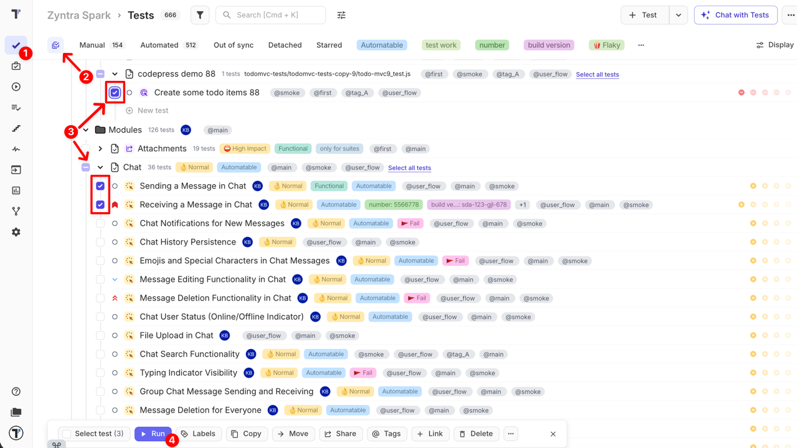

In the **Run** modal window,

5. Open the **Mixed Run** tab
6. Choose execution type:
   - **On CI** → Select [CI Profile](https://docs.testomat.io/integrations/continuous-integration/)
   - **Without CI** → disable CI build
7. Click the **Launch** button

### Launch Mixed Run from Runs Page

You can create and configure Mixed Runs from the **Runs page** when more control is required.

Launching a Mixed Run typically consists of **three steps:**

1. Create a new Mixed Run
2. Select Execution Type ([CI](https://docs.testomat.io/integrations/continuous-integration/)/ without CI)
3. Configure Mixed Run

Let's dive deeper into each step below.

#### Create a Mixed Run

1. Open the **Runs** page
2. Click the **'⌄'** button next to the 'Manual Run'
3. Select **Mixed Run** from dropdown

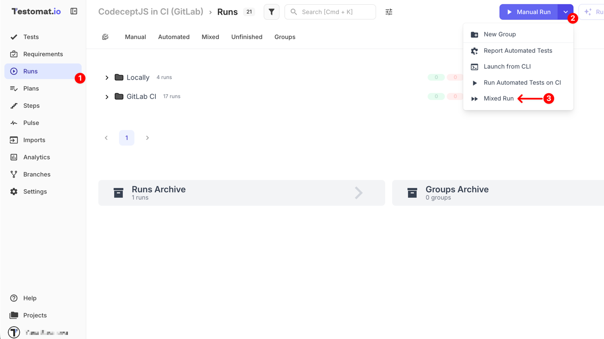

#### Select Execution Type

Choose how automated tests should run:

- **Enable CI build** — automated tests run via [CI pipeline](https://docs.testomat.io/integrations/continuous-integration/)
- **Disable CI build** — automated tests run locally via CLI

This selection determines how automated test execution will start.

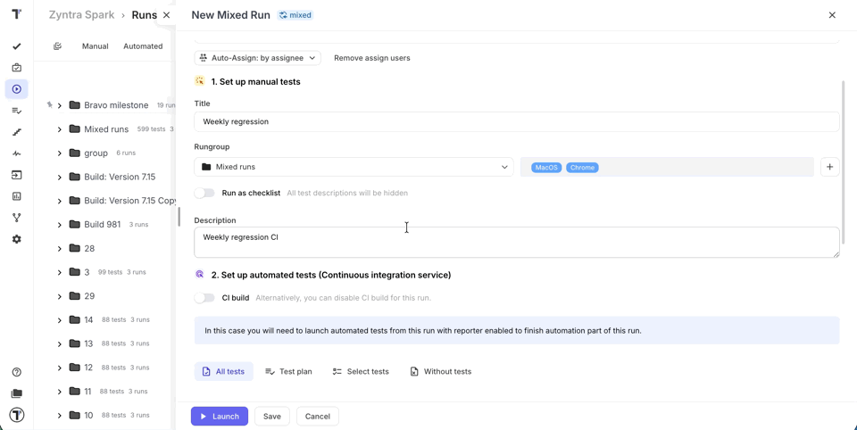

#### Configure Mixed Run

When creating a mixed run from the Runs page, the following options are available for configuration:

**Options Overview:**

- **All tests** – launch all manual and automated tests available in the project
- **Test plan** – select from existing test plans
  - Bulk selection is NOT supported, only one plan can be selected
  - You can also create a new test plan if needed (Learn more [here](https://docs.testomat.io/project/plans/#ways-to-create-a-test-plan))
- **Select tests** – manually select tests from the tree structure, use search, or apply filters to narrow down your selection
  - Supports bulk selection
  - Filters and collections allow for advanced selection and grouping of tests
  - Learn more about working with test collections & filters [here](https://docs.testomat.io/project/plans/#how-to-work-with-test-collections)
- **Without tests** – create a mixed run first and populate it later

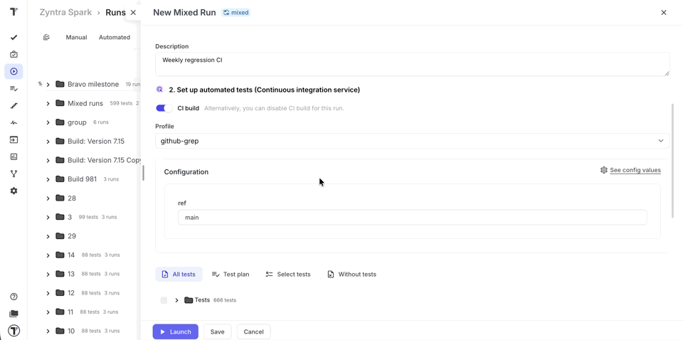

:::note

These options are mutually exclusive — you can select only one at a time — but you can still use bulk actions within ‘Select tests’ option.

:::

**Additional Configurations:**

- **Assign to** – define who will execute the tests (See: [How to Assign Users to the Run](https://docs.testomat.io/project/runs/running-tests-manually/#how-to-assign-users-to-the-run))
- **Title** (optional) – give your run a descriptive name
- **Rungroup** – group the run within a specific RunGroup for better organization (See: [How to Run Tests in RunGroups](https://docs.testomat.io/project/runs/running-tests-manually/#how-to-run-tests-in-rungroups))
- **Set environment for execution** – choose one or multiple environments for the run (See: [How to Run Environments](https://docs.testomat.io/project/runs/environments/#how-to-run-with-multi-environments))
- **Run as checklist** – hides test descriptions for faster execution, ideal for experienced testers (See: [How to Run Tests As Checklist](https://docs.testomat.io/project/runs/running-tests-manually/#how-to-run-tests-as-checklist))
- **Description** (optional) – provide context for this run

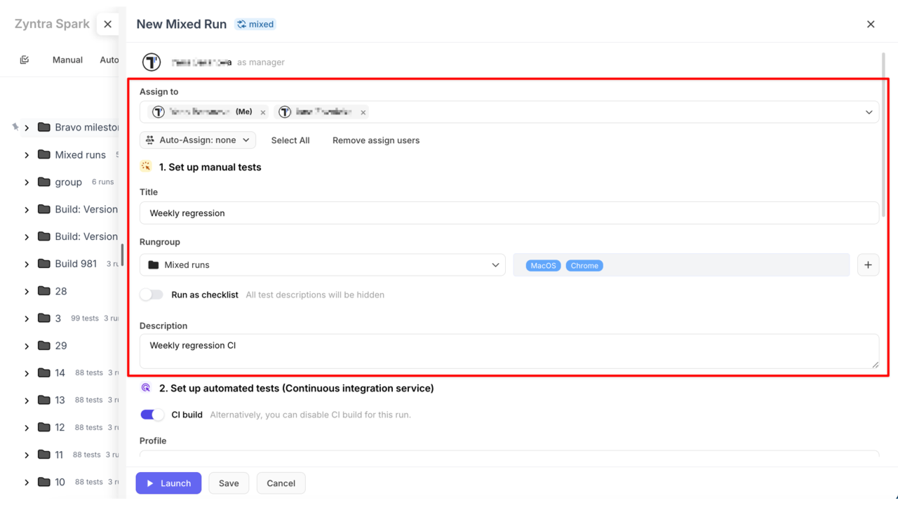

**After configuration:**

- **Launch** – immediately start the run with the configured settings
- **Save** – store the configured run without launching it, so it can be executed later
- **Cancel** - exit without saving; all changes will be lost

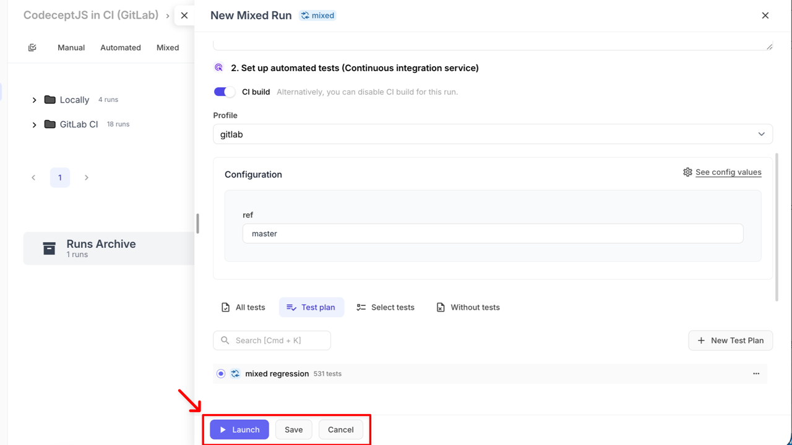

## How to Execute Mixed Run

After launching a Mixed Run, manual and automated tests can be executed independently depending on the selected execution type.

### Mixed Run without CI

When a Mixed Run is launched and **CI build is disabled**, follow these steps:

1. Copy the command in the launched Mixed Run

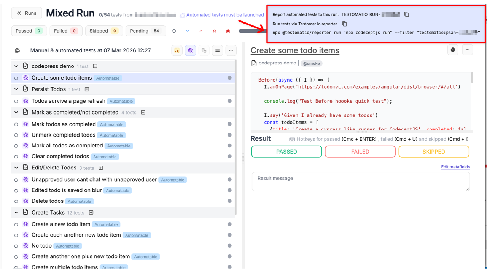

2. Paste it in your terminal

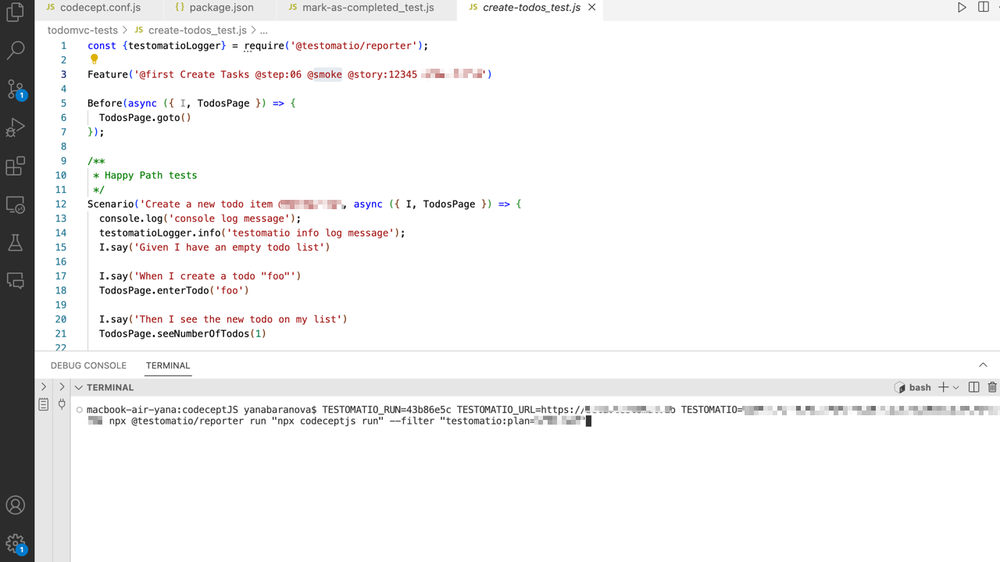

Example command:

`TESTOMATIO_RUN={Run_ID} TESTOMATIO={Project Reporting API key} npx @testomatio/reporter run "npx codeceptjs run" --filter "testomatio:plan={Plan_ID}"`

The CLI will:

- execute automated tests
- collect results
- send them to Testomat.io
- attach results to the current run

Meanwhile, manual tests can be executed directly in the UI.

3. Set up test case results for manual tests
4. Update test case results for automated tests or leave them as they are
5. Click the **Finish Run** button

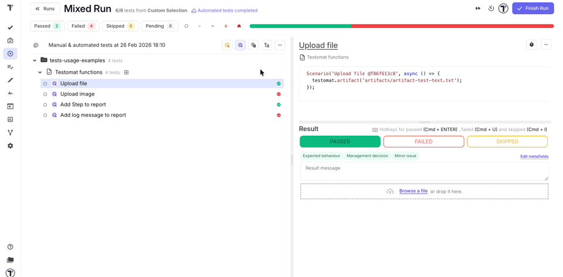

See how to set up test case results [here.](https://docs.testomat.io/project/runs/running-tests-manually/#how-to-set-test-case-results-in-manual-run)

### Mixed Run on CI

When a Mixed Run is launched and **CI build is enabled**:

1. CI pipeline starts automatically
2. Automated tests run in the CI environment
3. Test results are reported back to Testomat.io
4. manual tests must be executed in the Testomat.io UI in the same way as they are executed without CI
5. Finish the run when testing is complete

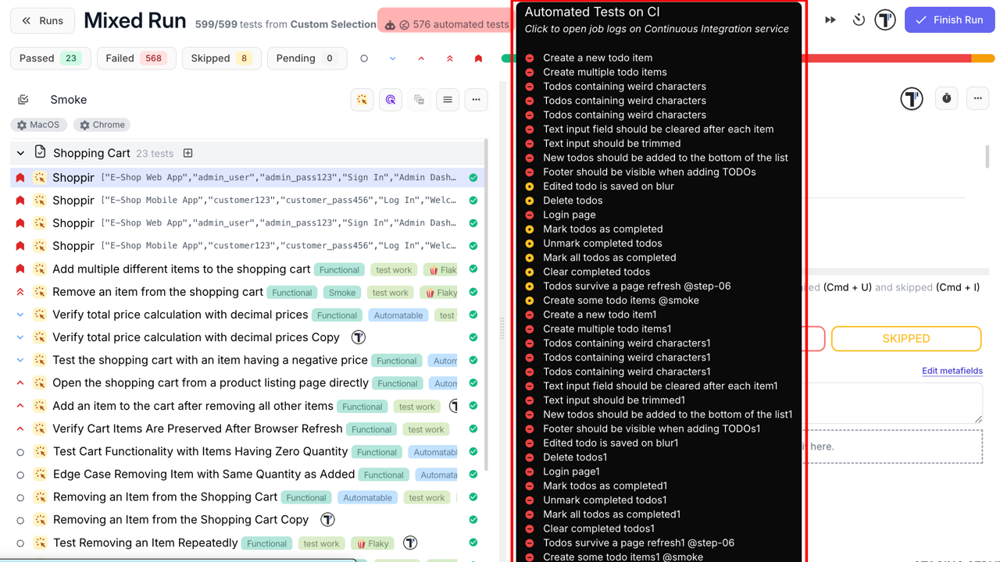

### How to Make Changes in Ongoing Mixed Run

During testing, new scenarios may appear that need immediate validation. Testomat.io allows you to edit an active Mixed Run without stopping the testing process.

This ensures flexibility, smooth testing workflow, and that no important scenarios are missed.

1. Go to the **Runs** page
2. Open the unfinished mixed run you want to edit
3. Click the **Edit** button

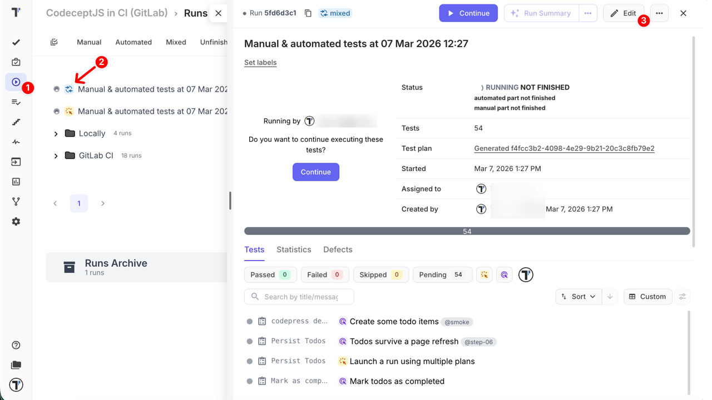

Once the **Edit mixed run** view is opened, here’s what you can do:

- **Assign to** - Remove existing users or assign more to the run
- **Title** - Enter or change the run title
- **Environment** - Add or remove testing environments
- **Description** - Add or update the run description
- **details** link - Check configuration details of the run
- **Current tests** – Shows all tests currently included in the run. Remove unnecessary tests by clicking the **trash** icon
- **+ Tests** – Similar to the 'Select tests' tab in a new mixed run. You can browse the test tree, use search or filters, or expand suites to select manual and automated tests to add to this run
- **+ Plans** – Select tests from existing test plans. You can include one or multiple plans in the current run

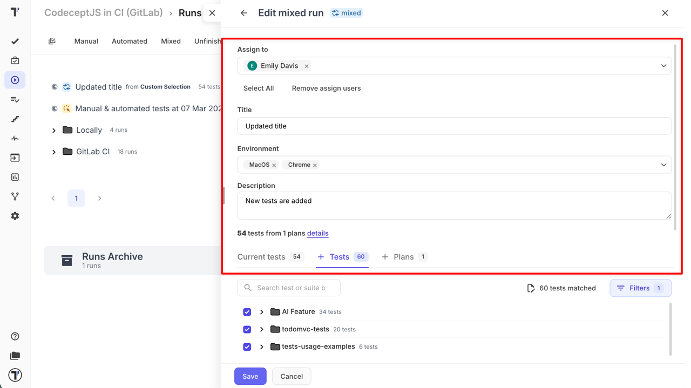

:::note

You can add tests from plans and additional tests at the same time. For example: select one or more plans, then select specific suites or individual tests — everything will be added to the run instantly.

:::

## Managing Mixed Runs

Testomat.io provides several ways to manage and reuse existing runs. Understanding each action ensures efficient test management and reduces the risk of errors in your QA workflow.

### Options only for Mixed Runs with CI

When the original run was executed via CI, two extra relaunch options appear:

1. **Relaunch Failed**

- Re-runs only the automated tests that failed in the previous run via CI
- A new CI job is created, but the Mixed Run ID stays the same
- Manual tests are skipped but can be executed again in the Testomat.io UI

2. **Relaunch All**

- Re-runs all automated tests via CI
- Previous results are reset, and a new CI job is created
- Manual tests still need to be executed manually in the UI

These options help teams to:

- repeat regression cycles efficiently
- validate fixes quickly
- re-run only failed automated tests when needed
- reuse existing run configurations
- maintain consistent and flexible QA workflows

### Options for all Mixed Runs

- **Relaunch Manually**

Restart the Mixed Run manually. All test cases (both manual and automated) will need to be executed manually in the Testomat.io UI, without triggering CI or CLI execution.

- **Advanced Relaunch**

Modify parameters before restarting execution. Learn more here about [Advanced Relaunch](https://docs.testomat.io/project/runs/managing-runs/#advanced-relaunch).

- **Launch a Copy Manually**

Create a copy of an existing mixed run and execute it manually. The copy allows independent execution without affecting the original run.

- **Launch a Copy**

Automatically create a copy of the mixed run and start it immediately with the same settings as the original.

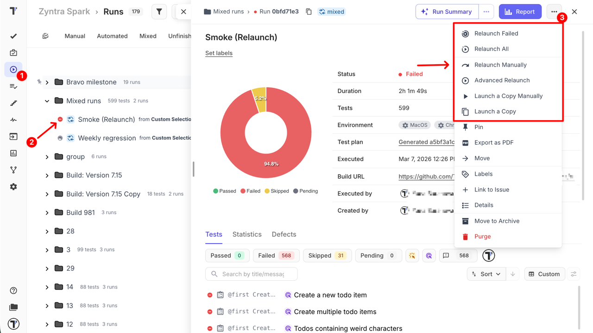
