## Running Tests Manually

Tests that are not automated (yet) can be executed by QA engineers in manual testing mode. In this mode, a user can check manual tests and mark them as passed or failed. It is possible to create a list of tests to check in test plan and assign users to a run.

### How to Run All Tests

To launch a Manual Test Run you need:

1. Click the Run button in the left-side menu
2. Select the Manual Run button

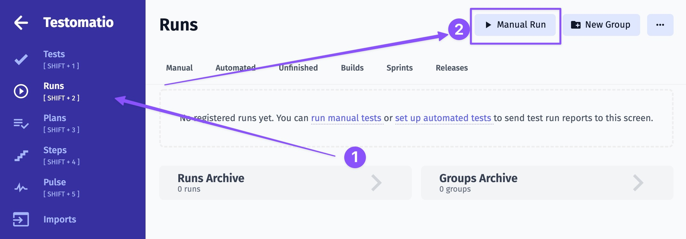

On Manual Run screen you need:

1. Select a Test Plan
2. Add a title (optional)
3. Pick up a testing environment
4. Click on Launch button

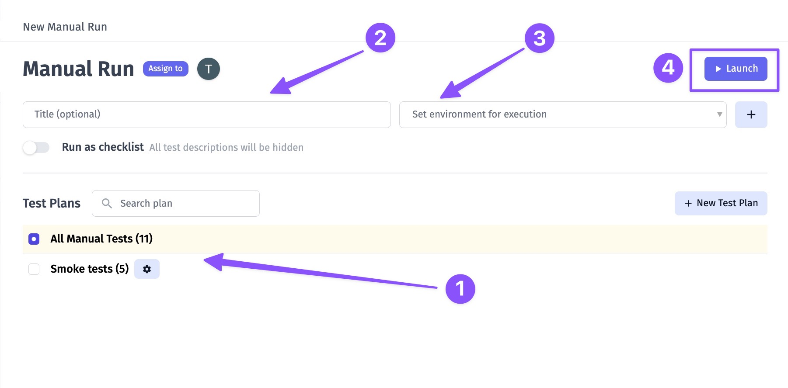

### How to Set Test Case Results in Manual Run

Once a manual test run is launched, you need to set a Result for each test case. The available options are:

- PASSED – The test case was successfully executed;
- FAILED – The test case did not meet the expected result;
- SKIPPED – The test case was not executed;

**Steps to Set Test Case Results, Messages, and Attach Files**:

1. Click on a test case
2. Select the appropriate result: PASSED, FAILED, or SKIPPED

3. Once the result is selected, you have the following options for the Test Result message field:

- Choose one of the available messages, but leave the field empty;
- Type your own message manually without choosing any of the available messages;
- Leave the field empty without choosing any message;
- Select a message from the available options and also type your own message in the field (as shown in the example below)

4. Once the **'Attaching a file'** field appears, allowing you to browse or drag-and-drop a file (e.g., screenshot, log file) to provide additional context for the result. This can help document evidence related to the test case, such as error logs or screenshots of the issue.

5. You can also configure the view of attached files with the following options:

- Large Thumbnails;
- Small Thumbnails;
- Grid View;
- List View;

6. Additionally, there are also two ways to view the specific file:

- **Open and fit to width**;

- Open and view a **Full screen** of the specific file;

7. To delete an attached file, click on the **trash** icon
8. After warning message **'Are you sure?'** appears, click **OK** button to confirm deletion

9. Once all test cases are completed, click the **Finish Run** button to end the process

:::note

If you need to configure different result messages, click here: <a href="https://docs.testomat.io/management/project/settings/#custom-statuses" target="_blank">Custom Statuses</a>

:::

### How to Create a Test Plan

If you need to create a Test Plan you should click on + New Test Plan

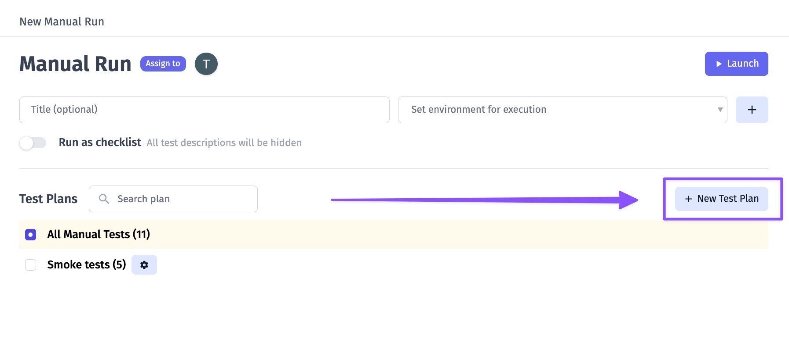

Or you can go to **Plans** page and create a new Test Plan there:

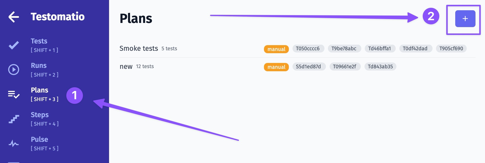

Now your next steps are:

1. Add a title to your Test Plan
2. Pick a suite/ tests
3. Click on the Save Plan button

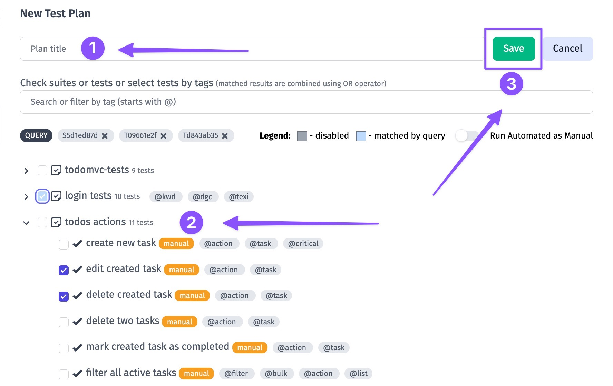

The new Test Plan will appear on Manual Run screen

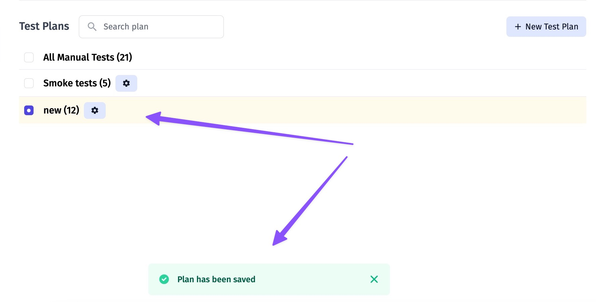

### How to Filter Tests for a Test Plan

Testomat.io allows users to refine test selection when creating a test plan by filtering tests and excluding unwanted ones.

Tests can be filtered in several ways:

1.  Manually picked up from existing suites.
2.  By Tags.
3.  By Priority.
4.  By Assignee.
5.  By Labels and Custom Fields.

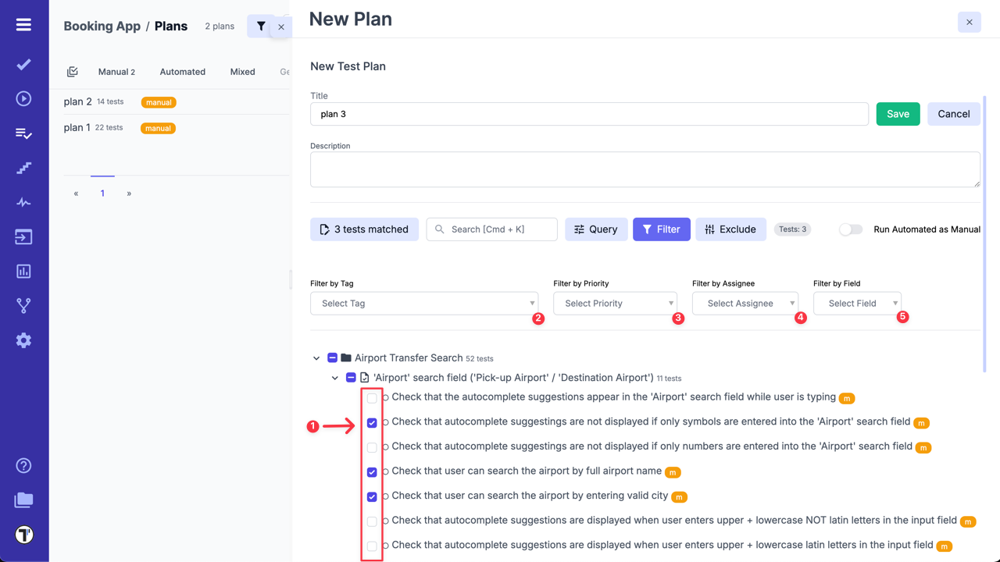

After you applied filters to narrow down the test list, you can exclude unwanted tests by deselecting individual tests from the filtered list **manually by unchecking them one by one** or **excluding multiple tests at once using TQL queries**. This will provide greater flexibility and control during test plan setup.

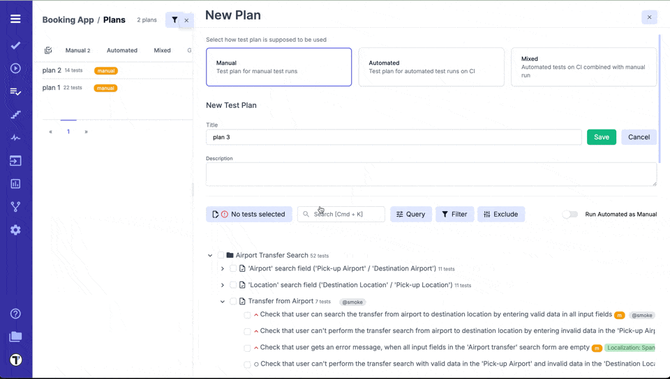

### How to Assign Users to the Test Run

By default, only the user who created the Test Run is added to it. However, Testomat.io allows you to assign multiple users to one Test Run:

1. Click on **'Manual run'** button.

2. Click on **'Assign users'** option.

3. Click on **'Assign to'** dropdown list and select users.

After selecting users, you can choose an assignment strategy, add a description, select/create a test plan, select an environment, etc., and then launch the test run.

**Test Assignment Strategies:**

- **None:** Users won't be automatically assigned to tests within this run. All users in the run can pick any test to assign, or you, as a manager, can manually assign users when run is started.

- **Prefer test assignee:** The system respects assignments made at the test and suite levels. Tests within this run will be automatically assigned to users responsible for them.

- **Randomly distribute tests between team members:** Tests within this run will be equally split between assigned team members. Manager won't be assigned to any test.

To select Test Assignment Strategies:

1. Assign at least one user to a Test Run.
2. Click on **'Auto-Assign Users'** button.
3. Select a strategy from the list.

### How to Assign User to Specific Test Cases/Suites within a Test Run

During the Test Run you can assign different users to specific Test Cases, Suites or Folders within one Test Run.

:::note

First, you need to assign users to the Test Run, and only after this you can assign them to specific Test Cases, Suites and Folders.

:::

**To Assign a User to a Suite/Folder:**

1. Open Test Run with assigned users.
2. Click on **'Continue'** button.

3. Click on **'Assign to'** icon for specific Suite/Folder.
4. Select a user for assignment from the list.

**To Assign a User to Test Cases:**

You can assign specific Test Cases only via **Multi-Select** button.

1. Open Test Run with assigned users.
2. Click **‘Continue’** button.

3. Click **‘Multi-Select’** button.
4. Select the Test Cases you would like to assign.
5. Click the **'Assign to'** button at the bottom.
6. Select a user for assignment from the list.

7. Click **'OK'** in the **'Are you sure you want to assign (username) to all selected tests?'** pop-up window.

Your Test Cases and Suites are now successfully assigned to different users.

### How to Select Environment

To select a testing environment you need:

1. Click on Environment field.
2. Choose the environment that you need.

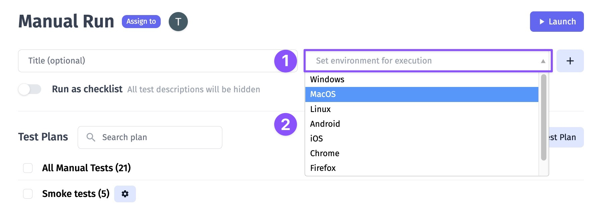

### How to Run Tests in RunGroups?

RunGroups allow you to organize test runs into structured folders, making it easier to manage and analyze test execution. By grouping related runs, you can maintain better visibility over different testing phases, environments, or specific test suites.

Before proceeding, make sure you have created a RunGroup. For detailed instructions on how to create and manage RunGroups, refer to this [guide](https://docs.testomat.io/project/runs/managing-runs/#rungroups) for more details.

**Enabling RunGroups for New Runs** (Optional Setting)

This setting is optional and can be enabled if you need it. Overall, you can freely create runs inside and out of groups.

1. Navigate to the **Settings** in the sidebar
2. Click on the **Project** tab
3. In the **Runs settings**, enable the option to require a RunGroup for new runs

Once the RunGroup is enabled, you can start your runs within folders. Make sure the **RunGroup Structure** is also enabled.

**Launching Runs in a Folder**

1. Navigate to the **Runs** tab
2. Click the **Manual Run** button

3. Select the required **RunGroup** from the dropdown
4. Click the **Launch** button

**Important:** If no RunGroup is selected, the field will be highlighted in red, and a warning message will appear, prompting you to choose a group before proceeding.

By following these steps, you can organize test runs within RunGroups, ensuring a structured and manageable testing workflow. See the result below:

**Launching Runs with Test Multiselection**

Ensure the **Require RunGroup for new runs** option is enabled to launch runs for individual tests or suites.

1. Navigate to **Tests**.
2. Enable multiselection.
3. Select one or more individual tests or suites.
4. Click the **Run** button in the bottom menu.
5. In the pop-up window, click **Launch**.

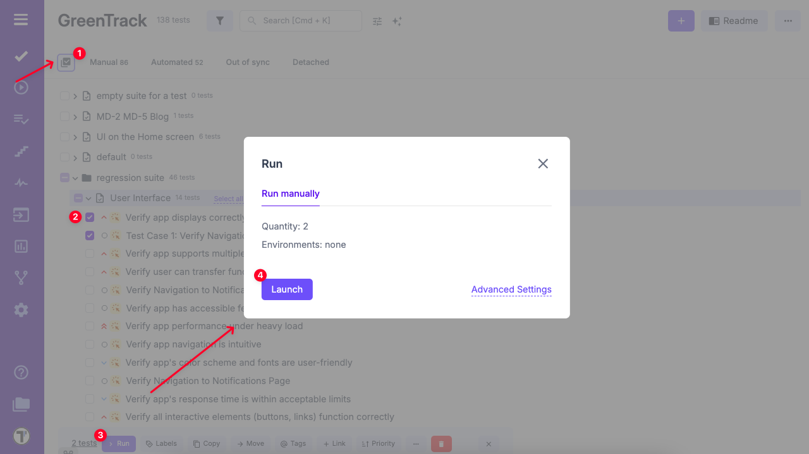

## Multi Environment Tests

Multi environment tests are used for performing the same tests in different environments. This option is very useful in cases when you need to perform testing with different types of operating systems/ browsers/ devices. They can be performed simultaneously or in a sequence. Let's get a look at this option.

### How to Add More Environments

To add more environment you need to click on the plus button

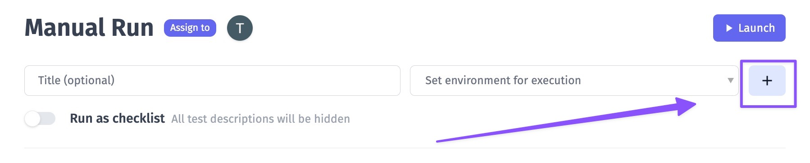

You will see a pop-up window where you should click on Add Environment button

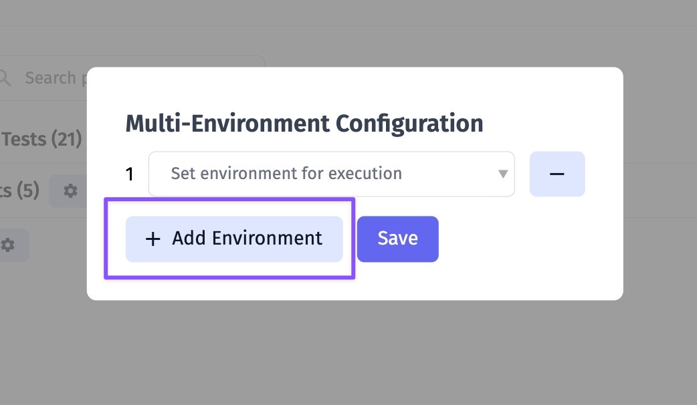

Then click on Environment field and choose the environment that you need

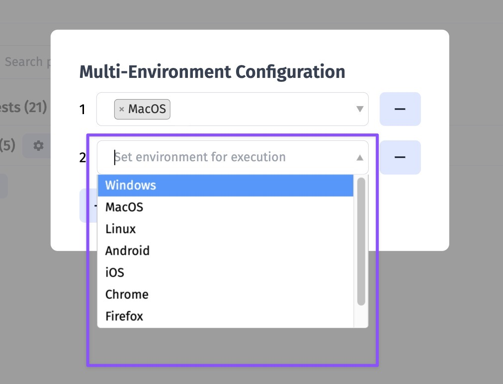

Once all environments were added click on Save button

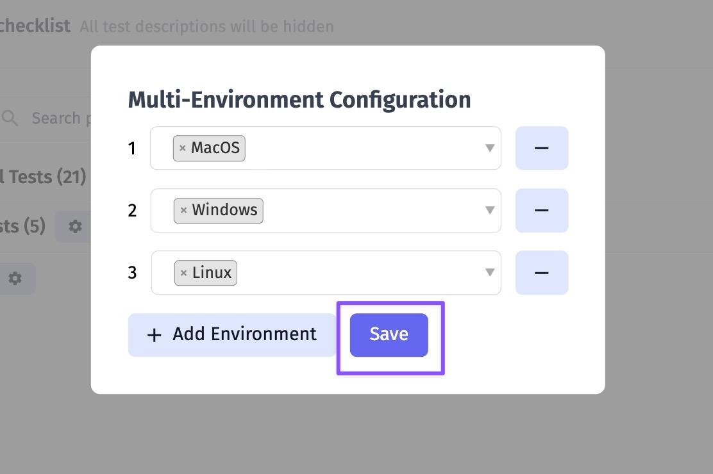

Now you have environment information updated on Manual Run screen

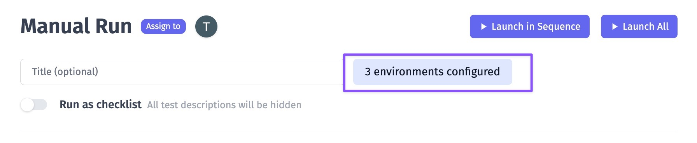

### How to Run Multi Environment Tests in Sequence

To run Multi Environment Tests in sequence you need to click on Launch in Sequence button

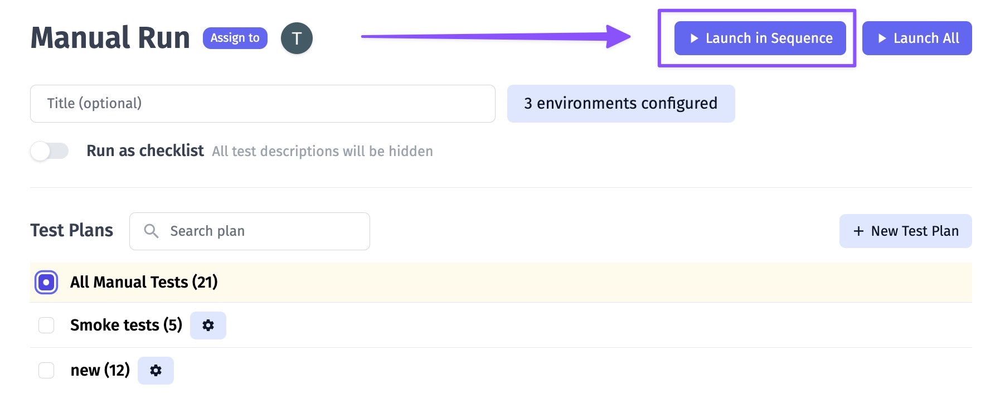

### How to Run All Multi Environment Tests

To run Multi Environment Tests in sequence you need to click on Launch All button

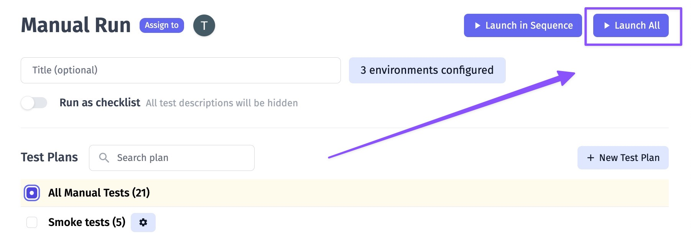

## How to Run Tests As Checklist

Checklists are widely used in day-to-day manual testing to quickly execute a set of tests without distracting to the additional details. In this mode, the test description is hidden by default. But you can still view the description when you click on the Description button.

To enable Checklist mode you need to launch Manual Run and switch on the Checklist toggle.

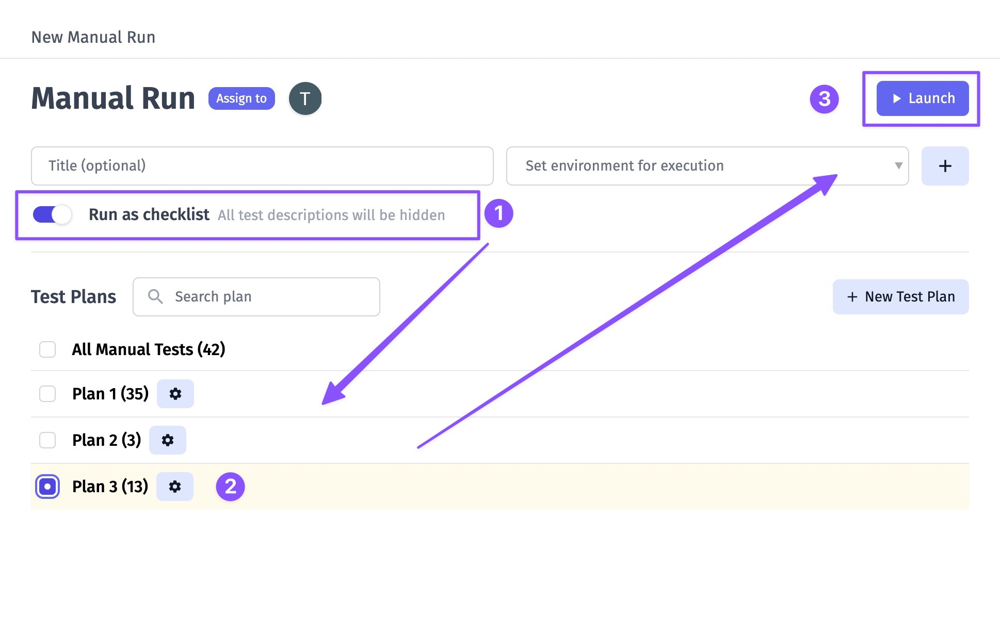

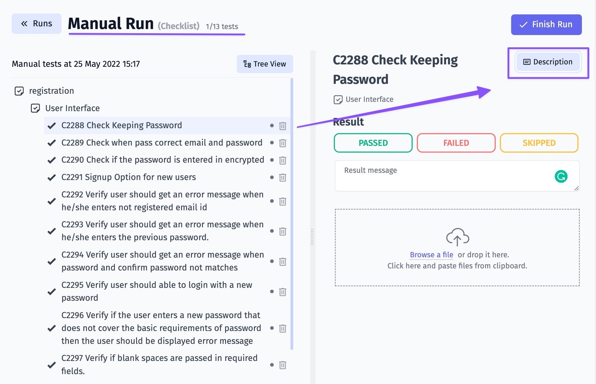

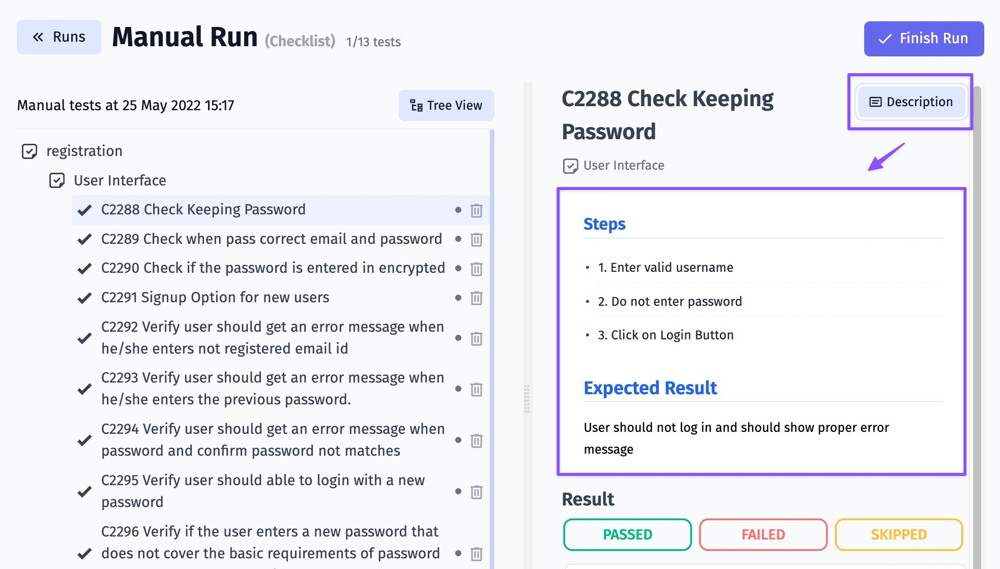

## How to Run Test With Steps Execution

Test execution by steps is a feature that enhances manual testing by allowing testers to track and manage the results of individual test steps. This ensures better traceability, improved defect detection, and a structured approach to test execution. By marking each step separately, QA teams gain deeper insights into the testing process and can effectively address issues as they arise.

1. Click the **Runs** in the sidebar
2. Launch a new manual run

3. Select the test with detailed steps you want to execute
4. Mark steps regarding the results:

- Click a step once to mark it as **Passed**
- Click a step twice to mark it as **Failed**
- Click a step three times to mark it as **Skipped**

5. Add a result with a message (optionally) for the test
6. Click **Finish Run** to complete the test execution

Test execution by steps introduces a structured, transparent, and efficient way to conduct manual testing. By breaking down test results into individual actions, QA teams can improve accuracy, streamline defect resolution, and optimize their testing workflow. This feature plays a crucial role in ensuring high-quality software delivery by providing detailed insights into each phase of test execution.

Take a look at how the test result with step execution looks:

## How to Run Automated Tests Manually

When creating Manual Test Run automated tests are disabled by default.

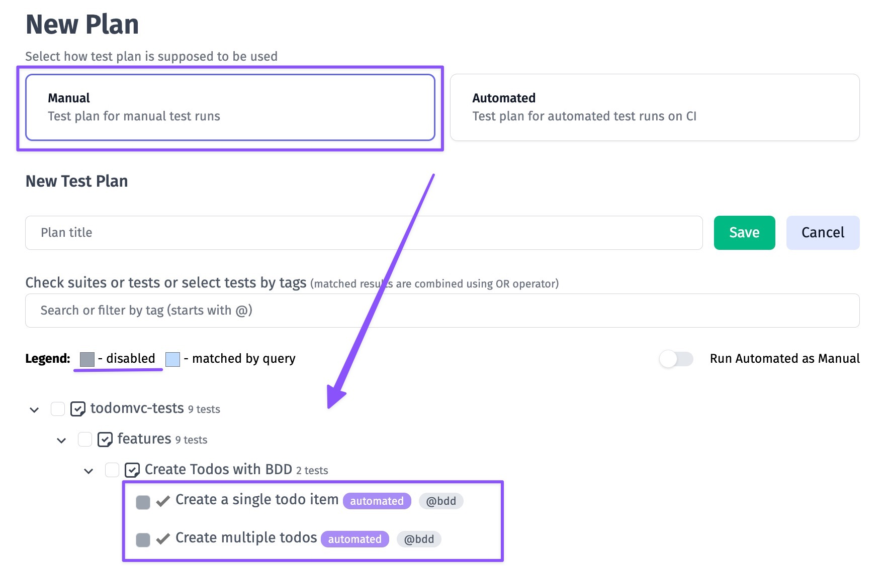

But you can enable them with **Run Automated as Manual** toggle.

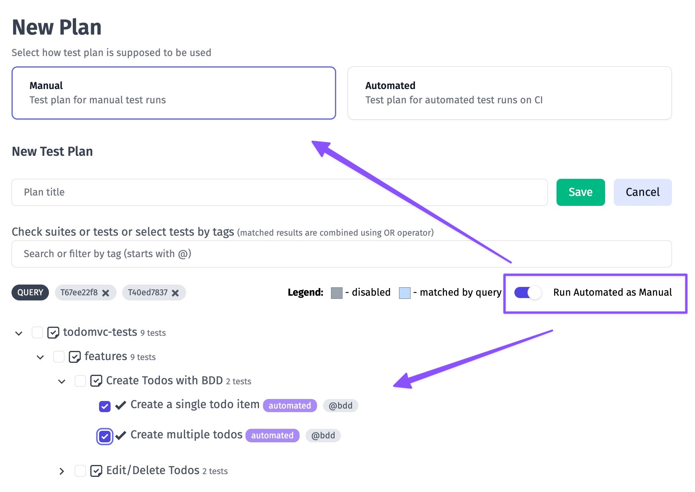

So can run automated tests manually as regular manual tests and see Code Description for reference

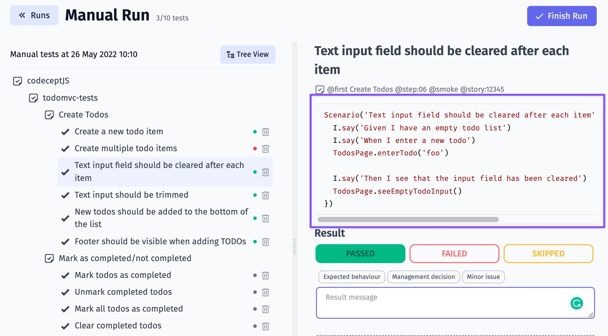

## How Make Changes in the Launched Test Run

As your testing journey unfolds, you might encounter new scenarios that warrant immediate attention. Fear not, Testomat.io provides you with options to inject additional tests into your already launched test runs. Discover how to expand your test scope effortlessly, ensuring that even the most unforeseen scenarios are accounted for without disrupting your testing momentum.

You can update your Test Run any time in few easy steps:

1. Open the Run
2. Click the Edit button

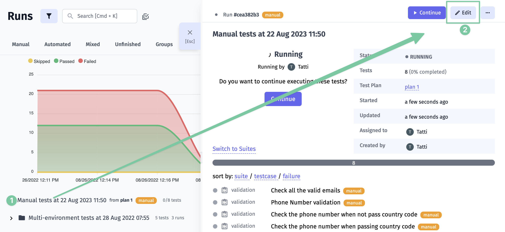

Let's see what we can do here:

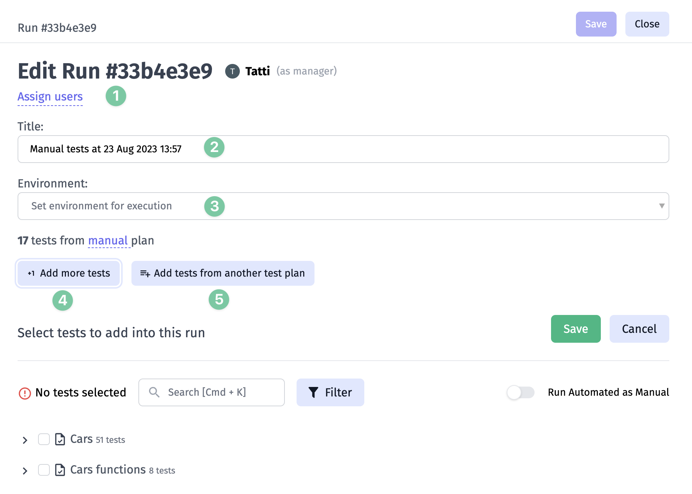

1. Assign more users to the Run
2. Edit title of the Run
3. Add/remove testing environments
4. Add more tests to the Run
5. Add tests from another test plan
6. Don't foget to save ;)

## How to Adjust Test Case Description Block

In case you want to adjust the size of the test description block to see more details without scrolling or to minimize it, you can easily resize it by following these steps:

1. Locate the vertical bar at the bottom of the test description block.
2. Hover your cursor over the bar until it changes to a resize indicator (an up-and-down arrow).
3. Click and hold the left mouse button on the bar.
4. Drag the bar up to decrease the block size or down to increase it.
5. Release the mouse button once you've adjusted the size to your preference.

This way, you can customize the view to match your workflow.

## Bulk Actions in Test Runs

Managing test cases efficiently is crucial for smooth test execution. With bulk actions, you can perform multiple operations at once, reducing manual effort and saving time. Below are the available bulk actions you can use within test runs.

### How to Reassign Multiple Test Cases

If you need to reassign test cases to a different user, you no longer have to update each test case separately. Instead, follow these easy steps:

1. Click **‘Runs’** button on the sidebar
2. Open the test run you’re working on
3. Click **‘Continue’** button

4. Click **‘Multi-Select’** button
5. Select the specific tests you would like to reassign
6. Click the **'Assign to'** button at the bottom
7. Select a user you would like to reassign
8. Click **'OK'** in the **'Are you sure you want to assign (username) to all selected tests?'** pop-up window

This feature significantly reduces manual effort and speeds up the reassignment process during test run.

Let’s check how tests look like after changes.

### How to Multi-Select Result Messages for Test Cases

While running tests and selecting the appropriate status with a result message, you can multi-select result messages for test cases. Follow these steps to complete the process:

1. Click **‘Runs’** button on the sidebar
2. Open a test run you’re working on
3. Click **‘Continue’** button

4. Click **‘Multi-Select’** button
5. Select the specific tests
6. Click the **‘Result message’** button at the bottom

7. Select an appropriate status, e.g., **‘PASSED’**
8. Choose a result message, e.g., **‘Expected behaviour’**
9. Also, type a result message in the provided field
10. Click the **‘Apply’** button

This feature allows testers to update multiple test cases efficiently, ensuring consistency in reporting results.

By using bulk actions, you streamline test management, improve workflow efficiency, and maintain consistency across test runs.

Let’s verify the multiple message results in these test cases:

## How to Track Test Time

You may find it useful to track the time spent on runs and specific test cases. For this purpose, Testomat.io has developed flexible time tracking.

The first thing you need to do is start a run. Сlick on the button with the stopwatch icon **(1)** and then click on the **Track** button **(2)**. Every 10 seconds will be displayed in the time record. The time is also displayed next to the title of each test case.

You can stop the tracking time if you need to leave during the testing process. And continue in the same way when you are ready.

If necessary, you can set the time manually. Сlick on the button with the stopwatch icon **(1)**, enter the time **(2)** using arrows or enter it from the keyboard and then click on the **Set Time** button **(2)**.

What's more, you can use the **Auto-Track** feature to automatically start the tracking process when you move on to the next test.

At the end of the run, the report will show you the time spent on a particular test case and the total time spent on all the test cases.

This can be useful for spreading the workload across all team members in future test runs.

## How to Track Test Case History During One Test Run

During a test run, the state or status of a test case may change multiple times. In some situations it can be important to review the history of all state changes, comments, and statuses for a specific test case before finishing the test run.

For this purpose, Testomat.io provides the test case history feature within the test run, displayed in chronological order beneath the selected test case.

To check the test case history, follow these steps:

1.  Open the test run
2.  Click 'Continue' button

3.  Click on the test case to see last 3 changes
4.  Click the arrow to expand the whole history, if needed

Now you can see the whole test case history

