In Testomat.io, manual test runs allow QA Engineers to execute tests that are not automated (yet) or to run automated tests in manual mode.  
During a manual run, testers can mark each test as **Passed**, **Failed**, or **Skipped**, add messages, attach evidence (screenshots, logs, etc.), and assign tests to specific team members.

There are **two main ways** to start a manual run:

1.  From the **'Tests'** page – quick launch for selected tests or suites, or adding tests to an already ongoing run without leaving the Tests view
2.  From the **'Runs'** page – the classic way to create and manage full runs with complete configuration options

## How to Launch from the Tests Page

From the **'Tests'** page, you can quickly start a run or add tests to an existing run without opening the Runs view. Available options include:

- Add single test case to ongoing run
- Add multiple test cases to ongoing run
- Run a single suite
- Run multiple suites at once
- Launch **manual**, **automated**, or **mixed** suites if CI is configured

### How to Add a Test Case to the Run from Tests Page

Add a test case to your unfinished run directly from **'Tests'** page.

1. Go to the **'Tests'** page.
2. Click on the Test Case that you want to add.
3. Click the **Extra menu** button on test case page.
4. Select **'Add to Run'** option from the dropdown menu.

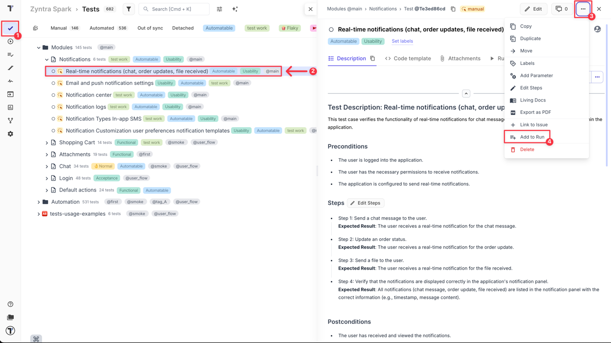

5. Select the unfinished run to which you want to add this test.
6. Click the **'Add to Run'** button.

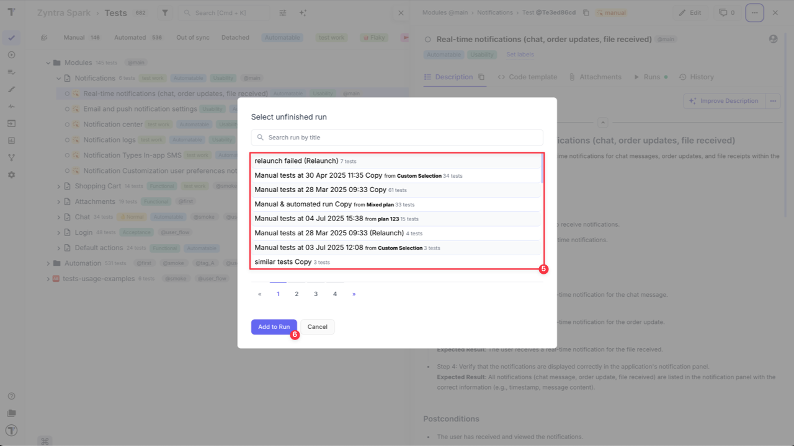

The test case is successfully added to the selected ongoing run:

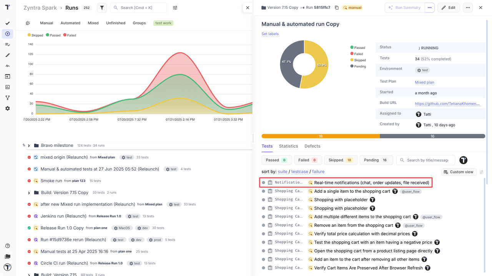

As well you can use **Multi-select** option to add several tests to a run simultaneously.

1. Go to the **'Tests'** page.
2. Enable **'Multi-select'** option.
3. Select a few test cases.
4. Click the **'Extra menu'** button in the multi-select menu panel.
5. Select **'Add to Run'** option.

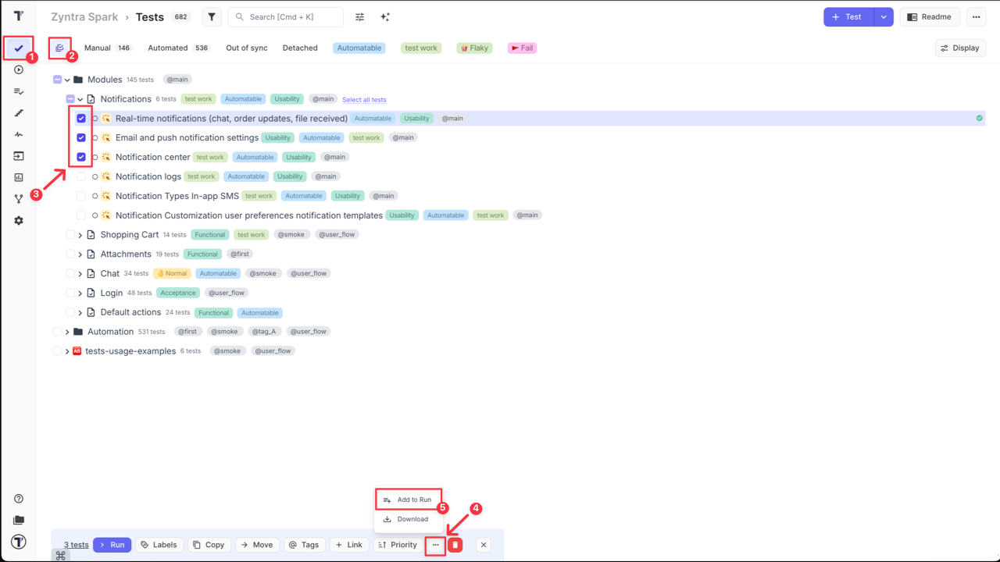

The selected tests will be immediately added to the ongoing test run, helping you to keep your execution plan up-to-date even while a run is already in progress.

### How to Run a Suite from Tests Page

Testomat.io allows you to launch a run of a single suite or multiple suites directly from the **'Tests'** page.

#### Run a Single Suite

1. Go to the **'Tests'** page.
2. Click on the Suite that you want to Launch.
3. Click the **'Extra menu'** button on suite page.
4. Select **'Run Tests'** option from the dropdown menu.

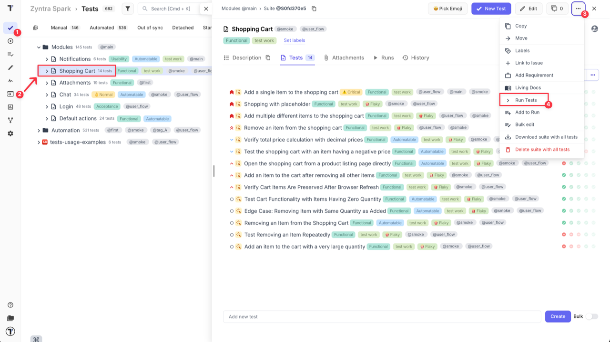

5. Click the **'Launch'** button on the displayed modal.

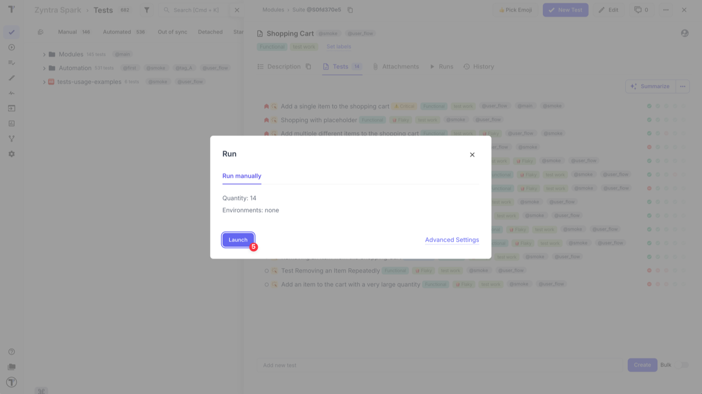

The Run window, displaying all test cases within the selected Suite, will appear automatically.

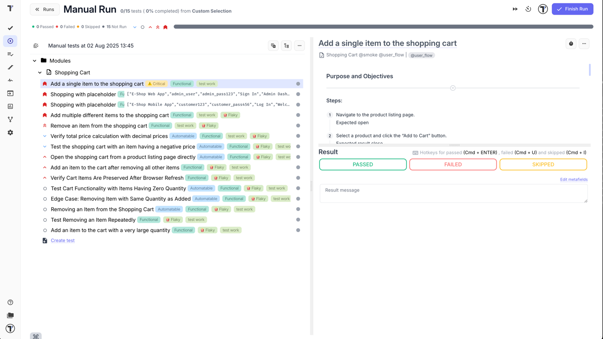

#### Run Several Suites

Use the **'Multi-select'** option to launch multiple suites in a single run.

1. Go to the **'Tests'** page.
2. Enable **'Multi-select'** option.
3. Select a few suites.
4. Click the **'Run'** button.

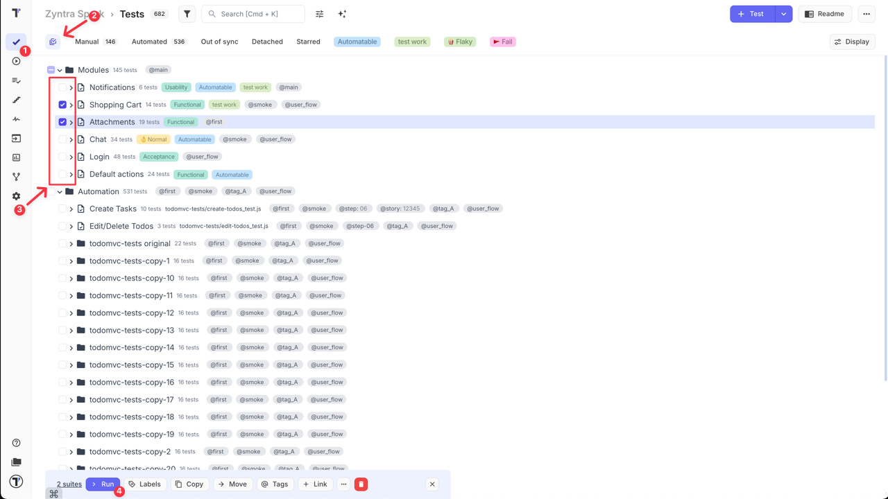

5. Click the **'Launch'** button on the displayed modal.

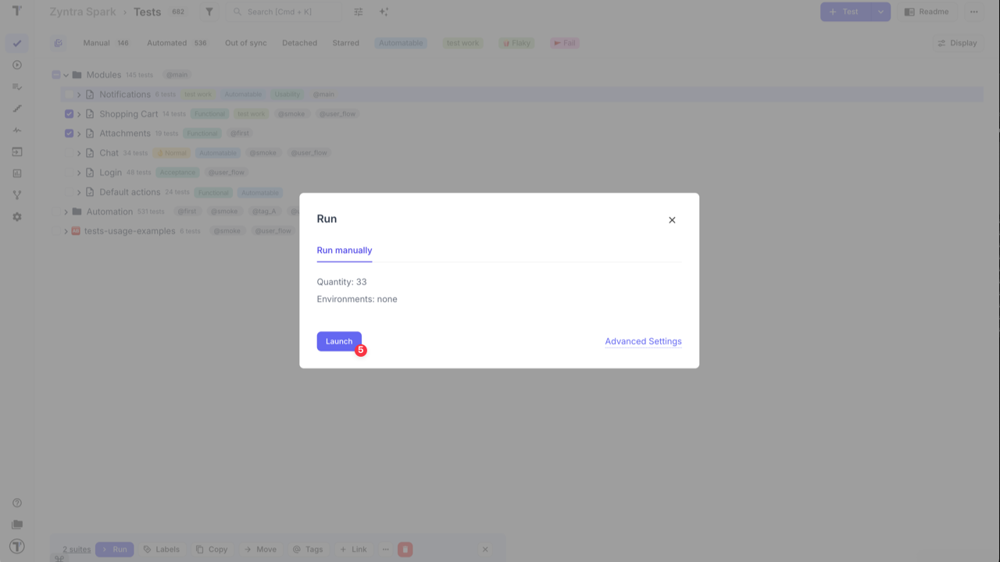

If you need to configure additional run settings (such as RunGroup or environment), click the **'Additional Settings'** link on the displayed modal.

:::note

You can Launch not only **manual** suites but also **automated** or **mixed** suites from **'Tests'** page, if Continuous Integration for your project is set up. Learn more about it on the relevant page on [Continuous Integration](https://docs.testomat.io/integrations/continuous-integration/) section.

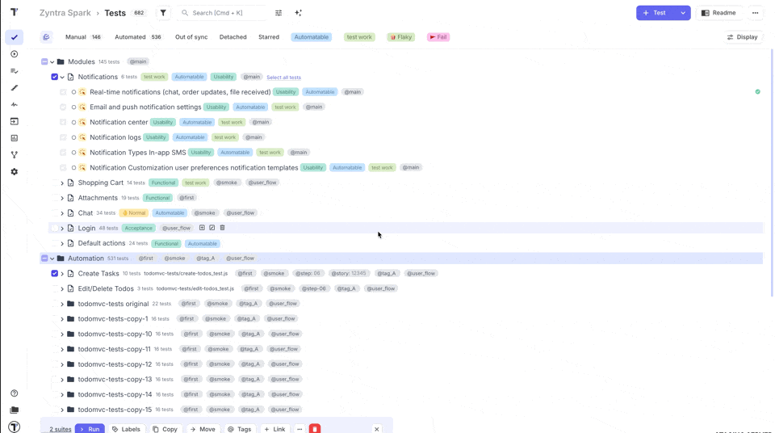

:::

## How to Launch from the Runs Page

From the **Runs** page, you can create and manage runs with flexible configuration options and full execution control. You can launch runs immediately or prepare and save them for later execution. Runs can include all tests in the project or predefined test plans, allowing you to organize testing according to your workflow.

### How to Configure a Manual Run

When creating a manual run from the Runs page, the following options are available for configuration:

Options Overview:

- **All tests** – launch all manual tests available in the project
- **Test plan** – select from existing test plans

  - Supports bulk selection
  - You can also create a new test plan if needed (Learn more [here](https://docs.testomat.io/project/plans/#ways-to-create-a-test-plan))

- **Select tests** – manually select tests from the tree structure, use search, or apply filters to narrow down your selection

  - Supports bulk selection
  - Filters and collections allow for advanced selection and grouping of tests
  - Learn more about working with test collections & filters [here](https://docs.testomat.io/project/plans/#how-to-work-with-test-collections)

- **Without tests** – create the run structure first and populate it later

:::note

These options are mutually exclusive — you can select only one at a time — but you can still use bulk actions within 'Test plan' and 'Select tests' options.

:::

Additional Configurations:

- **Assign to** – define who will execute the tests (See: [How to Assign Users to the Run](https://docs.testomat.io/project/runs/running-tests-manually/#how-to-assign-users-to-the-run))
- **Title** (optional) – give your run a descriptive name
- **Rungroup** – group the run within a specific RunGroup for better organization (See: [How to Run Tests in RunGroups](https://docs.testomat.io/project/runs/running-tests-manually/#how-to-run-tests-in-rungroups))
- **Set environment for execution** – choose one or multiple environments for the run (See: [How to Run Environments](https://docs.testomat.io/project/runs/environments/#how-to-run-with-multi-environments))
- **Description** (optional) – provide context for this run
- **Run as checklist** – hides test descriptions for faster execution, ideal for experienced testers (See: [How to Run Tests As Checklist](https://docs.testomat.io/project/runs/running-tests-manually/#how-to-run-tests-as-checklist))
- **Launch** button – immediately start the run with the configured settings
- **Save** button – store the configured run without launching it, so it can be executed later
- **Cancel** - exit without saving; all changes will be lost

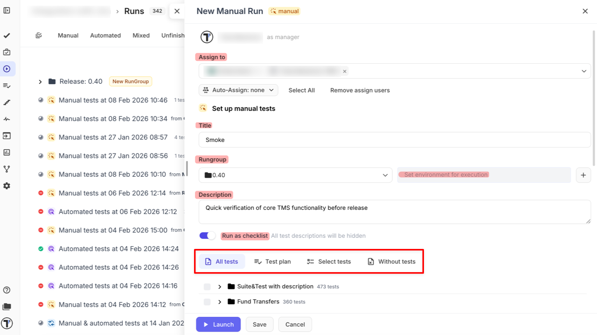

### How to Set up Additional Manual Run options

When manual run is launched, the following set up options are available:

1. **Collapse/Expand all** - expands or collapses test suites within the run structure
2. **Tree view/list view** - displays tests as a hierarchical tree or a flat list
3. **Extra options menu** - displays the list of additional set up options
4. **Refresh structure** - updates the test list to reflect any structural changes made during the run, such as moving, adding or removing tests
5. **Show/Hide Test Creation** - enables or disables the visibility of the button used to create and add new test cases during the run
6. **Show/Hide Labels** - shows or hides labels applicable to individual test cases
7. **Show/Hide Tags** - shows or hides tags applicable to individual test cases

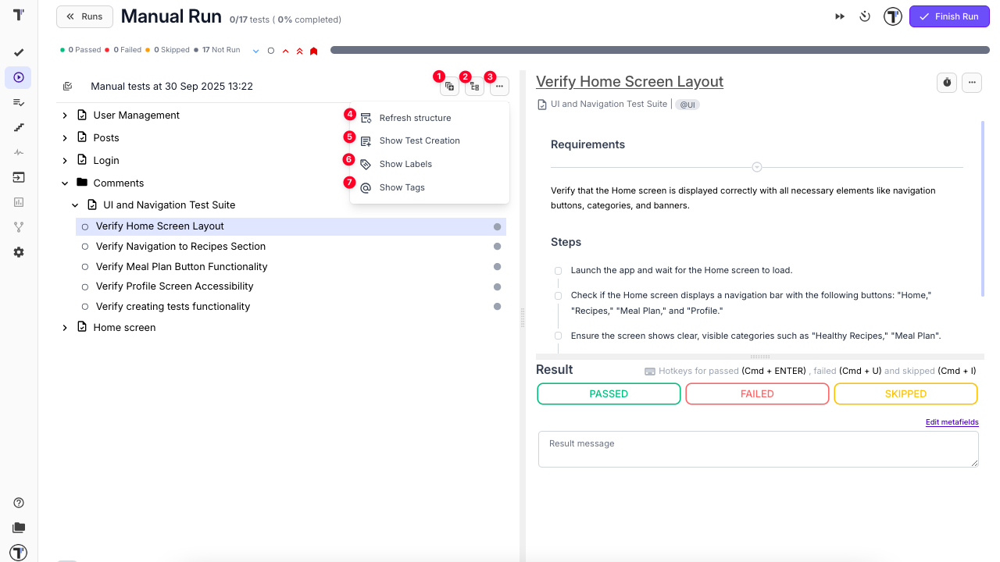

### How to Run All Tests

To launch a Manual Run you need:

1. Go to the **Runs** page
2. Click the **Manual Run** button

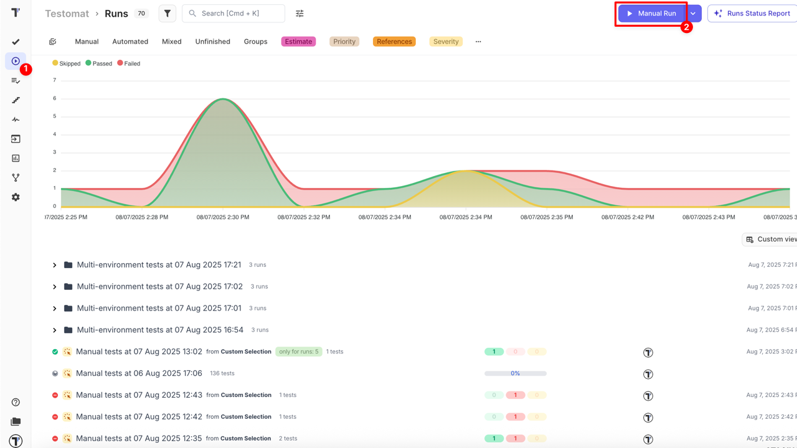

3. Add additional configuration if needed (See: [How set up additional configurations](https://docs.testomat.io/project/runs/running-tests-manually/#how-to-configure-a-manual-run))

The **'All tests'** tab is selected by default, meaning that **all manual tests in the project will be included in this run**.

4. Click **Launch** to start the run

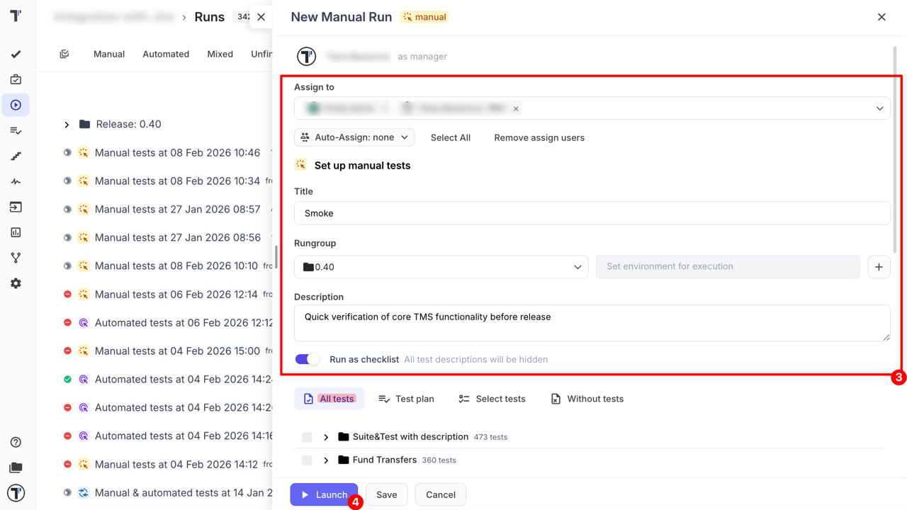

### How to Set Test Case Results in Manual Run

Once a manual test run is launched, you need to set a Result for each test case. The available options are:

- **PASSED** – The test case was successfully executed;
- **FAILED** – The test case did not meet the expected result;
- **SKIPPED** – The test case was not executed;

**Steps to Set Test Case Results, Messages, and Attach Files**:

1. Click on a test case
2. Select the appropriate result: PASSED, FAILED, or SKIPPED

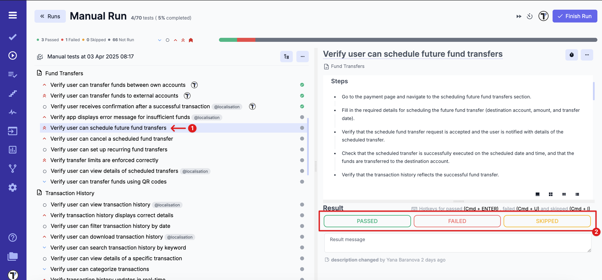

3. Once the result is selected, you have the following options for the Test Result message field:

- Type your own message manually;
- Leave the field empty;
- Select a custom status from the available options and also type your own message in the field (as shown in the example below);

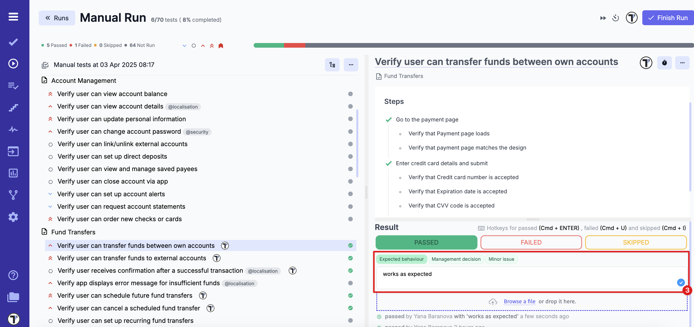

:::note

If you need to configure different custom statuses, click here: <a href="https://docs.testomat.io/project/runs/custom-statuses/" target="_blank">Custom Statuses</a>

:::

4. Once the **'Attaching a file'** field appears, allowing you to browse or drag-and-drop a file (e.g., screenshot, log file) to provide additional context for the result. This can help document evidence related to the test case, such as error logs or screenshots of the issue.

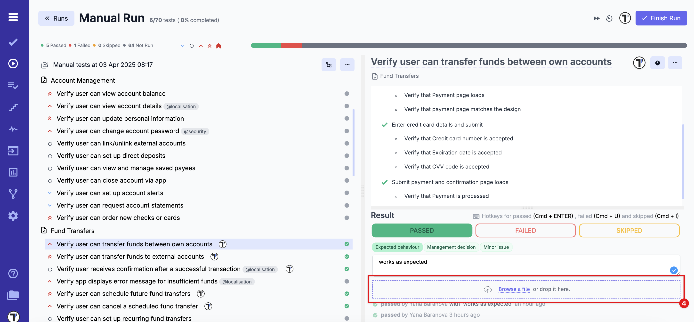

5. You can also configure the view of attached files with the following options:

- Large Thumbnails;
- Small Thumbnails;
- Grid View;
- List View;

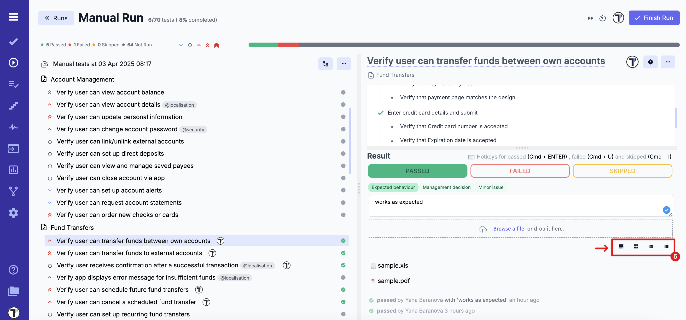

6. Additionally, there are also two ways to view the specific file:

- **Open and fit to width**;

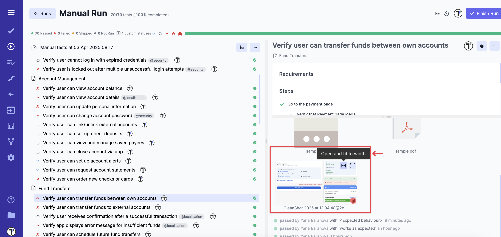

- Open and view a **Full screen** of the specific file;

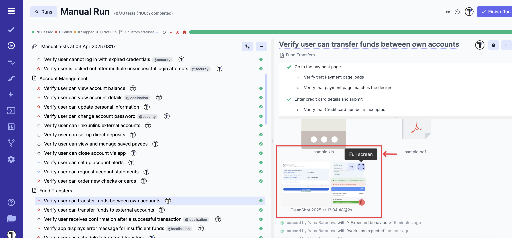

7. To delete an attached file, click on the **trash** icon
8. After warning message **'Are you sure?'** appears, click **OK** button to confirm deletion

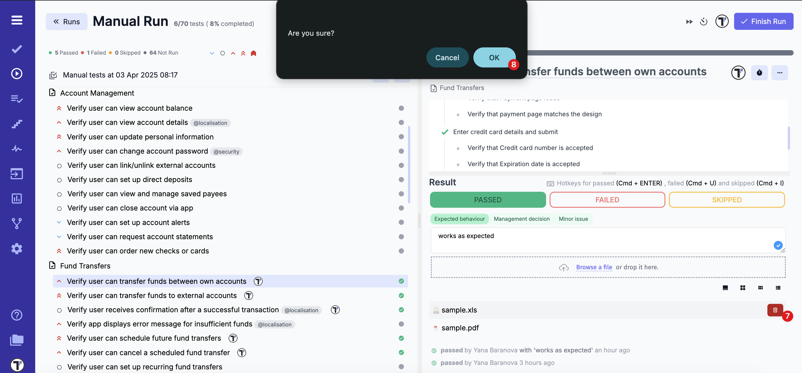

9. Once all test cases are completed, click the **Finish Run** button to end the process

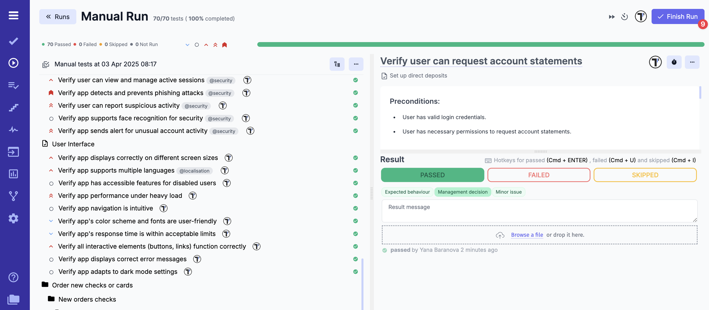

### How to Assign Users to the Run

By default, only the user who created the Run is added to it. However, Testomat.io allows you to assign multiple users to one Run:

1. Click on **'Manual Run'** button.

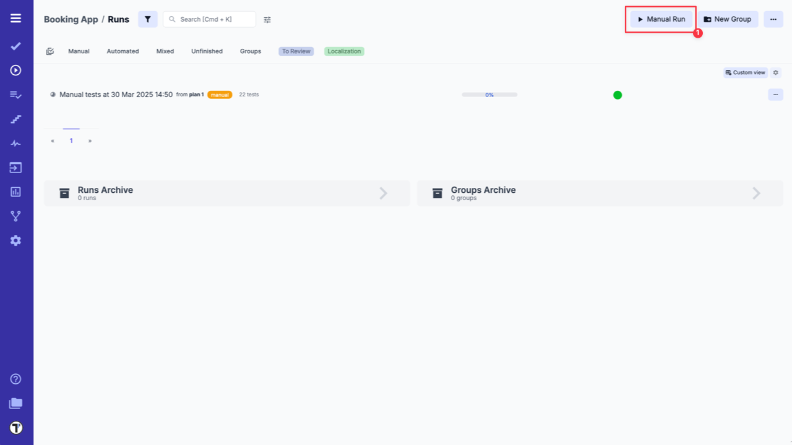

2. Click on **'Assign users'** option.

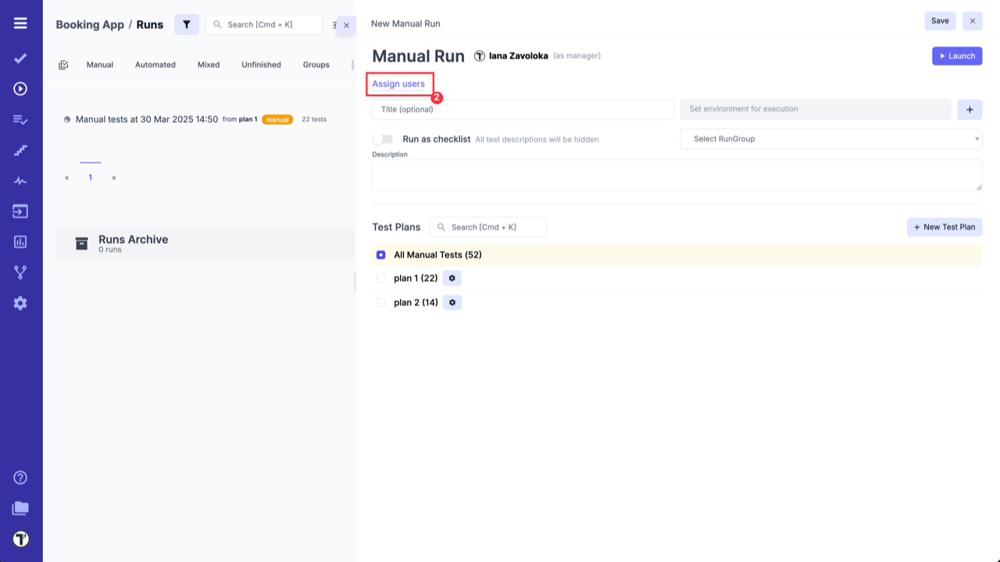

3. Click on **'Assign to'** dropdown list and select users.

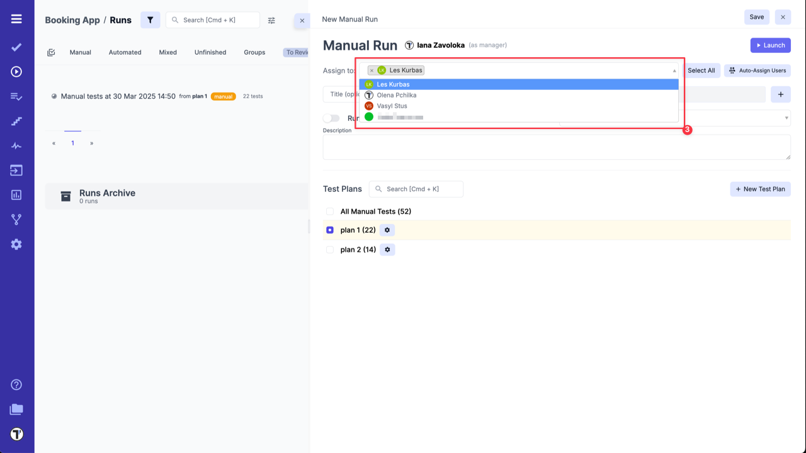

After selecting users, you can choose an assignment strategy, add a description, select/create a test plan, select an environment, etc., and then launch the test run.

**Test Assignment Strategies:**

- **None:** Users won't be automatically assigned to tests within this run. All users in the run can pick any test to assign, or you, as a manager, can manually assign users when run is started.

- **Prefer test assignee:** The system respects assignments made at the test and suite levels. Tests within this run will be automatically assigned to users responsible for them.

- **Randomly distribute tests between team members:** Tests within this run will be equally split between assigned team members. Manager won't be assigned to any test.

To select Test Assignment Strategies:

1. Assign at least one user to a Run.
2. Click on **'Auto-Assign Users'** button.
3. Select a strategy from the list.

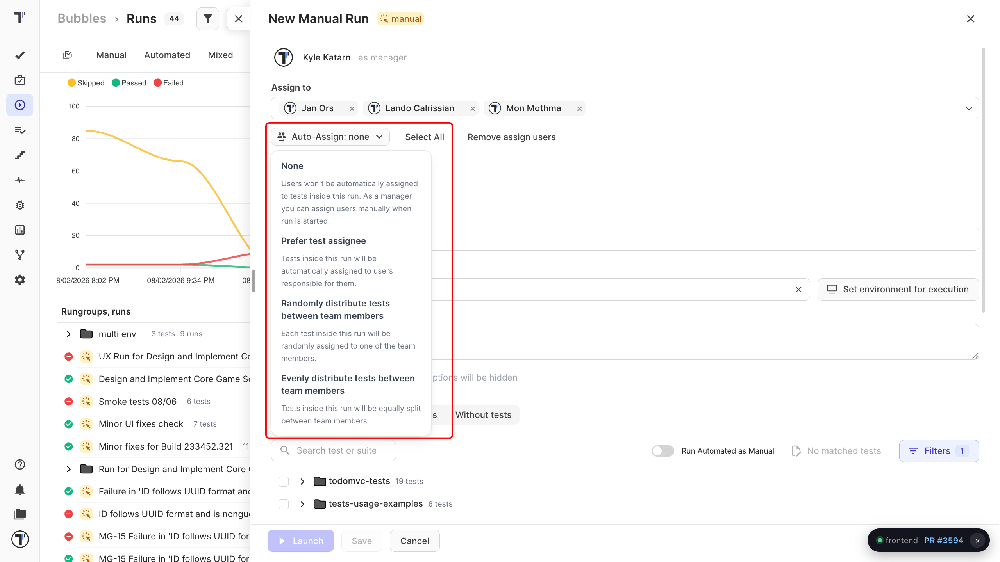

### How to Assign Users to Specific Test Cases or Suites

During the Run you can assign different users to specific Test Cases, Suites or Folders within one Run.

:::note

First, you need to assign users to the Run, and only after this you can assign them to specific Test Cases, Suites and Folders.

:::

**To Assign a User to a Suite/Folder:**

1. Open Run with assigned users.
2. Click on **'Continue'** button.

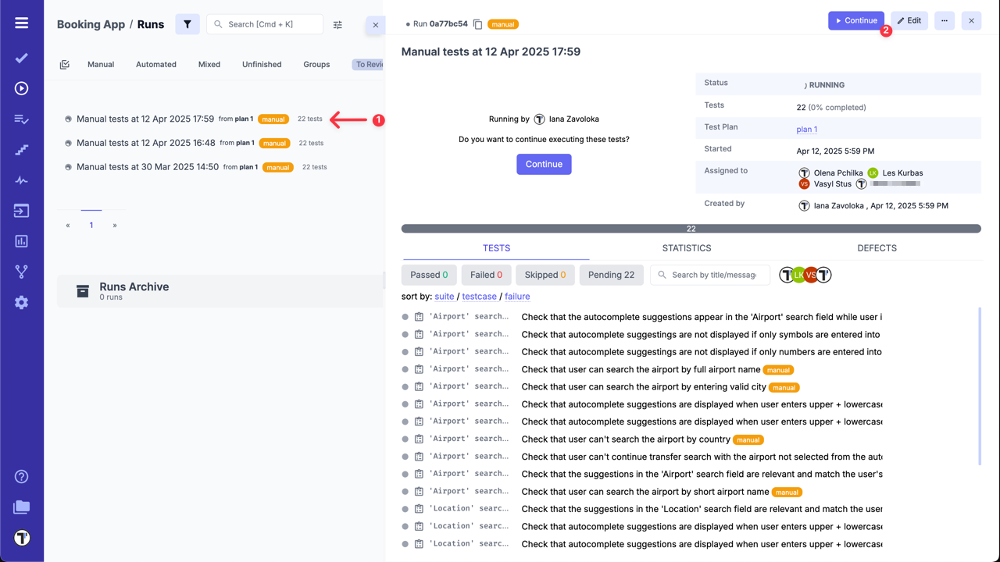

3. Click on **'Assign to'** icon for specific Suite/Folder.
4. Select a user for assignment from the list.

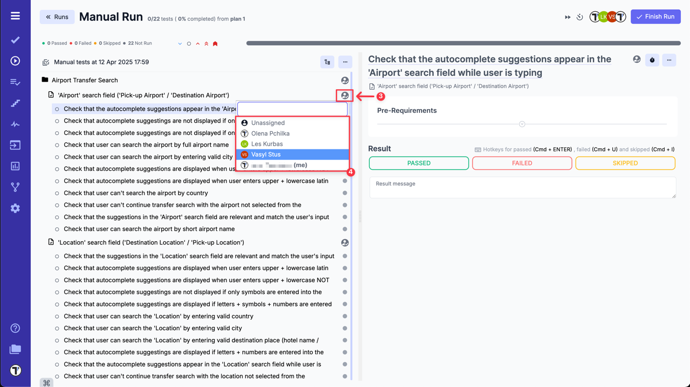

**To Assign a User to Test Cases:**

You can assign specific Test Cases only via **Multi-Select** button.

1. Open Run with assigned users.
2. Click **‘Continue’** button.

3. Click **‘Multi-Select’** button.
4. Select the Test Cases you would like to assign.
5. Click the **'Assign to'** button at the bottom.
6. Select a user for assignment from the list.

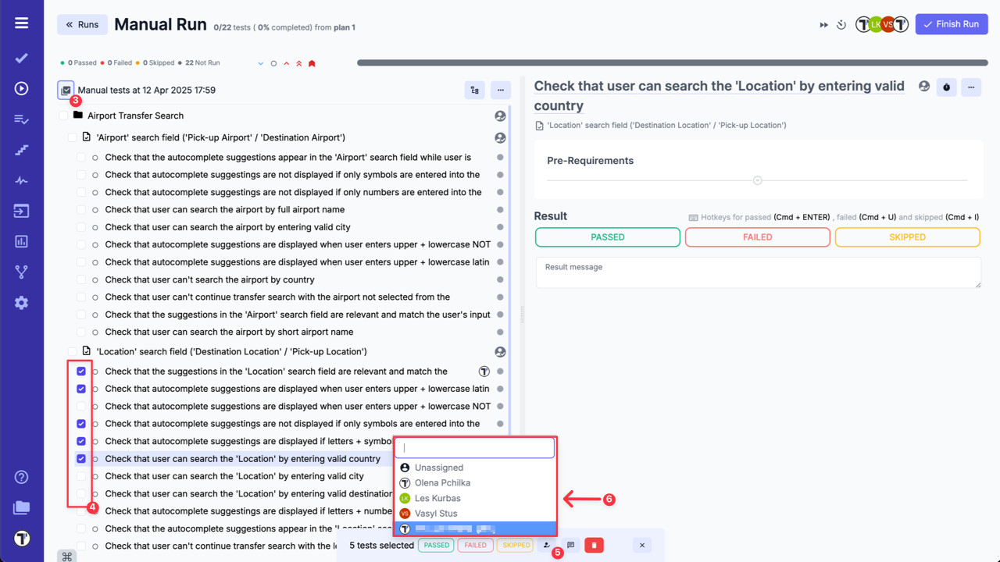

7. Click **'OK'** in the **'Are you sure you want to assign (username) to all selected tests?'** pop-up window.

Your Test Cases and Suites are now successfully assigned to different users.

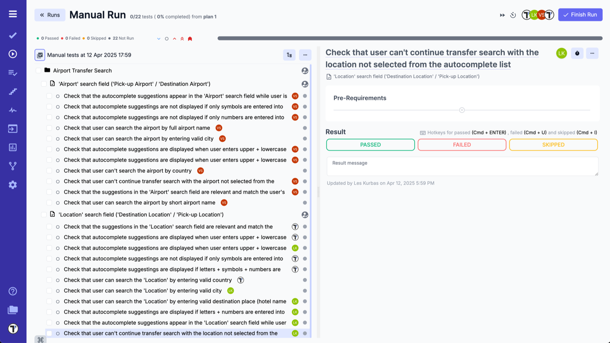

### How to Select a Test Environment

To select a testing environment you need:

1. Click on Environment field
2. Choose one or more environments from the dropdown list
3. Click **Save** to apply your selection

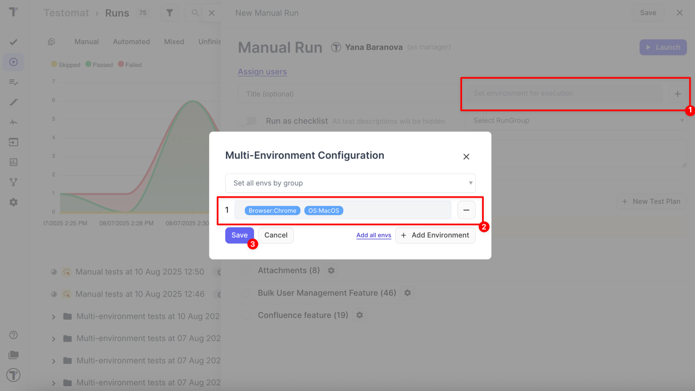

Testomat.io supports multiple strategies for running tests across different environments such as browsers, operating systems, devices, and deployment stages. You can run tests in single or multiple environments — sequentially or in parallel — depending on your project needs and infrastructure.

To learn more about configuring, managing, and running tests with environments, including multi-environment execution modes and CI/CD integration, please see the full guide here: [How to Run Environments](https://docs.testomat.io/project/runs/environments/).

### How to Run Tests in RunGroups

RunGroups allow you to organize test runs into structured folders, making it easier to manage and analyze test execution. By grouping related runs, you can maintain better visibility over different testing phases, environments, or specific test suites.

Before proceeding, make sure you have created a RunGroup. For detailed instructions on how to create and manage RunGroups, refer to this [guide](https://docs.testomat.io/project/runs/managing-runs/#rungroups) for more details.

**Enabling RunGroups for New Runs** (Optional Setting)

This setting is optional and can be enabled if you need it. Overall, you can freely create runs inside and out of groups.

1. Navigate to the **Settings** in the sidebar
2. Click on the **Project** tab
3. In the **Runs settings**, enable the option to require a RunGroup for new runs

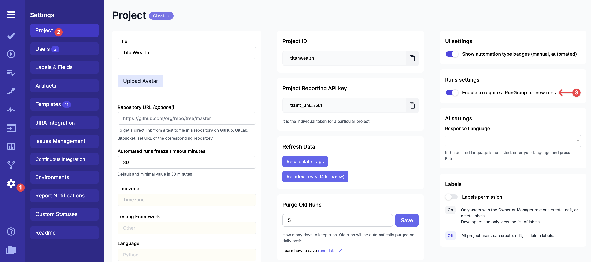

Once the RunGroup is enabled, you can start your runs within folders. Make sure the **RunGroup Structure** is also enabled.

:::note

This setting applies to all new run types — manual, automated, and mixed. 

:::

**Launching Runs in a Folder**

1. Navigate to the **Runs** tab
2. Click the **Manual Run** button

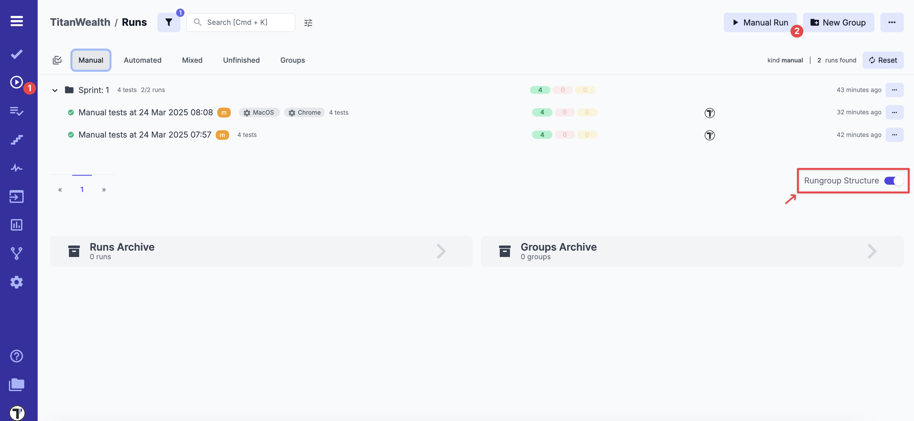

3. Select the required **RunGroup** from the dropdown
4. Click the **Launch** button

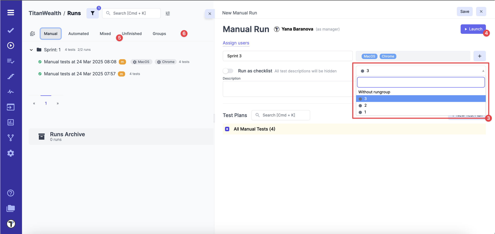

**Important:** If no RunGroup is selected, the field will be highlighted in red, and a warning message will appear, prompting you to choose a group before proceeding.

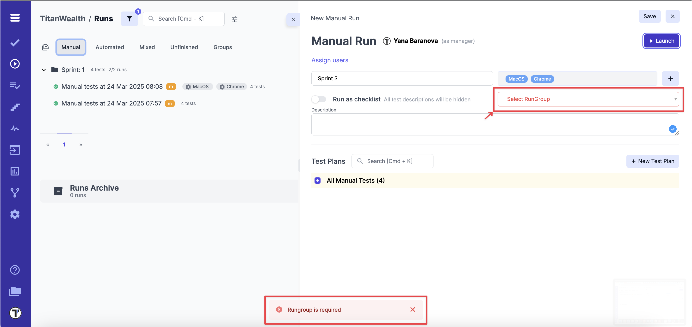

:::note

 If you relaunch an existing run as a copy and the original run belongs to a RunGroup, the copy is placed in the same group. No manual selection is needed.      

:::

By following these steps, you can organize test runs within RunGroups, ensuring a structured and manageable testing workflow. See the result below:

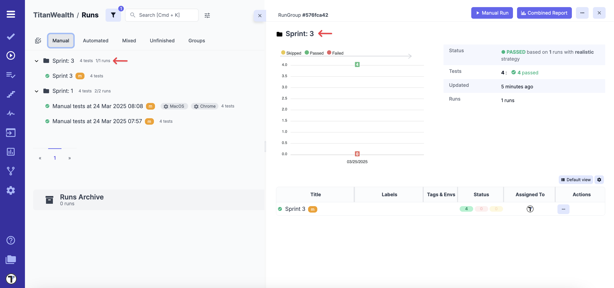

## How to Run Tests As Checklist

Checklists are commonly used in manual testing to quickly execute a set of tests without distractions from additional details. In this mode, test descriptions are hidden by default, but you can still view them by clicking the Toggle Description button.

In the **New Manual Run** sidebar,

1. Select a **Test Plan** or **All Manual Tests**
2. Enable **Run as checklist**
3. Click the **Launch** button

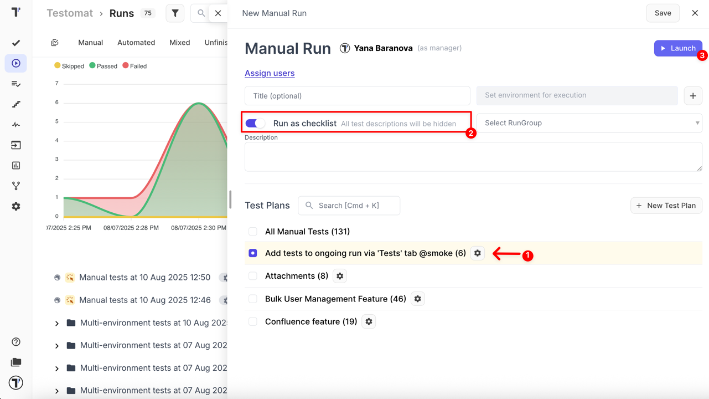

Once the manual run is launched, test descriptions will be hidden. To view a description for any test:

4. Click the extra menu -> Toggle Description

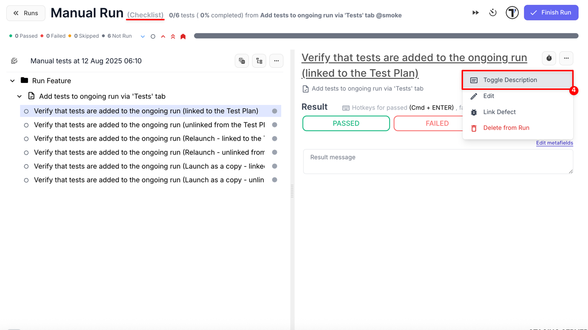

## How to Run Test With Steps Execution

Test execution by steps is a feature that enhances manual testing by allowing testers to track and manage the results of individual test steps. This ensures better traceability, improved defect detection, and a structured approach to test execution. By marking each step separately, QA teams gain deeper insights into the testing process and can effectively address issues as they arise.

1. Click the **Runs** in the sidebar
2. Launch a new manual run

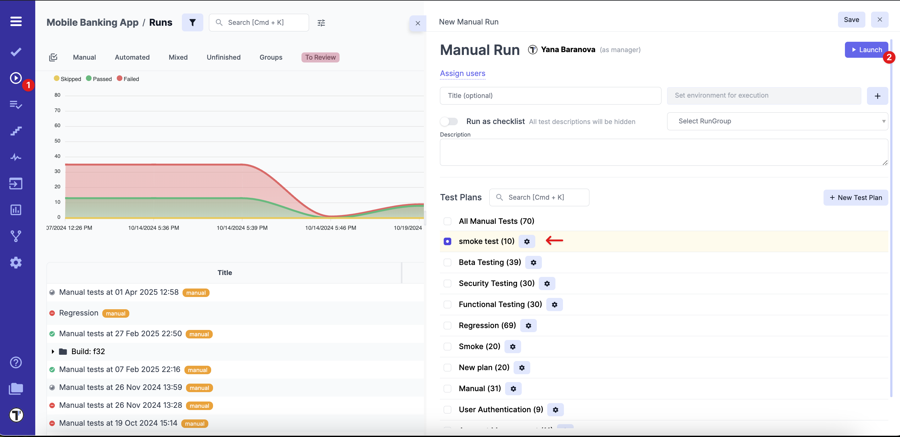

3. Select the test with detailed steps you want to execute
4. Mark steps according to the results:

- Click a step once to mark it as **Passed**
- Click a step twice to mark it as **Failed**
- Click a step three times to mark it as **Skipped**

5. Add a result with a message (optionally) for the test
6. Click **Finish Run** to complete the test execution

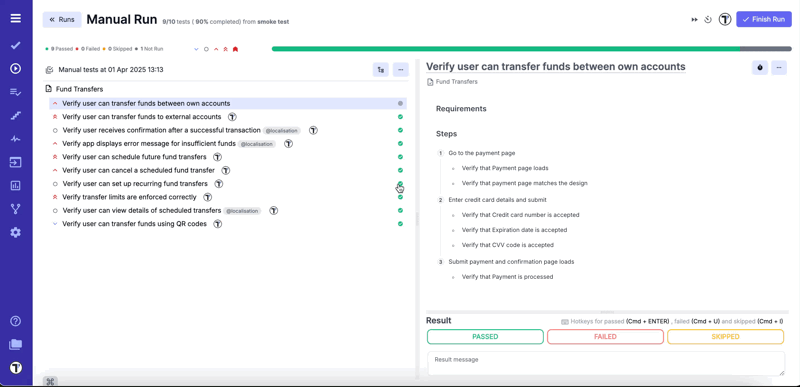

Test execution by steps introduces a structured, transparent, and efficient way to conduct manual testing. By breaking down test results into individual actions, QA teams can improve accuracy, streamline defect resolution, and optimize their testing workflow. This feature plays a crucial role in ensuring high-quality software delivery by providing detailed insights into each phase of test execution.

Take a look at how the test result with step execution looks:

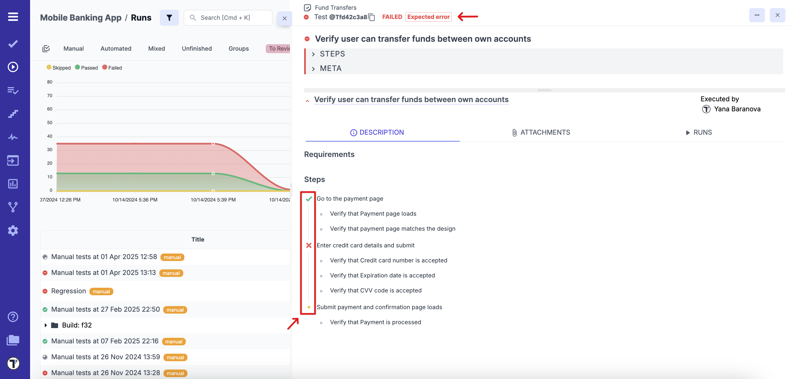

## How to Run Automated Tests Manually

Automated tests can be run manually in two ways:

- **Using a Test Plan** – create a test plan and enable the **Run Automated as Manual** toggle. This method allows you to include automated tests in a plan. Learn more about creating plans [here.](https://docs.testomat.io/project/plans/#add-automated-tests-as-manual)

- **Directly from the Runs page** – enable the **Run Automated as Manual** toggle during the run setup and select tests from the test tree.

### How to Run Automated Tests Manually from the Runs Page

1. Go to the **Runs** page
2. Click the **Manual Run** button
3. Switch to the **Select tests** tab
4. Enable the **Run Automated as Manual** toggle
5. Use the search, filters, or expand suites to select the automated tests you want to run
6. Click **Launch** to start the run

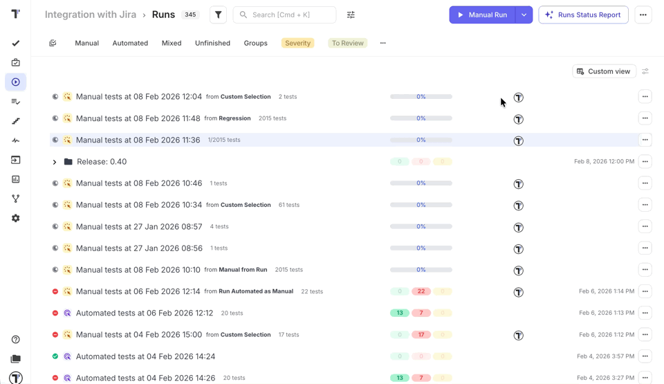

## How to Make Changes in a Launched Run

During testing, you might encounter new scenarios that need to be added immediately. Testomat.io allows you to easily add tests to a run that’s already started. This way, you can cover unexpected cases without stopping your ongoing testing process.

This ensures flexibility, smooth testing workflow, and that no important scenarios are missed.

1. Go to the **Runs** page
2. Open the unfinished run you want to edit
3. Click the **Edit** button (or open the '...' menu and select **Edit**)

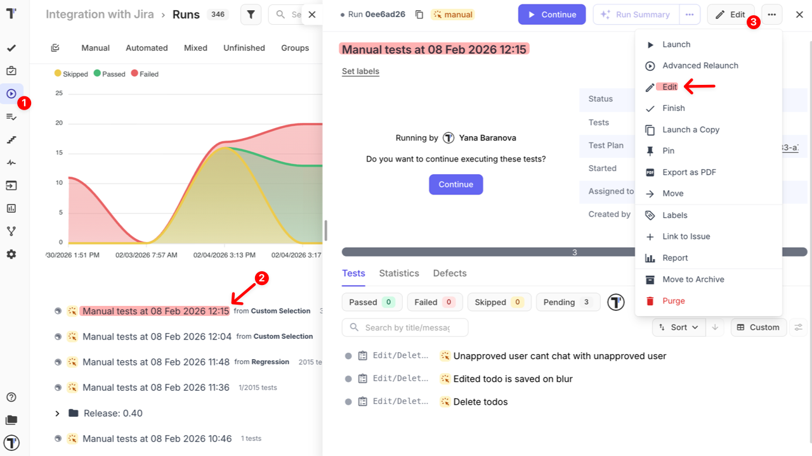

Once the **Edit manual run** view is opened, here’s what you can do:

- **Assign to** - Remove existing users or assign more to the run
- **Title** - Enter or change the run title
- **Environment** - Add or remove testing environments
- **Description** - Add or update the run description
- **details** link - Check configuration details of the run
- **Current tests** – Shows all tests currently included in the run. Remove unnecessary tests by clicking the **trash** icon
- **+ Tests** – Similar to the [Select tests](https://docs.testomat.io/project/runs/running-tests-manually/#how-to-configure-a-manual-run) tab in a new manual run. You can browse the test tree, use search or filters, or expand suites to select manual tests to add to this run
- **+ Plans** – Select tests from existing test plans. You can include one or multiple plans in the current run

:::note

You can add tests from plans and additional tests at the same time. For example: select one or more plans, then select specific suites or individual tests — everything will be added to the run instantly.

:::

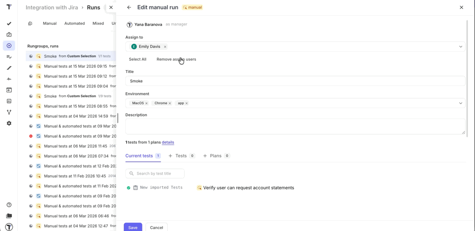

## How to Remove and Re-add a Test in a Run

Removing a test does not delete it. You can remove a test from a running test run and bring it back later. Testomat.io marks the test as excluded and keeps it in the run configuration.

### How to Return a Test to the Run

If you remove a test and then add the same test again, the run holds two statuses at once, excluded and included. The excluded status has higher priority, so the test stays out of the run's test list, even though Testomat.io confirms it was added.

If you only removed the test:

1. Open the run and go to configuration **details**.
2. Find the removed test and cancel the deletion.
3. The test returns to the run.

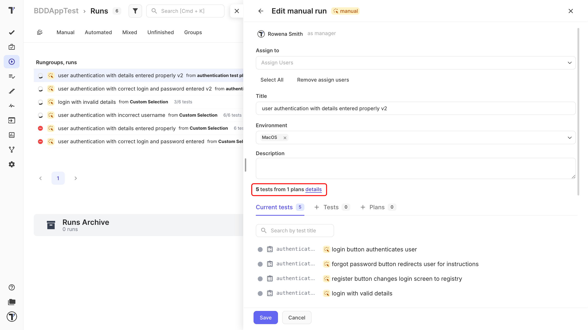

If you removed the test and then added it again, it now shows both a removed and an added status:

1. Open configuration **details** and find the test.
2. Click the `x` next to the removed status to clear the exclusion.

The added status then takes effect, and the test appears in the run.

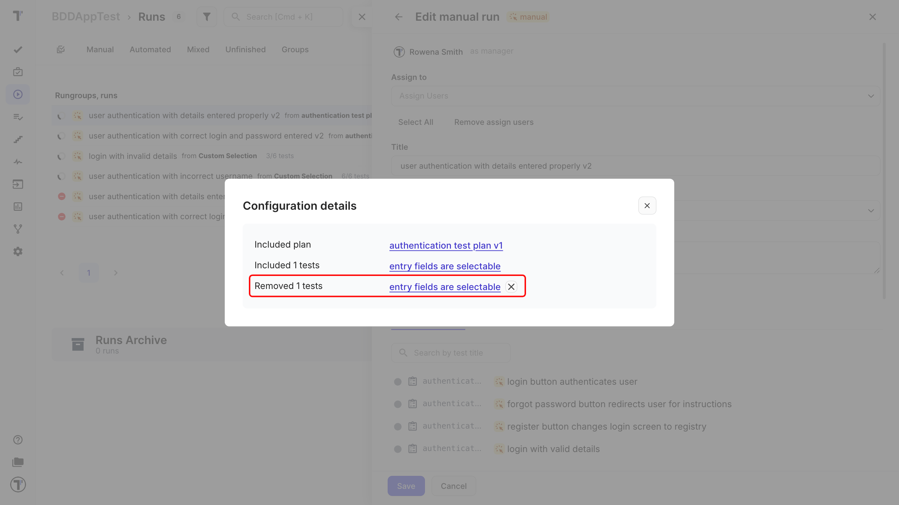

## How to Adjust Test Case Description Block

In case you want to adjust the size of the test description block to see more details without scrolling or to minimize it, you can easily resize it by following these steps:

1. Locate the vertical bar at the bottom of the test description block.
2. Hover your cursor over the bar until it changes to a resize indicator (an up-and-down arrow).
3. Click and hold the left mouse button on the bar.
4. Drag the bar up to decrease the block size or down to increase it.
5. Release the mouse button once you've adjusted the size to your preference.

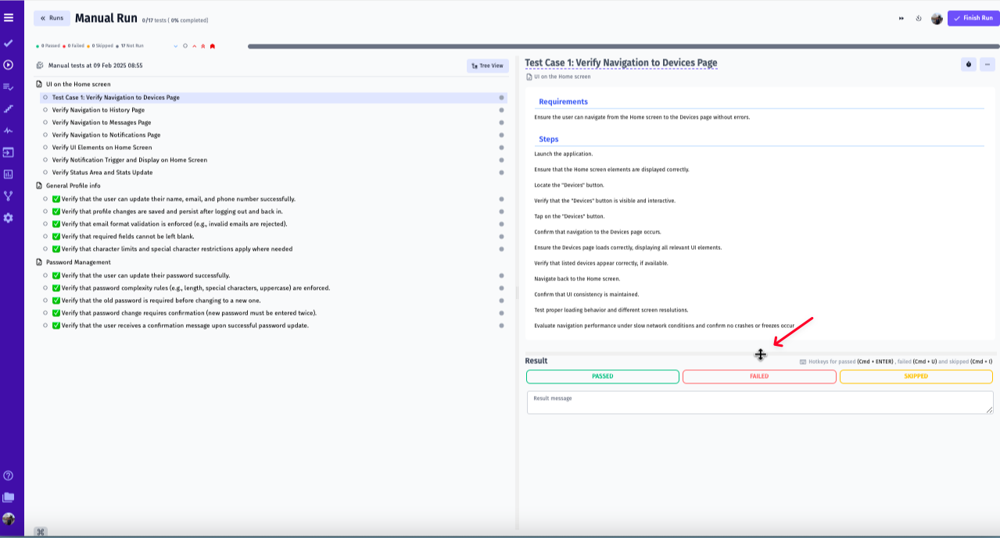

This way, you can customize the view to match your workflow.

## Bulk Actions in Runs

Managing test cases efficiently is crucial for smooth test execution. With bulk actions, you can perform multiple operations at once, reducing manual effort and saving time. Below are the available bulk actions you can use within test runs.

### How to Reassign Multiple Test Cases

If you need to reassign test cases to a different user, you no longer have to update each test case separately. Instead, follow these easy steps:

1. Click **‘Runs’** button on the sidebar
2. Open the test run you’re working on
3. Click **‘Continue’** button

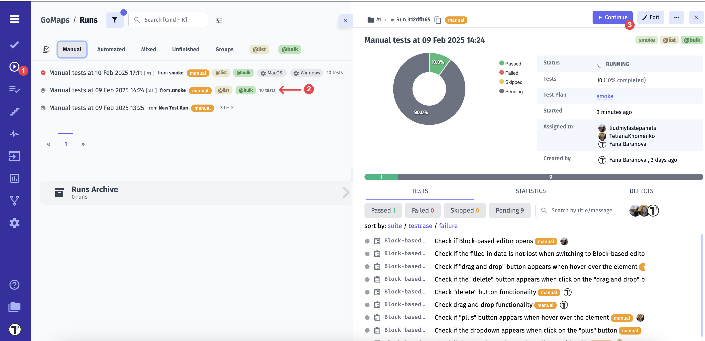

4. Click **‘Multi-Select’** button
5. Select the specific tests you would like to reassign
6. Click the **'Assign to'** button at the bottom
7. Select a user you would like to reassign
8. Click **'OK'** in the **'Are you sure you want to assign (username) to all selected tests?'** pop-up window

This feature significantly reduces manual effort and speeds up the reassignment process during test run.

Let’s check how tests look like after changes.

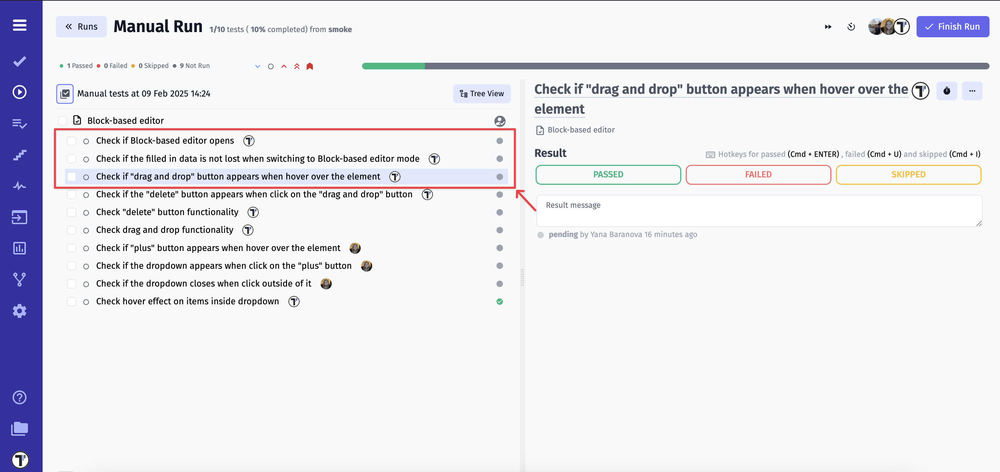

### How to Multi-Select Result Messages for Test Cases

While running tests and selecting the appropriate status with a result message, you can multi-select result messages for test cases. Follow these steps to complete the process:

1. Click **‘Runs’** button on the sidebar
2. Open a test run you’re working on
3. Click **‘Continue’** button

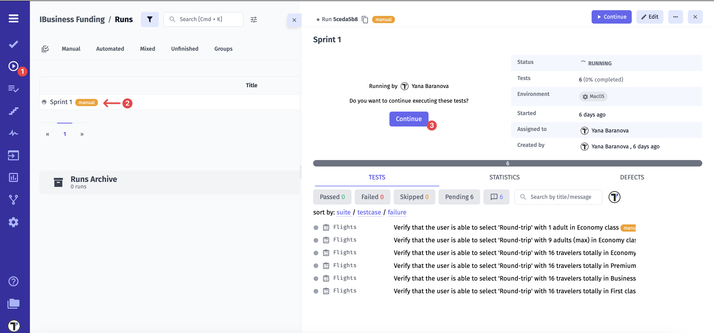

4. Click **‘Multi-Select’** button
5. Select the specific tests
6. Click the **‘Result message’** button at the bottom

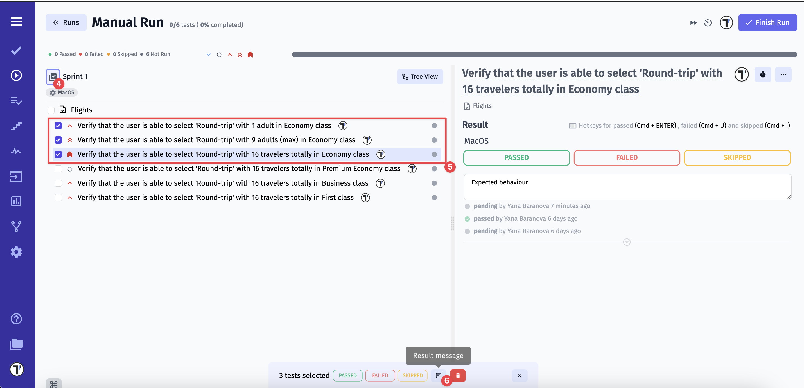

7. Select an appropriate status, e.g., **‘PASSED’**
8. Choose a result message, e.g., **‘Expected behaviour’**
9. Also, type a result message in the provided field
10. Click the **‘Apply’** button

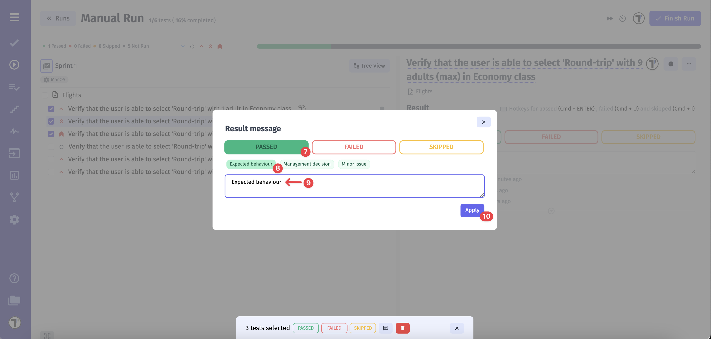

This feature allows testers to update multiple test cases efficiently, ensuring consistency in reporting results.

By using bulk actions, you streamline test management, improve workflow efficiency, and maintain consistency across test runs.

Let’s verify the multiple message results in these test cases:

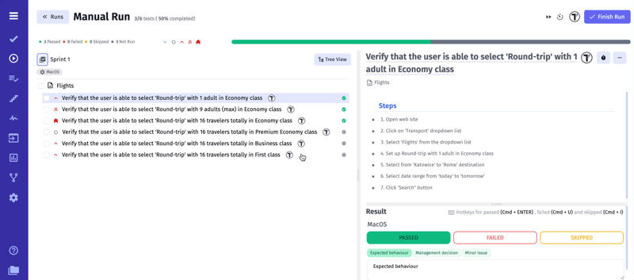

## How to Track Test Time

You may find it useful to track the time spent on runs and specific test cases. For this purpose, Testomat.io has developed flexible time tracking.

The first thing you need to do is start a run. Сlick on the button with the stopwatch icon **(1)** and then click on the **Track** button **(2)**. Every 10 seconds will be displayed in the time record. The time is also displayed next to the title of each test case.

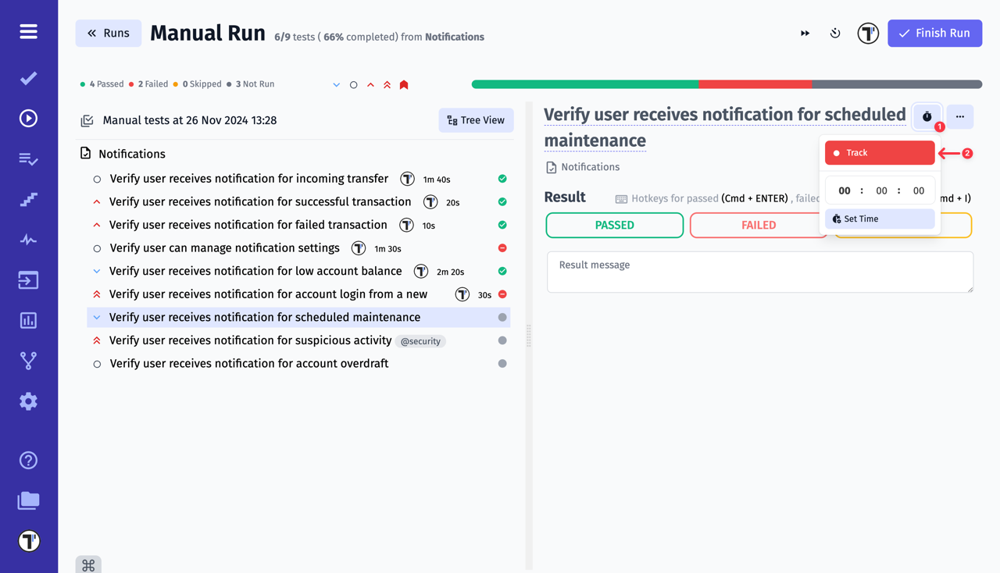

You can stop the tracking time if you need to leave during the testing process. And continue in the same way when you are ready.

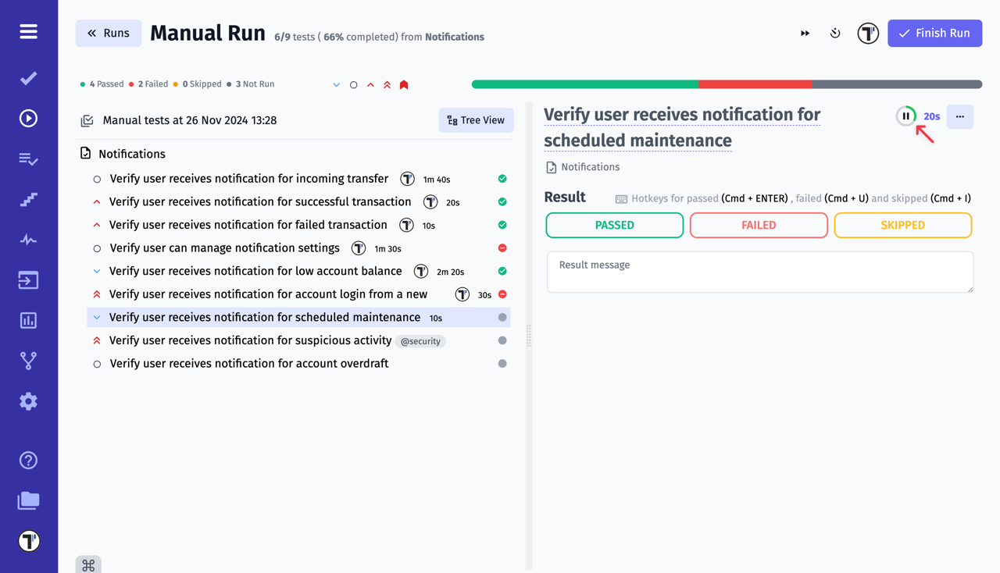

If necessary, you can set the time manually. Сlick on the button with the stopwatch icon **(1)**, enter the time **(2)** using arrows or enter it from the keyboard and then click on the **Set Time** button **(2)**.

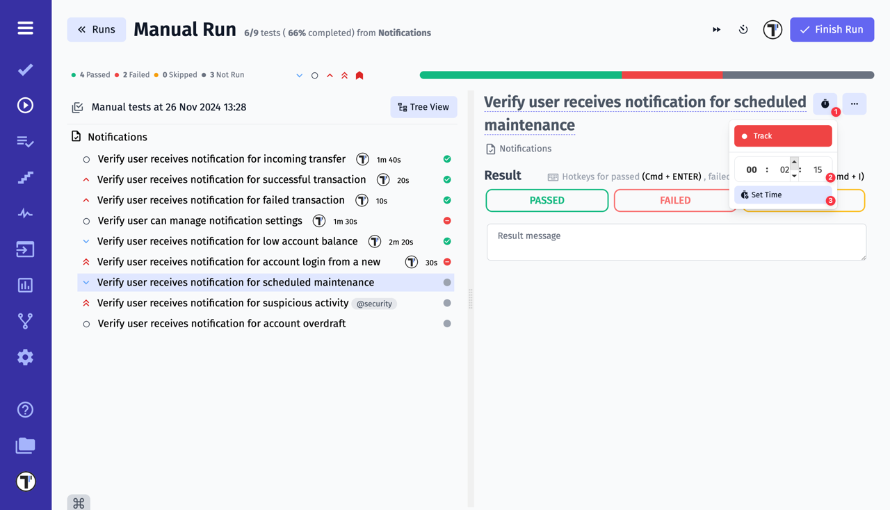

What's more, you can use the **Auto-Track** feature to automatically start the tracking process when you move on to the next test.

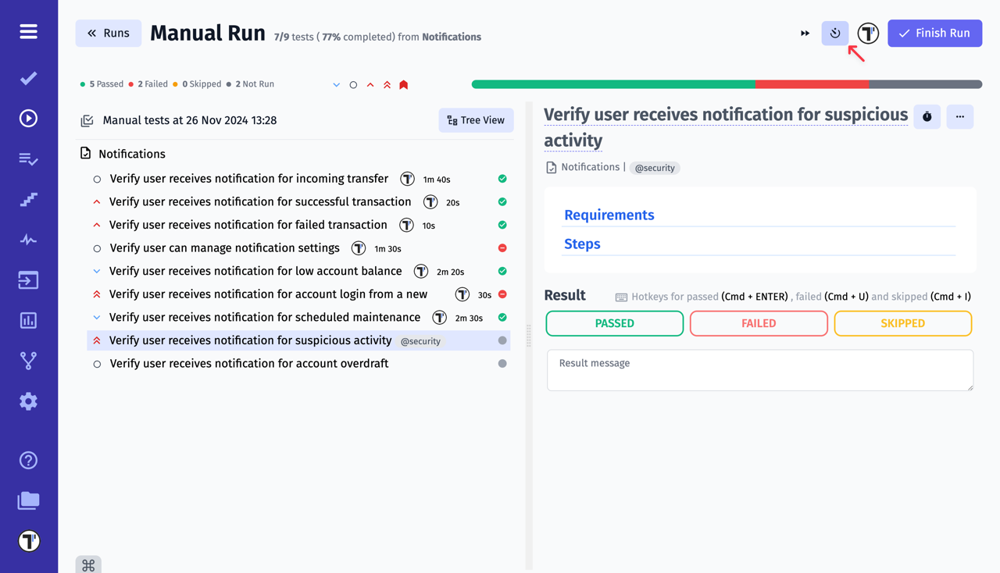

At the end of the run, the report will show you the time spent on a particular test case and the total time spent on all the test cases.

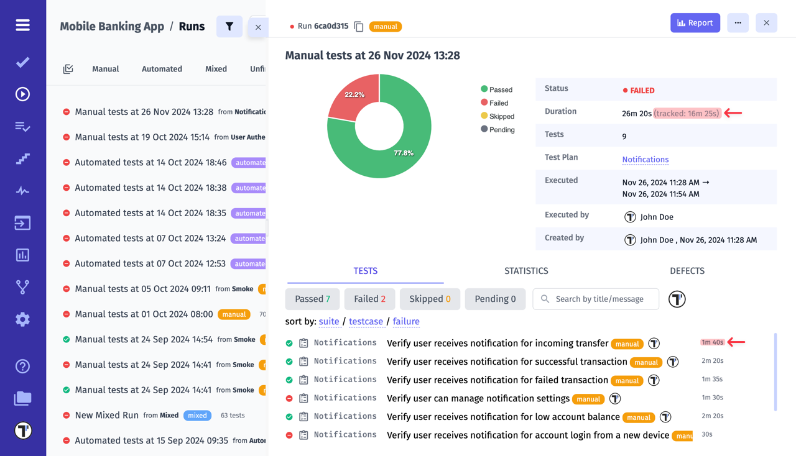

This can be useful for spreading the workload across all team members in future test runs.

## How to Track Test Case History During One Run

During a test run, the state or status of a test case may change multiple times. In some situations it can be important to review the history of all state changes, comments, and statuses for a specific test case before finishing the test run.

For this purpose, Testomat.io provides the test case history feature within the test run, displayed in chronological order beneath the selected test case.

To check the test case history, follow these steps:

1.  Open the test run
2.  Click 'Continue' button

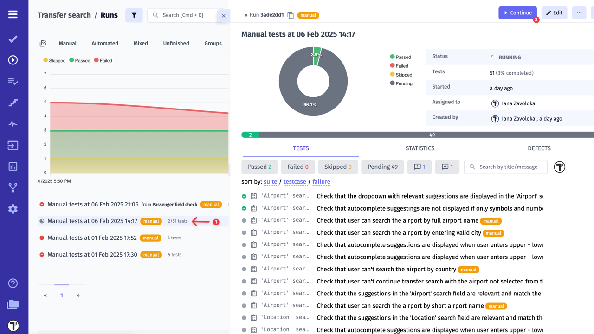

3.  Click on the test case to see last 3 changes
4.  Click the arrow to expand the whole history, if needed

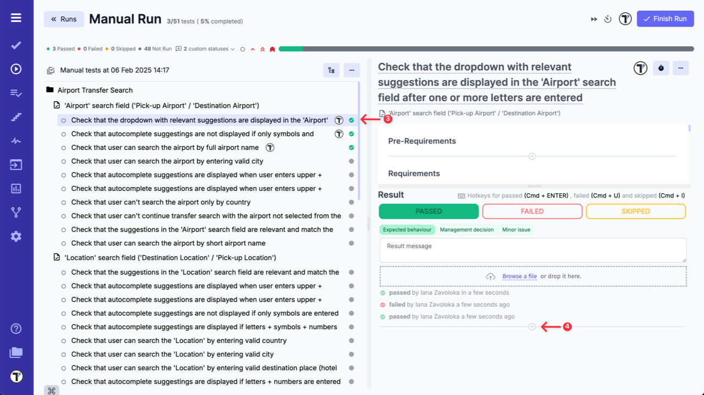

Now you can see the whole test case history

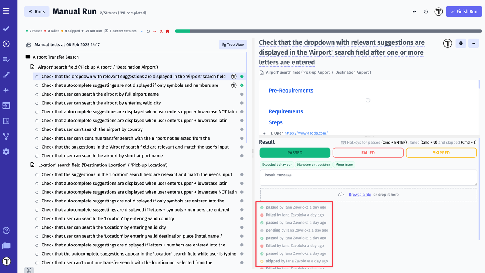

## Search in Manual Runs
Search functionality is available in manual runs, allowing users to quickly find specific tests and suites within a run.
This makes it easier to navigate large manual runs by filtering items based on names or keywords, without scrolling through the full list.
