**Notes** in Testomat.io cover most key features of an ideal **Temporary Test Case**, providing QA teams with clear benefits and practical use cases. Notes are temporary tests that can be created directly within a test run, allowing testers to capture observations, ad-hoc scenarios, or corner-case tests quickly and efficiently, without cluttering the main test repository. Notes can later be converted into permanent test cases if they prove valuable, ensuring important tests are preserved and included in future test plans.

### Benefits

- **Quick creation during a test run**: Notes can be created directly during the test run, allowing instant capture of new scenarios or discovered issues without leaving the current context.
- **Isolation from the main repository**: Notes are localized in a global **Notes** suite, keeping them separate from permanent test cases.
- **Visual distinction in the UI**: Notes are marked with an icon and highlighted in purple, making them easy to identify at a glance.
- **Convertible to permanent test cases**: Notes can be converted during a run or from the run report, enabling important scenarios to be added to regression without data loss.
- **Automatic inclusion in test plans after conversion**: If the suite where the Note was created is part of a test plan, the converted note to test is automatically added and updates the plan.

### How to Create Notes Within a Run

During a test run, **Notes** can be created at two different levels, depending on whether you want them tied to a specific suite or remain global:

- **Global Notes for the Run**: These Notes are stored in the main **Notes** suite for the run and are not associated with any specific suite or functionality. They are useful for capturing observations or ad-hoc scenarios that apply across the entire test run.

- **Suite-Level Notes**: These Notes are created within **a specific suite**, allowing you to document observations directly related to particular tests or functionalities. This makes it easier to track and manage Notes associated with individual suites.

#### Global Notes for the Run

Let's go step by step to see how it works for **Global Notes for the Run:**

1. Navigate to the **Runs** page
2. Click the **Manual Run** button to start a new manual run

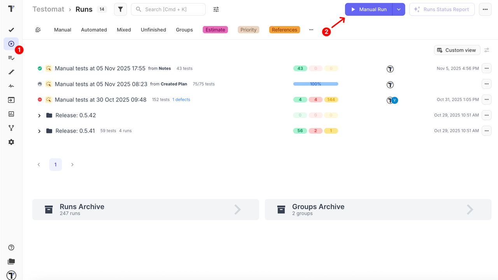

3. Select a **test plan**

:::note

For detailed run configuration, see [How to Configure a Manual Run.](https://docs.testomat.io/project/runs/running-tests-manually/#how-to-configure-a-manual-run)

:::

4. Click the **Launch** button

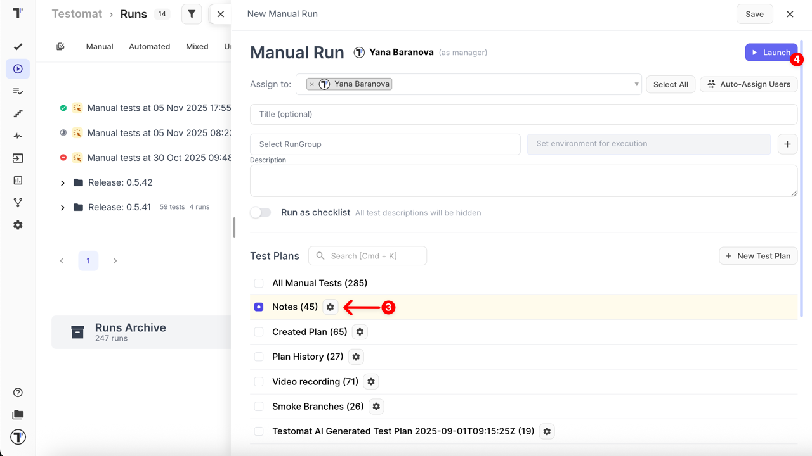

5. Click the **Create notes +** button to add your first note

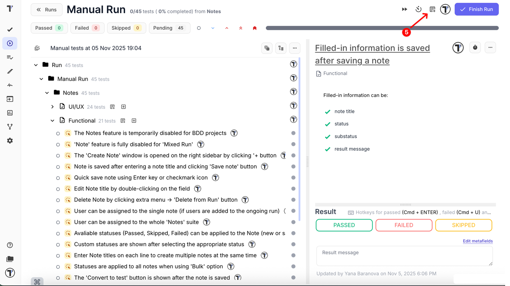

6. When the **Create note** window opens, fill in the following information:

- **Note title** (required)
- **Status:** Passed, Failed, Skipped (optional)
- **Sub-status** (optional)
- **Result message** (optional)

7. Click the **Save note** button to save your note

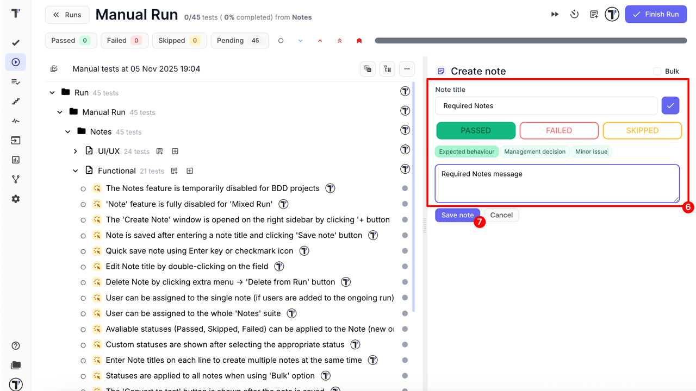

8. Or, enable the **Bulk mode** to create multiple notes at once
9. In Bulk mode, fill in the following information:

- **Note titles:** each line corresponds to the title of a new note (required)
- **Status:** applied to all notes (Passed, Failed, Skipped) – (optional)
- **Sub-status:** (optional)
- **Result message:** (optional)

10. Click the **Save # notes** to save all notes at once

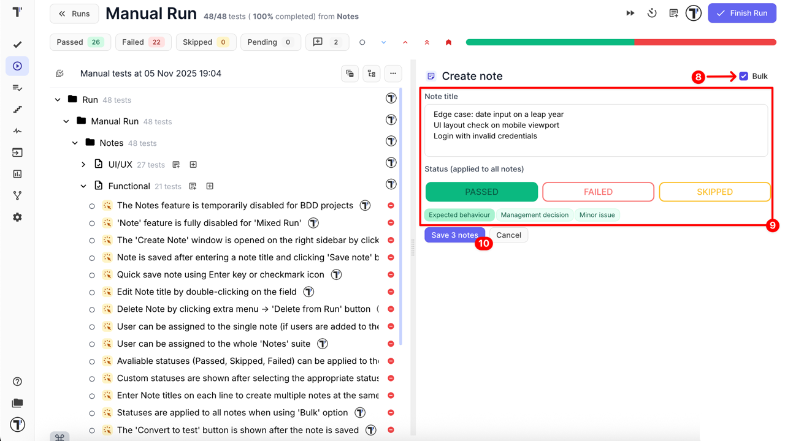

#### Suite-Level Notes

Let's go step by step to see how it works for **Suite-Level Notes:**

1. Navigate to the **Runs** page
2. Click the **Manual Run** button to start a new manual run

3. Select a **test plan**

:::note

For detailed run configuration, see [How to Configure a Manual Run.](https://docs.testomat.io/project/runs/running-tests-manually/#how-to-configure-a-manual-run)

:::

4. Click the **Launch** button

5. Click the **Add note to suite** button next to the specific suite

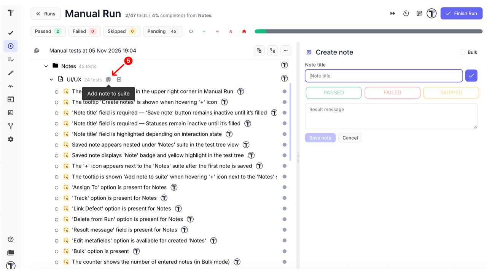

:::note

If the **Add note to suite** button doesn't appear next to the suite, please enable **'Show Creation Buttons'** mode in the extra menu.

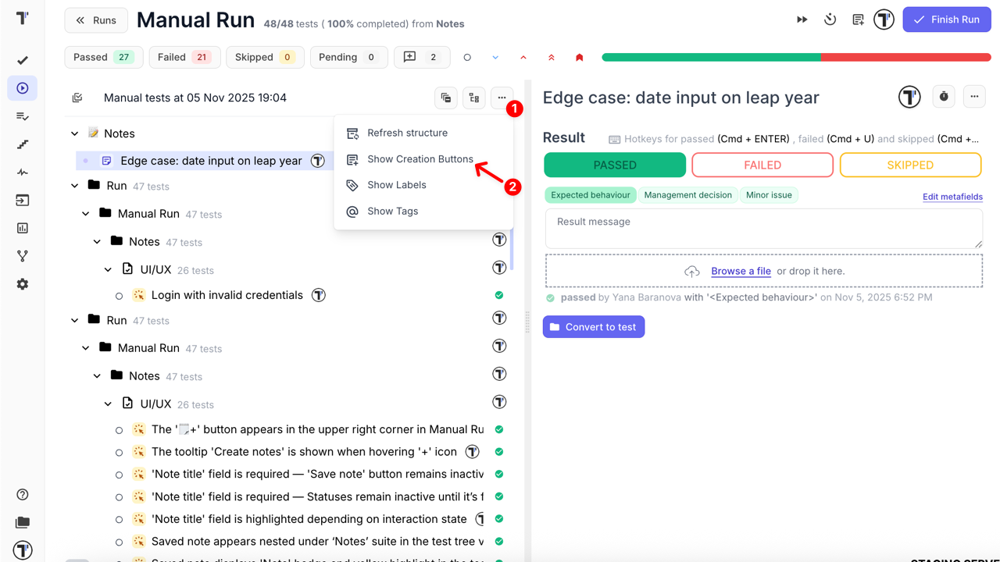

:::

6. When the **Create Note** window opens, fill in the following information:

- **Note title** (required)
- **Status:** Passed, Failed, Skipped (optional)
- **Sub-status** (optional)
- **Result message** (optional)

7. Click the **Save note** to save your note

8. Or, enable the **Bulk mode** to create multiple notes at once
9. In Bulk mode, fill in the following information:

- **Note title:** each line corresponds to the title of a new note (required)
- **Status:** applied to all notes (Passed, Failed, Skipped) – (optional)
- **Sub-status:** (optional)
- **Result message:** (optional)

10. Click the **Save # notes** to save all notes at once

#### Quick Actions

To make the process of creating and managing Notes even faster, you can use the following quick actions:

- Press **Enter** to create a Note — when adding a single Note (not in Bulk mode), simply type the title and press Enter to create it instantly, without clicking the Save note button.
- Double-click to edit a Note title — you can quickly rename an existing Note by double-clicking its title directly in the Notes window.

These shortcuts speed up the workflow and make it easier to capture insights during manual test runs.

### How to Convert Notes to Tests

Notes can be converted into permanent test cases:

- During a manual run
- After the manual run is finished, in the Run Report

When converting a Note:

- All information is preserved, including title, status, sub-status, result message, linked defects, edited metafields, and attachments
- You can modify the test title, description, or any other details both during and after conversion
- If the suite where the Note was created is part of a test plan, the new test case is automatically added to that plan

#### Converting During a Run

1. Open the **created note** within the test run
2. Click the **Convert to test** button

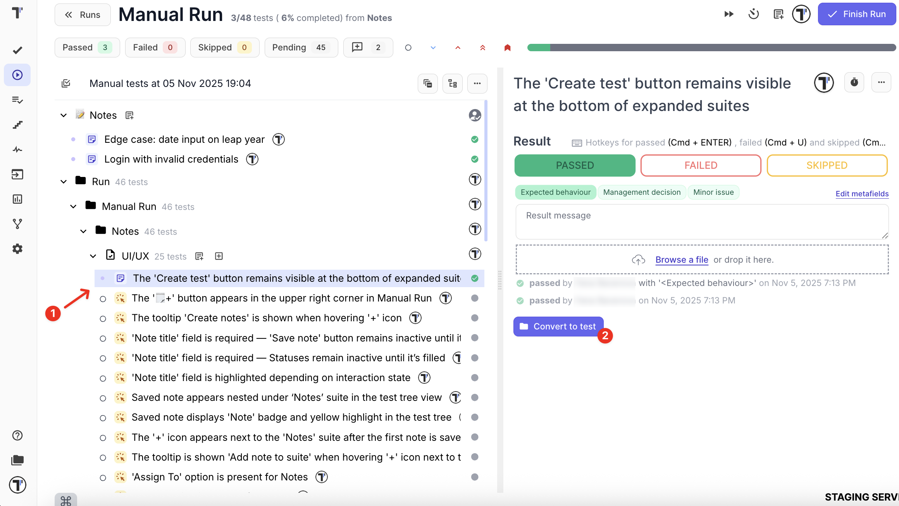

3. When the **Select suite for test** window opens, search suite by title or select the specific suite manually
4. Click the **Select** button

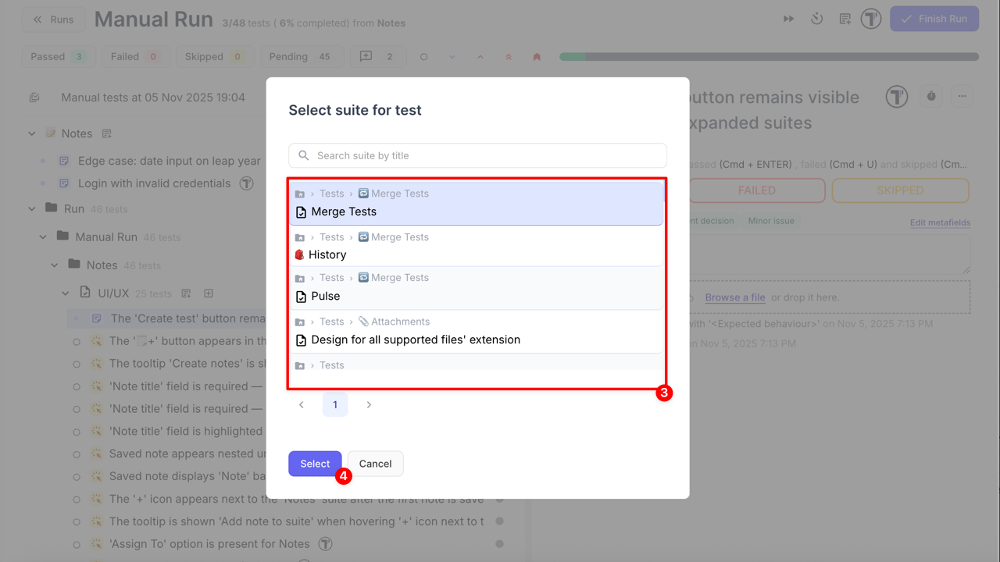

5. When **Add Description** window opens,

- Update a title of a test (or leave it as it is)
- Add description (optional)

6. Click the **Save test** button

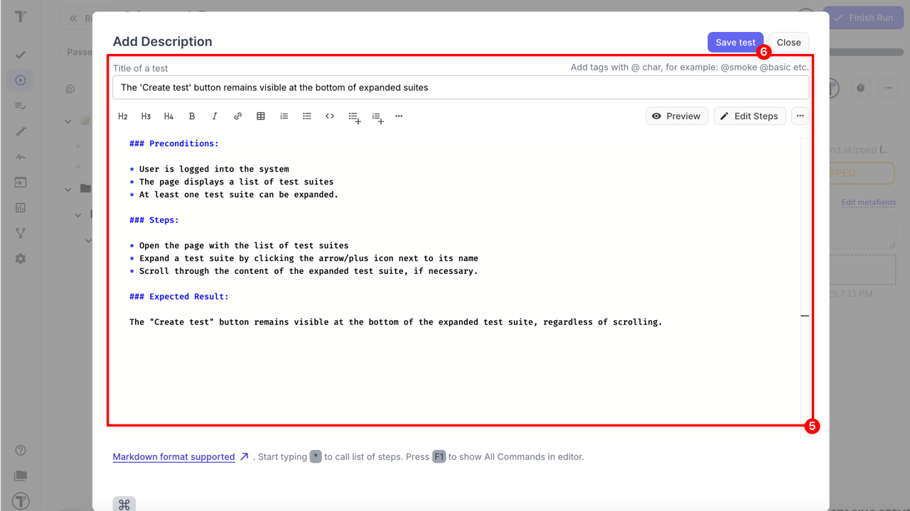

The Note is removed automatically after conversion. The test is saved in the selected suite and becomes visible both in the ongoing run and on the Tests page.

#### Converting from the Run Report

Notes can be converted into permanent tests directly from the Run Report. There are two ways to open the report for a completed run:

- Option 1: Via sidebar in the completed run
- Option 2: Via Run Report

Both options lead to the same interface containing the list of Notes. To convert a Note:

1. Open the **Run Report** for the completed test run with created notes
2. Click the **Convert to test** button at the right side

**Via sidebar in the completed run**

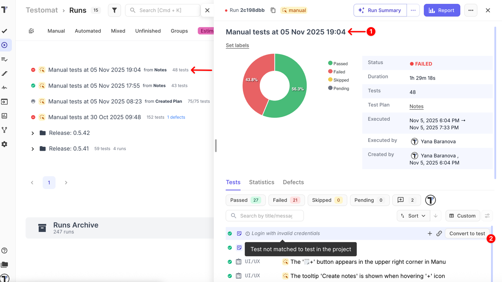

**Via Run Report**

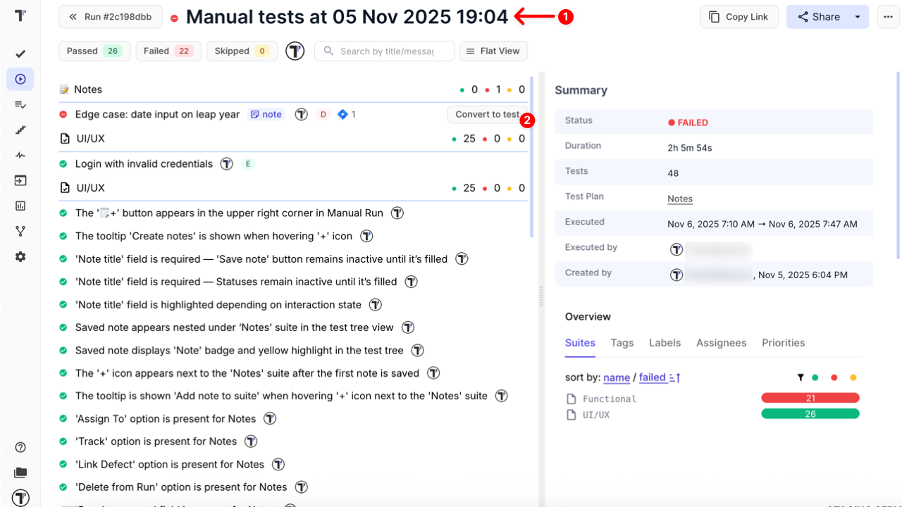

3. When the **Select suite for test** window opens, search suite by title or select the specific suite manually
4. Click the **Select** button

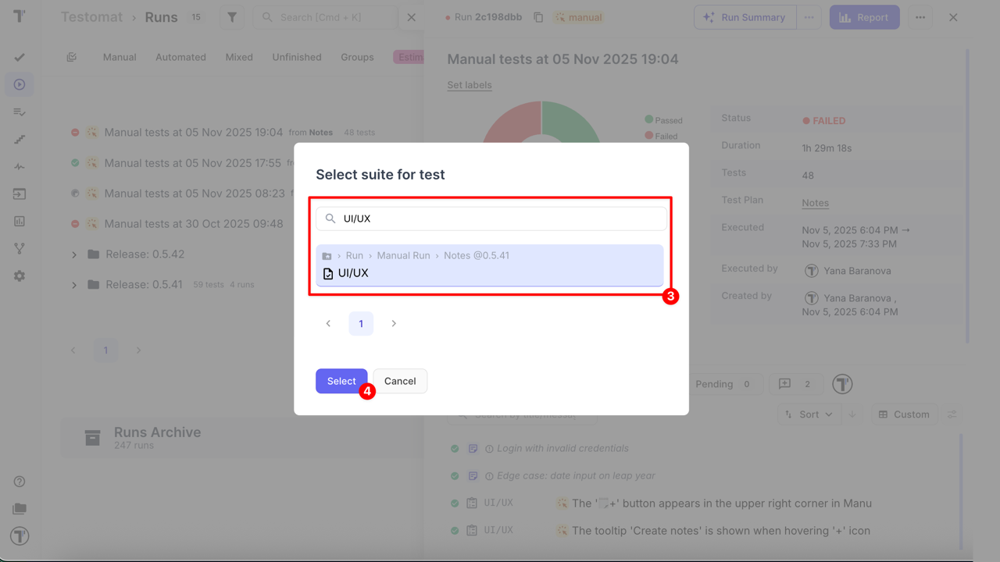

5. When the **Add Description** window opens,

- Update a title of a test (or leave it as it is)
- Add description (optional)

6. Click the **Save test** button

The Note is removed automatically after conversion. The test is saved in the selected suite and becomes visible both in the ongoing run and on the Tests page.

### Use Cases

- Capture ad-hoc or unexpected scenarios immediately during execution
- Document results of manual testing without creating permanent test cases
- Identify coverage gaps and mark additional checks for future regression testing
- Promote temporary Notes to permanent test cases that automatically join test plans

Notes provide quick creation, isolation, visual distinction, and flexible conversion, helping QA teams capture and manage valuable testing insights efficiently.
