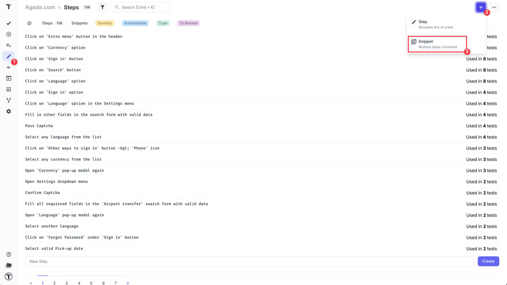
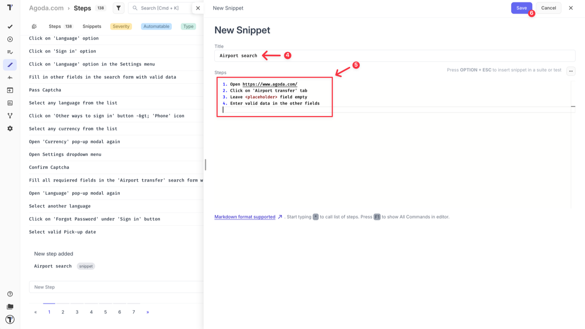
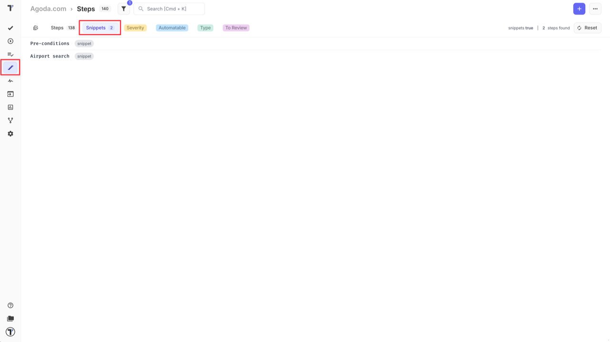
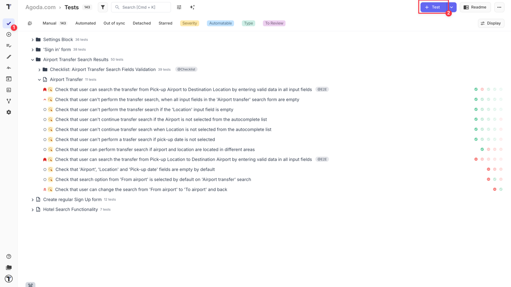
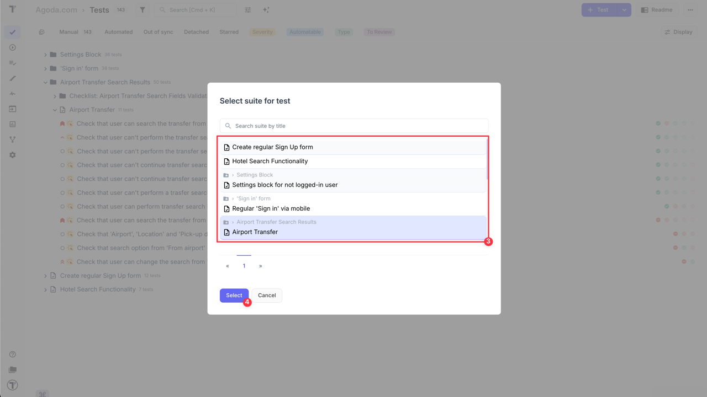
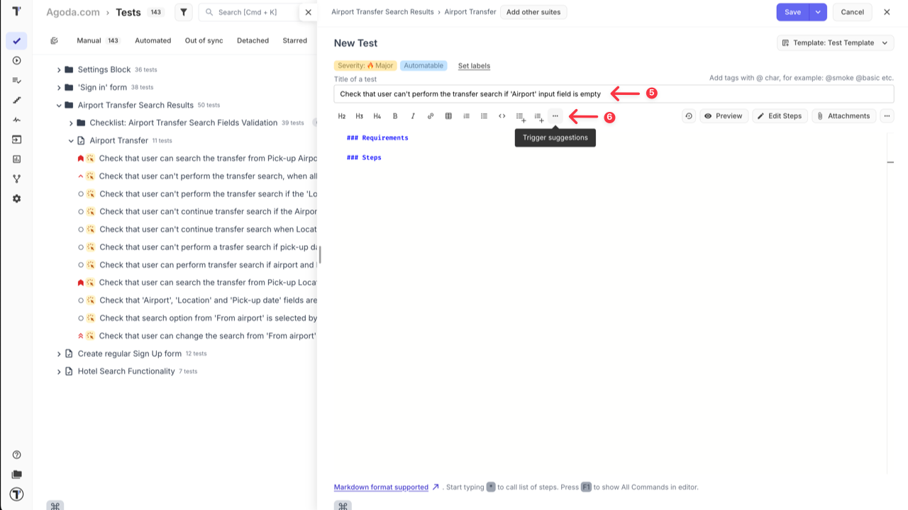
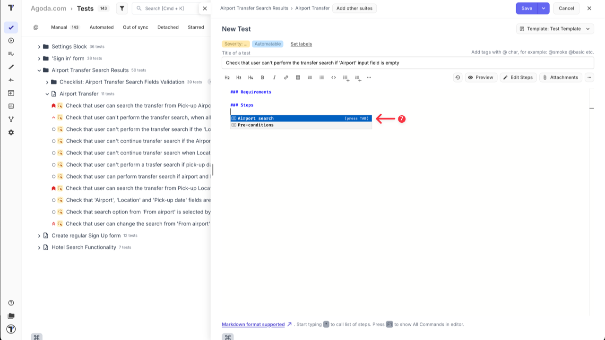
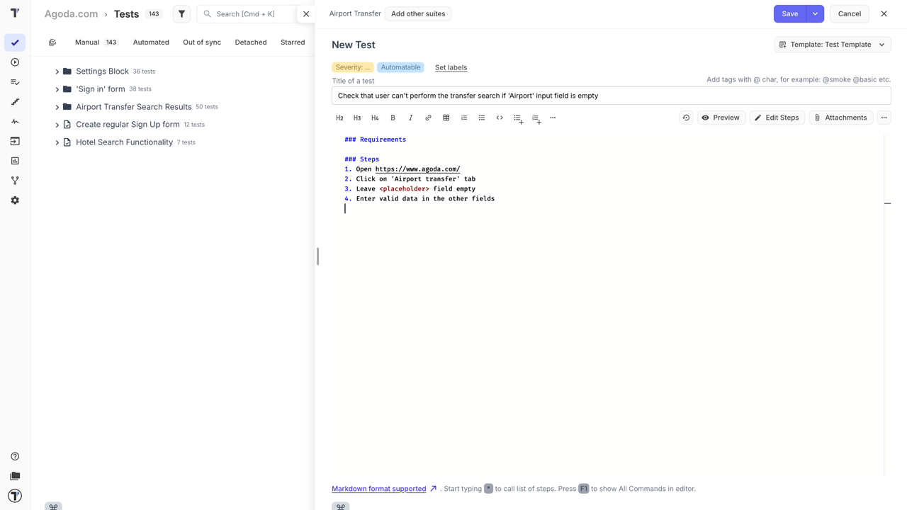
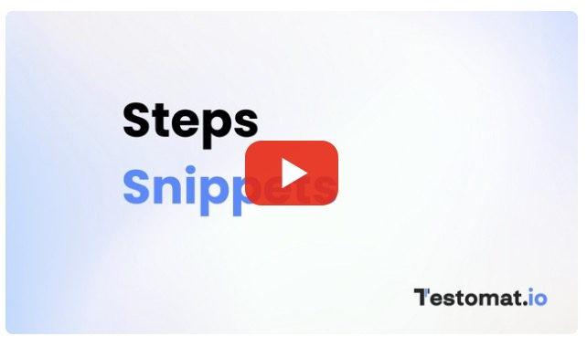

A snippet - is a piece of text or collection of steps that can be used as autocompletion during creating tests. This can be used for any part of a test case. 

When a new test case or suite needs to be created, you can simply call a previously created snippets, to add information that you need with one click. This makes test creation faster and simplier.

As well you can use snippets for creating and managing test data.

## How to Create a Snippet

1. Go to **'Steps'** page.
2. Click **'+'** icon.
3. Select **'Snippet'** option from the dropdown.

4. Enter **'Title'** for snippet.
5. Add a piecce of text or steps.
6. Click **'Save'** button.

After snippet is created you can use it during your test case creation.

:::note

You can find your snippets in the relevant section on 'Steps' page and update them at any time.

:::

## How to Add Snippet to Test Case

1. Go to **'Tests'** page.
2. Click **'+Test'** button to add a new test case (or open the one that you want to edit).

3. Select the Suite.
4. Click **'Select'** button.

5. Add test case title.
6. Click **'Trigger suggestions'** button.

7. Select the snippet that you want to use from the suggested list.

The snippet content is successfully added to the test case.

