Testomat.io provides functionality for test steps re-using and autocompletion.  

## How To Add A New Step In Steps Database

There are few ways to create steps on the page:

1. Open **Steps** page.
2. Enter the step into the field.
3. Click **Create** button.

Or another way:

4. Сlick on **Plus** button to add context to the step.

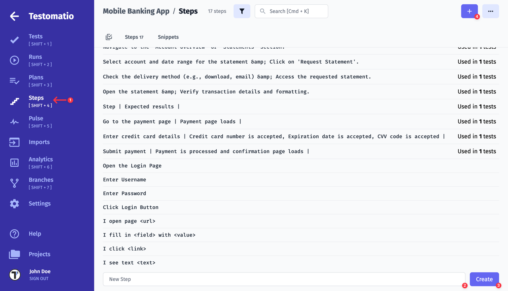

At the New Step screen, you need to add the step itself (1), description (2) and click on the Save button (3).

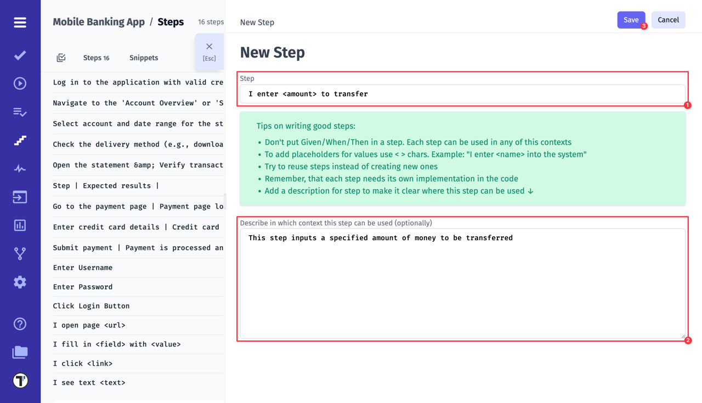

The new step has been created!

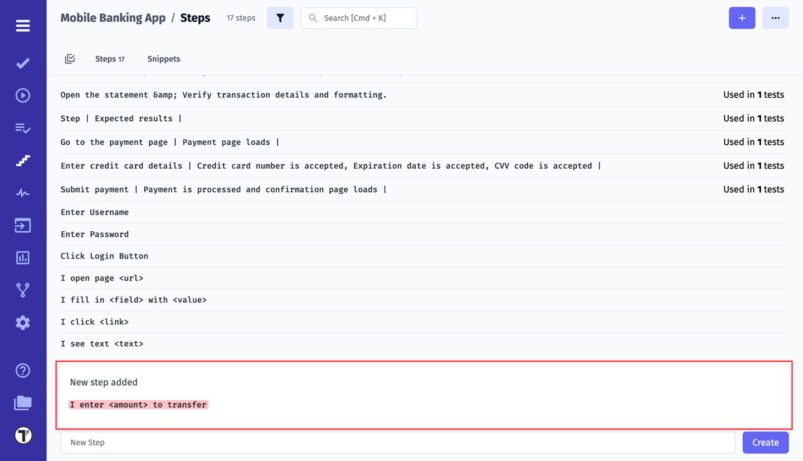

## How To Add A New Step In Editor for Classical Tests

Create your steps during writing your classical tests! Testomat.io Editor gives the ability to save your test description as steps directly to Steps Database.

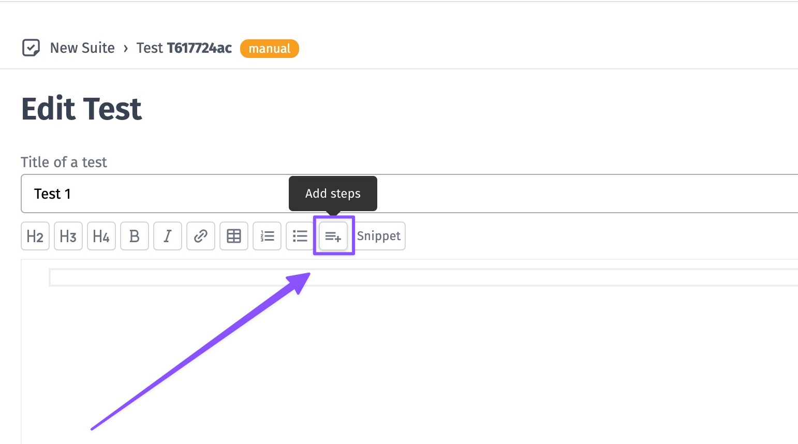

❗When you start the lone with the asterisk sign `*` Testomat.io creates a new step❗

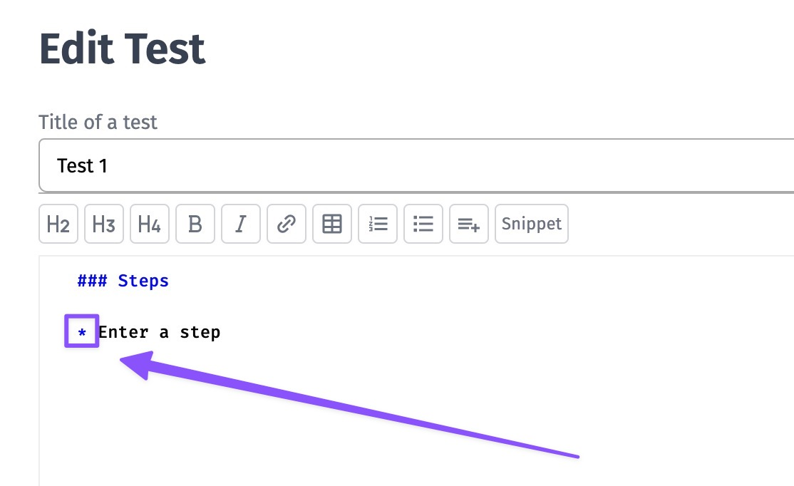

Save the test and the new step will be placed in the Database.

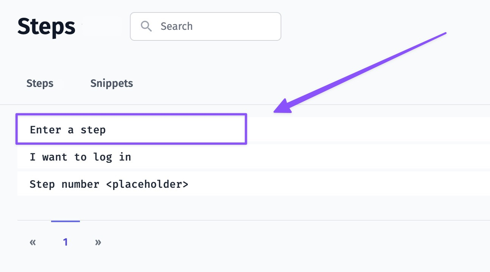

Next time you need this step start typing it with the asterisk sign `*` and Editor will show it to autocomplete.

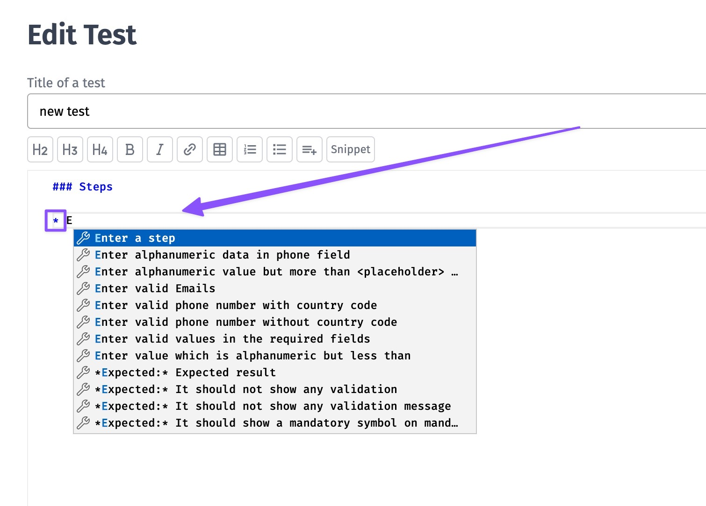

## How To Add A New Step In Editor for BDD Tests

Testomat.io BDD Editor creates steps once a Scenario/ Feature File is saved. So you don't need to add steps separately. 

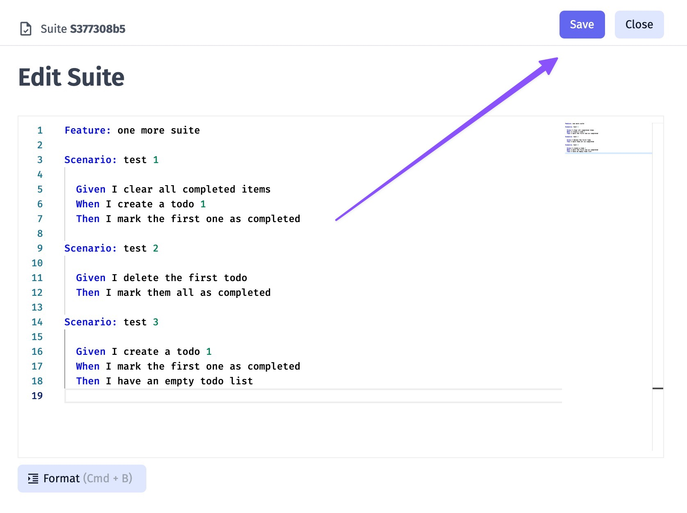

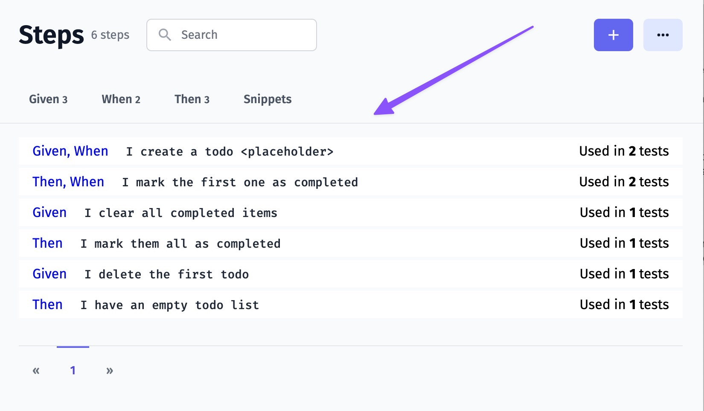

## How To Rename A Step

There may be situations when you need to update existing tests in order to suit project requirements. You can rename required steps on Steps page. This action will update tests containing changed step, so there is no need to change each tests individually.  

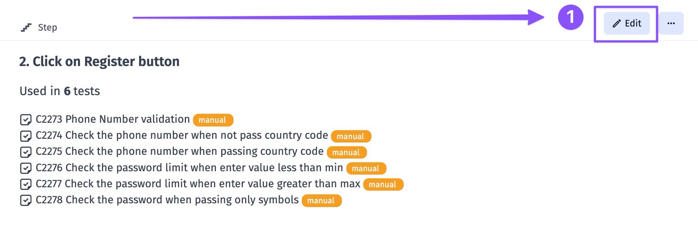

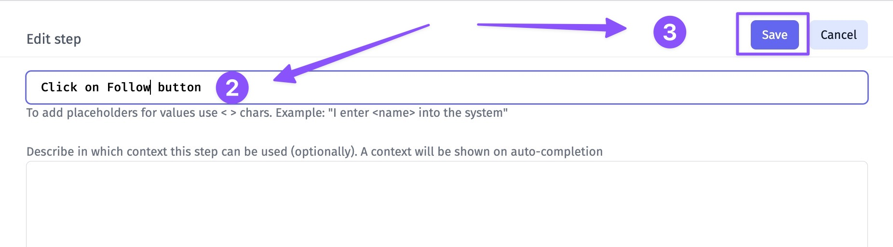

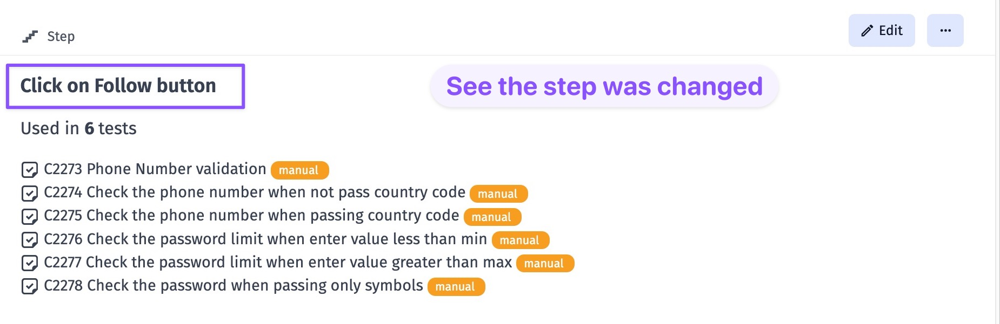

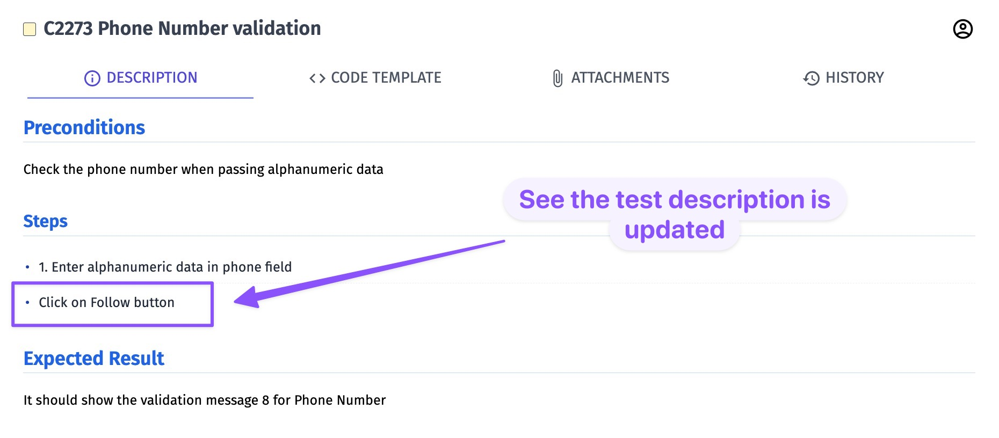

