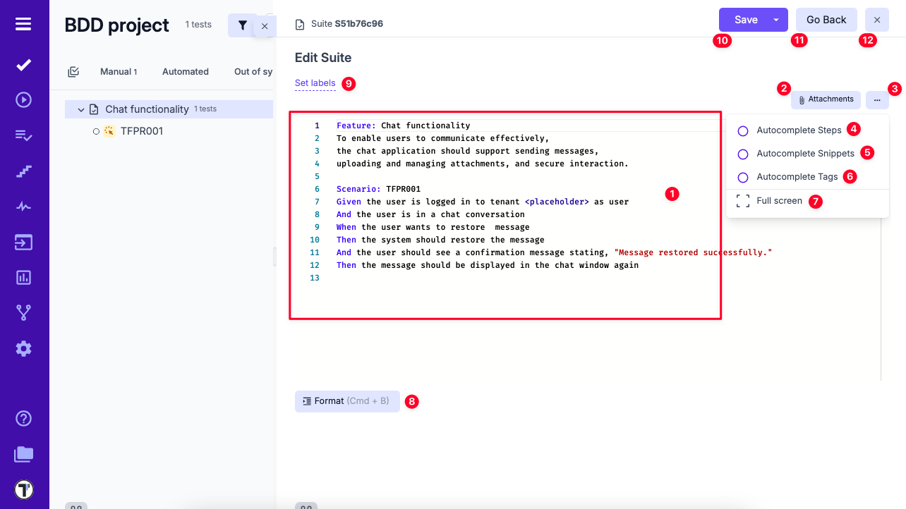
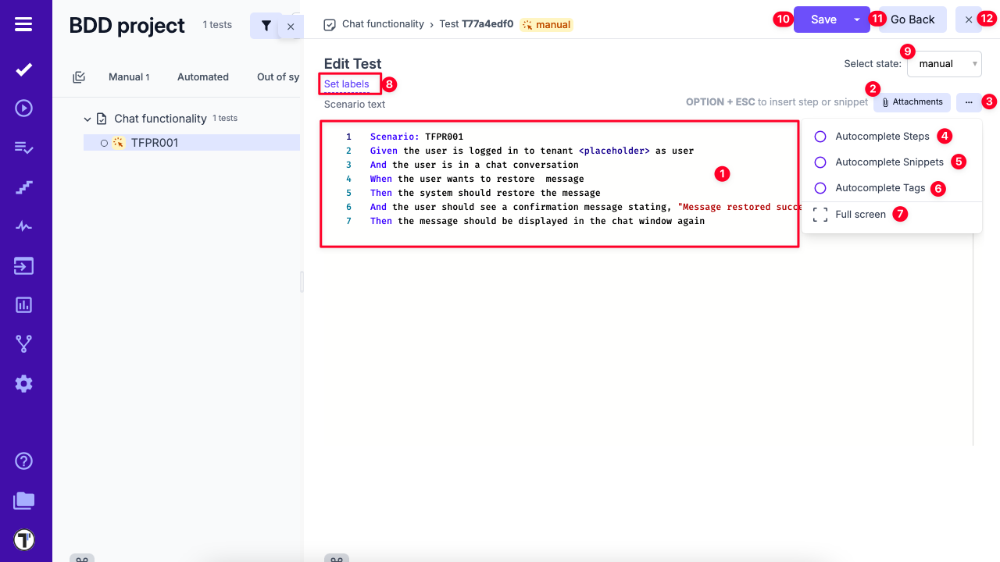

## Test Case Editor

Test Case Editor is a dynamic interface, designed to accommodate the diverse requirements of test case formulation. Through this platform, testers wield the power to architect meticulously structured test scenarios, encompassing a range of variables, actions, expected results, and potential outcomes.

Regarding test case creation, Testomat.io offers two distinct editor types: the **Classical** Editor and the **BDD** (Behavior-Driven Development) Editor. Each caters to different testing methodologies and user preferences, enabling testers to choose the approach that best aligns with their needs.

Let's have a look at **BDD** Editor.

## BDD Editor Review

As you embark on the journey of crafting and refining BDD scenarios, this innovative platform empowers you to shape narratives into meticulously executable tests. At its core, the BDD Editor encapsulates the essence of collaboration, precision, and agility, delivering a comprehensive solution for modern testing workflows. Here, you'll create user stories, scenarios, and document expected behaviors with an eloquence that bridges the gap between technical and non-technical stakeholders.

**Feature File Editor**

In the context of BDD, the Feature File serves as the canvas upon which your software's behavior is painted.

Let's see what we have here!

1. **Editing Area** – Displays the Feature File with Given/When/Then steps.  
2. **Attachments** – Upload supporting files via the attachments dialog.  
3. **Extra Menu** – Access additional options.  
4. **Autocomplete Steps** – Toggle step suggestions.  
5. **Autocomplete Snippets** – Toggle snippet suggestions.  
6. **Autocomplete Tags** – Toggle tag suggestions.  
7. **Fullscreen** – Enter a distraction-free workspace.  
8. **Format** – Structure Scenarios into Gherkin format.  
9. **Set Labels** – Assign existing labels or create custom fields.  
10. **Save** – Save your work.  
11. **Go Back** – Return to the previous screen.  
12. **Close** – Exit the editor.

**Scenarios Editor**

Beyond Feature Files lies the individual tests. Here, the BDD Editor grants you the ability to sculpt scenarios with precision, breaking down user behaviors into granular steps and verifiable outcomes. Each test becomes a symphony of detail, harmonizing the user's journey with the software's responses. By editing separate tests within the BDD Editor, you orchestrate complex interactions, validations, and expectations.

1. **Editing Area** – Displays Scenarios with Given/When/Then steps.  
2. **Attachments** – Upload supporting files via the attachments dialog.  
3. **Extra Menu** – Access additional options.  
4. **Autocomplete Steps** – Toggle step suggestions.  
5. **Autocomplete Snippets** – Toggle snippet suggestions.  
6. **Autocomplete Tags** – Toggle tag suggestions.  
7. **Fullscreen** – Enter a distraction-free workspace.  
8. **Set Labels** – Assign existing labels or create custom fields.  
9. **Change State** – Update the test state (e.g., manual to automated).  
10. **Save** – Save your work.  
11. **Go Back** – Return to the previous screen.  
12. **Close** – Exit the editor.

## Cross-Linking Tests, Suites and Folders

Another useful feature that allows you to cross-link test cases, suites, and folders by embedding their unique IDs directly into the description of another test or suite. This functionality provides you with clickable links to other related items within your project, and clicking on it displays a dynamic preview of the linked test, suite or folder in an additional window. 

This feature is available for Classical and BDD projects but have a difference in formating.

### For BDD Project

In the projects that use BDD format, you need to follow certain rules to maintain your test structure.
If you want to add clickable references to a test or suite in a BDD project, use **#** followed by their IDs. Clicking the link will open the test or suite in detail view, making navigation and traceability more seamless.

