When a new project is created, there are multiple options to start:


1. Create new suite and start adding tests
2. Import automated tests from source code
3. Import tests from CSV file from another Test Management System

## Creating a Test

Tests are created within a suite.


To create a new suite use "+" button or input field.
Open a newly created suite.

To add a new test to the suite you are currently in, click on **New Test** button.


Then input the name and the description of your test.


It is also possible to create the test straightaway from this screen. Simply input the test's title and click on the **Create** button. You can add the description at any time later.


Repeating these steps, you can easily add as many tests as you need within a reasonable period of time.

Also, you can use shortcut commands to create/edit Test Cases or Suites. Visit the [Keyboard Shortcuts](https://docs.testomat.io/usage/keyboard-shortcuts/) page to learn more.

## Edit Steps in Test Case Preview

After your test cases are created, Testomat.io offers a convenient feature for quick editing - **Edit Steps**. This allows you to modify steps and expected results directly from the test case preview page.

To use this feature, ensure that the **Steps** title is included in the test case description. Once that is set, you will see the **Edit Steps** option near the **Steps** title.

To edit steps from the test case preview window, follow these steps:

1. Click the Edit Steps button.


2. Click Add Step button on displayed modal.


3. Add steps and expected results, if needed.
4. Click Save button.


Example of test case after editing:


:::note

If you want to use the **Edit Steps** feature on a test case that already has steps added, be aware that it will affect the previous formatting!

:::

For example, if you used the pattern displayed below, after clicking **Edit Steps** you need to delete **Expected result** wording as it will be added automatically after you save changes.

```
## Steps

* Step 1
    Expected result: Step 1
* Step 2
    Expected result: Step 2
* Step 3
    Expected result: Step 2
```

Test Case before editing:


Test Case after editing:


## How To Save Your Tests

Testomat.io Editor offers options designed to streamline your test and suite management workflow. Lets have look:


Save: promptly save your changes while staying on the current test.

Save + View Test: save your work while immediately viewing the test in question.

Save + Go To Suite: save your changes and seamlessly navigate to the suite you're working on.

Save + Close All: ensures all open tests and suites are saved and closed simultaneously.

## Add Attachments to Test

First of all, you need to open the test that you want to add the attachment to.


Click on the **Attachments** tab.


Add your attachment via **Browse a file** or simply drag and drop it.


You can also add attachmennts to the test descrption:

1. Click on the **Attachment** button.
2. Select a file from your PC, or drag and drop it onto the area. You can also paste a file from the clipboard.
3. Click on the image that has been downloaded.


Once you have completed the steps, you will see the attachment in the test case description:


## How to Resize Attached Images in a Test Case

All images attached to a test case are displayed on the preview page at their default size.

To change the size of an attached image for a better view, follow these steps:

1. Hover over the attachment.
2. Click on the displayed button.


By clicking on the resize button on one image, all attachments in the test case will automatically resize.

## Add Drawing to Test

Including drawings in test case descriptions can improve clarity by visually representing complex UI layouts and interactions that are difficult to explain through text alone.

To add a drawing to a test case, enter the edit mode and click on the **Draw** button.


You'll see a window with a set of drawing tools. You can select different elements from the top panel (2) and apply styles to them from the side panel (3). When you are done with the drawing, click on the **Save** button (4).


After saving the changes in the edit mode, you will see a preview of the drawing in the test case description:


## How to add a label/tag to a test

This option is the easiest one! You simply need to add the label's name (preceeded by @ char) in the name field of the test. The drop-down list of tags already used in projects appears, when you type the @ symbol.


And now you can see your label/tag in the test list next to the test's title.


## How to assign a test to a user

If you want to assign a certain test to a certain user, you should click on this user icon in the upper right corner of the window, as shown in the picture.


Assign a user from the list of users added to the project by clicking on the user's name. Please note, that you need to make sure the intended user is added to the project first!


Now you can see that this test is assigned to a certain user. The user icon has changed accordingly.


## How to set a priority to a test

First, you should open the test and click on the checkbox icon next to the test title, as shown in the picture.

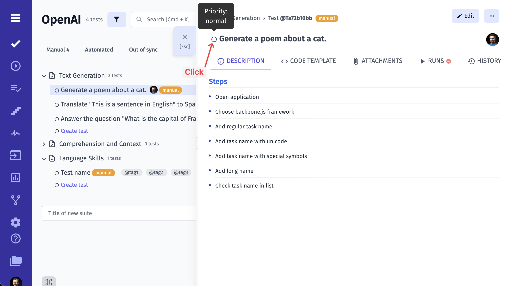

You will see a list of priority types

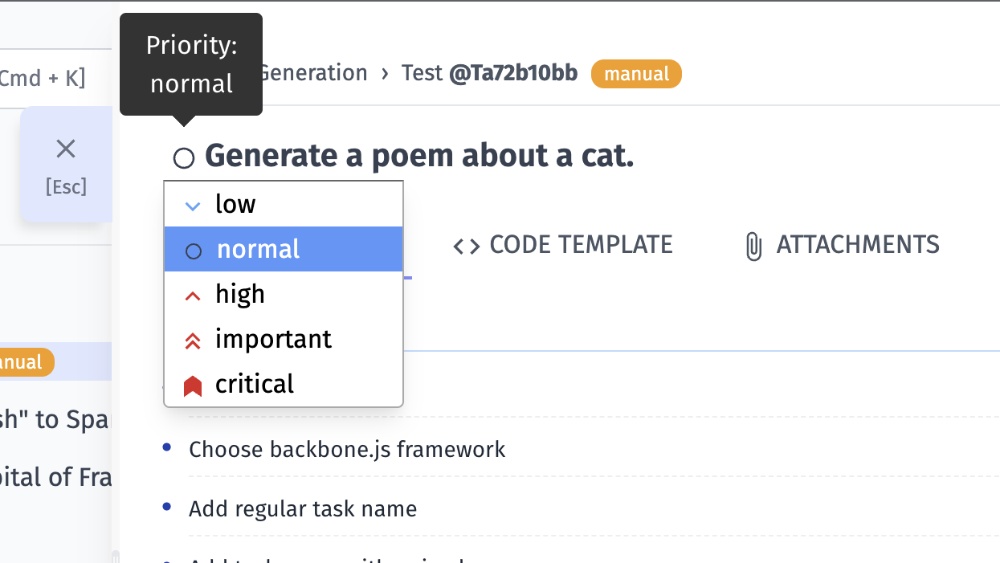

Click on the priority type you need and you will see the checkbox changed

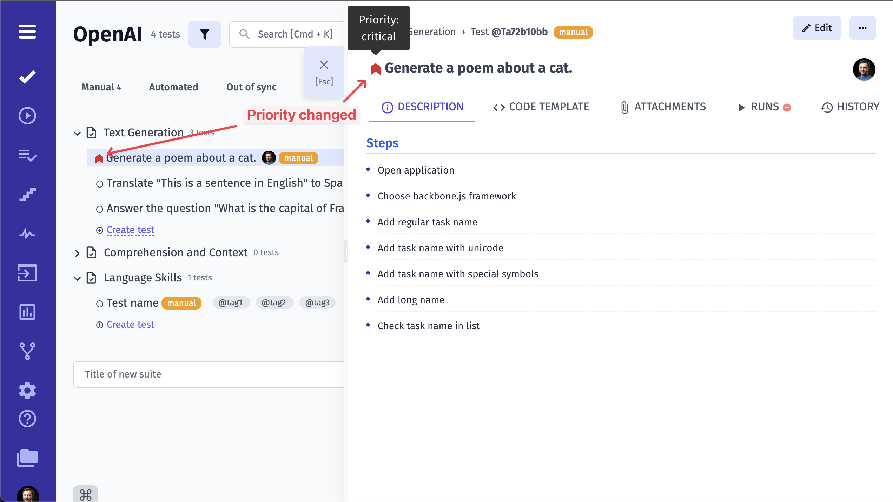

Also, you will see set priority in your suite

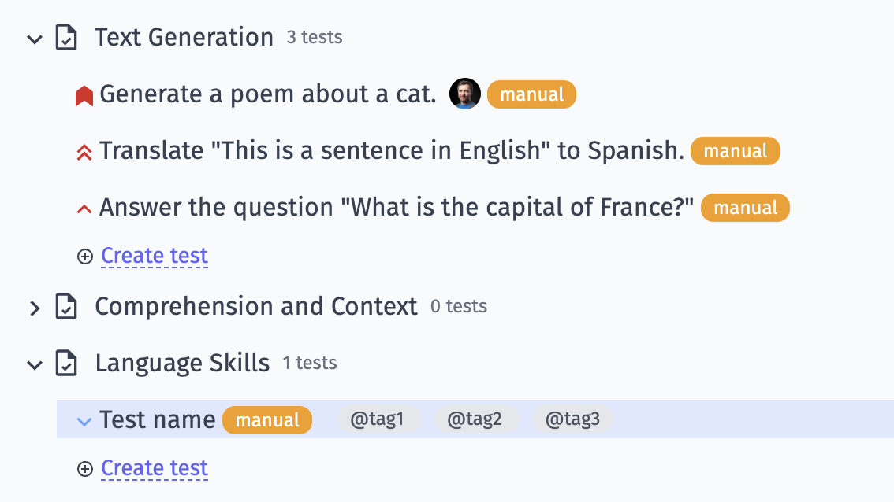

## How to add parameters to a test

Parameters are used to create data-driven tests. Each parameter will be treated as a separate test during a manual or automated run.

**To add parameters to your test**:

1. Navigate to **‘Tests’** in the sidebar
2. Select specific test
3. Click the **’Extra button’** icon
4. Select **’Add Parameter’** from the menu

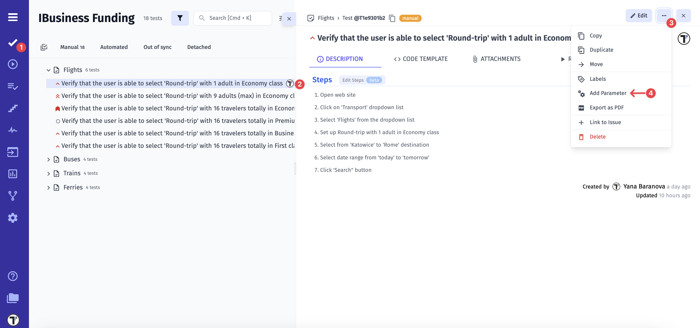

After a modal with instructions will appear,

1. Add parameter headers:

- Enter a name for the header
- A new **'Parameter header'** will appear automatically for each additional header

2. Click **’Save’** button after adding all necessary headers

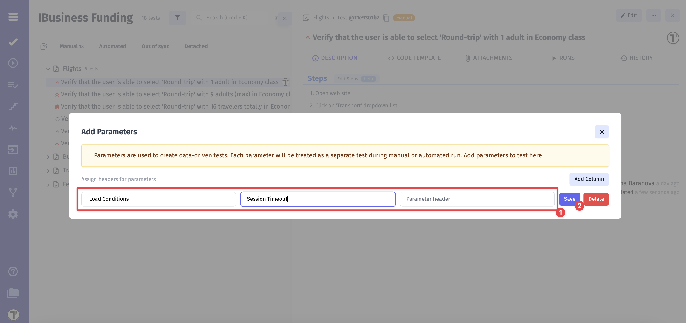

3. Add parameter names
4. Click **’Save’** button

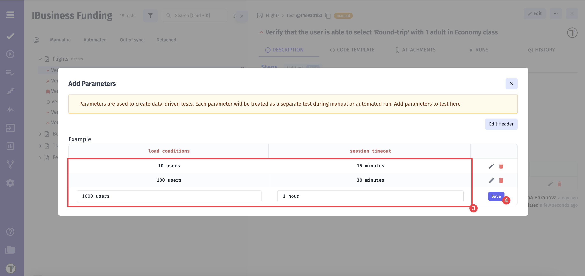

Now, your parameters are added, and you can see them at the bottom of the modal,

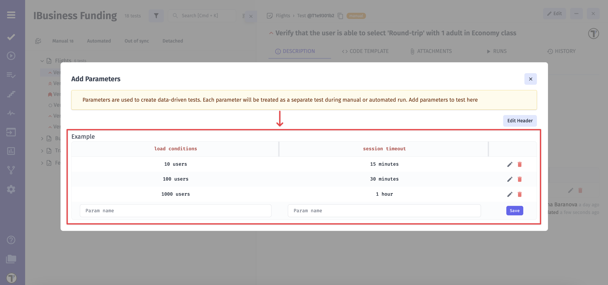

or under the test description.

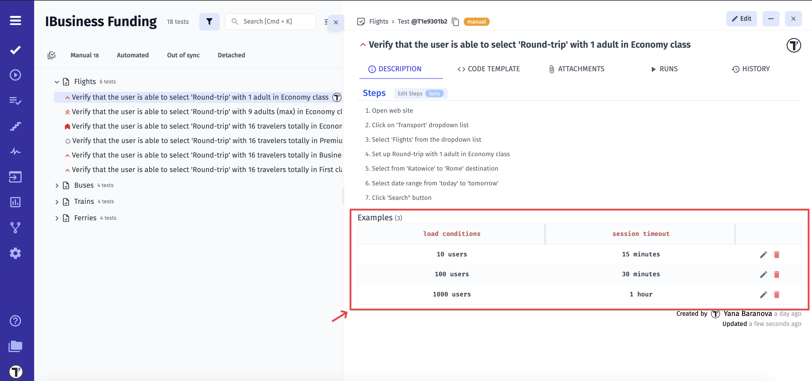

### How to edit test parameters

You are able to edit existing parameters or parameter headers in two methods:

**Method 1: Editing directly under the test description**

1. Click the **‘Edit’** icon next to the parameter

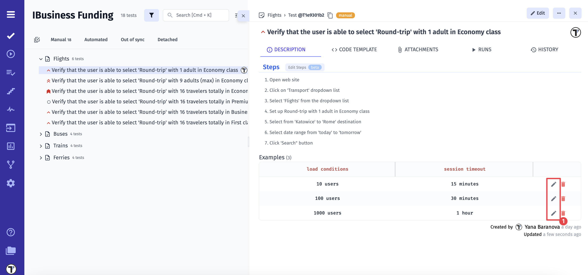

2. Update the parameter name
3. Click the **‘Save’** button

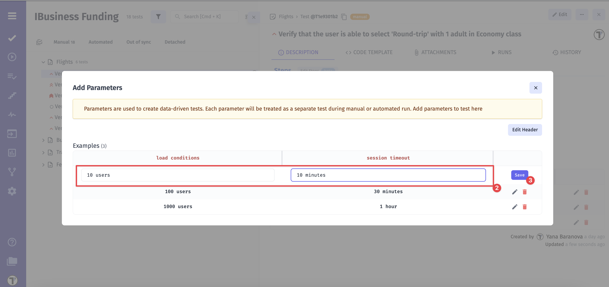

4. Click the **‘Edit Header’** button

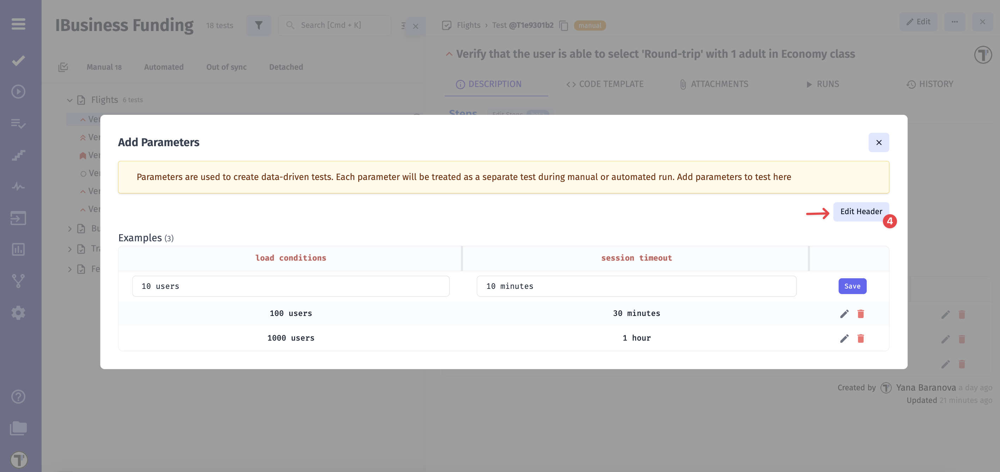

5. Update the header name
6. Click the **‘Save’** button

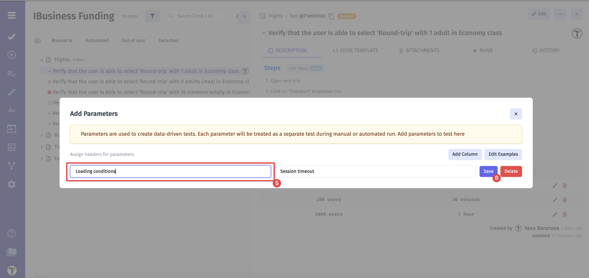

To delete a parameter:

1. Click the **‘Trash’** icon
2. A pop-up will appear: **’Are you sure you want to delete this param?’**
3. Click **‘OK’** to confirm

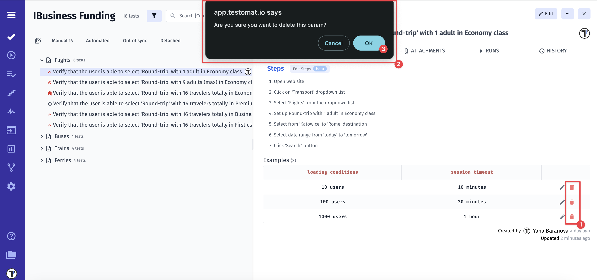

**Method 2: Editing via the parameter menu**

1. Click the **‘Extra button’** icon
2. Select **‘Add Parameter’** from the menu

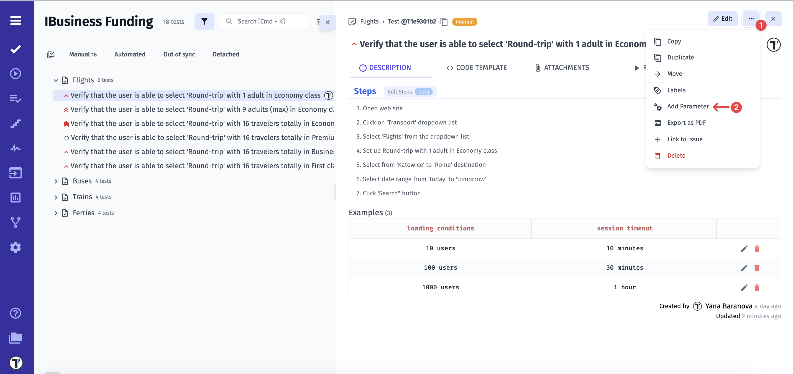

3. Follow the same steps as in Method 1:

- Click the **‘Edit’** icon next to the parameter
- Update the parameter name
- Click **‘Save’**

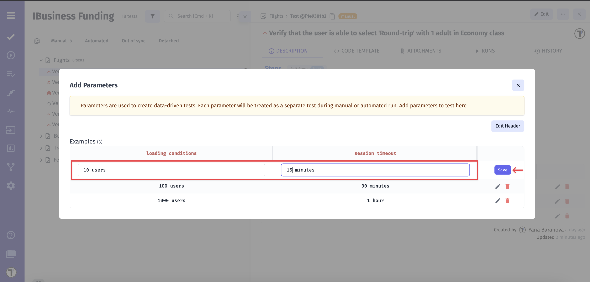

- Click **‘Edit Header’** button
- Update the header name
- Click **‘Save’**

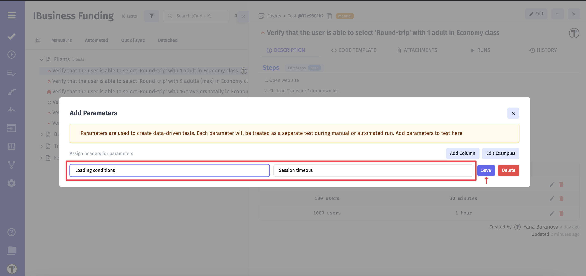

