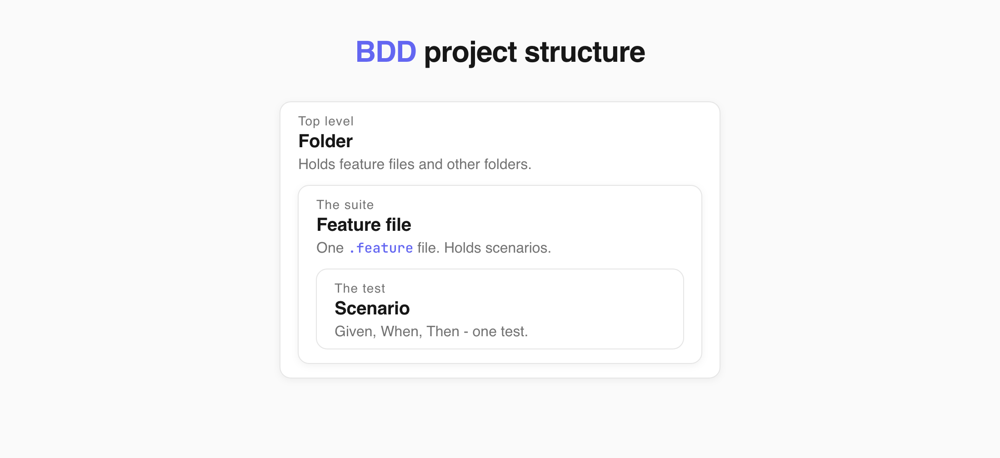
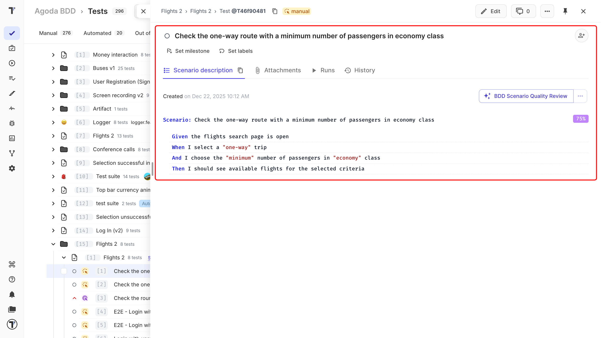
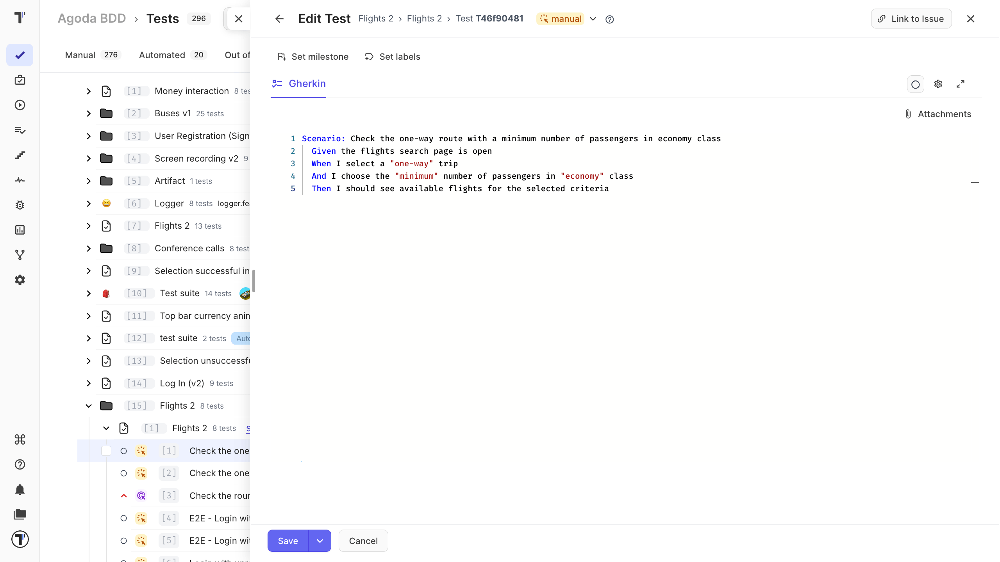
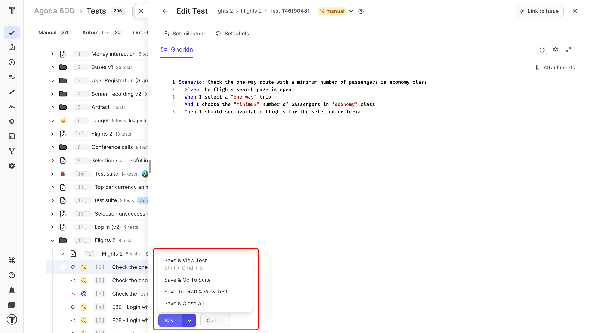
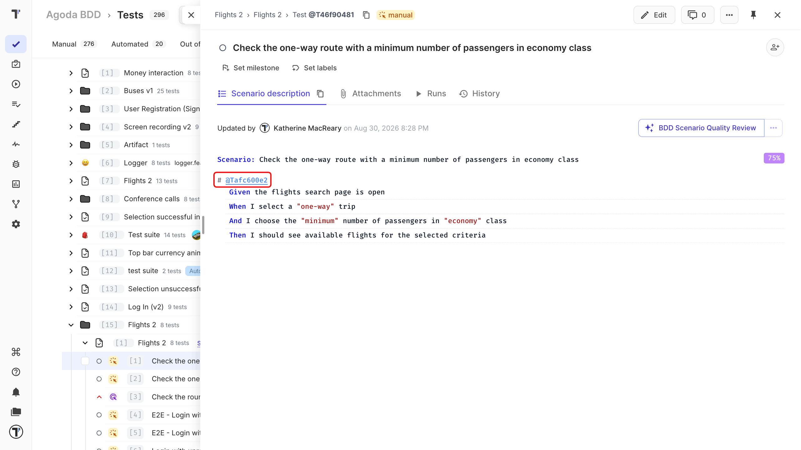

A BDD project stores tests as Gherkin scenarios. Each suite is a `.feature` file, and each test is a scenario inside that file. A BDD project is a good fit when you:

- write scenarios together with business, development, and QA teams,
- use a Cucumber-based automation framework,
- want your test scenarios to be closely connected to automation,
- want to describe the starting state and expected result for each scenario.



:::note

A project is either Classical or BDD, and the type cannot be changed after creation. To move from Classical to BDD, you create a new BDD project and transfer the tests - manually, or with the Transform Project to BDD AI agent. There is no supported way to move from BDD to Classical. See [Classical vs BDD](https://docs.testomat.io/project/tests/classical-vs-bdd) and [AI-Agents](https://docs.testomat.io/advanced/ai-powered-features/ai-agents).

:::

## Feature Files, Scenarios, and Folders

In a BDD project, each suite is a `.feature` file. The scenarios inside the file are the tests.



A feature file cannot contain another feature file, so a suite cannot contain other suites. Use folders to group feature files. Tests are organised like files in your code, so a manual test can become automated without moving it. See [Suites and Folders](https://docs.testomat.io/project/tests/other-features-for-test-case-design/#suites-and-folders) to learn more.

## Gherkin Syntax

BDD scenarios use Gherkin keywords such as `Given`, `When`, `Then`, and `And`. The BDD editor checks the Gherkin syntax as you type. If you misspell a keyword or miss a required line, the scenario cannot be saved as a valid test.

| Keyword | Description |
| --- | --- |
| **Given** | The starting state |
| **When** | An action |
| **Then** | The expected result |
| **And** | Another step added to the previous one |

For example:

```gherkin
Feature: User Authentication

Scenario: Successful login with valid credentials

Given the user is on the Testomat.io login page
When the user enters valid credentials
And the user clicks the 'Sign In' button
Then the user should be redirected to the Project Dashboard
And a "Welcome" message should be displayed
```
You can keep an unfinished scenario as a draft. See [Drafts for unfinished scenarios](#drafts-for-unfinished-scenarios).


## Reuse Shared Steps

The same steps, such as `Given I am on the login page`, can be reused:

1. Start typing the step.
2. Pick it from the autocomplete list. 

Reused steps have one big advantage: when a step changes, you edit it in one place and every scenario that uses it is updated.

See [Steps Database](https://docs.testomat.io/project/steps-snippets/steps/#how-to-reuse-steps-from-steps-database) for the full picture.

## Automation Mapping

In a BDD project, each Gherkin step is connected to a step definition in your automation code. For reusable tests, describe what the user wants to do rather than the exact UI action.

For example:


```gherkin
When I cancel the transaction
```

is easier to reuse than:

```gherkin
When I click the red Cancel button
```

This also means your scenarios are less affected when the user interface changes.

To connect your scenarios to real code, import your feature files. See [Import Cucumber BDD Tests](https://docs.testomat.io/project/import-export/import/import-bdd).

:::note

As Gherkin alternative, you can use a Classical project and write CodeceptJS code that reads like BDD, such as `I.click('Login')`. See [Classical vs BDD](https://docs.testomat.io/project/tests/classical-vs-bdd#moving-between-project-types).

:::

## Suite Page

Click a suite in the tree to open its page. This is where you see the feature file, its scenarios, and everything attached to it.

| Tab | What it shows |
| --- | --- |
| **Feature description** | The `Feature` text of the file. |
| **Tests** | Every scenario in the file. |
| **Attachments** | Files added to the suite. |
| **Runs** | Runs that included these scenarios. |
| **History** | Changes made to the suite. |

From this page you can also:

| Control | What it does |
| --- | --- |
| **Edit** | Opens the feature file editor. |
| **Set milestone** | Links the suite to a [milestone](https://docs.testomat.io/advanced/milestones), such as a sprint or a release. |
| **Set labels** | Adds labels or custom fields. |
| **Set requirements** | Links the suite to a requirement document, so you can see what the scenarios are meant to cover. See [AI-Requirements](https://docs.testomat.io/advanced/ai-powered-features/ai-requirements). |
| **Suggest Tests** | Lets AI propose new scenarios based on the suite description. See [AI-Powered Features](https://docs.testomat.io/advanced/ai-powered-features/ai-powered-features). |
| **Add new test** | Adds a scenario without opening the editor. Type a title and click **Create**. Turn on **Bulk** to add several at once, one title per line. |

## Feature File Editor

A feature file is the suite in a BDD project. To open it:

1. On the **Tests** page, click a suite in the tree.
2. Click **Edit** in the top-right corner.

The editor opens with the `Feature` description and every scenario in the file.

| # | Control | What it does |
|---|---|---|
| 1 | **Go back** | Return to the previous screen. |
| 2 | **Close** | Close the editor. |
| 3 | **Set milestone** | Link the feature file to a [milestone](https://docs.testomat.io/advanced/milestones), such as a sprint or a release. |
| 4 | **Set labels** | Add labels or custom fields. |
| 5 | **Gherkin** | Switch to the Gherkin view of the feature file. |
| 6 | **Autocomplete** | Turn step, snippet, and tag suggestions and the spell checker on or off. |
| 7 | **Fullscreen** | Open the editor in full-screen mode. |
| 8 | **Attachments** | Add files to the feature file. |
| 9 | **Editing area** | Edit the feature file and its Given/When/Then steps. |
| 10 | **Format** | Format the scenarios using the Gherkin structure. Shortcut: `Cmd` + `B`. |
| 11 | **Save** | Save your changes. Open the arrow next to it for more save options. |
| 12 | **Cancel** | Leave the editor without saving. |

The **Autocomplete** menu holds four switches.

| Switch | What it does |
| --- | --- |
| **Autocomplete Steps** | Suggests steps from the [Steps Database](https://docs.testomat.io/project/steps-snippets/steps) as you type. Pick one from the list to insert it. |
| **Autocomplete Snippets** | Suggests [snippets](https://docs.testomat.io/project/steps-snippets/snippets) - saved blocks of text or steps that you reuse across tests. |
| **Autocomplete Tags** | Suggests existing [tags](https://docs.testomat.io/advanced/tags-labels/tags) after you type `@`, so you reuse a tag instead of creating a duplicate. |
| **Spell check** | Marks misspelled words in the editor as you type. |

The feature file editor and scenario editor work with the same file. Changes made to a scenario are saved back to its feature file.

## Scenario Editor

The scenario editor lets you edit the test without showing the rest of the feature file. You can open one scenario: 

1. Click a test in the tree.
2. Click **Edit**. 



| # | Control | What it does |
|---|---|---|
| 1 | **Go back** | Return to the previous screen. |
| 2 | **State** | Change the test state, such as manual or automated. |
| 3 | **Help** | Open the help panel. |
| 4 | **Link to Issue** | Link the scenario to an issue in your bug tracker. |
| 5 | **Close** | Close the editor. |
| 6 | **Set milestone** | Link the scenario to a [milestone](https://docs.testomat.io/advanced/milestones), such as a sprint or a release. |
| 7 | **Set labels** | Add labels or custom fields. |
| 8 | **Gherkin** | Switch to the Gherkin view of the scenario. |
| 9 | **Priority** | Set how important the scenario is. |
| 10 | **Autocomplete** | Turn step, snippet, and tag suggestions and the spell checker on or off. |
| 11 | **Fullscreen** | Open the editor in full-screen mode. |
| 12 | **Attachments** | Add files to the scenario. |
| 13 | **Editing area** | Edit the scenario and its Given/When/Then steps. |
| 14 | **Save** | Save your changes. Open the arrow next to it for more save options. |
| 15 | **Cancel** | Leave the editor without saving. |

## Drafts for Unfinished Scenarios

Open the arrow next to **Save** to see every save option:

| Option | What it does |
| --- | --- |
| **Save & View Test** | Saves and opens the test. |
| **Save & Go To Suite** | Saves and opens the feature file the scenario belongs to. |
| **Save To Draft & View Test** | Saves your changes as a draft and opens the test. |
| **Save & Close All** | Saves and closes the editor. |

Use **Save To Draft & View Test** to keep unfinished changes. The draft is saved, while the test keeps its last valid version.

When you open the test in edit mode again, you can use:

- **Apply Draft to Description** to replace the current scenario text with the saved draft.
- **Delete Draft** to remove the saved draft.



:::note

Only one draft can be saved at a time. Saving a new draft replaces the previous one.

:::

## Link Tests and Suites

You can link a test or suite from another description by adding `#` before its ID. The `#` is a must in a BDD project.

For example:

```text
#12345
```

To link by ID:

1. Save the description. The ID becomes a clickable link. 
2. Click it to open the linked item in detail view.




## Next Steps

- [Classical Test Case Editor](https://docs.testomat.io/project/tests/classical-test-case-editor)
- [Classical vs BDD](https://docs.testomat.io/project/tests/classical-vs-bdd)
- [AI-Agents](https://docs.testomat.io/advanced/ai-powered-features/ai-agents)
