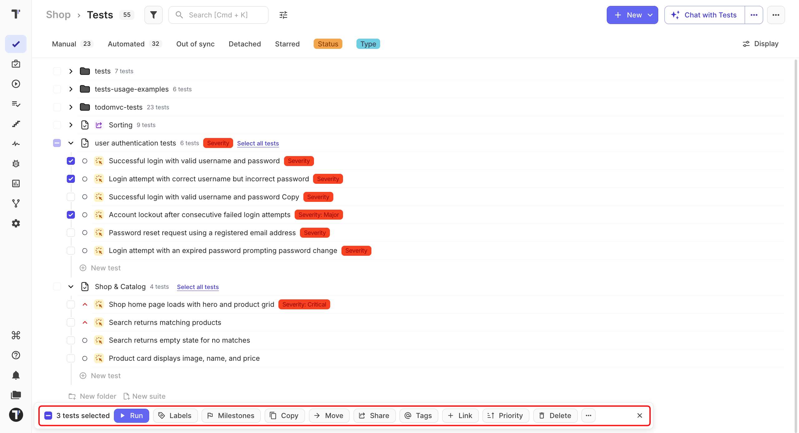

 
Update several tests at once instead of opening them one by one.
 
Select the tests you need on the **Tests** page, then choose an action from the bulk panel.
 
## Select Multiple Tests
 
1. Go to the **Tests** page.
2. Select the tests you need in one of these ways:
   - Click the checkbox next to a test.
   - Click the checkbox on a folder or suite to select everything inside it.
   - Click **Select all tests** next to a suite.

The bulk actions panel appears at the bottom of the page and shows how many tests are selected.

 
All actions you choose from this panel apply to the selected tests. To clear the selection, click **✕** on the right of the panel.
 
## Bulk Actions

Choose the action you need and follow the prompts that appear.
 
| Action | What it does |
| --- | --- |
| **Run** | Starts a test run with the selected tests. |
| **Labels** | Adds or removes labels and custom fields. |
| **Milestones** | Assigns the selected tests to a milestone. |
| **Copy** | Copies the selected tests to another folder or project. |
| **Move** | Moves the selected tests to another suite or folder in the same project. |
| **Share** | Makes the selected tests available in another project while keeping one original. |
| **Tags** | Adds existing tags or creates new ones. |
| **Link** | Links a defect to the selected tests. |
| **Priority** | Sets a priority for the selected tests. |
| **Delete** | Deletes the selected tests. |
| **⋯** | Downloads the selected tests as a spreadsheet. |
 
:::note

**Delete** removes all selected tests. Check your selection before confirming, especially when working with a large group of tests. Deleted tests can be restored for 90 days. See [Pulse](https://docs.testomat.io/project/pulse).

:::
 
## Next Steps
 
- [Test Priority](https://docs.testomat.io/project/tests/test-priority)
- [Tags, Labels, and Assignees](https://docs.testomat.io/project/tests/tags-labels-and-assignees)
- [Move Tests](https://docs.testomat.io/project/tests/move-tests)
 
