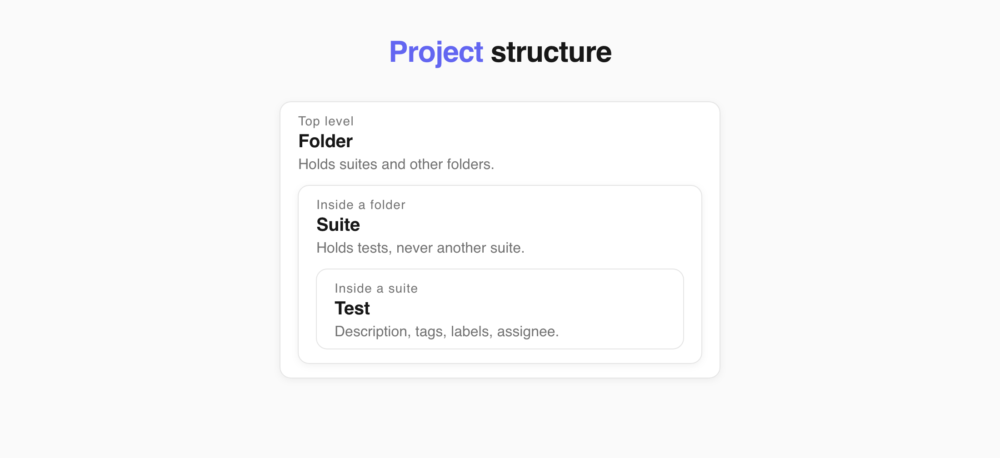
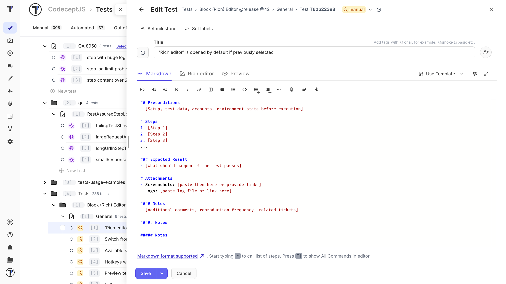
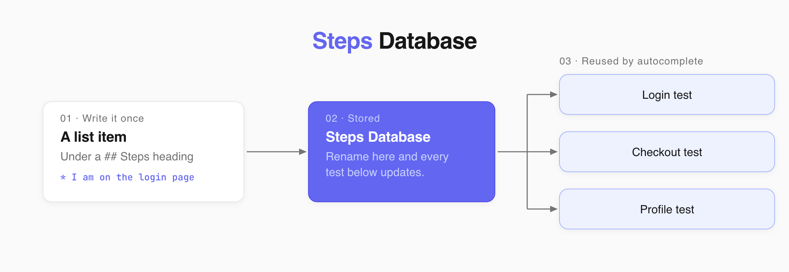
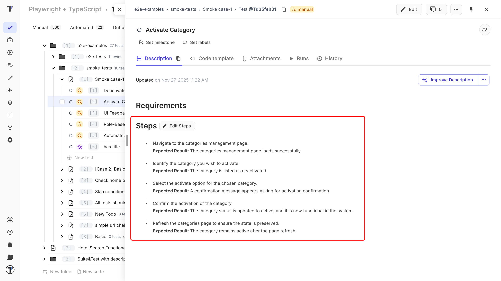
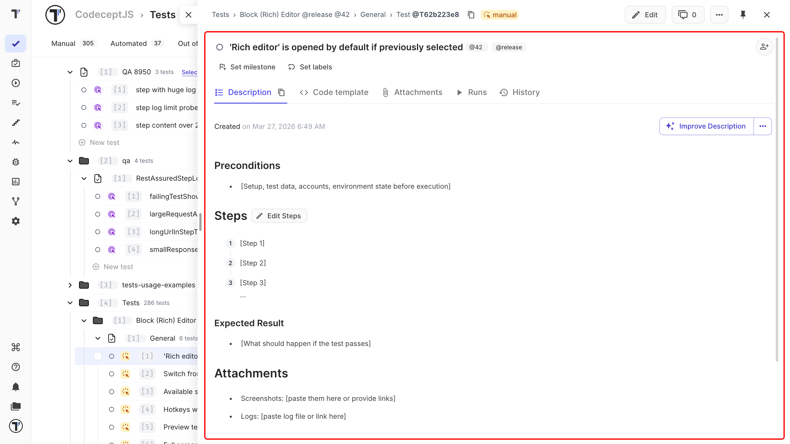
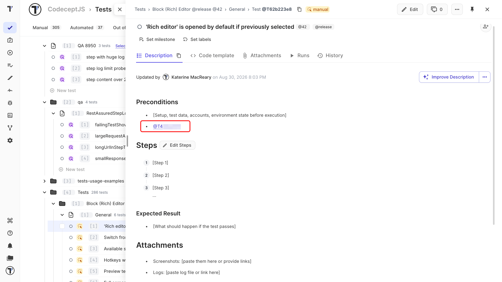

A Classical project stores each test as a Markdown document. It is the default choice for manual testing. 

Choose a Classical project if you:

- are moving from spreadsheets or another test management system;
- work mostly with manual tests;
- use an automation framework that does not use Cucumber;
- want to write tests in your own words.

:::note

Choose the project type when you create the project. You cannot change it later. Classical projects do not support Gherkin scenarios. See [Classical vs BDD](https://docs.testomat.io/project/tests/classical-vs-bdd).

:::

## Folders, Suites, and Tests

A Classical project uses three types of items: folders, suites and tests. 

A folder can contain other folders and suites. A suite contains tests. Tests are the final level of the project structure.

Use folders to organize your suites. Use suites to group related tests.



You can also change an empty suite into a folder, or change a folder back into a suite.

This structure keeps your tests organized. You can also connect a manual test to automation later without moving it to another part of the project.

## Suite Descriptions

A suite can have its own description. Use it for information that applies to all tests in the suite, such as:

- system settings,
- dependencies,
- test data,
- setup steps.

Add this information once at the suite level instead of repeating it in every test. See [Suites and Folders](https://docs.testomat.io/project/tests/other-features-for-test-case-design/#suites-and-folders) for more information.

## Test Descriptions

Classical test descriptions use Markdown. With Markdown, you can add:

- headings,
- lists,
- bold text,
- images,
- attachments.

If you use the same structure for several tests, save it as a template and apply it with **Use template** in the editor. Templates are managed in project settings. See [Templates](https://docs.testomat.io/management/project/templates).

:::note

AI-generated tests use the same Markdown format as manually created tests.

:::



## Tags

Tags group tests across suites. Add a tag right in the test title with the `@` symbol:

```text
Checkout works with a saved card @smoke @payments
```

Testomat.io picks the tags out of the title and shows them next to the test. See [Tags](https://docs.testomat.io/advanced/tags-labels/tags).

## Test Priority

Priority shows which tests matter most. The priority icon appears next to the test title and in the test tree, and you can filter tests by it.

| Level | Meaning |
| --- | --- |
| **Low** | Low-importance test |
| **Normal** | Default priority |
| **High** | High-importance test |

Set priority when you create a test, change it while editing, or update many tests at once. See [Test Priority](https://docs.testomat.io/project/tests/test-case-creation-and-editing/#test-priority).

## Steps and Expected Results

The Steps Database is a shared list of reusable steps for the whole project. It helps you:

- find existing steps with autocomplete while writing a test,
- rename a step in one place and update it in every test that uses it.

Testomat.io saves a step to the Steps Database only when it is written as a list item under a `## Steps` heading.



:::note

If you want to reuse a step in other tests, create it as a list item from the start.

:::

For example:

```markdown
## Steps
* Go to the payment page
* Verify that Payment page loads
* Enter credit card details and submit
* Verify that Payment is processed and confirmation page loads
```

| How you write it | What Testomat.io does |
| --- | --- |
| Plain text | Shows it in the test, but does not save it to the Steps Database |
| List item | Saves it and makes it available in autocomplete and the Steps editor |
| Nested list, table, or subheading | Saves it and makes it available in autocomplete and the Steps editor |

### Expected Results as Nested List

This format is useful for breaking down each step into multiple sub-steps, each with its own expected result.

```markdown
## Steps

1. Step 1
   - Expected result: Step 1.1
   - Expected result: Step 1.2
2. Step 2
   - Expected result: Step 2.1
   - Expected result: Step 2.2
3. Step 3
   - Expected result: Step 3.1
   - Expected result: Step 3.2
```

 Write expected results as list items if you want to save and reuse them.



### Separated Expected Results

The verification actions can be listed under a separate section for expected results. This can be used to provide a summary of the expected behavior and can be helpful in identifying any gaps in the test coverage.

```
## Steps
* Step 1
* Step 2
* Step 3

## Expected results:
* Verify that ...
* Verify that ...
* Verify that ...
```

When a test contains a `## Steps` heading, the preview shows steps in rich editor. Use it to edit steps and expected results without opening the full test editor. See [Steps](https://docs.testomat.io/project/steps-snippets/steps) for more information.

## Dynamic Parameters

Dynamic parameters turn one test into a data-driven test. Write a placeholder in the steps, fill in a table of values, and Testomat.io runs the test once per row. Each row counts as a separate test in the run.

Use `${ParameterName}` or `{{ParameterName}}` in the description or the steps:

```text
Open home page {{URL}}
Enter an invalid mobile number ${Mobile No}
```

See [Add Dynamic Parameters to a Test](https://docs.testomat.io/project/tests/test-case-creation-and-editing/#add-dynamic-parameters-to-a-test).

## Automation Mapping
In a Classical project, Testomat.io connects automated tests to your test cases using the test title and file path.
Your manual test steps do not need to match functions in your automation code. You can describe the steps in plain language. This approach works with automation frameworks:

- Playwright,
- Cypress,
- JUnit,
- pytest,
- RSpec.

## Test Editor

The Classical editor opens when you create a test or edit an existing one.



It contains the test title, description, and tools for editing the test.

| # | Control | What it does |
| --- | --- | --- |
| 1 | Test title field | Enter the test title and add tags. |
| 2 | Set priority | Set how important the test is, from Low to High. |
| 3 | Assign to | Assign the test to a user. The user must already be a member of the project. |
| 4 | Formatting toolbar | Format the test description. |
| 5 | Editing area | Add requirements, preconditions, steps, and expected results. |
| 6 | Preview | See how the finished test looks. |
| 7 | Edit steps | Edit steps and expected results in a Rich editor. |
| 8 | Attachments | Add files to the test. |
| 9 | Draw | Add a diagram or drawing. |
| 10 | Editor mode switch | Switch between block and Markdown modes. |
| 11 | Autocomplete steps | Turn step suggestions on or off. |
| 12 | Autocomplete snippets | Turn snippet suggestions on or off. |
| 13 | Autocomplete tags | Turn tag suggestions on or off. |
| 14 | Full screen | Open the editor in full-screen mode. |
| 15 | Set labels | Add labels or custom fields. |
| 16 | Use template | Apply a saved test template. |
| 17 | Change state | Change the test state, such as manual or automated. |
| 18 | Save | Save your changes. |
| 19 | Dictate | Speak the text instead of typing it. Needs AI features turned on. |
| 20 | Go back | Return to the previous screen. |
| 21 | Close | Close the editor. |

## Suite Editor

The suite editor works in much the same way, but it has fewer controls because suites do not have steps or a state.

| # | Control | What it does |
| --- | --- | --- |
| 1 | Suite title field | Enter the suite title and add tags. |
| 2 | Formatting toolbar | Format the suite description. |
| 3 | Assign to | Assign the suite to a user. The user must already be a member of the project. |
| 4 | Editing area | Write the suite description. |
| 5 | Preview | See how the suite looks. |
| 6 | Attachments | Add files to the suite. |
| 7 | Extra menu | Open additional suite options. |
| 8 | Autocomplete steps | Turn step suggestions on or off. |
| 9 | Autocomplete snippets | Turn snippet suggestions on or off. |
| 10 | Autocomplete tags | Turn tag suggestions on or off. |
| 11 | Full screen | Open the editor in full-screen mode. |
| 12 | Set labels | Add labels or custom fields. |
| 13 | Use template | Apply a saved suite template. |
| 14 | Save | Save your changes. |
| 15 | Dictate | Speak the text instead of typing it. Needs AI features turned on. |
| 16 | Go back | Return to the previous screen. |
| 17 | Close | Close the editor. |

## Block and Markdown Modes

You can edit the same test description in two modes.

The block editor splits the content into separate blocks. Each step can have its own expected result and image. This makes longer tests easier to read.
The Markdown editor shows the same content as Markdown view.

Both modes edit the same description, so you can switch between them any time.

## Link Tests and Suites

You can link a test, suite, or folder from a description by adding its ID.

After you save the description, the ID becomes a clickable link. Click it to open a preview of the linked item in a side panel.



If the ID stays as plain text, check that you added the item ID rather than its full URL.

:::note

In a Classical project, use the ID without `#`.

:::

## Next Steps

- [BDD Test Case Editor](https://docs.testomat.io/project/tests/bdd-test-case-editor)
- [Classical vs BDD](https://docs.testomat.io/project/tests/classical-vs-bdd)
