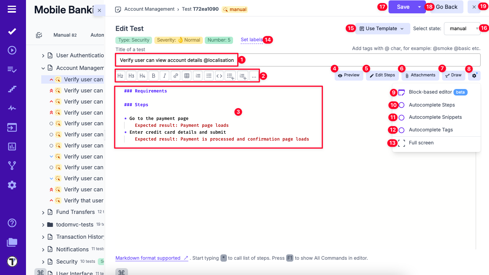
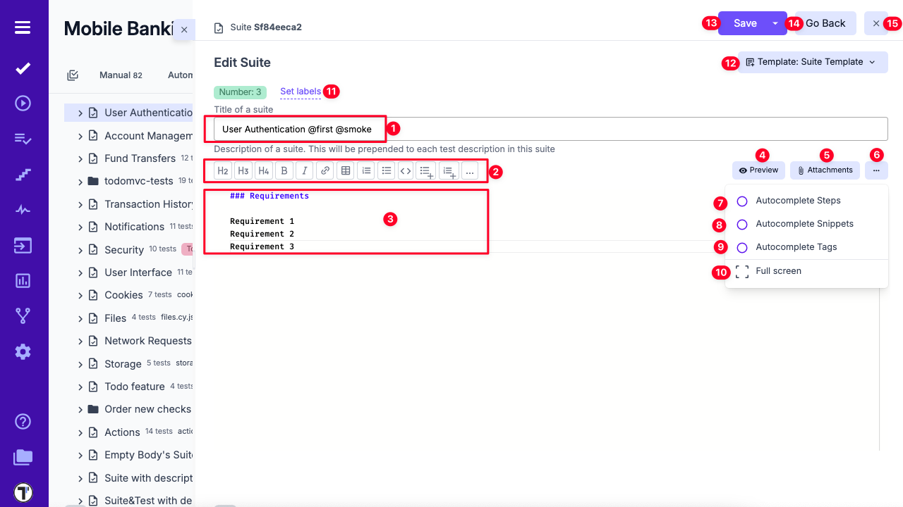
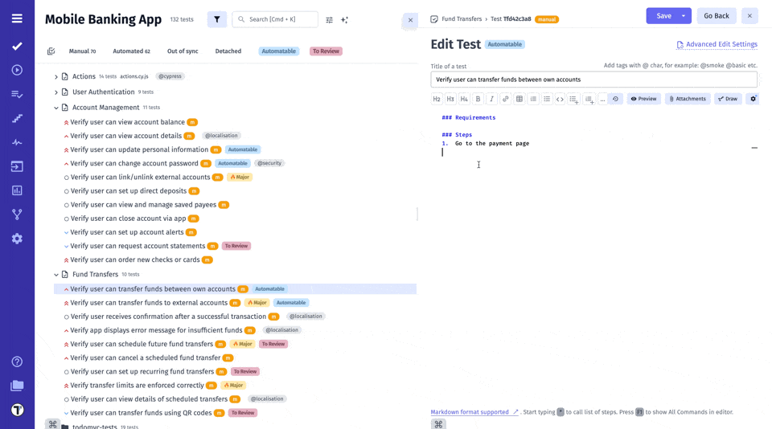
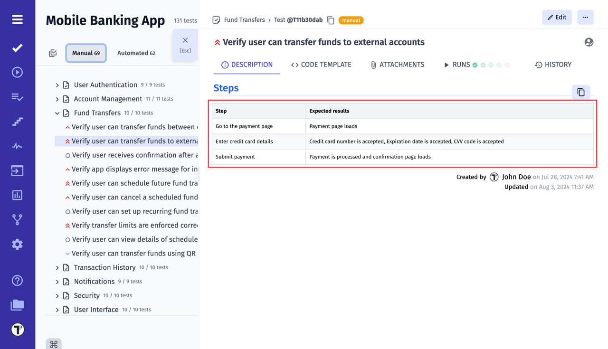
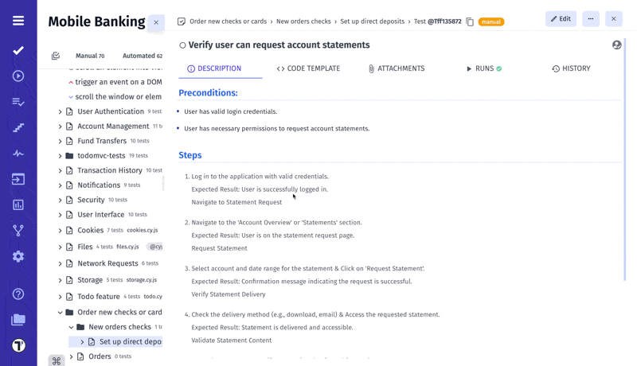

## Test Case Editor

Test Case Editor is a dynamic interface, designed to accommodate the diverse requirements of test case formulation. Through this platform, testers wield the power to architect meticulously structured test scenarios, encompassing a range of variables, actions, expected results, and potential outcomes.

Regarding test case creation, Testomat.io offers two distinct editor types: the **Classical** Editor and the **BDD** (Behavior-Driven Development) Editor. Each caters to different testing methodologies and user preferences, enabling testers to choose the approach that best aligns with their needs.

Let's have a look at **Classical** Editor.

## Classical Editor Review

Introducing the Classical Editor, a tool that places the art of test editing firmly in your hands. Crafting tests becomes a seamless endeavor as you immerse yourself in the Classical Editor's capabilities.



# Test Editor Overview

1. **Test Title Field** – Enter the title of your test and add relevant tags.  
2. **Formatting Toolbar** – Use formatting options to enhance your text.  
3. **Editing Area** – Add test requirements, preconditions, steps, and expected results.  
4. **Preview Button** – View a live preview of how the test will appear.  
5. **Edit Steps** – Open the steps editor to modify test steps and expected outcomes.  
6. **Attachments Button** – Open the attachments dialog to upload supporting files.  
7. **Draw Button** – Launch the drawing editor to add visual elements.  
8. **Editor Mode Switch** – Toggle between block-based and Markdown editor modes.  
9. **Autocomplete Steps** – Enable or disable automatic step suggestions.  
10. **Autocomplete Snippets** – Enable or disable snippet suggestions.  
11. **Autocomplete Tags** – Enable or disable tag suggestions.  
12. **Full Screen Button** – Switch to a distraction-free, full-screen editing mode.  
13. **Set Labels Button** – Open a window to assign existing labels or create custom fields.  
14. **Use Template Button** – Apply a predefined test template.  
15. **Change State** – Change the test state (e.g., from manual to automated).  
16. **Save Button** – Save your progress.  
17. **Go Back Button** – Return to the previous screen.  
18. **Close Button** – Exit the test editor.


However, the Classical Editor's influence transcends singular tests. With Pre-Requirements, you can now wield the power to define the contextual prerequisites that set the stage for entire test **suites**. Seamlessly integrate high-level descriptions of dependencies, system states, or configurations required to execute a suite effectively.



# Suite Editor Overview

1. **Suite Title Field** – Enter the suite title and any relevant tags.  
2. **Formatting Toolbar** – Use text formatting tools as needed.  
3. **Editing Area** – Provide a description for the suite.  
4. **Preview Button** – See a live preview of the suite’s appearance.  
5. **Attachments Button** – Open the dialog to upload attachments.  
6. **Extra Menu Button** – Access additional suite editor options.  
7. **Autocomplete Steps** – Enable or disable step autocompletion.  
8. **Autocomplete Snippets** – Enable or disable snippet suggestions.  
9. **Autocomplete Tags** – Enable or disable tag suggestions.  
10. **Full Screen Button** – Enter distraction-free editing mode.  
11. **Set Labels** – Assign existing labels or create new custom fields.  
12. **Use Template Button** – Apply a predefined suite template.  
13. **Save Button** – Save your changes.  
14. **Go Back Button** – Return to the previous view.  
15. **Close Button** – Exit the suite editor.


### Why Do We Use Markdown in Classical Editor?

Markdown is a lightweight and versatile markup language that revolutionizes the way content is formatted and presented. It combines the simplicity of plain text with the ability to produce well-structured documents, making it a favored choice for various applications, including software documentation and test case creation. Here are its benefits:

**Simplified Syntax:** Markdown's straightforward syntax empowers testers to articulate intricate test scenarios with clarity. Utilize headings to structure test steps, employ bullet points for concise lists, and employ emphasis (bold, italic) to highlight crucial details.

**Swift Formatting:** Testers can bid adieu to convoluted formatting menus and endless mouse clicks. Markdown's minimalist syntax allows testers to swiftly format text, enabling them to focus more on the content itself and less on the mechanics of formatting. This efficiency translates to accelerated test case creation.

**Collaboration Amplified:** Collaborative testing endeavors thrive on clear communication. Markdown's plain text format is version control-friendly, facilitating seamless collaboration using tools like Git. Team members can easily track changes, suggest modifications, and merge contributions, ensuring that test cases evolve cohesively.

**Readable and Accessible Content:** Markdown's clean and uncluttered appearance translates into test cases that are effortlessly readable, even by non-technical stakeholders. This enhances cross-functional communication by bridging the gap between testers, developers, and business analysts.

**Media Integration:** Beyond text, Markdown accommodates image and file embedding. Testers can attach screenshots, diagrams, or supplementary documentation directly within test cases. This integration injects valuable context, aiding in comprehension and enabling more accurate bug reproduction.

**Consistency and Templates:** Markdown's consistent structure allows for the creation of reusable test case templates. This ensures that test cases adhere to a standardized format, streamlining comprehension and navigation across a myriad of test scenarios.

### Rich Editor for Classical Test Projects

The editor follows a block-based layout, making it easier to structure and maintain detailed test cases.

It supports adding expected results for each step and attaching images directly within steps, improving clarity and documentation quality. The editor is fully compatible with the markdown format, enabling more effective use of AI features when creating and updating tests. \

:::note

The Classical editor page is already part of the tree.

:::

The new editor improves test readability and structure, simplifies creation of detailed step-by-step scenarios, and enhances AI-assisted workflows through markdown compatibility.

### Examples of Markdown Written Test Cases

In the realm of Markdown-based test case creation, the handling of test unveils an array of versatile techniques. Below, we delve into several illustrative examples that showcase various methods for incorporating steps and expected results into your test cases.

In this pattern, the steps are listed one after the other, along with their respective expected results. This is a simple and straightforward way to document the steps for a test case. You can see expected results as plain text just after step. Need to mention that expected results in this way will no go to steps database and you won't have autocompletion for it.

```
## Steps

* Step 1
    Expected result: Step 1
* Step 2
    Expected result: Step 2
* Step 3
    Expected result: Step 2
```

Some example:

```
## Steps

* Go to the payment page
    Expected result: Payment page loads
* Enter credit card details and submit
    Expected result: Payment is processed and confirmation page loads
```

---

### Expected Results as Steps One After Another

This pattern is similar to the previous one, but instead of listing the expected results right after each step as plain text, they are listed after all the steps have been documented. This approach will give you ability to use autocompletion and expected results will be stored in steps database.

```
## Steps
* Step 1
* Expected result: Step 1
* Step 2
* Expected result: Step 2
* Step 3
* Expected result: Step 2
```

Some example:

```
## Steps
* Go to the payment page
* Verify that Payment page loads
* Enter credit card details and submit
* Verify that Payment is processed and confirmation page loads
```

---

### Steps with Expected Results as Nested List

This format is useful for breaking down each step into multiple sub-steps, each with its own expected result. This can be helpful when a step is complex and has several different parts or when there are multiple expected behaviors that need to be documented for each step. By nesting the expected results under each step, it's easy to see which expected results are related to which sub-steps, making it easier to track and verify expected behaviors.

```
## Steps
* Step 1
    1. Expected result: Step 1.1
    2. Expected result: Step 1.2
* Step 2
    1. Expected result: Step 2.1
    2. Expected result: Step 2.2
* Step 3
    1. Expected result: Step 3.1
    2. Expected result: Step 3.2
```

Some example:

```
## Steps

* Go to the payment page
    1. Verify that Payment page loads
* Enter credit card details and submit
    1. Verify that Credit card number is accepted
    2. Verify that Expiration date is accepted
    3. Verify that CVV code is accepted
* Submit payment and confirmation page loads
    1. Verify that Payment is processed
```

:::note

In case you use numbered list for your steps and unordered list for expected result or sub-steps, to see the correct formatting, **add 4 spaces or 1 tab** before unordered list. Check the relevant case below.

:::

```
## Steps

1. Step 1
    - Expected result: Step 1.1
    - Expected result: Step 1.2
2. Step 2
    - Expected result: Step 2.1
    - Expected result: Step 2.2
3. Step 3
    - Expected result: Step 3.1
    - Expected result: Step 3.1
```

Some example:

```
## Steps

1.  Go to the payment page
    - Verify that Payment page loads
    - Verify that payment page matches the design
2. Enter credit card details and submit
    - Verify that Credit card number is accepted
    - Verify that Expiration date is accepted
    - Verify that CVV code is accepted
3. Submit payment and confirmation page loads
    - Verify that Payment is processed
```



---

### Steps with Separated Expected Results

Instead of listing the verification actions after each step, they are listed under a separate section for expected results. This can be a good way to provide a summary of the expected behavior and can be helpful in identifying any gaps in the test coverage.

```
## Steps
* Step 1
* Step 2
* Step 3

## Expected results:
* Verify that ...
* Verify that ...
* Verify that ...
```

Some example:

```
## Steps

1. Go to the payment page
2. Enter credit card details and submit

## Expected Results:

1. Payment page loads
2. Payment is processed and confirmation page loads

```

---

### Steps with Table of Expected Results

In this pattern, the steps are presented in a table format, with the expected results listed in a separate column. This can be a good way to provide a clear and concise summary of the test case and can be helpful in identifying any variations in the expected behavior.

```
## Steps

| Step          | Expected results |
|---------------|------------------|
| Success login | Check form       |
| Failed login  | Check form       |
```

Some example:

```
## Steps

| Step                           | Expected results                                           |
|--------------------------------|------------------------------------------------------------|
| Go to the payment page         | Payment page loads                                         |
| Enter credit card details      | Credit card number is accepted, Expiration date is accepted, CVV code is accepted |
| Submit payment                 | Payment is processed and confirmation page loads           |
```

## 

### Steps with Expected Results as Subheadings

In this format, the expected results are included as subheadings under each step. This can be useful when you want to provide a more detailed description of the expected behavior for each step. So each section will provide more complex details and many verification point per each step

```
## Steps

### Step 1

* Expected result 1.1
* Expected result 1.2
* Expected result 1.3

### Step 2

* Expected result 2.1
* Expected result 2.2
* Expected result 2.3

### Step 3

* Expected result 2.1
* Expected result 2.2
* Expected result 2.3
```

Some example:

```
## Steps

### Go to the payment page

* Verify that Payment page loads

### Enter credit card details

* Enter credit card number
    1. Verify that Credit card number is accepted
* Enter expiration date
    1. Verify that Expiration date is accepted
* Enter CVV code
    1. Verify that CVV code is accepted

### Submit payment

* Verify that Payment is processed
* Verify that Confirmation page loads

```

Use Markdown shortcuts to edit test case description quickly and easily. Visit the [Keyboard Shortcuts](https://docs.testomat.io/usage/keyboard-shortcuts/) page to learn more.

## Cross-Linking Tests, Suites and Folders

Another useful feature that allows you to cross-link test cases, suites, and folders by embedding their unique IDs directly into the description of another test or suite. This functionality provides you with clickable links to other related items within your project, and clicking on it displays a dynamic preview of the linked test, suite or folder in an additional window. 

This feature is available for Classical and BDD projects but have a difference in formating.

### For Classical Project

All you need to do is copy test cases/suites IDs and paste them into a test/suite description:



