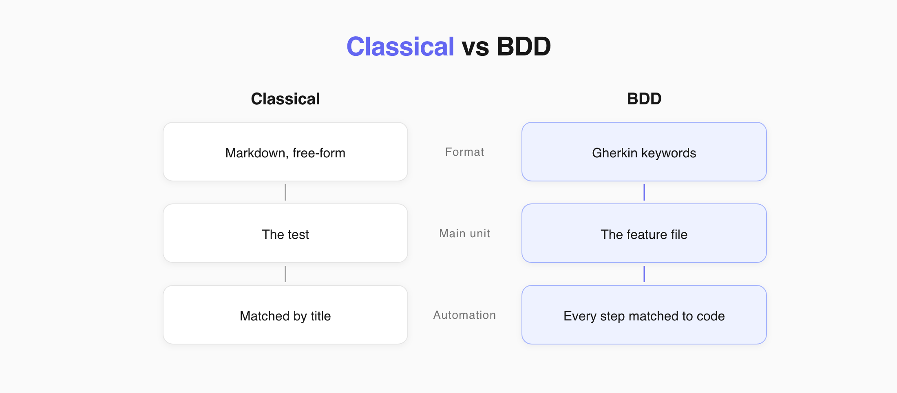
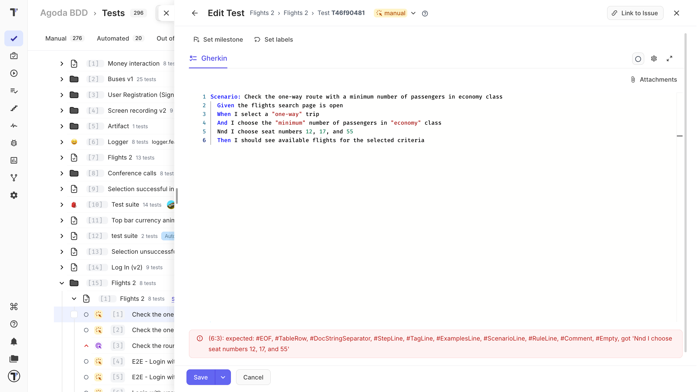
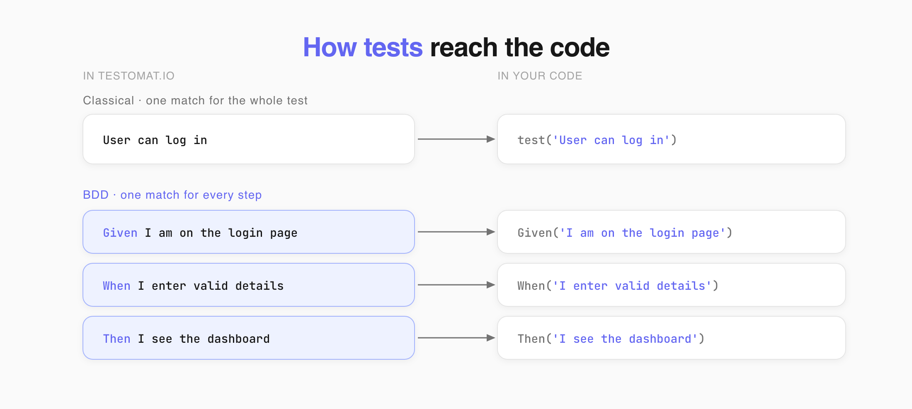

Testomat.io has two project types: Classical and BDD. Both hold manual and automated tests. They differ in how you write a test, where its data lives, and how it connects to code.

## Choose Your Project Type

| Classical if you | BDD if you |
| --- | --- |
| Write mostly manual tests | Write scenarios with business, dev, and QA together |
| Move from spreadsheets or another TMS | Use a Cucumber-based framework |
| Want to describe steps in your own words | Want every step backed by code |

You choose the type when you create the project, and it cannot be changed later.

## Main Differences

| | Classical | BDD |
| --- | --- | --- |
| **Test format** | Markdown | Gherkin |
| **Editor** | Block and Markdown | Gherkin only |
| **Syntax** | Free-form | Fixed - `Given`, `When`, `Then`, `And` |
| **The main unit** | The test | The feature file |
| **Tags and details live** | On the test | In the feature file |
| **Automation matches by** | Test title and file path | Every step, one by one |
| **Templates** | Yes | No |
| **Invalid test** | Cannot happen | Saves as a draft until you fix it |

## Writing a Test

Classical takes whatever you type. A step can be a sentence, a paragraph, or a table.

BDD reads Gherkin as you type. Misspell a keyword and the test will not save.

That is why BDD has **Save To Draft** and Classical does not. Free-form Markdown has nothing that can fail.

## Moving a Test

In Classical, a test carries its own data, so it moves or copies on its own.

In BDD, you are moving a part of a document. Check that the feature file it came from still makes sense.

## Connecting to Code

Classical matches a test to code by title. A step is free text, so it can describe an action no code performs.

BDD matches every line to a step definition. A line without one is a gap, not a description.

The payoff is reuse. Once `Given I am on the login page` has a definition, every scenario that needs a login reuses it.

**Write one action per line.** A step that bundles three actions needs its own definition and fits nowhere else.

## One Format per Project

You cannot add Gherkin tests to a Classical project. Some things can break:

| What breaks | Why |
| --- | --- |
| **Syntax** | A Markdown test in a Gherkin suite has no keywords. The feature file stops working in the editor and in your framework. |
| **Data** | One format keeps details on the test, the other in the file. The system cannot tell separate tests from one shared document. |
| **Automation** | Some tests would need a definition per line, others map to nothing on purpose. Half of the reports come out wrong. |

:::note

Moving a Classical project to BDD is a separate operation, not a setting. See [AI-Agents](https://docs.testomat.io/advanced/ai-powered-features/ai-agents).

:::

## Next Steps

- [Classical Test Case Editor](https://docs.testomat.io/project/tests/classical-test-case-editor)
- [BDD Test Case Editor](https://docs.testomat.io/project/tests/bdd-test-case-editor)
- [AI-Agents](https://docs.testomat.io/advanced/ai-powered-features/ai-agents)