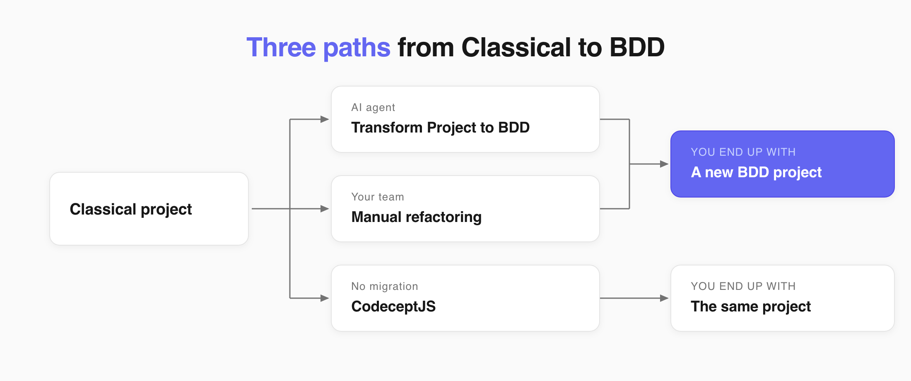
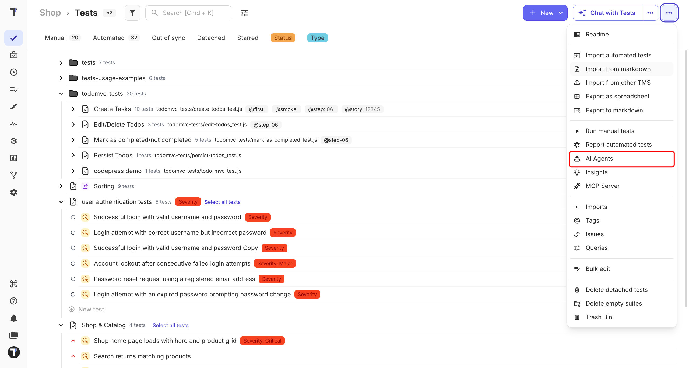
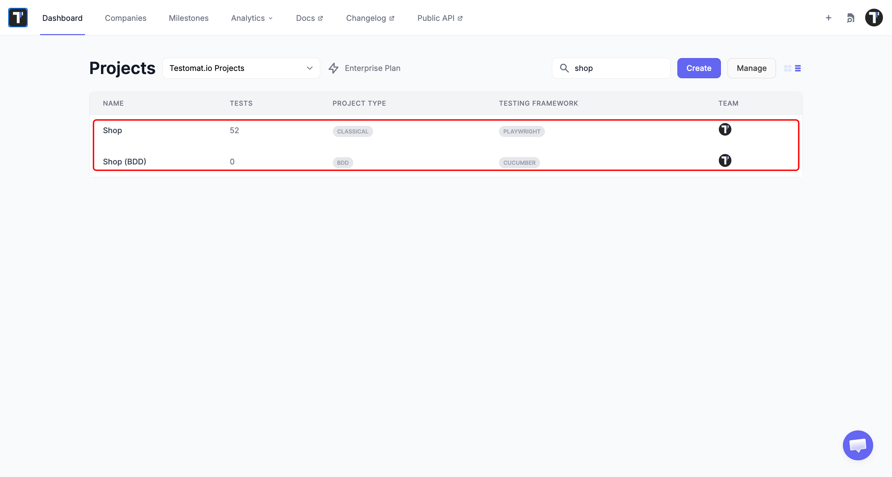
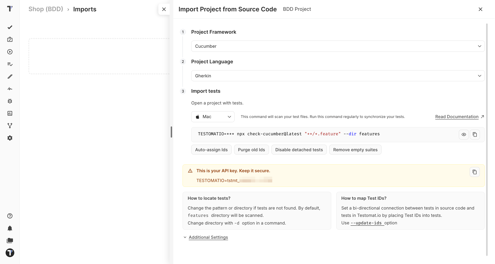

To use a Markdown test as a BDD test, rewrite it as a Gherkin scenario. Changing the project setting alone does not convert the test.



You have three paths. Two build a new BDD project. The third keeps you in Classical.

| Path | What you end up with | Best when |
| --- | --- | --- |
| **Transform Project to BDD** | A new BDD project, built from your existing tests | You want everything moved quickly and written in one style |
| **Manual refactoring** | A new BDD project, written by your team | The logic is tricky and a person has to make the calls |
| **CodeceptJS** | No new project - you stay Classical | You want tests the business can read, without taking on Gherkin |

## Transform Project to BDD

**Transform Project to BDD** is an AI agent that reads your Classical tests and builds a BDD project out of them.

- It rewrites your steps into valid `Given/When/Then` syntax.
- It creates a **new BDD project** with the converted suites.
- Your original Classical project stays as it is.

Nothing is overwritten, so you can review the result. To run it:

1. On the **Tests** page, open the `...` menu.
2. Choose **AI Agents**.
3. Select **Transform Project to BDD**.



The agent stays close to your original wording. A Classical step that did two things comes out as one line:

```gherkin
Scenario: Successful login with valid credentials
  Given the user is on the Testomat.io login page
  When the user enters a registered email and the correct password
  Then the user should be redirected to the Project Dashboard
```



This `When` line does two things at once, so no other scenario can reuse it.

:::note

Read more about the agents on the [AI-Agents](https://docs.testomat.io/advanced/ai-powered-features/ai-agents) page.

:::

## Manual Refactoring

Rewrite the tests yourself when a few of them carry logic only the author understands.

1. Create a new BDD project.
2. Rewrite each test so every step follows Gherkin rules.
3. Split any step that does more than one thing.
4. Match each new step to a step definition in your automation code.

Writing it yourself, you split that step:

```gherkin
Scenario: Successful login with valid credentials
  Given the user is on the Testomat.io login page
  When the user enters a registered email
  And the user enters the correct password
  Then the user should be redirected to the Project Dashboard
```

Every line here is a step definition other scenarios can call. To make the process faster you can:

- Split steps land in the [Steps Database](https://docs.testomat.io/project/steps-snippets/steps), so autocomplete offers them next time.
- If the Gherkin is not valid yet, **Save To Draft & View Test** keeps your work.

:::note

A BDD project cannot be moved back to Classical. The feature file history and its data would be lost.

:::

## CodeceptJS

If you just want your tests to be easy to read, you do not need to switch to BDD. CodeceptJS uses simple instructions that are easy for everyone on the team to follow. You can keep your current project without rewriting your tests or learning a new format.

The main difference is who the tests are written for. Gherkin scenarios are written in a way that both the team and the business can understand and review before the code is written. CodeceptJS is still code, just written in a way that is easier to read.

## Check the Converted Tests

Four things are worth checking after a conversion, whether the AI agent did the work or your team did.

**One action per step.** `Enter a registered email and the correct password` does two things at once, split it:

```gherkin
When the user enters a registered email
And the user enters the correct password
```

**The goal.** `Hit the blue 'Sign In' button at the bottom of the form` names the colour and the position. The next redesign makes both wrong. Redo:

```gherkin
When the user clicks the 'Sign In' button
```

**A clear starting point.** A Classical test often jumps straight in, assuming the user is already on the right page. BDD code has to know where the scenario begins, and scenarios that say so fail less often for the wrong reason.

```gherkin
Given the user is on the Testomat.io login page
```

**Valid syntax.** `Expected Result:` - in BDD the line has to carry a keyword and correct wording:

```gherkin
Then the user should be redirected to the Project Dashboard
```

## Connect to Code

A rewritten scenario is not finished until every step has a definition in your automation code. Import your feature files to make the connection.

1. On the **Tests** page, click **Import from other TMS**.
2. On the **Imports** page, click **Import**.
3. Select **Import from Source Code**.
4. Pick **Cucumber** as the framework.
5. Copy the command you are given.
6. Run it in your project folder:

```bash
TESTOMATIO={apiKey} npx check-cucumber@latest "**/*.feature" --dir features
```

7. Refresh the page. The imported feature files appear in the test tree.



:::note

The command needs **NodeJS 10+** with NPM. It looks in the `features` folder by default - change `--dir` if your feature files live somewhere else.

:::

See [Import Tests From Cucumber](https://docs.testomat.io/project/import-export/import/import-tests-from-cucumber) for the full guide.

## Next Steps

- [Classical vs BDD](https://docs.testomat.io/project/tests/classical-vs-bdd)
- [BDD Test Case Editor](https://docs.testomat.io/project/tests/bdd-test-case-editor#bdd-editor)
- [AI-Agents](https://docs.testomat.io/advanced/ai-powered-features/ai-agents)
