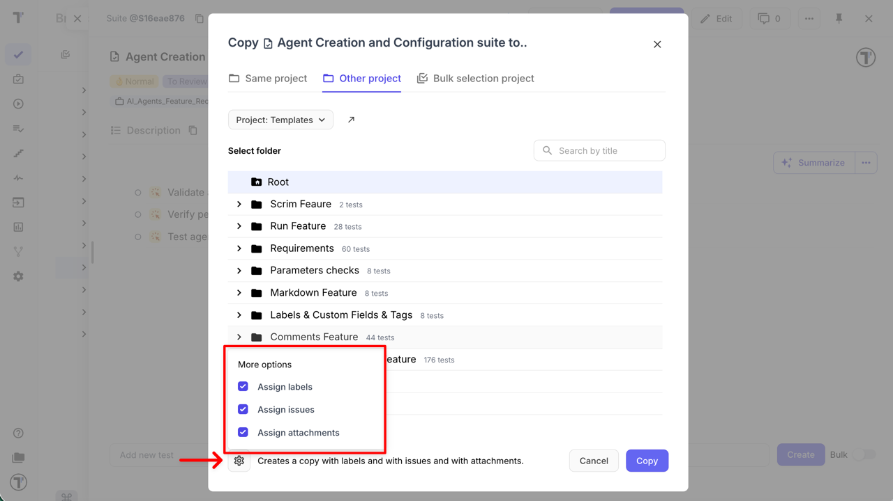

## How to Copy your Tests, Test Suites, and Folders

You can copy a single test from a test suite, an entire test suite, or even a folder containing a set of test suites. You can copy these items either within your current project or to a different project.

### Copying Tests or Test Suites Within Your Project

1. Go to the **Tests** section.
2. Select the item you want to copy (e.g., a test suite).
3. Open the drop-down menu by clicking the **three dots** next to the **Edit** button.
4. Click **Copy**.
5. Select the destination folder where you want to move your test suite.

### Copying Tests or Test Suites to Another Project

1. Go to the **Tests** section.
2. Select the item you want to copy (e.g., a test suite).
3. Open the drop-down menu by clicking the **three dots** next to the **Edit** button.
4. Click **Copy**.
5. In the pop-up menu, click **'Change project'**.
6. Select the specific project from the drop-down list.
7. Select the destination folder where you want to move your test suite.

### Advanced Copy Options

When copying tests, suites, or folders, you can include additional metadata. To do this, open the **Copy** modal and expand the **More options** section.

- **Assign labels** — copies all labels associated with tests, suites, or folders, including **custom labels**
- **Assign attachments** — copies all attached files to tests, suites, or folders
- **Assign issues** — copies linked issues

:::note

Linked issues are copied only if the destination project has an active integration with the **same Issue Management System and the same project/configuration**.

Otherwise, linked issues will be **skipped** and **not copied**.

:::

You can select **one**, **multiple**, or **all** options at the same time, depending on your needs. If no options are selected, the system creates a copy **without labels, issues, or attachments** by default.

These advanced options are available for **all copy modes**:

- **Same project**
- **Other project**
- **Bulk selection project** (for suites and folders)

:::note

**Bulk selection project** is not available when copying individual tests. Tests must belong to a suite, while bulk copying places items into the **project root**, which is not supported for tests.

:::

This flexibility allows you to either fully duplicate test assets with all related context or create a clean copy without additional metadata.

## Move Your Tests

You may need to move your tests within a project, for example to another suite. For this purpose, you can use **Move** or **Drag and Drop** functionality.

### Move menu action

1. Go to the Tests section.
2. Select the item you want to move (e.g. a test suite).
3. Open the drop-down menu by clicking the three dots next to the Edit button.
4. Click **Move**.

5. Select the destination folder where you want to move your tests.

### Drag and Drop option

1. Go to the Tests section.
2. Expand the folder or suite where you want to move your test(s).
3. Hover over the test, suite, or folder you want to move until the drag handle (⠿) appears.
4. Click and hold the drag handle, then drag the item to your desired location.
5. Position the item slightly below the item you want it to appear under. When space opens up, release to drop.

## How to restore deleted tests?

The **Trash Bin** feature is designed to enhance data recovery and user experience by allowing users to easily restore accidentally deleted suites or test cases. Revisions are stored for up to 90 days, ensuring that valuable testing data is not permanently lost and can be quickly recovered without the need for complex restoration processes.

You can also track changes to Suits and Test Cases, including deletions, on the [Pulse](https://docs.testomat.io/usage/pulse/) page.
