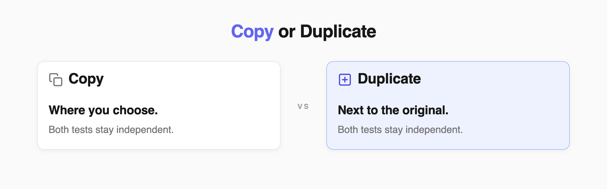
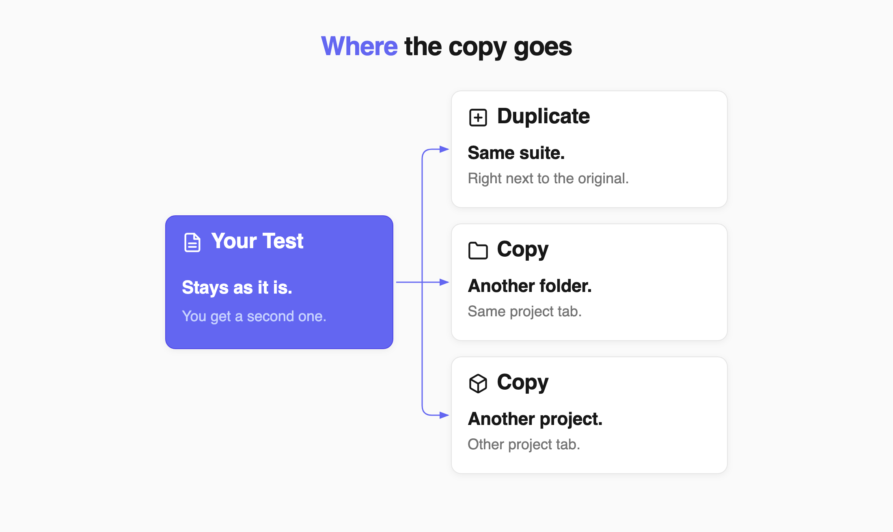
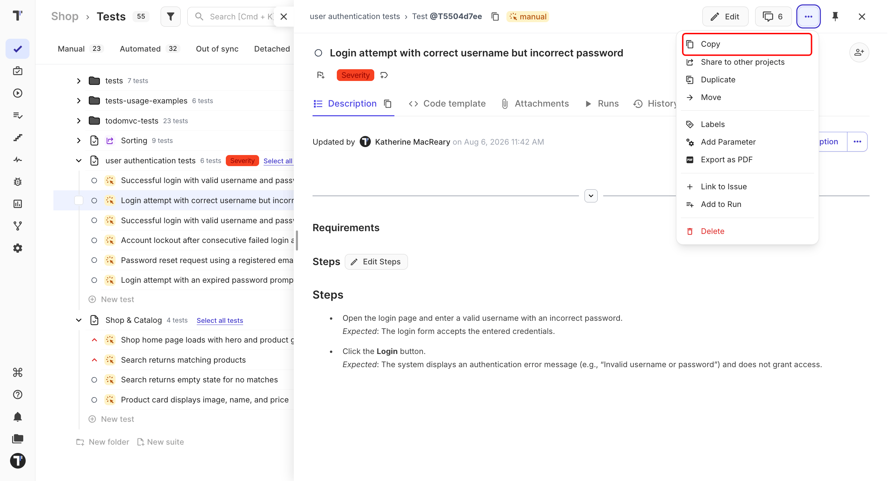
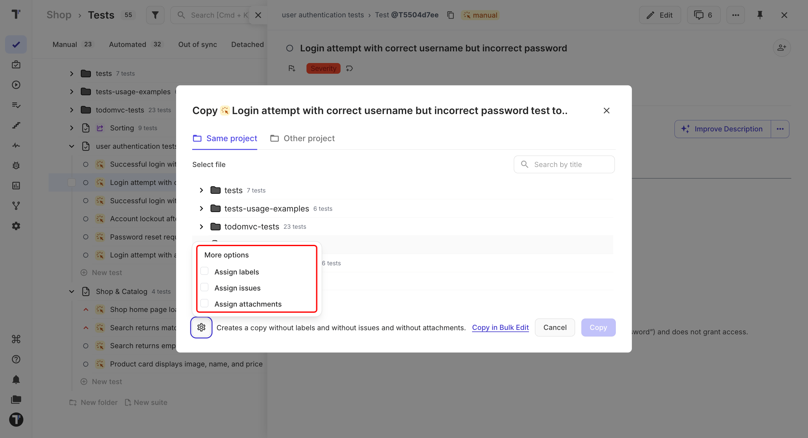
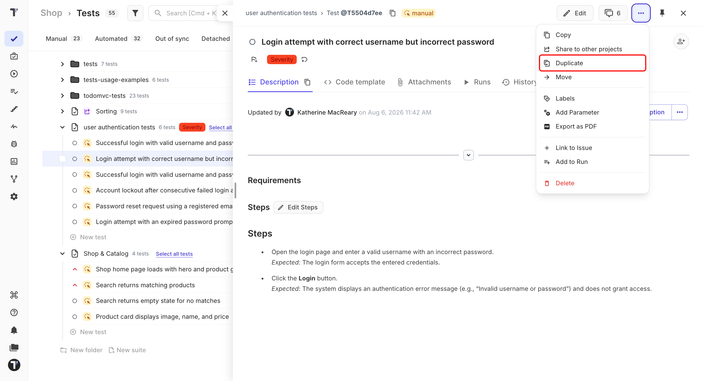

Copy tests, suites, and folders when you want to reuse existing test cases without changing the originals.

You can copy an item to another folder in the same project or to a different project. You can also duplicate a test directly in the same suite.

The new item is independent from the original. Changes you make to one do not affect the other.

## Copy or Duplicate

Choose the option that matches what you want to do:

| Feature | What it does |
| --- | --- |
| **Copy** | Creates a new test, suite, or folder in the location you choose. |
| **Duplicate** | Creates a new test in the same suite as the original. |
| **Move** | Moves the original item to another location. |
| **Share** | Makes the same test available in another project while keeping one original. |

Use **Share** instead of **Copy** when several projects need to use the same test and you want changes to the original to stay connected.

## Copy a Test, Suite, or Folder

A new test can land in the same suite, in another folder, or in another project. The original never moves.

All copy actions start from the same menu.

1. Go to the **Tests** page.
2. Open the test, suite, or folder you want to copy.
3. Click the **⋯** menu in the top-right corner.
4. Click **Copy**.

The **Copy** window opens with two tabs — **Same project** and **Other project**.

### Copy Within the Same Project

1. Stay on the **Same project** tab.
2. Select the destination folder. Use **Search by title** to find it faster.
3. Click **Copy**.

The copy appears in the selected folder. The original stays where it was.

### Copy to Another Project

1. Open the **Other project** tab.
2. Select the destination project.
3. Select the destination folder.
4. Click **Copy**.

:::note

Bulk copying is available for suites and folders. A single test cannot be copied through bulk selection because tests belong to suites.

:::

### Choose What to Copy

By default, Testomat.io copies the test content without its additional data. To include more:

1. In the **Copy** window, click the gear icon in the bottom-left corner.
2. Under **More options**, select what you want to include.
3. Click **Copy**.

| Option | What it copies |
| --- | --- |
| **Assign labels** | Labels and custom labels. |
| **Assign issues** | Issues linked to the tests, suites, or folders. |
| **Assign attachments** | Files attached to the tests, suites, or folders. |

You can select any combination of these options. The line next to the gear icon always describes the result, for example *Creates a copy without labels and without issues and without attachments*.

Leave the options empty when you are creating a clean starting point for a new feature. Include attachments and labels when you want to reuse the existing test setup.

To copy several items with the same options, click **Copy in Bulk Edit**.

Linked issues are copied only when the destination project uses an active integration with the same issue management system and the same project or configuration. Otherwise, the issues are skipped.

:::note

These options are available when copying within the same project, to another project, or through bulk selection.

:::

## Duplicate a Test

Use **Duplicate** when you need another version of a test in the same suite. The duplicate keeps the test content, steps, and parameters.

1. Open the test.
2. Click the **⋯** menu in the top-right corner.
3. Click **Duplicate**.
4. Select what you want to include — the same options as for copying.
5. Click **Duplicate**.

The new test appears in the same suite and gets a **Copy** badge. Rename it when you are ready.

:::note

Testomat.io remembers your duplicate settings and uses the same selections the next time you duplicate a test.

:::

## Next Steps

- [Suites and Folders](https://docs.testomat.io/project/tests/suites-and-folders)
- [Tags, Labels, and Assignees](https://docs.testomat.io/project/tests/tags-labels-and-assignees)
- [Bulk Edit](https://docs.testomat.io/advanced/bulk-edit-folder)
