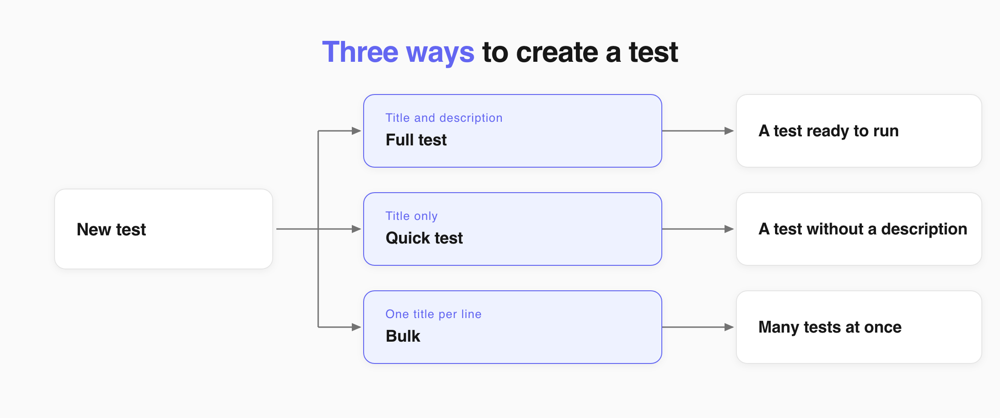
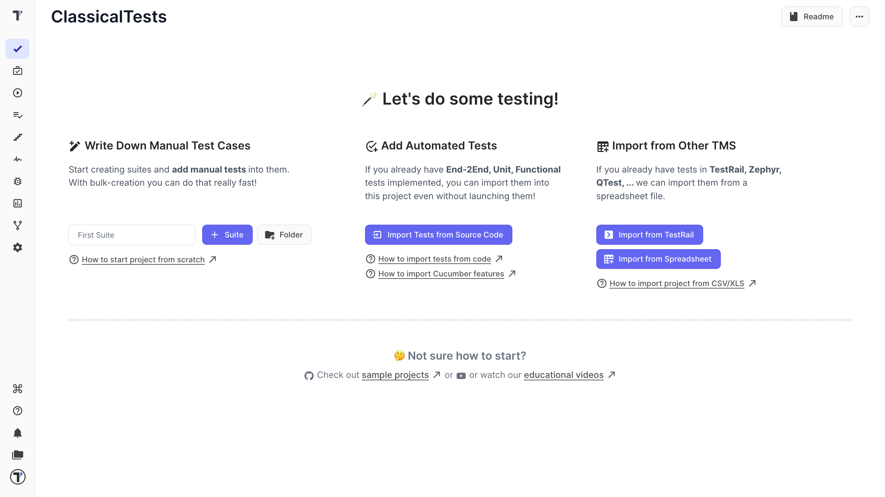
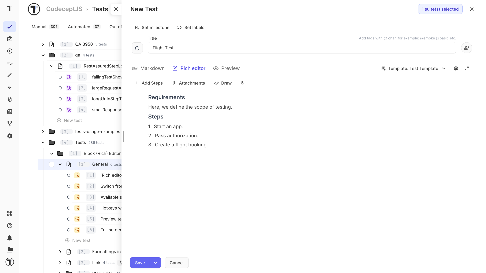
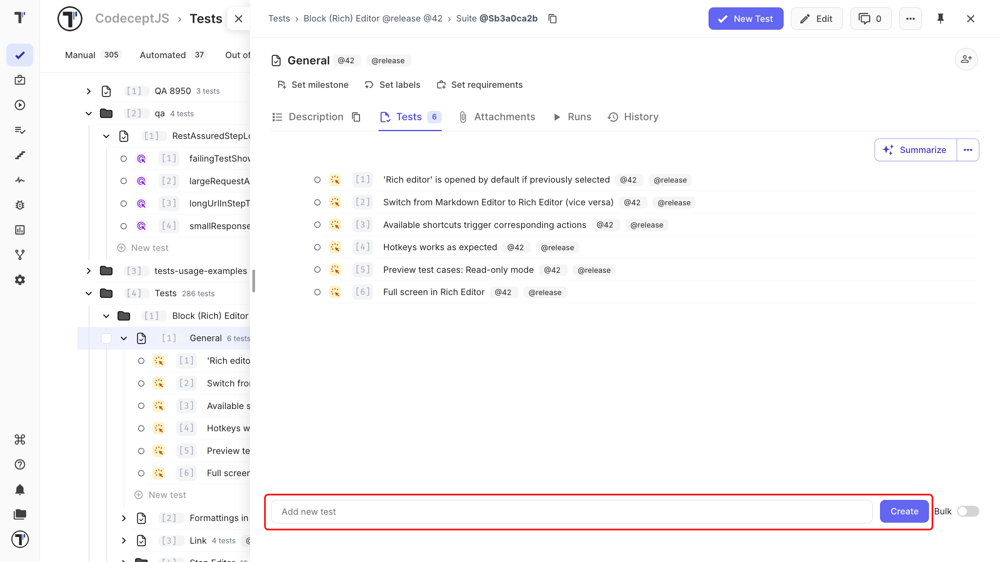
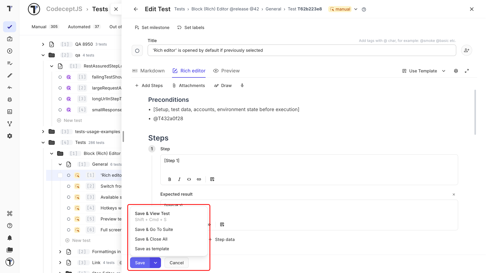

When you start a new project, choose **Create a new suite** to add tests manually. To add tests tou haw 3 possibilities:

- write the test and its description,
- create test with the title only,
- create several tests in a bulk.

You can also import automated tests from source code or a CSV file. See [Import tests](https://docs.testomat.io/project/import-export/import/import-tests-from-source-code).

## Add a New Test

1. Go to the **Tests** page.
2. Open a suite or create one.
3. Click **New Test**.
4. Enter the test title.
5. Add the preconditions, steps, and expected results.
6. Click **Save**.

The test appears in the tree in its suite. New tests are marked **manual**.

See [Steps Database](https://docs.testomat.io/project/steps-snippets/steps) for examples of how to structure the test.

## Quick Test Creation

Enter only the titles when you have ideas for tests and want to add them quickly to the list. You can add the description, steps, and other details later.

1. Open a suite.
2. Enter the test title.
3. Click **Create**.

Open test to add the details.

## Create Tests in a Bulk

1. Open a suite or create one.
2. Turn on the **Bulk** toggle.
3. Enter one test title per line.
4. Click **Create**.

Each written title in a line becomes a separate test in the suite. It is similar to the **Quick Test Creation** but a bit in other way. This is useful when you want to create the tests first and add description later.

You can also use [keyboard shortcuts](https://docs.testomat.io/usage/keyboard-shortcuts/) to create and edit tests and suites.

## Save a Test

All four save options save your changes. Choose one based on what you want to do next.

| Option | Result |
| --- | --- |
| **Save** | Saves the test and keeps it open. |
| **Save + View Test** | Saves the test and opens it in view mode. |
| **Save + Go To Suite** | Saves the test and returns to the suite. |
| **Save + Close All** | Saves the test and closes all open tests and suites. |

## Next Steps

- [Classical Test Case Editor](https://docs.testomat.io/project/tests/classical-test-case-editor)
- [Steps Database](https://docs.testomat.io/project/steps-snippets/steps)
- [Tags](https://docs.testomat.io/advanced/tags-labels/tags)
