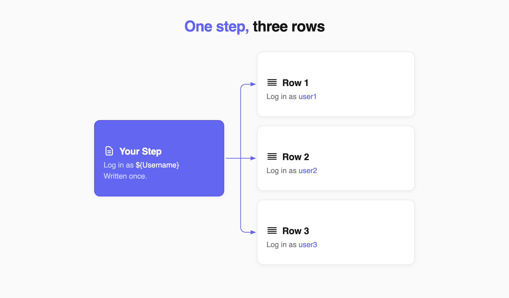
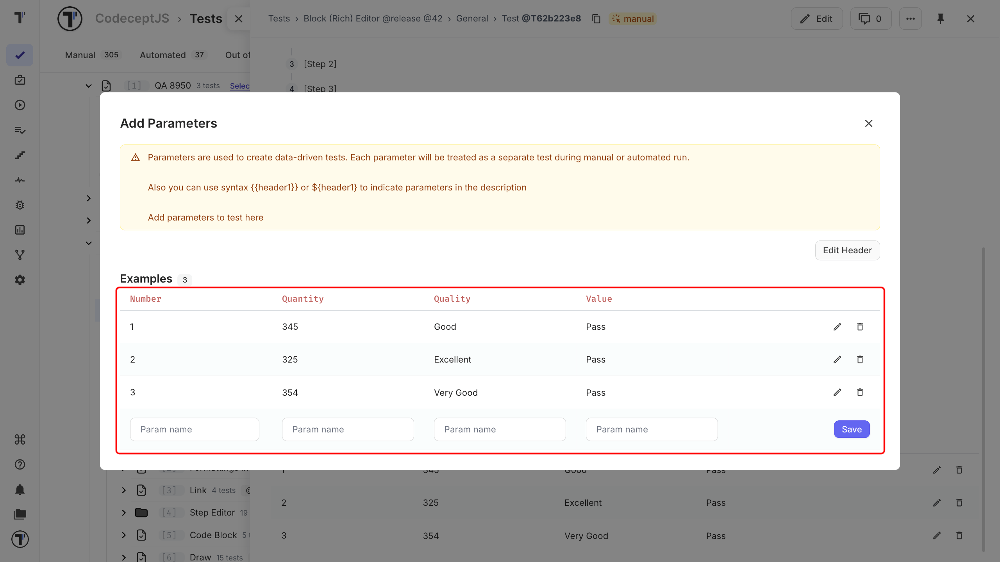
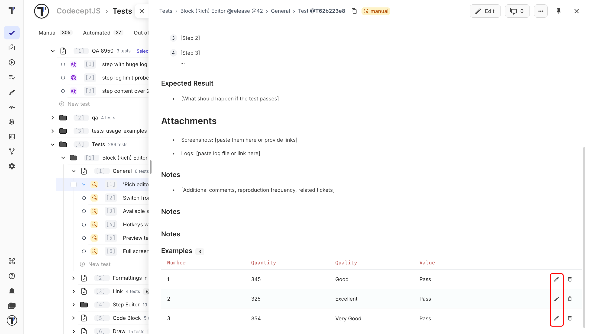

 
Use dynamic parameters to run the same test with different values. Add a **parameter table** to the test and use its headers in your test steps. Each row in the table becomes a separate test iteration. For example, one test can use several usernames:
 
| Username | Password |
| --- | --- |
| user1 | pass1 |
| user2 | pass2 |
| user3 | pass3 |
 
The test runs three times, using the values from each row.


 
Three pieces work together:
 
- A **parameter table** stores the values.
- A **parameter header** names each value.
- A **placeholder** in a test step tells Testomat.io where to use the value.

:::note

A placeholder must match its parameter header exactly. If it doesn't, Testomat.io shows `Undefined` in place of the value.

:::
 
## Add Parameters to a Test
 
1. Open **Tests** and select the test.
2. Click the **Extra button**.
3. Select **Add Parameter**.
4. Enter the name of the parameter.
5. Add a **Parameter header** for each value you need. You can also click **Add column**.
6. Click **Save**.
7. Enter the values for each row.
8. Click **Save**.


 
The parameter table appears in the test, with one row per set of test data.
 
## Edit Parameters
 
You can edit parameters from the test description or from the parameter menu.
 
### From the Test Description
 
1. Click **Edit** next to the parameter.
2. Change the parameter name.
3. Click **Save**.
4. Click **Edit Header**.
5. Change the header name.
6. Click **Save**.


 
:::note

When you rename a header, update every placeholder that uses the old name. A placeholder that no longer matches its header shows `Undefined` in the run.

:::
 
### From the Parameter Menu
 
1. Click the **Extra button**.
2. Select **Add Parameter**.
3. Edit the parameter name or header name.
4. Click **Save**.

## Delete a Parameter
 
1. Click the **Trash** icon next to the parameter.
2. Click **OK** to confirm.

You can also delete a parameter from the parameter menu: open **Add Parameter** and click the **Trash** icon.
 
:::note

Deleting a parameter removes its data from future test runs, so its iteration is no longer created.

:::
 
## Use Parameters in Test Steps
 
After adding the parameter table, connect its headers to your test steps with a placeholder.
 
1. Check the exact **Parameter header** name.
2. Open the test and click **Edit**.
3. Add the header name to a placeholder using either `${}` or `{{}}`.
4. Click **Save**.
 
For example:
 
```text
Enter an invalid Mobile Number ${Mobile No}
 
Open home page {{URL}}.
```
 
When the test runs, Testomat.io replaces each placeholder with the value from the current row.
 
Both placeholder formats work in steps and descriptions. In test titles, use `${}`.
 
| Where | `${ParameterName}` | `{{ParameterName}}` |
| --- | --- | --- |
| **Test title** | Works | Not supported |
| **Steps and description** | Works | Works |
 
Using `${}` everywhere keeps the syntax consistent.
 
## Next Steps
 
- [Test Steps and Expected Results](./test-steps-and-expected-results.md)
- [Edit Test Steps](./edit-test-steps.md)
- [Tags, Labels, and Assignees](./tags-labels-and-assignees.md)
 
