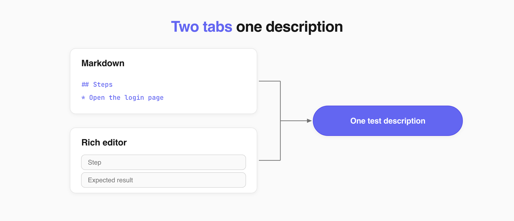
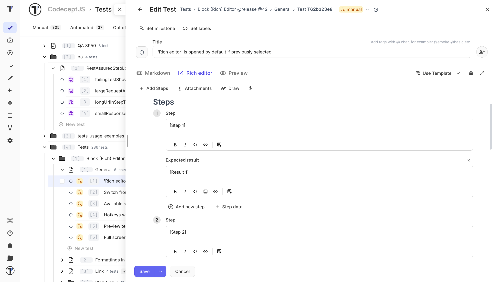
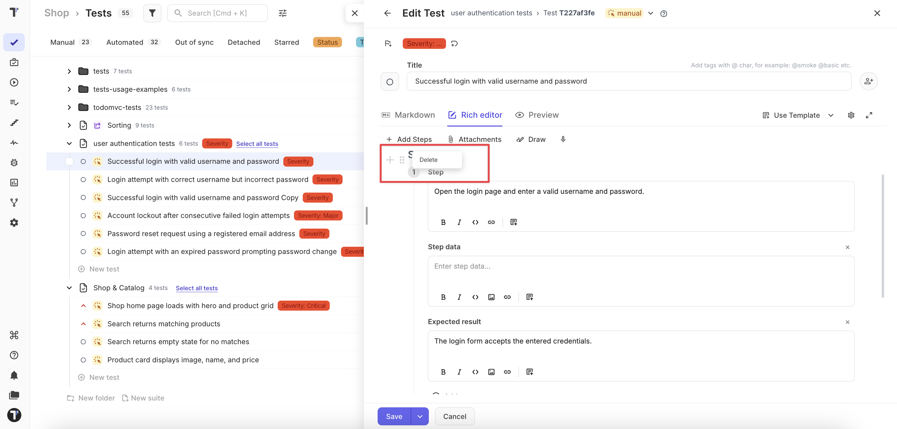

Open a test and click **Edit**. The editor gives you three tabs, and the one you pick decides how you work with the steps.

## Choose a Tab

| Tab | What you get |
| --- | --- |
| **Markdown** | The raw description. Full control over tables, headings, and images |
| **Rich editor** | Each step and its expected result in its own field. No Markdown to write |
| **Preview** | The finished test as a tester sees it |

Both tabs edit the same description, so you can switch between them at any time.

## Edit the Steps

1. On the **Tests** page, open a test.
2. Click **Edit**.
3. Open the **Rich editor** tab.
4. Change the text of any step or its expected result.
5. To add a step, click **Add new step**.
6. Click **Save**.

Your changes are saved to the test description and appear under **Steps** on the test page.

Each field has its own formatting buttons - bold, italic, code, and a link. The expected result also takes an image.

### Add Step Data

**Step data** is a note on the step. Use it for extra context the tester needs, such as the account to sign in with or the values to enter.

1. Click **Step data** under the step.
2. Enter the note.

The field takes formatting and images, like the others.

### Hide a Field

To hide the **Step data** or **Expected result** field, click the **×** next to its name.

### Delete a Step

1. Click the handle next to the step number.
2. Choose **Delete**.

## Reuse a Step

**Add Steps** in the toolbar is different from **Add new step**. It offers the steps already in your project, so you pick one instead of typing it again. See [Steps Database](https://docs.testomat.io/project/steps-snippets/steps).

## If This Doesn't Work

- **No steps in the Rich editor.** The test has no `## Steps` section yet. Add one in the **Markdown** tab — see [Test Steps and Expected Results](https://docs.testomat.io/project/tests/test-steps-and-expected-results).
- **The formatting changed after saving.** The Rich editor rewrites steps in its own format. If the test used a table, subheadings, or a separate `## Expected Results` section, edit it in the **Markdown** tab instead.

## Next Steps

- [Test Steps and Expected Results](https://docs.testomat.io/project/tests/test-steps-and-expected-results)
- [Create a Test](https://docs.testomat.io/project/tests/create-a-test)
- [Classical Test Case Editor](https://docs.testomat.io/project/tests/classical-test-case-editor)
