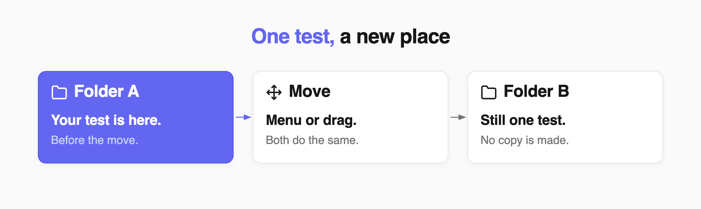
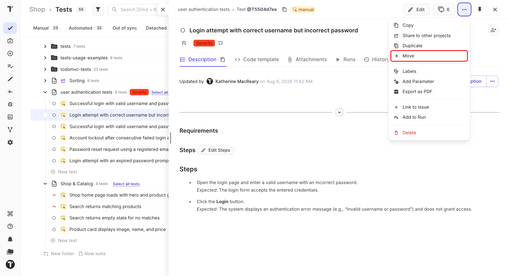
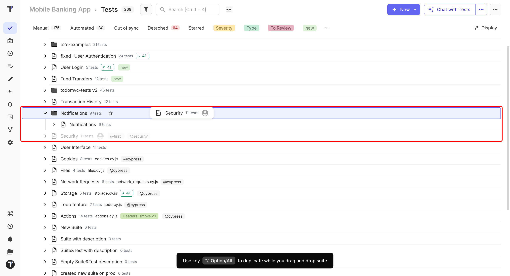

 
Move a test, suite, or folder when you want to change its place in the project tree.
 
Moving does not create a copy. The same item simply appears in its new location.

 
You can move items using the **Move** menu or by dragging and dropping them.
 
:::note

Moving works within the same project. To use a test in another project, copy or share it instead.

:::
 
## Ways to Move an Item
 
### Use the Move Menu
 
Use the menu when you already know where you want to place the item.
 
1. Go to the **Tests** page.
2. Select the test, suite, or folder you want to move.
3. Click the (`...`) menu in the top-right corner.
4. Click **Move**.
5. Select the destination folder and click **Move** again.

 
### Drag and Drop
 
Use drag and drop when you want to place an item directly in the project tree.
 
1. Go to the **Tests** page.
2. Open the folder or suite where you want to move the item.
3. Hover over the test, suite, or folder until the drag handle appears.
4. Drag the item to its new location.
5. Drop it when the destination is highlighted.

## Move Several Items
 
1. Select the items you want to move.
2. Drag one of the selected items.
3. Drop the selection in the new location.

All selected items move together and keep their order.
 
## Copy While Dragging
 
If you want to create a copy instead of moving the original, hold **Alt** on Windows or **Option** on Mac while dropping the item. This creates a copy inside the current project.
 
:::note

Dragging with **Alt**/**Option** copies the items without giving you options for labels, attachments, or issues. To choose what to copy, see [Copying Tests and Suites](https://docs.testomat.io/project/tests/copying-tests-and-suites).

:::
 
## Next Steps
 
- [Copying Tests and Suites](https://docs.testomat.io/project/tests/copying-tests-and-suites)
- [Suites and Folders](https://docs.testomat.io/project/tests/suites-and-folders)
 
