## Multiselection for Tests

The **'Multiselection'** feature on the **Tests** page allows users to perform bulk actions on multiple tests, entire test suites, or folders.

### To enable Multiselection:

1. Click the **'Multiselection'** button located at the top left corner of the **Tests** page.

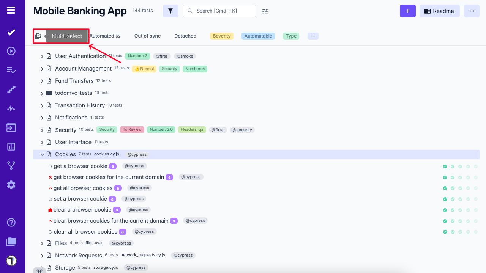

2. Select the desired tests, test suites, or folders.
3. Once selected, the **'Multiselection options'** toolbar will appear at the bottom of the page.

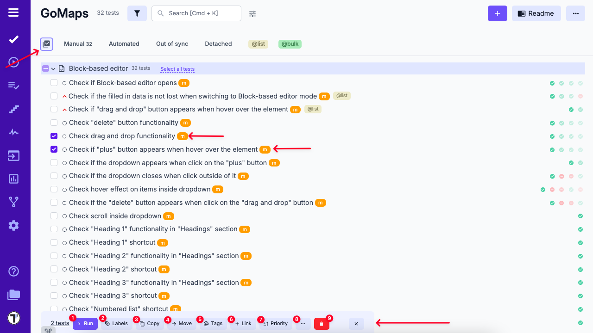

---

### Available Multiselection Actions:

1. **Run** – Launches a test run containing the selected items.
2. **Labels** – Add or remove labels or custom fields for the selected tests.  
   [Learn more about labels →](https://docs.testomat.io/advanced/tags-labels/labels-and-custom-fields)
3. **Copy** – Copy selected tests within the current project or to another project.
4. **Move** – Move tests to another test suite or folder within the same project.
5. **Tags** – Assign existing tags or create new ones for the selected tests.  
   [More on using tags →](https://docs.testomat.io/advanced/tags-labels/tags/)
6. **+ Link** – Open a pop-up to link a related defect to the selected tests.
7. **Priority** – Set priority levels for the selected tests.
8. **More options (⋯)** – Contains additional action **'Download'** – Export selected tests to a spreadsheet.
9. **Delete** – Permanently remove the selected tests.

## URL/ID Quick Copy

Depending on your needs, you can set up a convenient way to copy **URL/IDs** in **Test Cases**, **Suites** and **Runs**.

To start, you need to open a **Test Case** (**Suite** or **Run**):

1. Click the copy icon to open the modal window.
2. In the window that opens, you can copy the format you are interested in.
3. Turn on the toggle next to a format if you need to use it frequently.
4. Now, every time you click on the ID, the selected format will be copied to clipboard without any further actions.

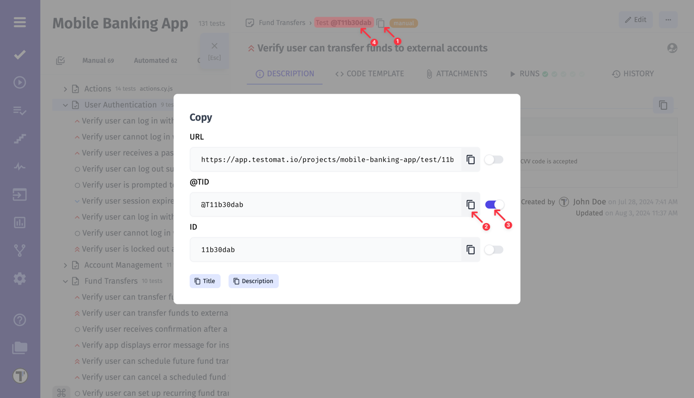

## Display Settings

The **Display** menu at the top of the **Tests** page lets you control how the test structure and side view are presented. Settings are applied instantly and persist across sessions.

The following options are available:

- **Hide tests in tree**
- **Pin sidebar**

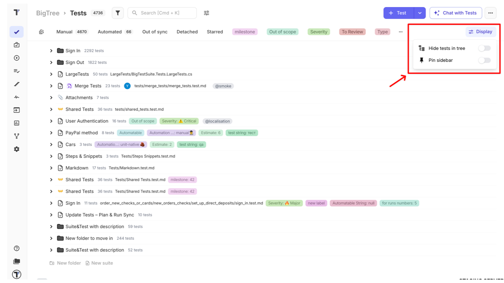

### Hide Tests in Tree

**Hide tests in tree** shows only folders and suites in the main tree, hiding individual test entries from the list.

This is useful in large projects where the tree becomes difficult to navigate due to the number of tests. Hiding them keeps the structure clean and makes it easier to find the suite or folder you need without scrolling through hundreds of test entries.

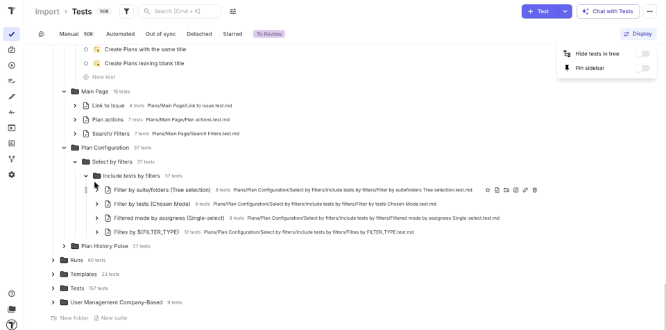

### Pin Sidebar

**Pin sidebar** keeps both the test tree and test or suite details visible at the same time — giving you access to filters, search, and actions while reviewing tests and suites, so you can navigate without losing context and stay focused during QA activities.

You can enable it in two ways:

- Click the **Pin icon** in the top-right corner of the test or suite detail panel
- Open the **Display** menu at the top of the Tests page and toggle **Pin sidebar**

| State                  | Behavior                                                                                                                                         |
| ---------------------- | ------------------------------------------------------------------------------------------------------------------------------------------------ |
| **Unpinned** (default) | The sidebar opens over the Tests page. Some toolbar actions may not be accessible.                                                               |
| **Pinned**             | The sidebar is fixed alongside the test tree. The full **Tests** page toolbar — filters, search, Display menu, and actions — remains accessible. |

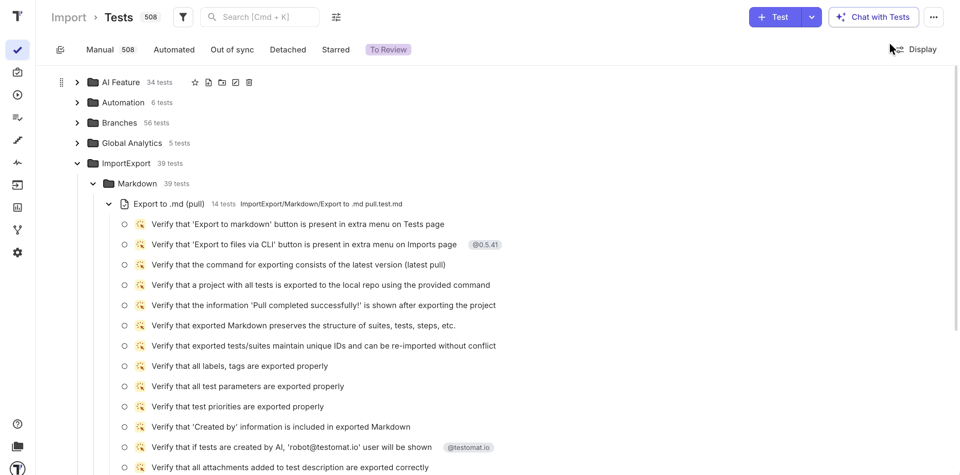

Use **Pin Sidebar** when navigating multiple tests in sequence, or during QA audits. It keeps the test tree, filters, search, and actions accessible while reviewing test details, providing:

- Faster navigation between tests and suites
- Continuous focus during QA activities
- Less UI friction throughout your workflow

### Preview Tests in Branches

You can review tests created inside a branch without switching to that branch. Branch preview allows you to:

* See newly created tests
* Review changes before switching branches
* Compare work between branches
* Reduce unnecessary branch switching

This helps teams review changes faster and improves collaboration during feature development.

## Suites and Folders

Unlike other test management systems, **Testomat.io doesn't allow suite to include other suites and tests**. That's why you can either create a suite (a collection of tests) or folder (collection of suites).

:::note
When creating a suite you have to explicitly set its type: a suite or a folder.
:::

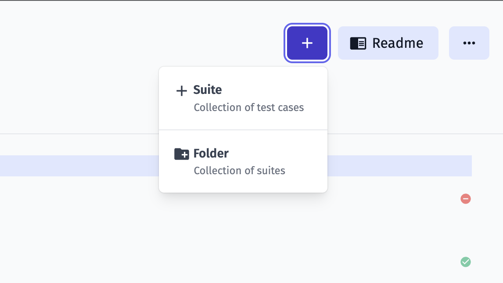

This was designed so tests structure could match the filesystem. For instance, if you use BDD project, feature file can contain scenarios, but can't contain other feature files. The same for automated tests, a file can contain tests but can't contain other files.

It's assumed that in any moment a manual test can be automated, so it is important to keep the filesystem structure in a project.

An empty suite can be converted to folder or vice versa

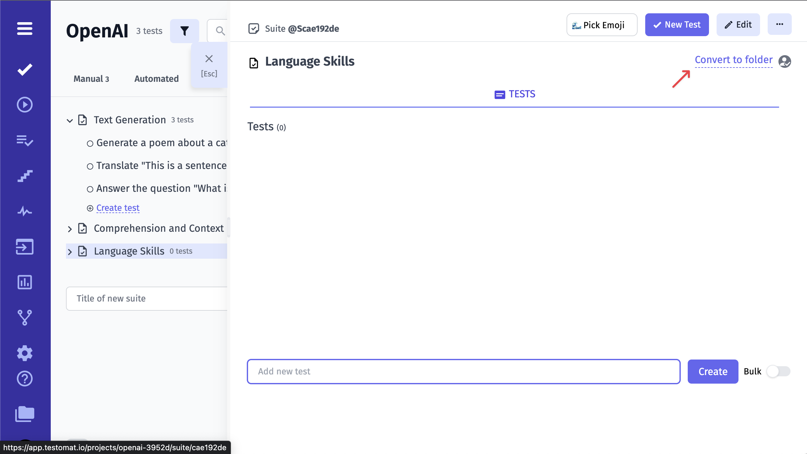

Also you can set an emoji icon for the suite

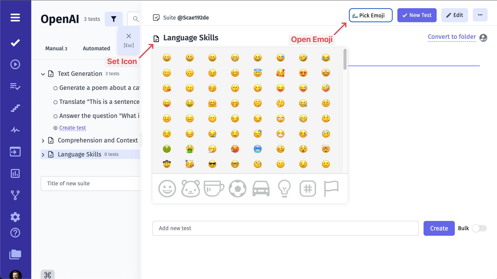

If your test is deeply nested within suites and folders, you can use breadcrumbs with tooltips to navigate the project structure more effectively.

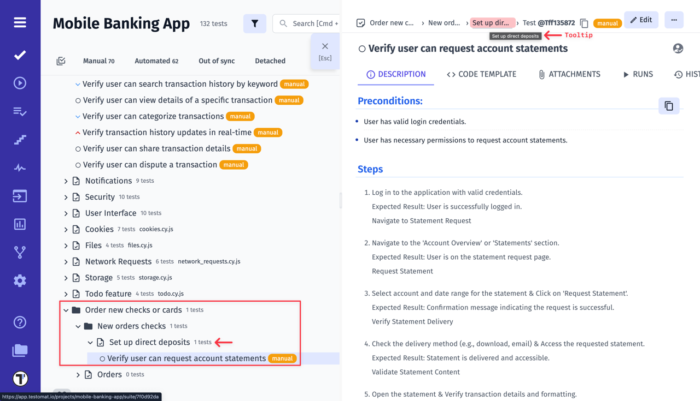

### Mark Folders & Suites as Favourites

Working with large projects often means navigating through a long test tree or running the same search queries over and over again. To make your workflow smoother, we’ve introduced the **'Starred'** feature for test suites and folders.

**Now you can:**

- ⭐ **Star any suite/folder** you plan to work on — whether it’s for the current sprint, a specific release, or ongoing maintenance.
- 📂 **Create your own quick-access list** of suites to eliminate repetitive navigation through the entire test tree.
- 🔍 **Mark favourites directly from search results** — if you’re looking for a test or suite/folders by keyword or using filters you can instantly star it without leaving the search view.
- ⏱ **Quickly return to starred suites/folders** even after filters or selections are reset — simply use the **'Starred'** filter to jump back.
- 🛠 **Work more efficiently** by keeping frequently accessed suites/folders at your fingertips, especially in large or multi-team projects.

Whether you’re focusing on smoke tests, regression packs, or a specific customer scenario, the **'Starred'** feature ensures you spend less time navigating and more time testing.

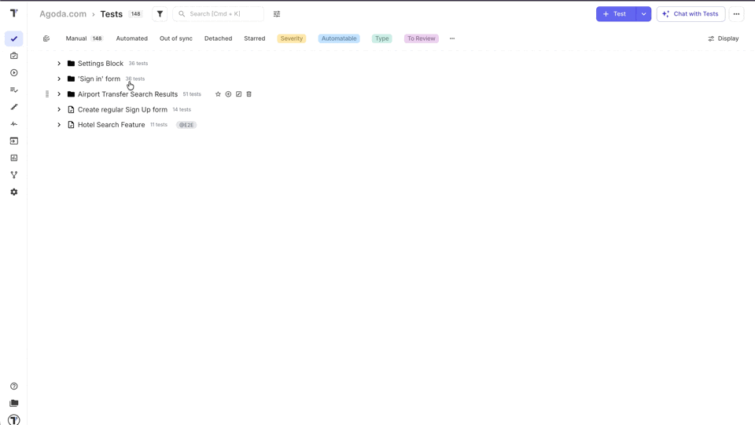

:::note

To remove all suites/folders from Favourites with one click: Use the **'Starred'** filter -> click '**Crossed star'** button -> confirm action.

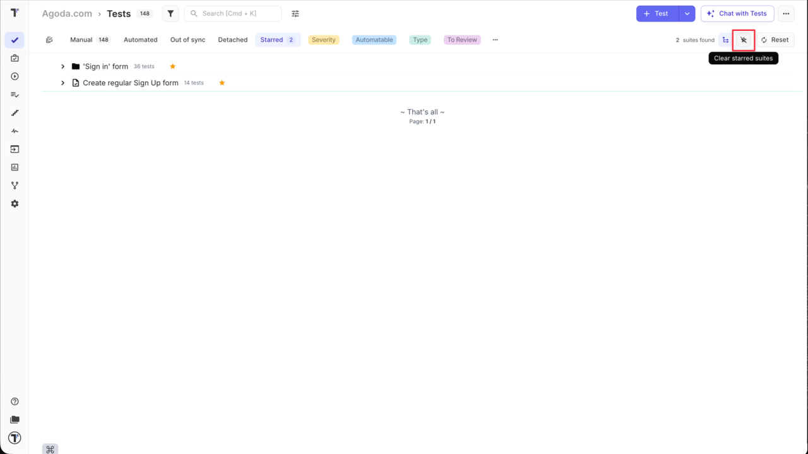
:::

### Convert Suite to Folder

When working on test design, it is common to start writing tests inside a single suite and later realize that the suite should become a higher-level section containing multiple suites.

Previously, restructuring required creating new folders and manually moving tests. To simplify this workflow, Testomat.io allows converting an existing suite into a folder — even if the suite already contains tests.

When converting:

- a **new folder with the same name** is created
- the **original suite is placed inside this folder**
- all existing tests remain unchanged

This allows you to reorganize test structure without recreating suites or losing test history.

#### How to Convert a Suite to a Folder

1. Navigate to the **Tests** page
2. Open the suite you want to restructure
3. Click the **Extra menu (⋯)**
4. Select **Convert to folder**
5. Confirm the action in the popup

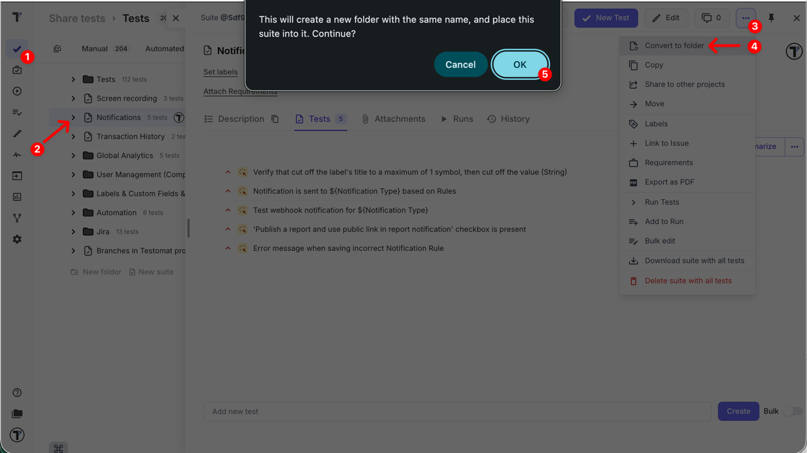

Before conversion:

```
Notifications (Suite)
|-- Test 1
|-- Test 2
```

After conversion:

```
Notifications (Folder)
└── Notifications (Suite)
    ├── Test 1
    └── Test 2
```

You can now create additional suites inside the folder and reorganize tests as needed.

#### Why This Is Useful

Test structures rarely stay perfect from the start. As your project grows, suites can become too large or cover multiple sub-features.

Converting a suite to a folder allows QA engineers to:

- **Reorganize tests on the fly** without stopping test creation
- **Split large suites into smaller, logical sub-suites** inside the new folder
- **Preserve all tests and history** — no need to recreate suites or move tests manually
- **Optionally rename** the folder or the inner suite to reflect its new role, keeping the hierarchy clear

This makes the test tree easier to navigate and maintain, ensuring a **scalable and readable structure** as the project grows.

## Export Suite as PDF

You can now download any suite as a **PDF file**. This feature is designed to help teams share test results, documentation, or audit trails with stakeholders who may not have access to the platform itself.

**Using this feature is simple:**

1. Go to the **Tests** page.
2. Open the desired suite.
3. Click **'Extra menu'** button.
4. Select **'Export as PDF'** option from the dropdown menu.


The export captures the entire test suite, including all individual test cases, their IDs, types, steps, expected results and screenshots.


This makes it convenient to share test content outside of Testomat.io, whether for reviews, documentation, or reporting purposes.

## Sharing Tests, Suites, and Folders

The **Share** feature is designed to keep test logic and structure consistent across multiple projects while keeping execution results independent.

**Key principles:**

- Shared items have **a single source project** controlling content and updates
- Shared items are **read-only** in target projects; editing is only possible in the source project or after unlinking
- Target projects maintain local execution context: runs, logs, statuses, results
- Items can be re-shared to additional projects without creating duplicates
- Only projects of the same type can share items (e.g., BDD → BDD, Classic → Classic)

:::note

The **Share** feature is a **paid feature**, included in Professional, Enterprise, and Trial plans.

:::

You can share the following entities between projects:

- Test
- Suite
- Folder

:::note

Folders act as containers for shared content. The folder itself is not marked as shared, but its nested items are.

:::

### Project Sharing Settings

Control which users can share tests and suites:

- **On:** All users can share tests and suites with other projects.
- **Off (default):** Only Owners and Managers can share.

To change the default settings:

1. Navigate to the **Settings** in the sidebar
2. Select the **Project**
3. Toggle **On** to allow access

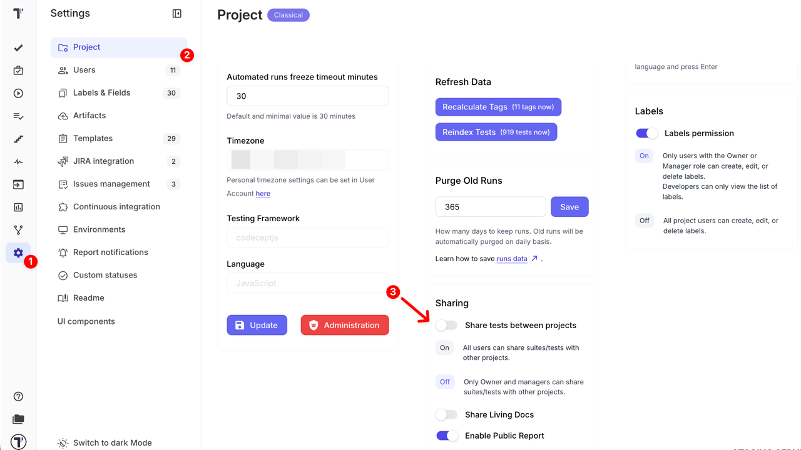

These settings apply to both initially shared and re-shared items.

:::note

Only **Owners and Managers** can enable or disable the sharing toggle.

:::

### How Sharing Works

When a test, suite, or folder is shared, specific data from the source project is propagated to all target projects, while other information remains local.

| Data                   | Shared Behavior                                                                         |
| ---------------------- | --------------------------------------------------------------------------------------- |
| Title & Description    | Shared; cannot be changed in target projects                                            |
| Attachments            | Shared; cannot be changed or new ones added in target projects                          |
| Labels & custom labels | Shared; additional labels can be added locally in target projects                       |
| Tags                   | Shared; cannot be changed in target projects                                            |
| Priority               | Shared; cannot be changed in target projects                                            |
| Linked issues          | Shared (if integration is enabled)                                                      |
| Assignee               | Shared (if the user exists in the target project); cannot be changed in target projects |
| Test author            | Shared (if the user exists in the target project)                                       |
| Runs                   | Not Shared; each project reports its own results                                        |
| History                | Not Shared; always project-specific                                                     |
| Requirements           | Not Shared; always project-specific                                                     |
| Comments               | Not Shared; always project-specific                                                     |

### Synchronization behavior

When an item is first shared, all data marked as **Shared** in the table above is propagated to target projects. After sharing is established, only a limited set of fields continues to synchronize when changes are made in the source project.

- New tests added to a shared suite in the source project automatically appear in all linked projects
- Updates to **Title**, **Description**, and **Tags** are synchronized from the source project after sharing
- Other shared fields are **not** synchronized after the initial share

### Permissions and Restrictions

- Shared items are **read-only** in target projects
- Editing is allowed **only in the source project**
- Editing becomes available **only after unlinking** the shared item
- AI actions are disabled for for shared items
- Execution is allowed in all projects
- Execution results remain local to each project

### How to Share a Single Item

1. Navigate to the **Tests** page
2. Open a test, suite, or folder in the source project
3. Click the **More options** button
4. Select **Share to other projects**

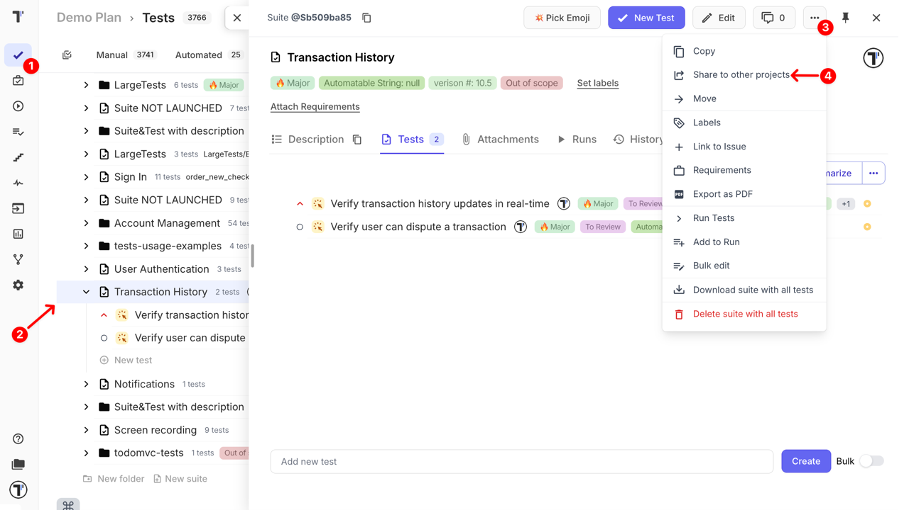

5. Open the **Bulk selection project** tab to share with multiple projects, or stay on **Other project** to share with a single project
6. Choose target project(s)
7. Click the **Share** button

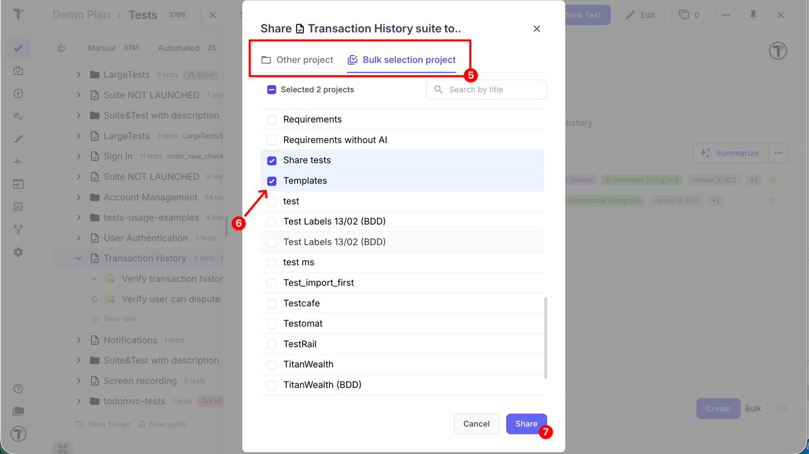

- Icons and tooltips indicating shared projects appear
- The selected items will appear in the chosen projects as shared and read-only
- Suites and folders shared in bulk are placed in the **Root** by default
- Sharing tests allow only for a single project

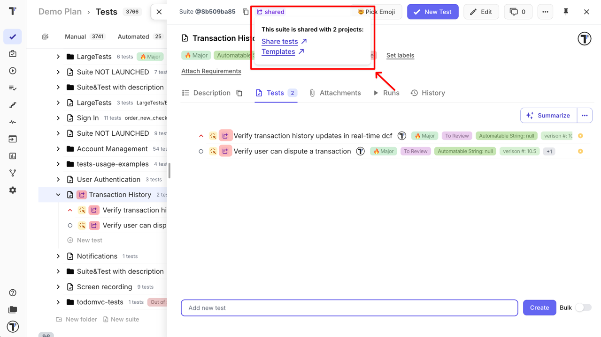

### How to Share in Bulk

Bulk sharing is available when multi-select mode is enabled.

1. Navigate to the **Tests** page
2. Enable **Multi-select** mode
3. Select multiple tests, suites, or folders
4. Click **Share** button at the toolbar
5. Choose a target project(s)
6. Select the destination
7. Click the **Share** button

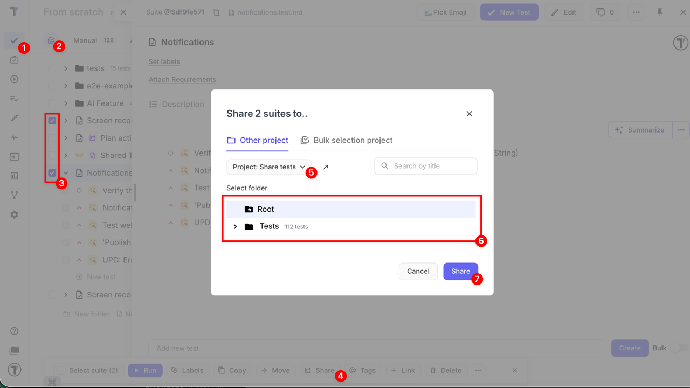

All selected items will be shared at once and follow the same shared rules.

### How to Re-share Shared Items

Tests and suites that were already shared to a project can be shared again to other projects.

When an item is re-shared:

- Original source remains the same (**Single Source of Truth**)
- Editing is still allowed only in the original source project
- For both initially shared and re-shared items, the same indicator shows the original source project

Learn more about the [sharing process here](https://docs.testomat.io/project/tests/other-features-for-test-case-design/#how-to-share-a-single-item).

### How Execution History Works for Shared Tests

Shared tests remain linked to the source project, but execution context is always project-specific.

- Running a shared test or suite in a target project creates a local run
- Logs, statuses, and results are tracked only in that project

This ensures teams can reuse test logic while keeping execution data isolated and meaningful for each project, while still reflecting updates to the source test where relevant.

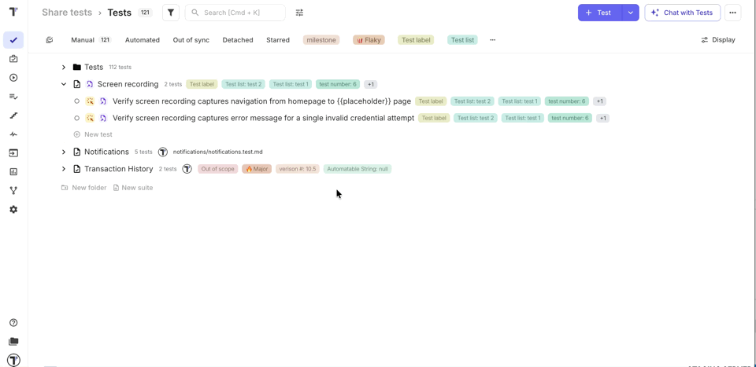

:::note

If a test run is in progress, and the source test is updated (e.g., its description is changed), the update is applied across all linked projects.

:::

### Unlinking Shared Items

Unlinking breaks the connection to the source project, making the item fully editable in the target project.

1. Open the shared test, suite, or folder in the target project
2. Click the **More options** button
3. Select **Unlink share** button

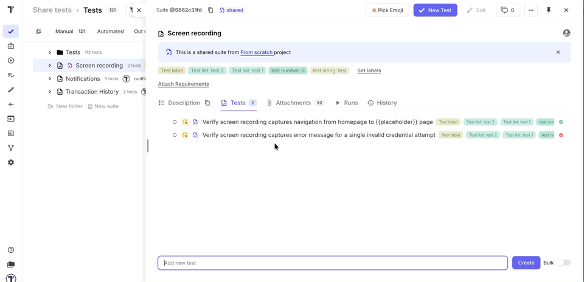

After unlinking:

- it is no longer updated from the source project
- the Single Source of Truth relationship is removed
- the item behaves as a local project entity and can be modified freely
- a log entry appears in the **History**, indicating that the item was unlinked from the shared source

Use unlinking only when a test or suite must diverge from its source version.

### Best Practices

- Treat the source project as a **Single Source of Truth**.
- Use shared tests for stable, reusable flows (smoke, regression, core scenarios).
- Unlink shared items only when necessary.
