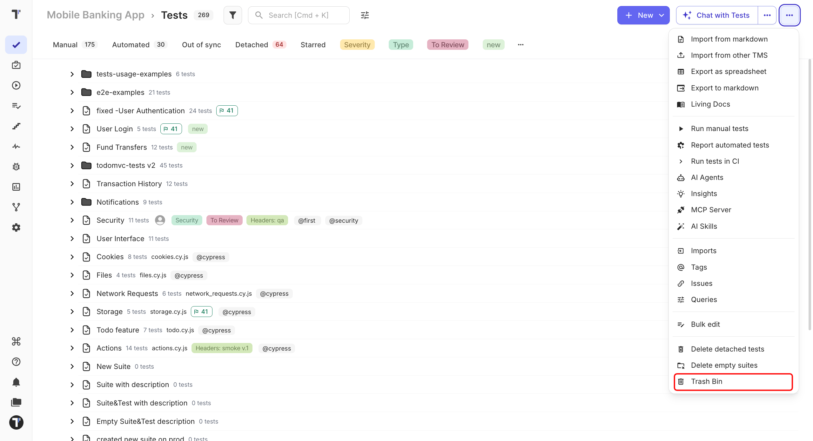
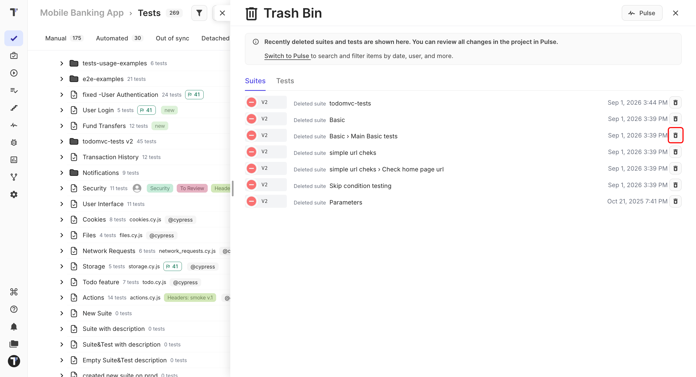

 
Deleted tests and suites are kept in the **Trash Bin** for 90 days. If you delete something by mistake, you can restore it without creating the test again.
 
## Restore a Test or Suite
 
1. Go to the **Tests** page.
2. Open the **Trash Bin** from the (`...`) menu.

In the trashbin window:

1. Find the deleted test or suite.
2. Click **Restore**.

 
The item returns to the test tree in the same place it was before deletion.
 
:::note

Tests and suites are kept for 90 days. After that, they are permanently removed.

:::
 
## Find Out What Was Deleted
 
If you are not sure what happened to a test or suite, check **Pulse** first. It shows project activity, including deletions, so you can see what was changed and when. See [Pulse](https://docs.testomat.io/project/pulse).
 
## Deleted Attachments
 
Attachments have a separate retention period and are restored from the **Attachments** tab, not the **Trash Bin**.
 
| Item | Kept for | Restore from |
| --- | --- | --- |
| Tests and suites | 90 days | **Trash Bin** |
| Attachments | 30 days | **Attachments** tab |
 
## Next Steps
 
- [Move Tests](https://docs.testomat.io/project/tests/move-tests)
- [Test Attachments](https://docs.testomat.io/project/tests/test-attachments)
 
