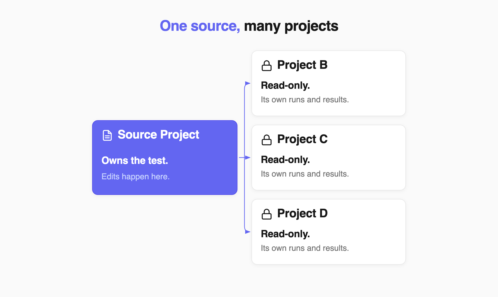
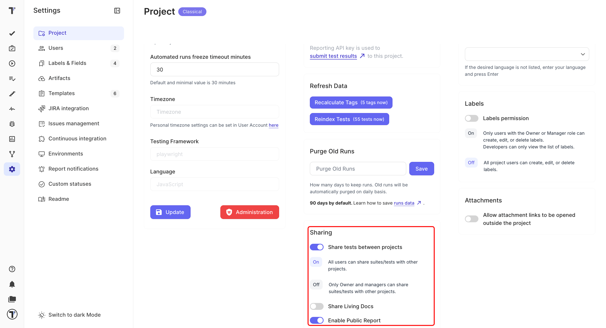
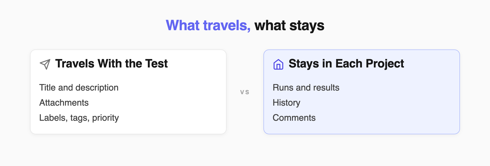
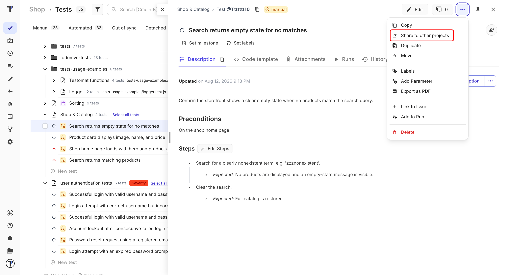
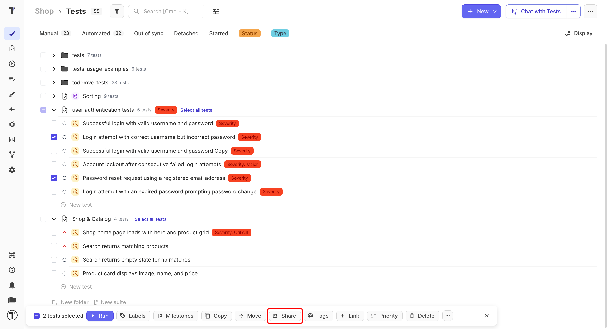

 
Share a test, suite, or folder when you want to use the same test in several projects without creating separate copies.
 
One project remains the source of the shared test. Other projects use it as read-only content, while each project keeps its own test runs and results.

 
Use **Share** when the test should stay the same across projects. Use [Copying Tests and Suites](https://docs.testomat.io/project/tests/copying-tests-and-suites) when each project needs its own version.
 
:::note

Folders are used to organize shared content. The folder itself is not shared, but the tests and suites inside it can be.

:::
 
## Sharing Rules
 
A shared test follows a few simple rules:
 
- The source project owns the test content.
- The test is read-only in other projects.
- Each project keeps its own runs, results, and history.
- You can share the same test with multiple projects.
- Projects must use the same test type: BDD with BDD or Classical with Classical.

:::note

Share is available on Professional, Enterprise, and Trial plans.

:::
 
## Allow Your Team to Share Tests
 
By default, only Owners and Managers can share tests and suites. You can allow all project members to use sharing.
 
1. Go to **Settings** in the sidebar.
2. Select **Project**.
3. Toggle the **Share to other projects** switch on.

The **Sharing** block also holds **Share Living Docs** and **Enable Public Report**. These are separate features - see [Living Documentation](https://docs.testomat.io/advanced/living-doc) and [Share Report Publicly](https://docs.testomat.io/project/runs/reports#share-report-publicly).
 
| Setting | Who can share |
| --- | --- |
| **On** | All project members |
| **Off** | Owners and Managers |
 
Only Owners and Managers can change this setting.
 
## Shared Test Data
 
When you share a test, its test content becomes available in the target project. Run-related information stays in the project where it was created.

 
| Data | Shared? |
| --- | --- |
| Title and description | Yes |
| Attachments | Yes |
| Labels and custom labels | Yes |
| Tags | Yes |
| Priority | Yes |
| Linked issues | Yes, when the integration is available |
| Assignee | Yes, when the user exists in the target project |
| Test author | Yes, when the user exists in the target project |
| Runs and results | No |
| History | No |
| Requirements | No |
| Comments | No |
 
## Synchronized Fields
 
After the first share, changes to title, description, and tags are synchronized from the source project to all linked projects.
 
New tests added to a shared suite are also available in linked projects.
 
Other shared fields are not updated after the initial share.
 
:::note

Shared tests are read-only in target projects. To edit a shared test there, you must first unlink it.

:::
 
## Share a Test, Suite, or Folder
 
1. Go to the **Tests** page in the source project.
2. Open the test, suite, or folder you want to share.
3. Click (`...`).
4. Select **Share to other projects**.
5. Choose **Other project** for one project or **Bulk selection project** for several projects.
6. Select the target project or projects.
7. Click **Share**.

The shared item appears in the selected projects as read-only.

:::note

Suites and folders shared in bulk are added to the **Root** of the target project. A single test can be shared with one project at a time.

:::
 
## Share Several Items
 
Use bulk sharing when you want to share multiple tests, suites, or folders at once.
 
1. Go to the **Tests** page.
2. Select the items you want to share.
3. Click **Share** in the toolbar.
4. Select the target projects.
5. Select the destination.
6. Click **Share**.

All selected items are shared using the same settings.
 
## Share an Item With More Projects
 
You can share an item that is already shared with additional projects. The original source project remains the owner. The new project connects directly to that original source.
 
This means sharing does not create a chain between projects. All linked projects use the same source.
 
## Run Shared Tests
 
Sharing the test content does not share its run history. When you run a shared test in another project, Testomat.io creates a run in that project. Its logs, status, and results stay there.
 
This lets different projects use the same test while keeping their own testing history.
 
:::note

If the source test changes while a run is in progress, updates to the shared test content are applied to the linked projects.

:::
 
## Unlink a Shared Test
 
Unlink a test when you want to make it independent from the source project.
 
:::caution

Unlinking is permanent for that connection. If you want the same test to stay synchronized with the source, keep it shared.

:::
 
1. Open the shared test, suite, or folder in the target project.
2. Click (`...`).
3. Select **Unlink share**.

After unlinking:
 
- the item no longer receives updates from the source
- it becomes editable in the current project
- it works as a local test, suite, or folder
- the unlink action is recorded in **History**

## Next Steps
 
- [Test URL and ID](https://docs.testomat.io/project/tests/test-url-and-id)
- [Suites and Folders](https://docs.testomat.io/project/tests/suites-and-folders)
 