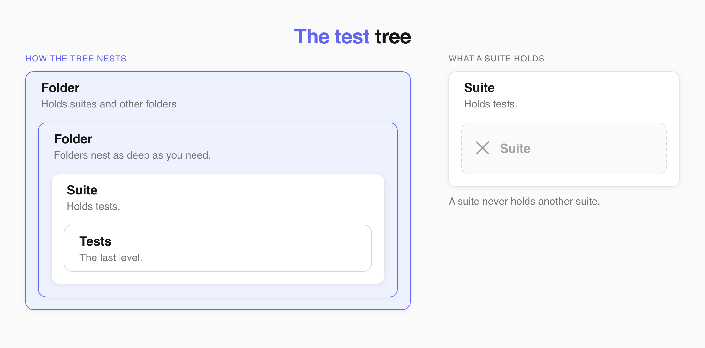
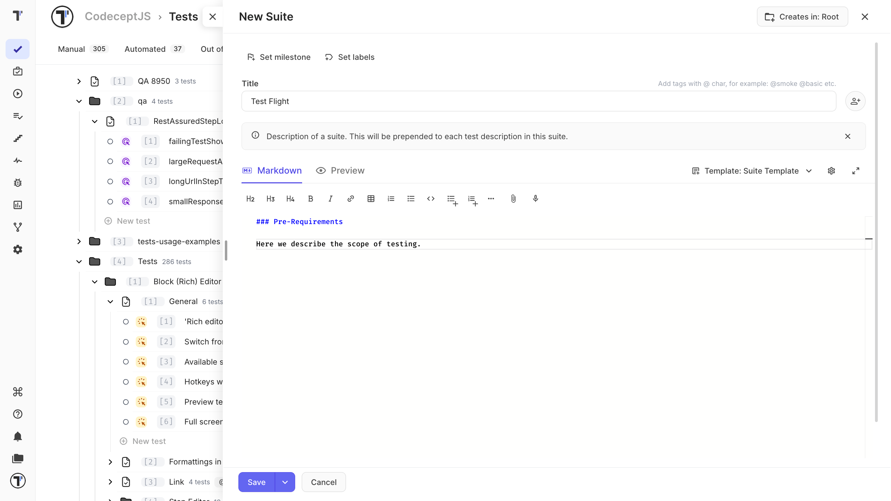
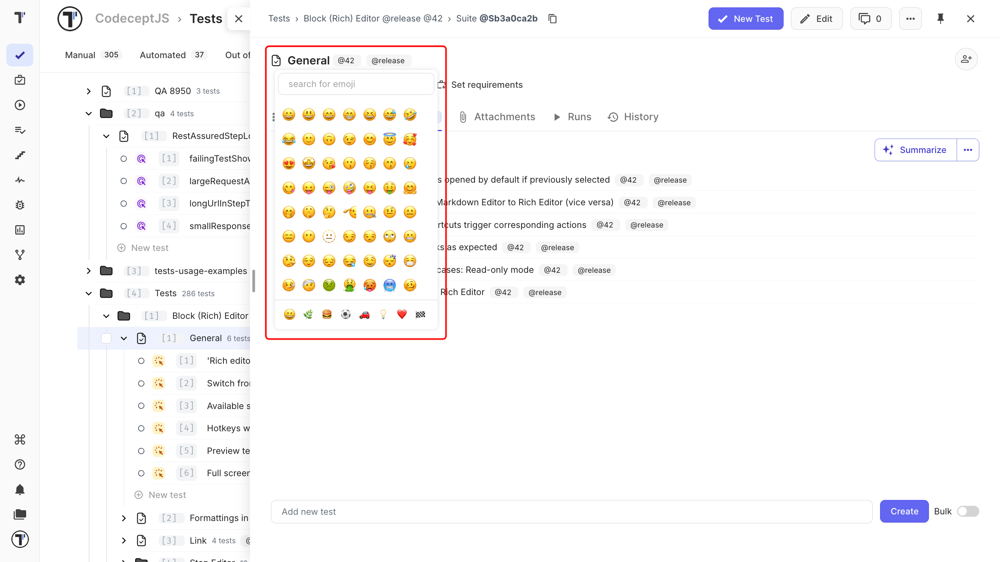
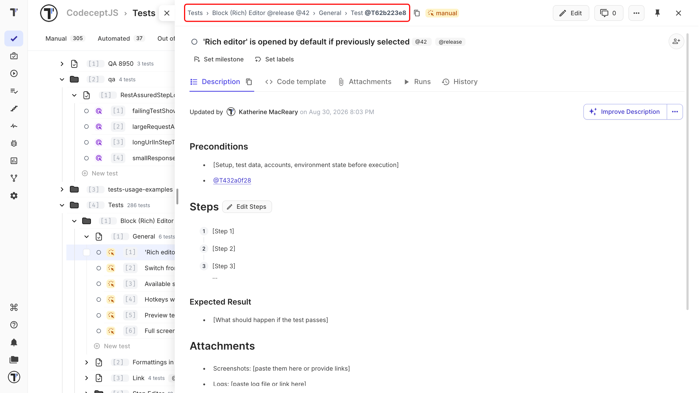
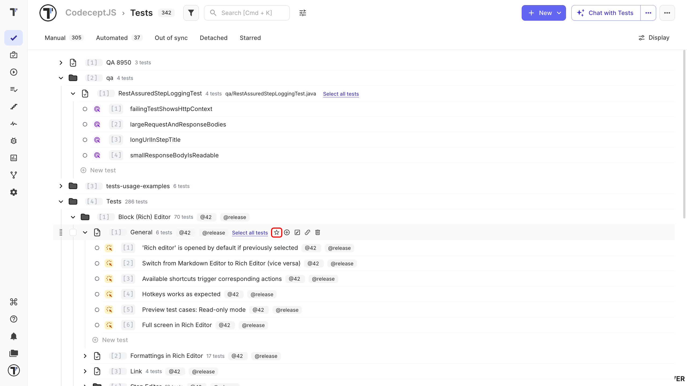
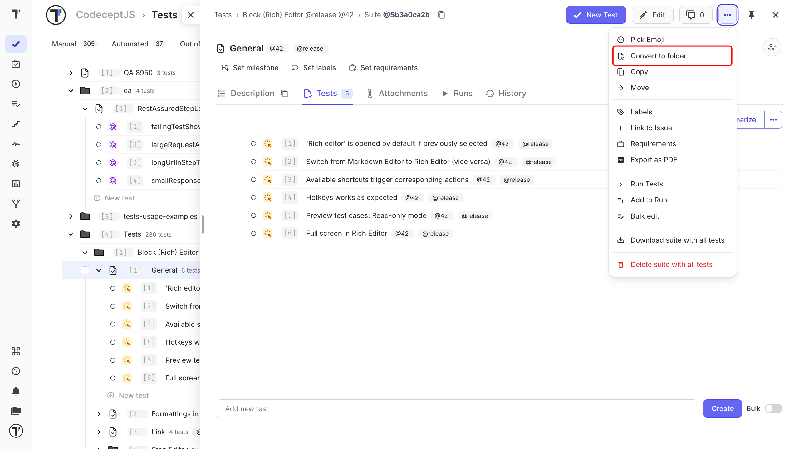

A **suite** contains tests. A **folder** groups suites.



## Create a Suite or Folder

Choose **New suite** when you want to add tests. Choose **New folder** when you want to group suites.

1. Go to the **Tests** page.
2. Click **+ New**.
3. Select **+ New suite** or **+ New folder**.
4. Enter a name.
5. Click **Save**.

The new item appears in the test tree. Open a suite to add tests.



## Add an Emoji to a Suite

Add an emoji to make a suite easier to spot in the test tree. Yopu can remove and change it at any time.



## Navigate with Breadcrumbs

Breadcrumbs show the test's location in the tree.

Click a breadcrumb to go back to a parent suite or folder.

Hover over a shortened breadcrumb to see its full name.



## Star Suites and Folders

Star items you use often to find them under the **Starred** filter.

1. Go to the **Tests** page.
2. Hover over a suite or folder.
3. Click the **star** icon.

You can also star an item from search results.



### Clear Starred Items

1. Apply the **Starred** filter.
2. Click the **Crossed star** button.
3. Confirm the action.

## Convert a Suite to a Folder

Convert a suite when you need to place other suites alongside it.

1. Go to the **Tests** page.
2. Open the suite.
3. Open the **(...)** menu.
4. Select **Convert to folder**.
5. Confirm the action.



The new folder keeps the suite inside it, along with all its tests and history.

Before:

```text
Notifications (Suite)
├── Test 1
└── Test 2
```

After:

```text
Notifications (Folder)
└── Notifications (Suite)
    ├── Test 1
    └── Test 2
```

You can now add other suites to the folder.

## Next Steps

- [Create a Test](https://docs.testomat.io/project/tests/create-a-test)
- [Copy and Move your Tests](https://docs.testomat.io/project/tests/copy-and-move-your-tests)
- [Other Features for Test case Design](https://docs.testomat.io/project/tests/other-features-for-test-case-design)