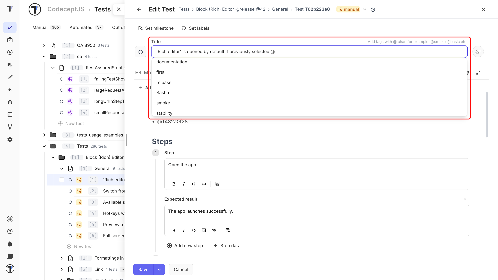
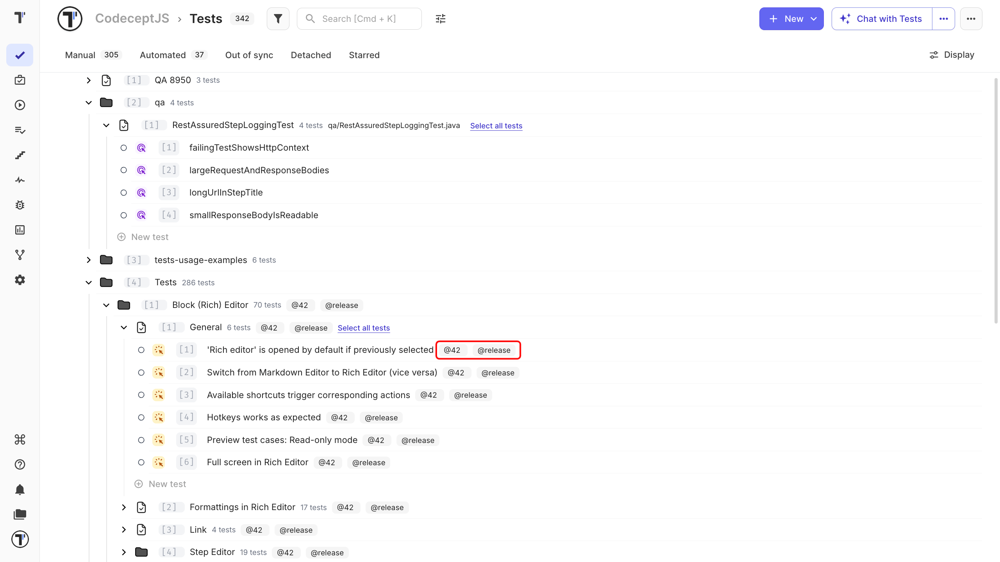
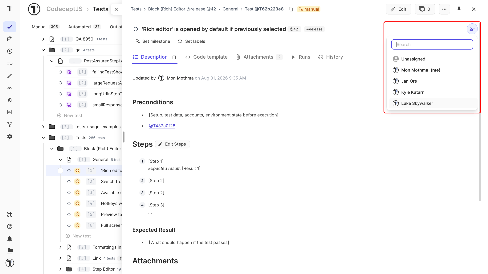

 
Use tags, labels, and assignees to organize tests and make them easier to manage.
 
- **Tags** group tests by name, such as `@smoke` or `@regression`.
- **Labels** add structured information, such as a component, owner, or requirement ID.
- **Assignees** show who is responsible for a test.

## Tags and Labels
 
Tags and labels both help you organize tests, but they work differently. Use a **tag** when a name is enough. Use a **label or custom field** when you need to store a value with it.
 
| | Tag | Label or custom field |
| --- | --- | --- |
| **Stores** | A name | A name and a value |
| **Add from** | The test title with `@` | **Set labels** in the editor |
| **Best for** | Quick test groups | Information you want to track and filter |

## Add a Tag
 
Tags are added directly to the test title.
 
1. Open the test and click **Edit**.
2. In the title field, type `@` and the tag name.
3. Select an existing tag from the list, or enter a new name.
4. Click **Save**.

 
The tag appears next to the test title.

:::note

Pick an existing tag from the list when you can. Tag names are case-sensitive, so `@smoke` and `@Smoke` are two different tags.

:::
 

 
## Add a Label
 
Use labels when a test needs more information than a simple tag can provide.
 
1. Open the test or suite editor.
2. Click **Set labels**.
3. Select a label or custom field.
4. Set its value.

The label appears on the test with its value.
 
To label several tests at once, use the **Labels** action in the bulk panel. For the labels available in your project and how they are set up, see [Labels and custom fields](https://docs.testomat.io/advanced/tags-labels/labels-and-custom-fields) and [Tags](https://docs.testomat.io/advanced/tags-labels/tags/).
 
## Assign a Test
 
Assign a test to show who is responsible for it. The user's avatar appears on the test.
 
1. Open the test on the **Tests** page.
2. Click the user icon in the top-right corner.
3. Select a project member.

Use the search field to find a member quickly, or pick **Unassigned** to remove the assignment.

 
:::note

Only project members can be assigned to tests. If you don't see the person you need, add them to the project first.

:::
 
## Test Assignment and Run Assignment
 
A test assignment and a run assignment have different purposes.
 
| | Applies to | Shows |
| --- | --- | --- |
| **Test assignment** | The test, until someone changes it | Who is responsible for the test |
| **Run assignment** | One test run only | Who is running the test in that run |
 
Assigning a test in a run does not change its test assignment.
 
## Next Steps
 
- [Create a Test](./create-a-test.md)
- [Test Attachments](./test-attachments.md)
- [Tags](https://docs.testomat.io/advanced/tags-labels/tags/)
 