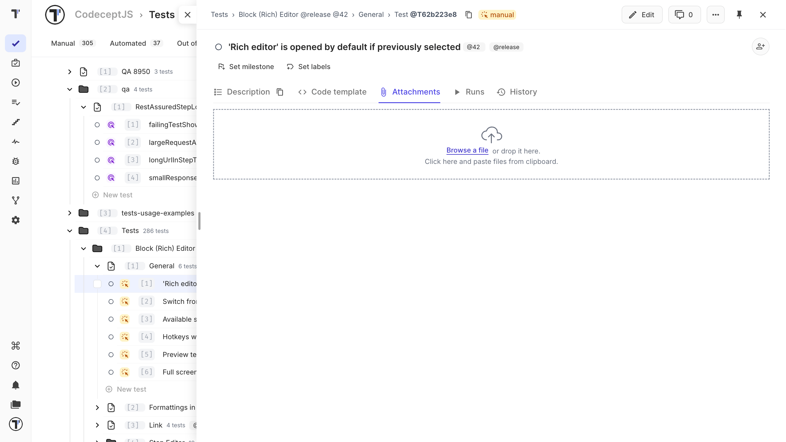
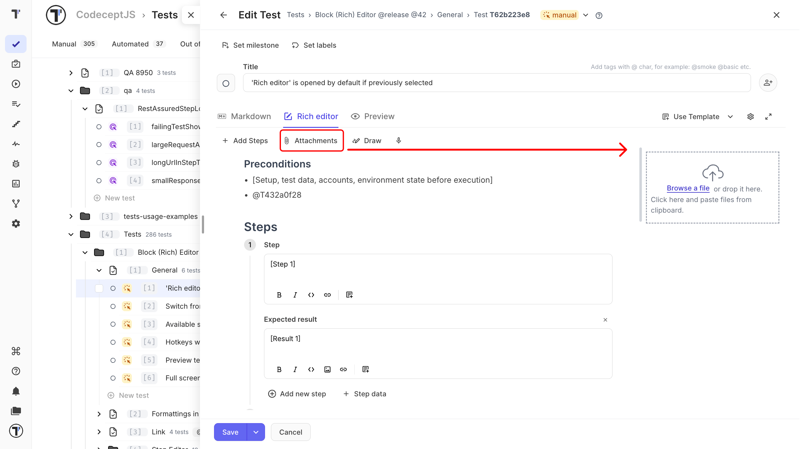
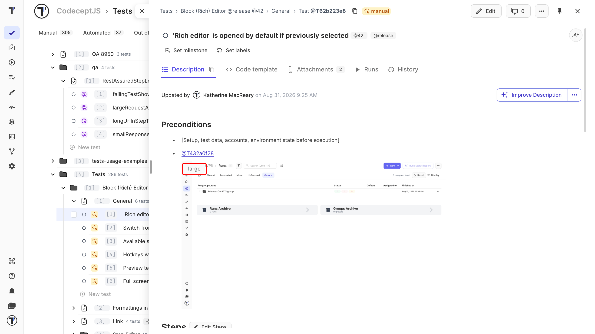
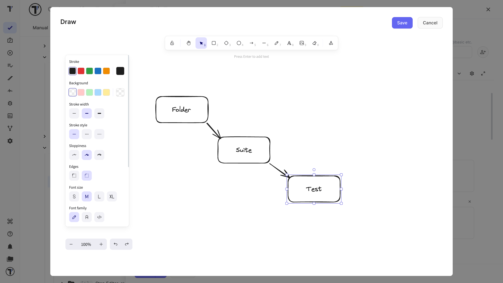
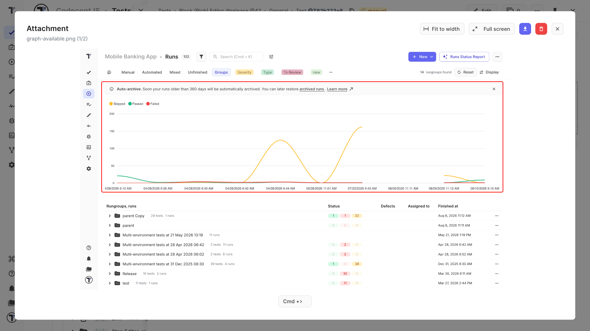
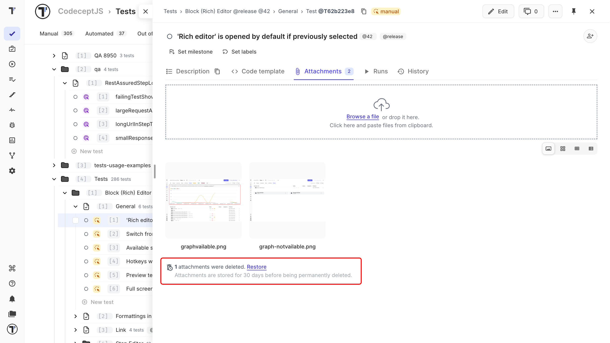

 
Add screenshots, logs, sample files to a test. There are two places a file can be added:
 
| Where | Use it for |
| --- | --- |
| **The Attachments tab** | Supporting files |
| **The test description** | Files the tester needs to see as part of the steps |

## Add Attachments to a Test
 
1. Open the test.
2. Click the **Attachments** tab.
3. Click **Browse a file**, or drag and drop the file into the upload area.

 
The file appears on the test's **Attachments** tab.
 
## Add Attachments to the Description
 
Add an image to the description when it belongs to the test instructions.
 
1. Open the test editor.
2. Click **Attachment**.
3. Select a file, drag and drop it into the upload area, or paste it from the clipboard.
4. Click the uploaded image to add it to the description.

 
The image now appears in the test description and on the **Attachments** tab.
 
### Resize an Image
 
You can change the size of images added to the description.
 
1. Hover over the image.
2. Click **Large**, **Small**, or **Default**.

 
:::note

The size applies to all images in that test. Choose a size that works well for the largest image.

:::
 
## Add a Drawing
 
Use a drawing to highlight an area of a screen or explain an interaction.
 
1. Open the test and click **Edit**.
2. Click **Draw**.
3. Add the elements you need.
4. Adjust their styles.
5. Click **Save**.

 
## Preview an Attachment
 
You can open supported files in Testomat.io without downloading them.
 
1. Open a test, suite, or folder from the **Tests** page.
2. Open the **Attachments** tab.
3. Click an attachment.
4. Use **Fit to width/height** or **Full screen** to change the view.

 
Testomat.io can preview these file types:
 
| Type | Formats |
| --- | --- |
| **Code and data** | `.json`, `.xml`, `.html`, `.sql`, `.js`, `.py`, `.java`, `.svg` |
| **Logs and text** | `.txt`, `.log`, `.properties`, `.csv` |
| **Scripts** | `.bat`, `.sh` |
| **Documents** | `.pdf` |
 
If a file type is not supported, download the file and open it on your computer.
 
## Delete an Attachment

You can delete an attachment from the test view or while editing the test.
 
:::note

Deleted attachments stay available for **30 days**, so you can restore one if you remove it by mistake. After 30 days they are permanently removed.

:::

### From the Test View
 
1. Open the test.
2. Click **Attachments**.
3. Click the **Delete** icon.
4. Confirm the deletion.

### From edit mode
 
1. Open the test and click **Edit**.
2. Open the **Attachments** tab.
3. Click the **Delete** icon.
4. Confirm the deletion and save the test.
 
## Restore an Attachment
 
1. Open the test or suite.
2. Open the **Attachments** tab.
3. Click **Restore**.
4. Select an attachment to restore, or click **Restore All**.

 
The restored files return to the **Attachments** tab.
 
## Next Steps

- [Edit Test Steps](https://docs.testomat.io/project/tests/edit-test-steps)
- [Test Steps and Expected Results](https://docs.testomat.io/project/tests/test-steps-and-expected-results)
- [Create a Test](https://docs.testomat.io/project/tests/create-a-test)
 
