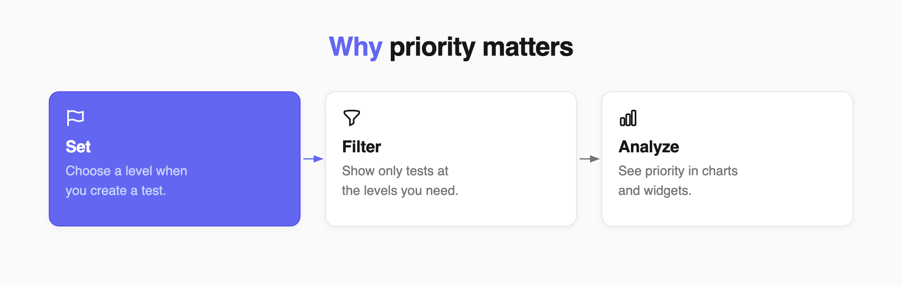
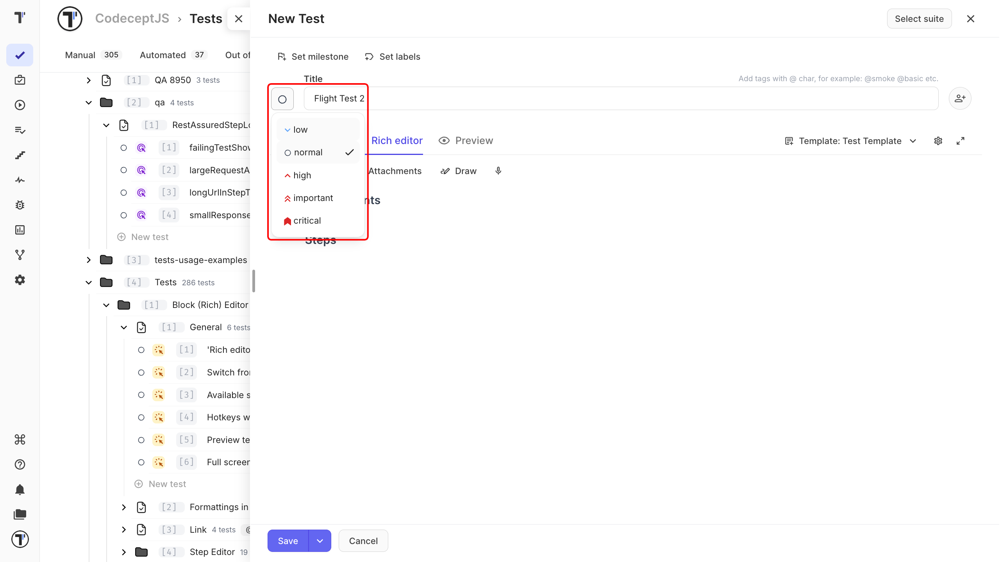
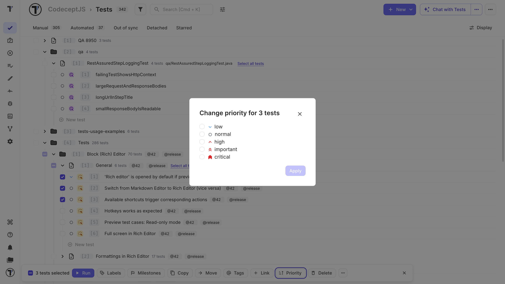
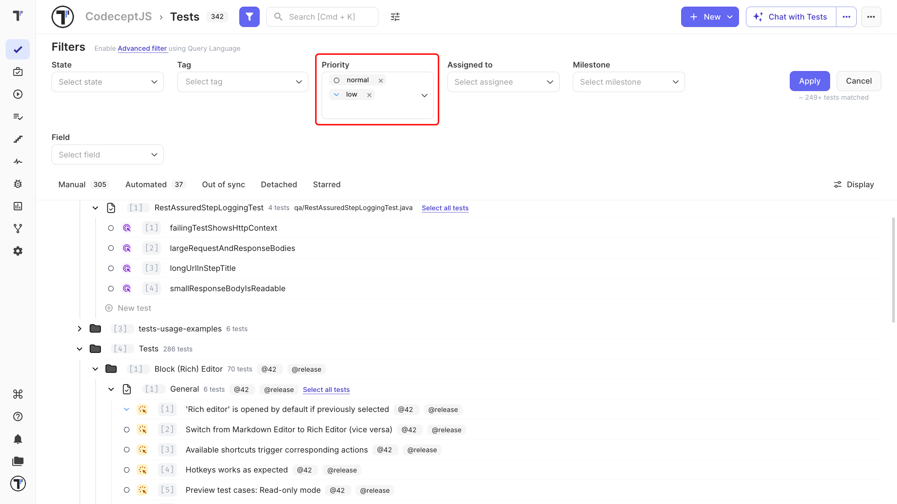
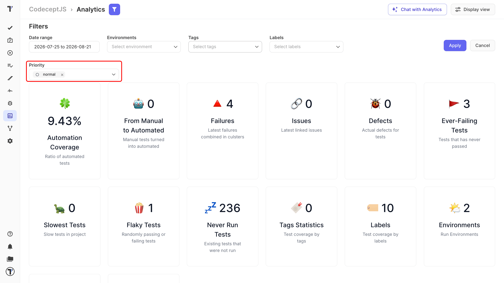

 
Set a priority when creating a test, change it later, or update several tests at once. Priority appears next to the test title and helps you quickly find the tests that need attention.

 
## Priority Levels
 
Choose the level that best describes the importance of the test.
 
| Level | Use it for |
| --- | --- |
| **low** | Minor checks that rarely affect a release. |
| **normal** | Most tests. This is the default. |
| **high** | Tests that need extra attention. |
| **important** | Tests that are important for a feature or workflow. |
| **critical** | Tests that can block a release or other important work. |
 
Your team can use these levels in the way that works best for your project. For example, you might use **critical** for release blockers, **important** for feature blockers, and **high** for tests that always run in regression.
 
Each priority has its own icon, so you can recognize it quickly in the test list and tree.
 
## Set Priority When Creating a Test
 
Choose the priority while creating the test.
 
1. Go to the **Tests** page.
2. Click **+ New** and then **New test**.
3. Enter the test title.
4. Click the priority icon to the left of the title field.
5. Select a priority.
6. Click **Save**.

 
:::note

If you don't select a priority, the test gets **normal** priority.

:::
 
## Change Priority
 
You can change the priority of an existing test at any time.
 
1. Open the test on the **Tests** page.
2. Click the priority icon to the left of the title field.
3. Select a new priority.
4. Close the test.

The new priority applies immediately. You don't need to save the test.
 
## Change Priority for Multiple Tests
 
Update several tests at once instead of opening them one by one. This is useful when you need to set priorities for a whole suite or a group of tests.
 
1. Go to the **Tests** page.
2. Turn on **multi-select**.
3. Select the tests you want to update.
4. Click **Priority** at the bottom of the page.
5. Select a priority.
6. Click **Apply**.

 
## Filter Tests by Priority
 
Use the priority filter to quickly find tests with a specific priority.

1. Go to the **Tests** page.
2. Click the filter icon next to the search field.
3. In **Priority**, select one or more levels.
4. Click **Apply**.

 
You can combine the priority filter with other filters, such as tags, state, or assignee.
 
## Use Priority in Analytics
 
Priority is also available in project and company analytics.
 
### Project Analytics
 
1. Open **Analytics** in your project.
2. Click the **Filters** icon.
3. Select the priority levels you want to see.
4. Add any other filters you need.
5. Click **Apply**.

 
The charts update to show data for the selected priorities.
 
### Company Analytics
 
Open **Analytics** from the global workspace navigation to see priority data across your projects. For more information, see [Analytics Board](https://docs.testomat.io/advanced/global-analytics/analytics-board/).
 
### Priority Widgets
 
You can also add priority-based widgets to an analytics dashboard.
 
| Widget | What it shows |
| --- | --- |
| **Failed Runs By Priority** | Failed runs grouped by priority over time. |
| **Latest Failed Runs By Priority** | Failed runs from the latest test runs, grouped by priority. |
| **Latest Run Results By Priority And Status** | Passed, failed, and skipped results for the latest runs, grouped by priority. |
| **Priority By Date** | Run and failure trends for each priority over a selected period. |
| **Run Results By Priority And Status** | Run results across your test history, grouped by priority. |
 
For more information, see [Analytics Dashboards (Widgets)](https://docs.testomat.io/advanced/global-analytics/analytics-dashboards/).
 
## Next Steps
 
- [Tags, Labels, and Assignees](./tags-labels-and-assignees.md)
- [Create a Test](./create-a-test.md)
- [Bulk Edit](https://docs.testomat.io/advanced/bulk-edit-folder)
 
