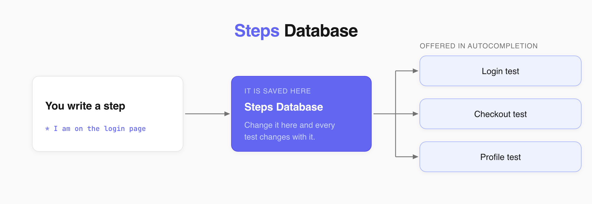

 
In a Classical project, Testomat.io reads test steps from the `## Steps` section of the description. Add `## Steps` and write your steps below. You can format the steps and expected results in several ways, depending on how you want the test to read.



## Choose a Format
 
| Format | Use it when | Saved to the steps database |
| --- | --- | --- |
| Plain text | The test is short and the result matters only here | No |
| Separate steps | You want to reuse the result in other tests | Yes |
| Nested list | One step has several things to check | Yes |
| Separate section | You want to review steps and checks separately | Yes |
| Table | You have many short steps and want a compact test | Yes |
| Subheadings | A step has several actions or detailed checks | Yes |
 
Steps saved to the database are offered in autocompletion the next time you write a test.
 
## Expected Results as Plain Text
 
Put the expected result on the next line after the step.
 
```markdown
## Steps
* Go to the payment page
  Expected result: Payment page loads
* Enter credit card details and submit
  Expected result: Payment is processed and confirmation page loads
```
 
Expected results written this way stay in the test and are not added to the steps database.
 
## Expected Results as Separate Steps
 
Make each expected result a separate list item.
 
```markdown
## Steps
* Go to the payment page
* Verify that Payment page loads
* Enter credit card details and submit
* Verify that Payment is processed and the confirmation page loads
```
 
Starting expected results with `Verify that` also makes them easy to scan.
 
## Expected Results as a Nested List
 
Put the expected results under the step they belong to.
 
```markdown
## Steps
* Go to the payment page
  1. Verify that Payment page loads
* Enter credit card details and submit
  1. Verify that Credit card number is accepted
  2. Verify that Expiration date is accepted
  3. Verify that CVV code is accepted
* Submit payment
  1. Verify that Payment is processed
  2. Verify that Confirmation page loads
```
 
:::note

When a numbered step contains an unordered list, indent the list by 4 spaces or 1 tab so Markdown keeps it under the step.

:::
 
```markdown
## Steps
1. Go to the payment page
    - Verify that Payment page loads
    - Verify that payment page matches the design
2. Enter credit card details and submit
    - Verify that Credit card number is accepted
    - Verify that Expiration date is accepted
    - Verify that CVV code is accepted
```
:::
 
## Expected Results in a Separate Section
 
List all steps first, then add their expected results under `## Expected Results`. Keep both lists in the same order so each result matches its step.
 
```markdown
## Steps
1. Go to the payment page
2. Enter credit card details and submit
 
## Expected Results
1. Payment page loads
2. Payment is processed and confirmation page loads
```
 
## Steps in a Table
 
Put each step and its expected result in the same row.
 
```markdown
## Steps
 
| Step | Expected results |
| --- | --- |
| Go to the payment page | Payment page loads |
| Enter credit card details | Credit card details are accepted |
| Submit payment | Payment is processed and confirmation page loads |
```
 
For long expected results, a list is easier to read than a table.
 
## Expected Results as Subheadings
 
Use the step as a subheading and put its expected results below it.
 
```markdown
## Steps
 
### Go to the payment page
* Verify that Payment page loads
 
### Enter credit card details
* Enter credit card number
  1. Verify that Credit card number is accepted
* Enter expiration date
  1. Verify that Expiration date is accepted
* Enter CVV code
  1. Verify that CVV code is accepted
 
### Submit payment
* Verify that Payment is processed
* Verify that Confirmation page loads
```
 
Save the test and open its preview. Your steps appear under **Steps**, and any reusable results show up in autocompletion the next time you type a step.
 
:::note

The **Edit steps** control on the test preview page converts your steps to its own format, which can change the original formatting. See [Classical Test Case Editor](https://docs.testomat.io/project/tests/classical-test-case-editor).

:::
 
## Next Steps
 
- [Classical Test Case Editor](https://docs.testomat.io/project/tests/classical-test-case-editor)
- [Steps Database](https://docs.testomat.io/project/steps-snippets/steps)
- [Keyboard Shortcuts](https://docs.testomat.io/advanced/shortcuts)
 