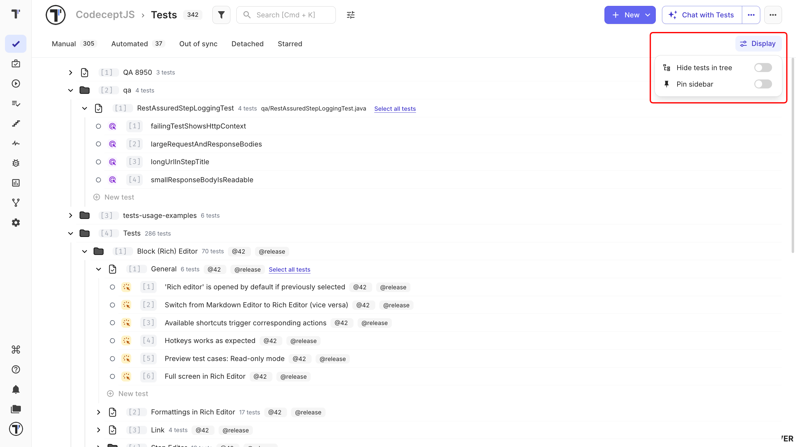
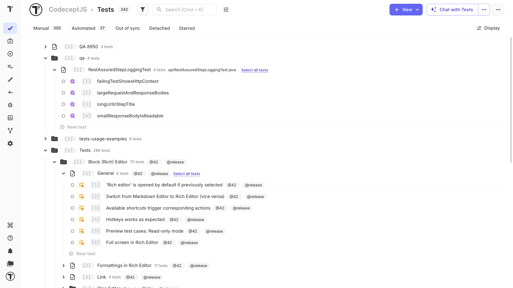
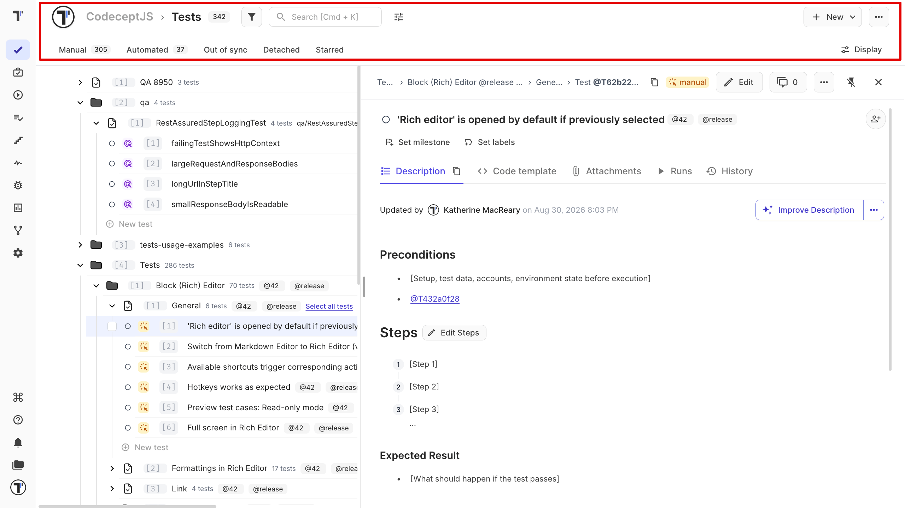
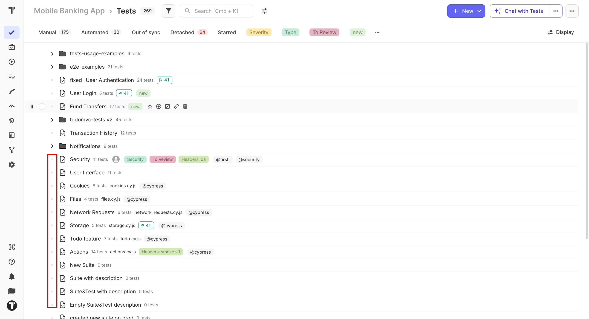

 
Adjust the **Tests** page to make your test tree easier to work with. Open the **Display** menu at the top of the **Tests** page to:
 
- hide individual tests from the tree
- keep the sidebar open while you work

 
These settings only change your view. They do not change the tests or affect other team members.
 
## Hide Tests in the Tree
 
Hide individual tests when you want to see a simpler project structure. By default the tree lists every test inside its suite.

With **Hide tests in tree** enabled, the tree shows only folders and suites. Tests are hidden from the tree but remain available in the project.
 
This is useful when you have many tests and want to focus on the project structure.
 
To show the tests again, open **Display** and turn off **Hide tests in tree**.
 
## Pin the Sidebar
 
Pin the sidebar when you want to see the test tree while working with a test or suite. You can pin it in either of these ways:
 
- Click the **Pin** icon in the top-right corner of the test or suite panel.
- Open **Display** and turn on **Pin sidebar**.

When the sidebar is pinned, the test tree stays visible next to the test or suite details. The **Tests** page toolbar, including search, filters, and display settings, also stays available.
 
Turn it off when you want more space for the test details.

 
## Next Steps
 
- [Suites and Folders](https://docs.testomat.io/project/tests/suites-and-folders)
- [Bulk Test Selection](https://docs.testomat.io/project/tests/bulk-test-selection)
 
