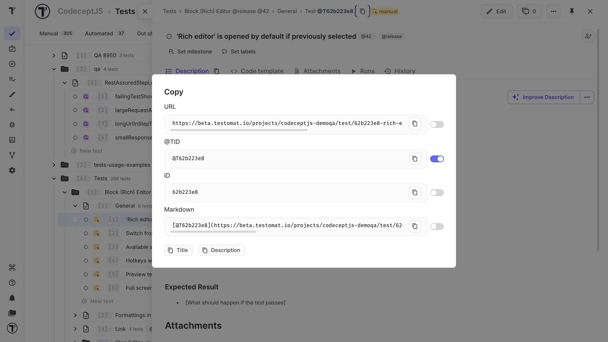
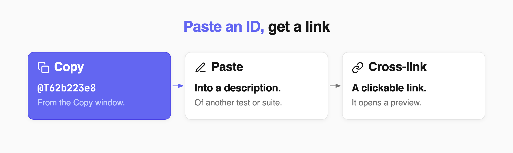

 
Every test, suite, and run has its own ID and URL. The **Copy** window offers them in four formats, so you can pick the one that fits where you are pasting.

| Format | Looks like | Best for |
| --- | --- | --- |
| **URL** | `https://app.testomat.io/projects/my-project/test/62b223e8-rich-editor` | Sharing the item outside Testomat.io |
| **@TID** | `@T62b223e8` | Cross-links inside a test or suite description |
| **ID** | `62b223e8` | Places where the `@T` prefix is not wanted |
| **Markdown** | `[@T62b223e8](https://app.testomat.io/projects/my-project/test/62b223e8)` | Tickets, chats, and commit messages that render Markdown |
 
## Copy a URL or ID
 
1. Open the test, suite, or run.
2. Click the copy icon next to the ID at the top of the panel.
3. Click the copy icon on the row with the format you need.

The **Title** and **Description** buttons at the bottom copy the item title and its description.

## Set a Default Format
 
If you usually copy the same format, set it as the default.
 
1. Open the **Copy** window.
2. Turn on the toggle next to the format you use most often.

After that, clicking the ID copies your selected format immediately.

## Link Tests and Suites

When you paste a copied **@TID** into a test or suite description, Testomat.io turns it into a clickable cross-link with a preview.
 
- **Classical projects:** paste the **@TID** directly.
- **BDD projects:** add `#` before the ID.

See [Classical Project](https://docs.testomat.io/project/tests/classical-test-case-editor) and [BDD Project](https://docs.testomat.io/project/tests/bdd-test-case-editor).
 
## Next Steps
 
- [Sharing Tests and Suites](https://docs.testomat.io/project/tests/sharing-tests-and-suites)
- [Bulk Test Selection](https://docs.testomat.io/project/tests/bulk-test-selection)
 
