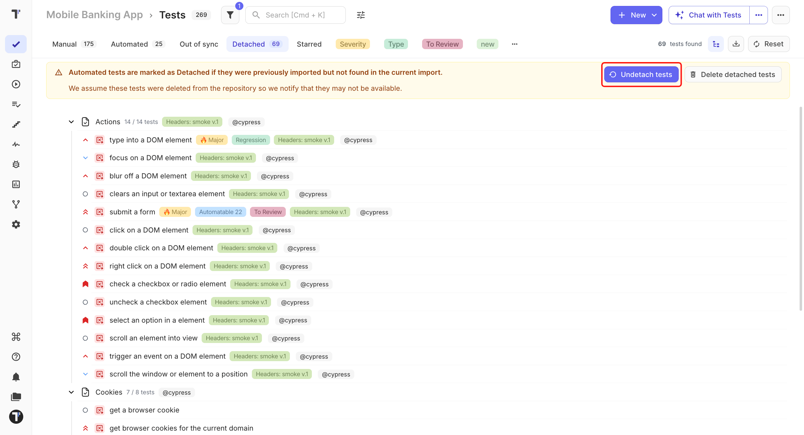
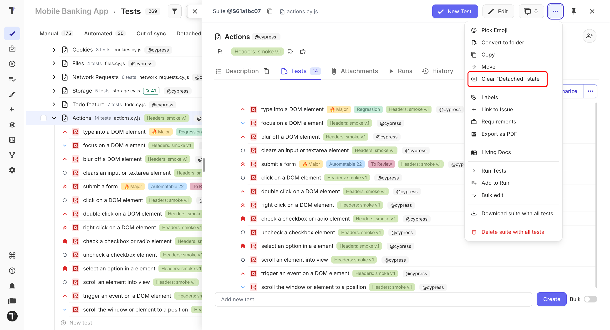

 
When an import no longer finds an automated test in your source code, Testomat.io marks the test as **Detached**.
 
The test stays in your project. If the test is still needed, you can **Undetach** it and remove the **Detached** state.
 
## Understand Test States
 
Each test has a state that shows how it is used:
 
| State | What it means |
| --- | --- |
| **Manual** | The test is run manually and is not connected to automation code. |
| **Automated** | The test is connected to automation code imported into Testomat.io. |
| **Detached** | The test was imported before, but the latest import did not find it in the source code. |
 
For example, a change in your automation project can cause an imported test to become **Detached**. The test is still there, so you can decide what to do with it.
 
## Undetach All Detached Tests
 
If an import detached many tests, you can restore them all at once.
 
1. Go to the **Tests** page.
2. Open the **Detached** tab.
3. Click **Undetach tests** in the banner.

 
Testomat.io removes the **Detached** state from all detached tests in the project.
 
:::note

This action applies to all detached tests in the project, not only the tests shown on the **Detached** tab.

:::

The banner also offers **Delete detached tests**. Use it only when the tests are gone from your source code for good - it removes them instead of restoring them.
 
## Undetach a Suite
 
If only one suite needs to be restored:
 
1. Open the suite with detached tests.
2. Click the (`...`) menu in the top-right corner.
3. Click **Clear "Detached" state**.

 
All detached tests in the suite are restored.
 
## Undetach a Single Test
 
To restore just one test:
 
1. Open the detached test.
2. Click the (`...`) menu in the top-right corner.
3. Click **Clear "Detached" state**.

The **Detached** state is removed from the test.
 
:::note

If the test no longer has automation code, undetaching it changes the test to **Manual**. If automation code is available again, the test can be connected through a later import.

:::
 
## Next Steps
 
- [Test Tree Display](https://docs.testomat.io/project/tests/test-tree-display)
- [Restoring Deleted Tests](https://docs.testomat.io/project/tests/restoring-deleted-tests)
- [Import Tests From Source Code](https://docs.testomat.io/project/import-export/import/import-tests-from-source-code)
 