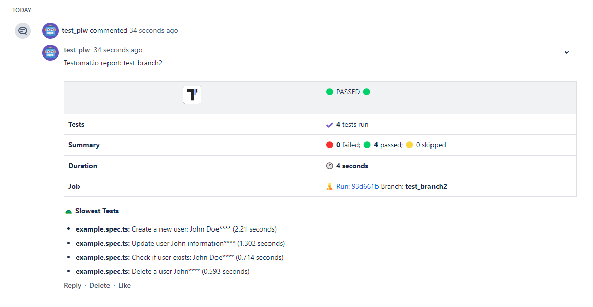

## Bitbucket Pipe

Bitbucket Pipe adds a comment with a summary of a run to a Pull Request:



This summary will contain:

- Status of a test run
- Number of failed/passed/skipped tests
- Stack traces of failing tests (first 10)
- Screenshots of failed tests (if available)
- List of 5 slowest tests

**🔌 To enable Bitbucket pipe set `BITBUCKET_PAT` environment with Bitbucket Repository Access Tokens**

To use the ACCESS_TOKEN from Repository Access Tokens in Bitbucket Pipelines, follow these steps:

1. In Bitbucket, go to your repository settings.

2. Select "Repository Access Tokens" under the "Access management" section.

3. Create a new Access Token, granting it the necessary permissions (e.g., read and write for the repository).


Now, you need to add this token as an environment variable in Bitbucket Pipelines:

1. Go to "Pipelines" in your repository settings.

2. Select "Repository variables" under the "Settings" section.

3. Add a new variable with the name ACCESS_TOKEN and paste the token


Once you've done that, your pipelines.yml configuration file will automatically use this token. Here's how it should look:
```yaml
image: atools/chrome-headless:java17-nodelts-latest

definitions:
  commonItems:
    - &buildFramework bash ./scripts/buildFramework.sh

pipelines:
  pull-requests:
    '**':
      - step:
          name: Run Playwright tests
          script:
            - *buildFramework
            - BITBUCKET_PAT=$ACCESS_TOKEN TESTOMATIO_ENV=$TESTOMATIO_ENV TESTOMATIO_URL=$TESTOMATIO_URL TESTOMATIO=$TESTOMATIO npx playwright test
```

### Keep Outdated Reports

If a pipeline is executed multiple times, comment with previous reports will be deleted. To keep them pass `BITBUCKET_KEEP_OUTDATED_REPORTS` variable:

```yaml
          script:
            - *buildFramework
            - BITBUCKET_KEEP_OUTDATED_REPORTS=1 BITBUCKET_PAT=$ACCESS_TOKEN TESTOMATIO_ENV=$TESTOMATIO_ENV TESTOMATIO_URL=$TESTOMATIO_URL TESTOMATIO=$TESTOMATIO npx playwright test
```

