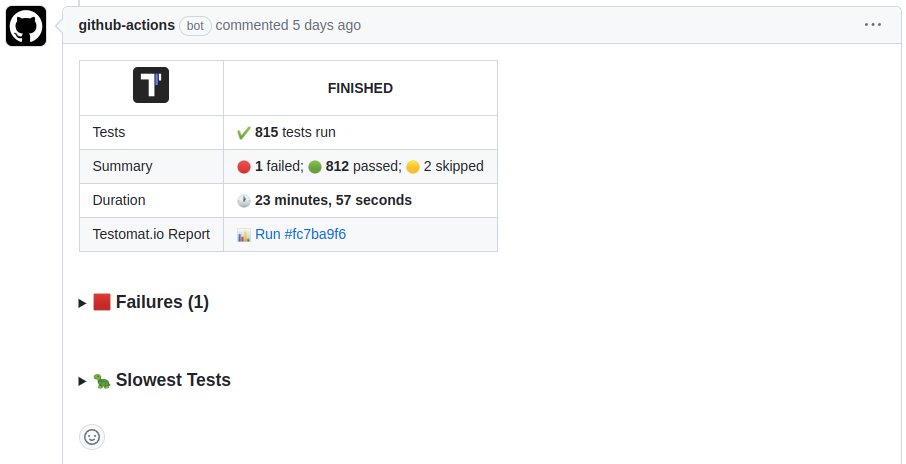

## GitHub Pipe

GitHub Pipe adds a comment with a summary of a run to a Pull Request:



This summary will contain:

- Status of a test run
- Number of failed/passed/skipped tests
- Stack traces of failing tests (first 20)
- Screenshots of failed tests (if available)
- List of 5 slowest tests

**🔌 To enable GitHub pipe set `GH_PAT` environment with GitHub Private Access Token**

When using GitHub Actions inside Pull Request you can set GH_PAT from `github.token` system variable. Here is a sample workflow:

```yaml
name: CI

on:
  push:
    branches:
      - main
  pull_request:

jobs:
  test:
    permissions:
      # These permissions are required for testomat to create comments on pull requests
      issues: write
      pull-requests: write
    # pre-execution steps
    - name: Run Tests
      run: <actual test command with @testomatio/reporter enabled>
      env:
        GH_PAT: ${{ github.token }}
```

### Keep Outdated Reports

If a pipeline is executed multiple times, comment with previous reports will be deleted. To keep them pass `GH_KEEP_OUTDATED_REPORTS` variable:

```yaml
- name: Run Tests
  run: <actual test command with @testomatio/reporter enabled>
  env:
    GH_PAT: ${{ github.token }}
    GH_KEEP_OUTDATED_REPORTS: 1
```

