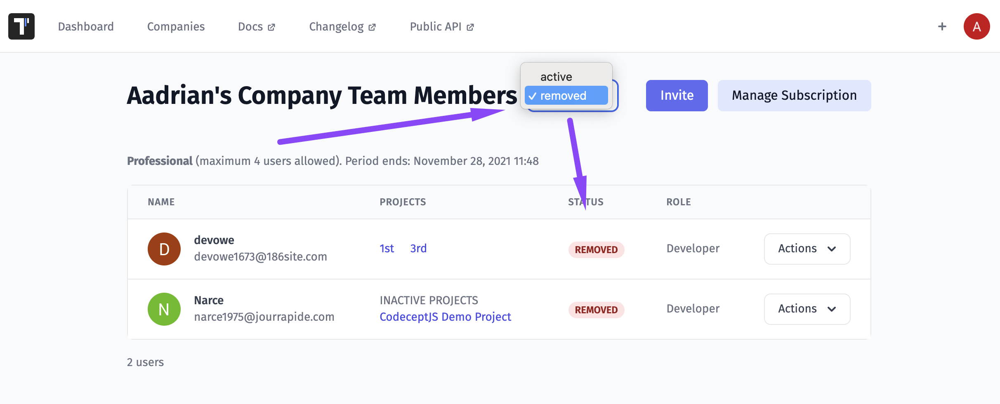
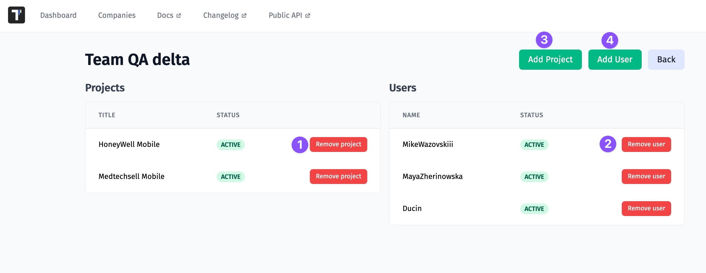

Testomat.io Team implemented Companies feature to simplify work with your team and subscriptions.
Now your projects are stored in Companies. Each user may have one company, so you will not shuffle your projects with others.

On the Companies page, you have a list of companies you participate in with mentioning your role in them.

## Roles Within a Company

Testomat.io provides different roles within projects and companies to make your testing process more convenient.
Different team members have different access levels to management options:

- **Owner** is a team member who created a company, can purchase a subscription, can invite members to a company and a project, create projects, and has access to all features within the project
- **Manager** is a team member who can purchase a subscription, can create projects, invite members to a company and a project, and has access to all features within the project
- **Developer** is a team member who can create projects and has access to all features within the project
- **Billing** is a team member who can update subscriptions and is free.
- **Read-only** is a team member who has permissions for viewing or reading information, can't make changes and is free (available in Professional and Enterprise plans).

## How To Invite A User to A Company

Follow these steps to invite users to your company:

1. Go to the Companies tab
2. Click on the Invite button

3. Enter user's mail

4. Click on the Actions button and pick Projects Access or click on member's name

5. Choose the project with Add to Project button or add to all projects with Add to All Projects button

6. See that member was added to projects and click Back

7. See that projects appeared in added member's line

## How To Manage Company Team Members

All invited members have a developer role by default. You can grant a manager or developer role to a team member on the Company Team Members page (Companies tab -> Actions). 

 
You can delete a team member by clicking on the delete button

With this action deleted team members will be moved to the **removed** section

So you can reactivate them at any time by clicking on the reactivate button

## Teams 

You need to manage project access for some user groups. With this feature, you can import all users of one project into another. Namely, you can group users into different **teams** to add them to different projects. 

### How To Create a Team 

To create a Team you need to go to the Company page and open your Company. And follow this guide:

### How To Assign a Team To a Project

You can assign the Team to another project by editing it.

Namely, you can:

1. Delete a team from a project by removing a project from the Team
2. Delete a user from the Team
3. Assign the Team to a project by adding a project to the Team
4. Add a new member to the Team
5. Edit the Team 
6. Edit the name of the Team
7. Delete the Team

## Read-Only Users

Some of your company members such as managers, BA, or other stakeholders may need to have read-only access to Tests, Run Reports, and Analytics in order to read, but not change any data. You can invite read-only users or make existing users read-only on the Company page. 

**Invite read-only user to a Company** 

**Make a Company member read-only** 

**Make the read-only users a member**

## Billing User

The billing user is meant to access to the billing and account management features, allowing them to update payment methods, manage subscriptions, or modify billing details. They are typically the primary point of contact for any billing-related inquiries or issues.

Our system allows the addition of billing users for free, it means that multiple individuals or entities can be designated as billing users without incurring any additional charges specifically for that role. This can be advantageous for businesses or organizations that require multiple people to manage the billing and financial aspects of their accounts.

**How to add a Billing user**

There are 2 ways to add a Billing user:

1. You can invite the Billing user to your company

2. You can make existing user Billing

**How to add a Billing user for Free**

If you want to use Billing users for free add them as Read-only users. See how it works [here](https://docs.testomat.io/subscriptions/companies/#read-only-users).

## Project Archive 

There may be completed projects that are not being developed or paused for some reason. So you may need to **archive** such projects not to mix up current work. In this case the archived project is placed on the Archive page, so it can be easily restored.

