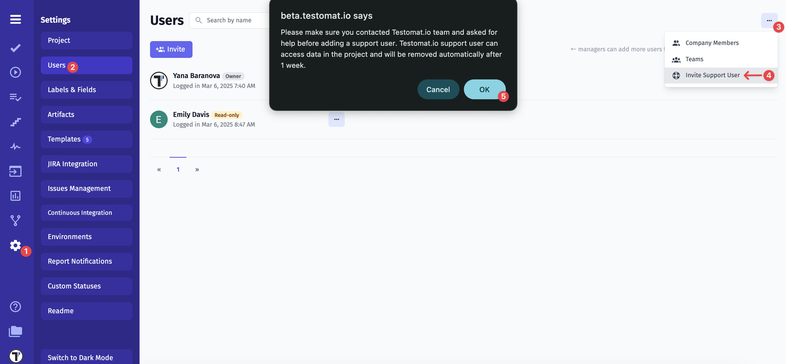
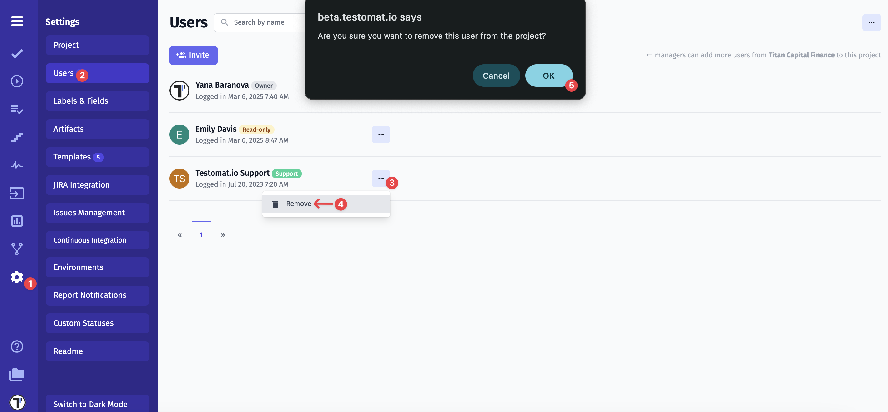

Have open questions about our product, features, user flows, subscriptions, or pricing? 🤔
Our teams are ready to help you 🤓

Here you can find useful contacts and links

**Reach us**

- Ask in [Slack](https://join.slack.com/t/testomatio/shared_invite/zt-1ac24wnao-EICi76nXmHbW3GQH4d22uA)
- Use **Crisp chat** _(at the bottom-right corner)_
- Make [feature request](https://testomat.nolt.io/roadmap)
- Raise [a defect](https://github.com/testomatio/app/issues/)
- Schedule [a demo](https://calendly.com/testomatio/demo)
- General queries contact@testomat.io
- Technical support support@testomat.io

**Documentation**

- [Our Roadmap](https://testomat.nolt.io/roadmap)
- [Documentation](https://docs.testomat.io/)
- [Changelog](https://changelog.testomat.io/)

**Follow Us**

- [Twitter](https://twitter.com/testomatio)
- [Linkedin](https://www.linkedin.com/company/testomatio/)
- [Facebook](https://www.facebook.com/testomatio)
- [YouTube](https://www.youtube.com/channel/UCjVETzkhixcVPwK7MYEb5cA)
- [Telegram](https://t.me/testomatio)

## Invite a Support User to Your Project

If you are experiencing an issue that is difficult to reproduce based only on screenshots or descriptions (for example, incorrect filtering, permissions behavior, configuration issues, or unexpected test execution results), our team may need temporary access to your project to investigate it directly.

In Testomat.io, a **support user** is a temporary user account that you can invite to your project to help our support or development team investigate an issue directly in your environment. When invited, the support user gains access only to that specific project so we can look at configurations, reproduce the problem, and resolve it more efficiently.

Before adding a support user, please make sure you have contacted the Testomat.io team and asked for help.
Inviting a Support User requires the Manager or Owner role.

To invite a support user to your project, follow these steps:

1. Click on **’Settings’** in the sidebar
2. Click the **’Users’** tab
3. Click on the **‘Extra Menu’**
4. Select **‘Invite Support User’** button
5. Click **‘OK’** to confirm that you give permission

**Important**: The Testomat.io support user can access data in the project and will be removed automatically after 1 week.

**Manually Remove a Support User**

If you no longer need help and your issue has been resolved, you can manually remove the Testomat.io support user.

1. Click on **’Settings’** in the sidebar
2. Click the **’Users’** tab
3. Click on the **‘Extra Menu’** next to Testomat.io Support user
4. Click **‘Delete’** button
5. Click **‘OK’** to confirm

If you have any further questions, please take a look at the **'Reach us'** section above.
