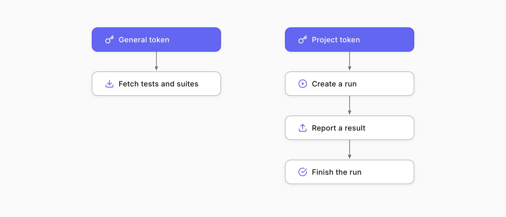
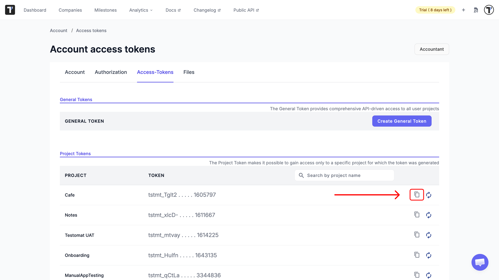

Welcome! 

This tutorial shows you how to work with Testomat.io from code. Basic comfort with HTTP requests and a tool like curl or Postman is all you need.

The API lets you work with Testomat.io straight from your own code, so you can fetch tests, start runs, and send results without opening the app. It's what you use to plug Testomat.io into your pipelines and scripts.



What you will do:

1. Get an access token.
2. Authenticate and get a JSON Web Token (JWT).
3. Fetch your suites and tests.
4. Create a run.

The base URL for every request is `https://app.testomat.io`.

## Before you start: two kinds of tokens

Learn more: [API Access](https://docs.testomat.io/advanced/api-access/#_top).

Testomat.io has two token types, and you pick based on the job:

* General token. Full API access across all your projects. Use it to read data, like fetching tests. It starts with `testomat_`.
* Project token. Access limited to one project, used for importing and reporting. Use it to create runs and report results. It starts with `tstmt_`.

You will use both in this tutorial: a General token to fetch, a Project token to create a run.

## Get an Access Token

Learn more: [Access Tokens](https://docs.testomat.io/advanced/api-access/#access-tokens-overview).

To get your tokens:

1. Open your account settings.
2. Go to **Access-Tokens**.
3. Copy a General token for reading and a Project token for your project.



Treat tokens like passwords. Keep them out of your code and commits, and store them as secrets.

## Authenticate

Learn more: [API Reference](https://docs.testomat.io/advanced/api-access/#api-reference).

The API uses a short-lived JWT. You trade your General token for a JWT once, then send that JWT on every read request.

Send your General token to the login endpoint via your API testing platform (e.g., Postman or Swagger):

`POST https://app.testomat.io/api/login`

```
{
  "api_token": "testomat_YOUR_GENERAL_TOKEN"
}
```

You will receive a JWT in the response:

```
{
  "jwt": "eyJhbGciOiJIUzI1NiIsInR5cCI6IkpXVCJ9..."
}
```

Copy the `jwt` value. Include it in the Authorization header on every read request from here on.

## Read Your Suites and Tests

Suites are nested, so you fetch the root suites first, then walk into each one to build the full tree. Each suite response includes the tests, so you do not need a separate call for tests.

List the root suites:

`GET https://app.testomat.io/api/<project>/suites`

```
Authorization: <your JWT>
```

Then fetch each child suite by its ID to go deeper:

`GET https://app.testomat.io/api/<project>/suites/<suite_id>`

```
Authorization: <your JWT>
```

Repeat for each child suite to rebuild the whole tree. Replace &lt;project&gt; with your project ID, which you can see in the project URL.

## Create a Run

Learn more: [Reporting API](https://docs.testomat.io/advanced/api-access/#importing-and-reporting-with-project-token).

To create and report runs, use the Reporting API with your Project token, passed as api_key. For example, if you need to create runs outside the Testomat.io app. Creating a run returns a unique run ID that you report results to.

Create the run:

`POST https://app.testomat.io/api/reporter?api_key=tstmt_YOUR_PROJECT_TOKEN`

```
{
  "title": "API run"
}
```

You will receive the run ID:

```
{
  "uid": "run-id-12345"
}
```

Save the uid, then report a test result to that run:

`POST https://app.testomat.io/api/reporter/<run-id-12345>/testrun?api_key=<tstmt_YOUR_PROJECT_TOKEN>`

```
{
  "title": "User can log in",
  "status": "passed"
}
```

When every result is in, finish the run so its status is calculated. See the Reporting API reference for the exact finishing call and the full list of fields.

## Use Public API v2 and the MCP Server

Testomat.io also offers Public API v2, a newer interface with a consistent request and response structure across all endpoints, designed to make integrations simpler and more predictable. Its exact endpoints and fields are listed in the API Reference.

Testomat.io MCP Server lets AI assistants such as Claude or Cursor talk to Public API v2 directly, so an assistant can read tests, search, and manage runs for you. Run it with your project token:

```
npx -y @testomatio/mcp@latest --token <PROJECT_TOKEN> --project <PROJECT_ID>
```

## Next Steps

* See every endpoint, parameter, and schema in the [API Reference](https://docs.testomat.io/advanced/api-access/#api-reference).
* Reporting from a test framework instead of raw requests? See the [Testomat.io Reporter](https://docs.testomat.io/test-reporting/reporter/#_top).
* Want to filter results precisely? Learn the query language in [TQL](https://docs.testomat.io/advanced/tql/#_top).