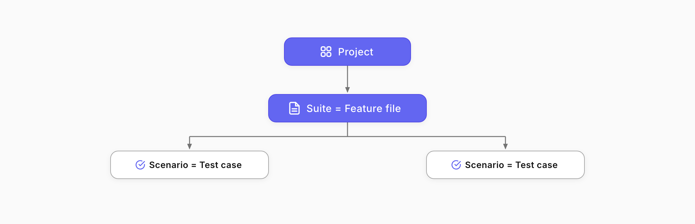
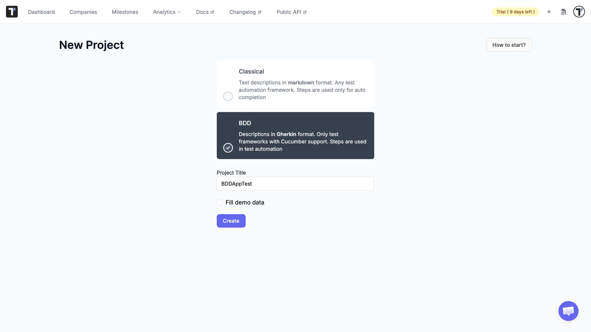
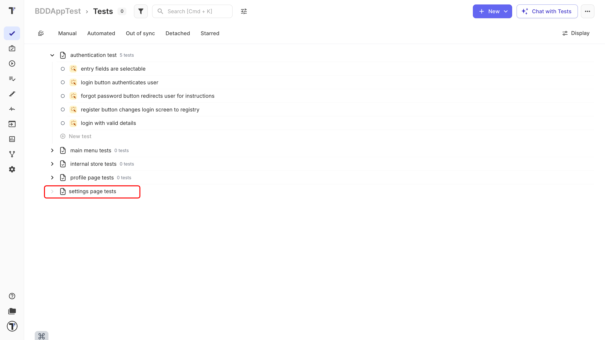
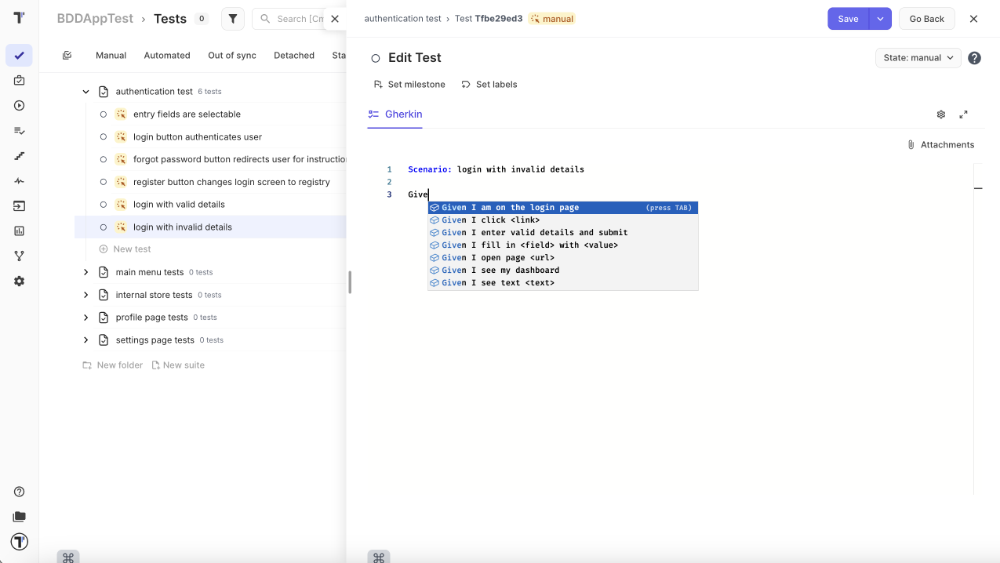
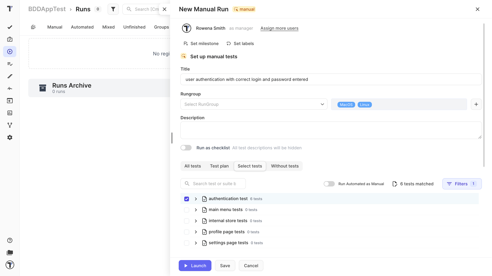
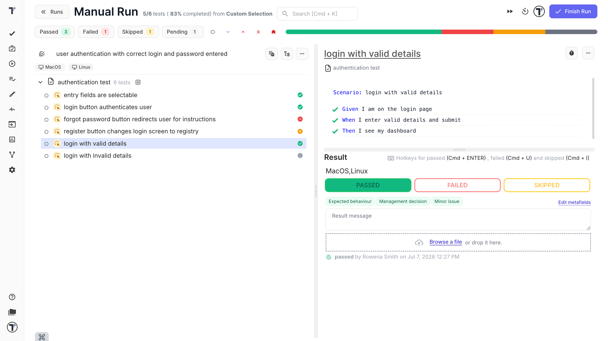

Welcome!

This tutorial walks you through manual testing in a BDD project. BDD means you write tests as plain-language scenarios with Given, When, and Then, so both technical and non-technical people can read them.

What you will do:

1. Create a BDD project.
2. Add a suite, which becomes your feature file.
3. Write a Gherkin scenario.
4. Reuse a shared step.
5. Run the scenario manually.

## Create a BDD project

1. On app.testomat.io, click **Create** in the top-right corner.
2. Enter a name in the **Project Title** field.
3. Choose a **BDD Project**.
4. Leave **Fill demo data** unchecked, so you start clean.
5. Click **Create**.

:::note

In a BDD project, your test cases are Gherkin scenarios, and they can sync with feature files in your code.

:::

## Add a suite

In a BDD project, a suite is your feature file, the place where your scenarios live.

1. On the Tests page, click **New suite**.
2. Type a name in the suite input field, for example, "Login tests"
3. Press `Enter`.

Your feature file appears in the tree, ready for scenarios.

## Write a scenario

Now write a scenario using Given, When, Then. Given sets the starting point, When is the action, and Then is the expected result.

1. Select your suite and add a test, for example, "Log in with valid details." This test is your scenario.
2. Click the test to open the BDD editor.
3. In the editing area, write the steps.
1. Click **Save**.

Write scenarios with one clear action per line. For everything the editor offers, see the [BDD Test Case Editor](https://docs.testomat.io/project/tests/bdd-test-case-editor/#_top).

## Reuse a shared step

Some steps appear in many scenarios, such as "Given I am on the login page." Instead of retyping them, you reuse a shared step. As you type, Testomat.io suggests steps you have already written.

1. In a new or existing scenario, start typing a step you used before.
2. Pick the matching step from the autocomplete list.

Reusing steps keeps your scenarios consistent and saves time. When a shared step changes, you update it in one place.

See [Shared Steps](https://docs.testomat.io/project/steps-snippets/steps/#how-to-reuse-steps-from-steps-database) for the full picture.

## Run the scenario manually

1. Open the **Runs** tab in the sidebar.
2. Click **Manual Run**.
3. Give the run a title, and set the environment if you want.
4. Tick the checkbox next to your tests.
5. Click **Launch**.

You now step through the scenario. Follow each Given, When, and Then, and mark the result:

| Mark the result | Shortcut |
|---|---|
| Passed, if the behavior matched. | `Cmd`+`Enter` on Mac, `Ctrl`+`Enter` on Windows |
| Failed, if it did not. Add a note, attach a screenshot, or link a defect. | `Cmd`+`U` on Mac, `Ctrl`+`U` on Windows |
| Skipped, if you did not run it. | `Cmd`+`I` on Mac, `Ctrl`+`I` on Windows |

If the run has many scenarios, use the search box in the run to jump straight to a test or suite by name instead of scrolling through the whole list.

:::note

Linking a defect needs a bug tracker connected to your project. Without one, the option will not work. Connect a bug tracker:

1. Open your project and go to **Settings**.
2. Click **Integrations**.
3. Pick your tracker (GitHub, GitLab, Azure, Linear, Jira).
4. Click **Connect** and sign in to authorize it.
5. Done, the tracker now shows as connected.

After that, **Link to Issue** and **Report Defect** work on your tests and runs.

:::

When every scenario has a result, click **Finish Run** to close the run. That is what turns it into a report.

## Next steps

* See the [BDD Test Case Editor](https://docs.testomat.io/project/tests/bdd-test-case-editor/#_top) for more.
* Ready to connect scenarios to code? See [Import Cucumber BDD Tests](https://docs.testomat.io/project/import-export/import/import-bdd/#_top).