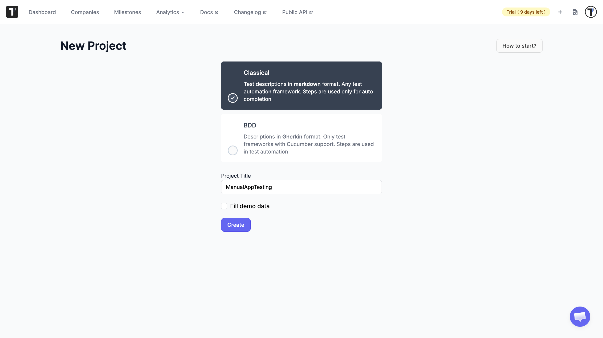
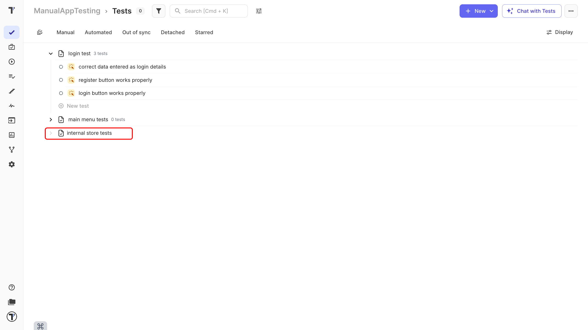
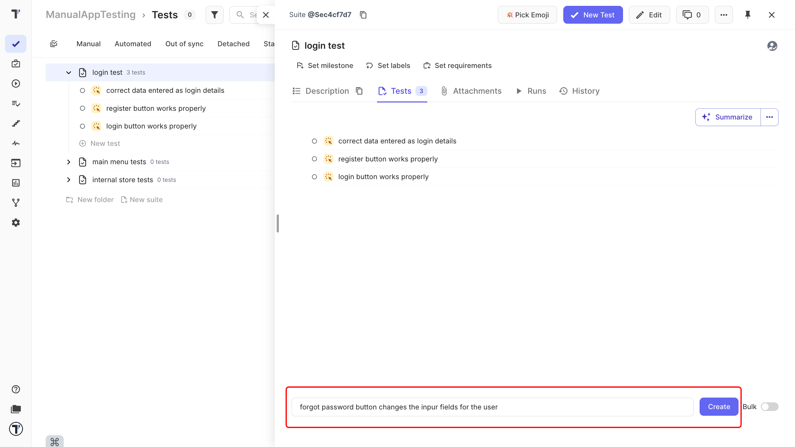
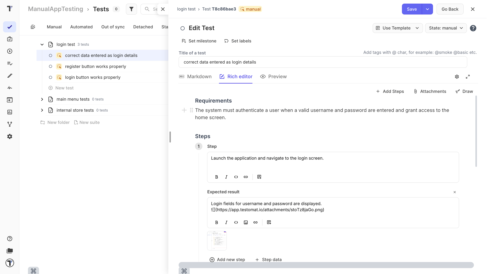
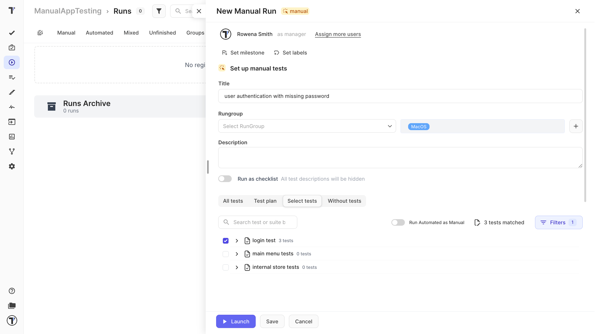
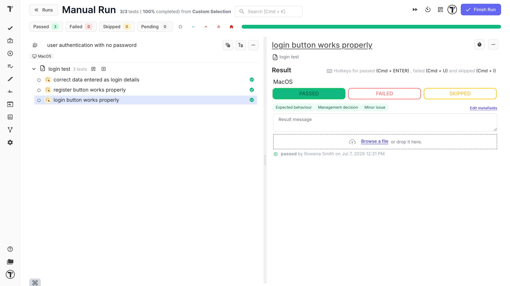
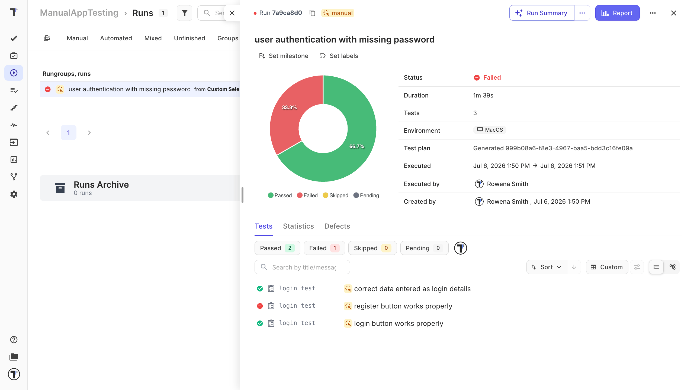

Welcome!

This tutorial walks you through the whole manual testing flow in a Classical project, from an empty project to a finished report you can share. 

You do not need any automated tests or code for this. If you are brand new to Testomat.io, this is the right place to start.

What you will do:

1. Create a Classical project.
2. Add a suite to hold your tests.
3. Write a few test cases.
4. Run them manually.
5. Read and share the report.

## Create a project

A project is the home for all your tests, runs, and reports.

1. On app.testomat.io, click **Create** in the top-right corner.
2. Enter a name in the **Project Title** field.
3. Choose a **Classical Project**.
4. Leave **Fill demo data** unchecked, so you start with a clean project.
5. Click **Create**.

Your empty project opens, ready for its first suite.

:::note

Classical projects use free-form Markdown for test cases, which is the simplest way to start. 

:::

## Create a suite

Test cases always live inside a suite, so you make a suite first. A suite is just a group of related tests, like all the tests for your login page.

1. Go to Tests page.
2. Click **New suite**.
3. Type a name in the suite input field.
4. Press `Enter`.

That's it. Your suite appears in the tree on the left. 

You can add as many suites as you like, and group them in folders later if you need to.

## Add test cases

Now add the tests you want to run. You can create several at once and fill in the details after.

1. Click your suite to select it.
2. Type a test name in the input field, for example, "User can log in with valid details."
3. Click **Create**.
4. Repeat for a few more tests, or turn on the Bulk switch to add several names at once, one per line.

New tests are marked as manual by default, which is exactly what you need.

Next, open a test and describe how to run it, so anyone in your team can follow it:

1. Click a test to open it. 
2. Then click **Edit**.
3. In the editing area, enter the steps and the expected result.
4. Click **Save**.

The Classical editor uses a block-based layout, so it is easy to add an expected result to each step and attach images directly within each step. 

It is still fully Markdown-compatible. Keep steps short and clear, one action per line.

For everything the editor can do, see the [Editor](https://docs.testomat.io/project/tests/classical-test-case-editor/#test-editor-overview).

### Bulk-create Tests

Read full article: [Bulk Edit](https://docs.testomat.io/advanced/bulk-edit-folder/bulk-edit-on-suite-and-test-level/).

You also can add multiple tests by listing their names, without adding each one individually:
1. Open (or create) a suite.
2. Turn on the **Bulk** toggle.
3. Type **one test name per line** in the input field.
4. Click **Create** - every line becomes a separate test, all added together.

## Run your tests manually

With your tests written, you can run them and record what happened.

1. Open the **Runs** tab in the sidebar.
2. Click **Manual Run**.
3. Give the run a title, and set the environment if you want to note the browser or device.
4. Select tests you need to complete or switch to **All Manual Tests**.
5. Click **Launch**.

You now see your test cases one by one. For each test, follow the steps and mark the result:

| Mark the result | Shortcut |
|---|---|
| Passed, if it worked as expected. | `Cmd`+`Enter` on Mac, `Ctrl`+`Enter` on Windows |
| Failed, if it did not. You can add a note, attach a screenshot, or link a defect. | `Cmd`+`U` on Mac, `Ctrl`+`U` on Windows |
| Skipped, if you did not run it. | `Cmd`+`I` on Mac, `Ctrl`+`I` on Windows |

If the run has many tests, use the search box in the run to jump straight to a test or suite by name instead of scrolling through the whole list.

When all tests have results, click **Finish Run** to close the run. That is what turns it into a report. 

:::note

Linking a defect needs a bug tracker connected to your project:

1. Open your project and go to **Settings**.
2. Click **Integrations**.
3. Pick your tracker (GitHub, GitLab, Azure, Linear, Jira).
4. Click **Connect** and sign in to authorize it.
5. Done, the tracker now shows as connected.

After that, **Link to Issue** and **Report Defect** work on your tests and runs.

:::

For more on running tests, see [Running Tests Manually](https://docs.testomat.io/project/runs/running-tests-manually/#_top).

## Read and share the report

Once the run is complete, Testomat.io automatically generates a report for you.

1. On the **Runs** page, click your run to open its report.
2. Review the results: how many passed, failed, or were skipped, plus the duration and who ran it.
3. Filter by status or tag to focus on what matters, for example, just the failures.

To share the outcome with your team or stakeholders, use the share option on the report. For a deeper look at reports, see [Reports](https://docs.testomat.io/project/runs/reports/#_top).

## Next steps

* Ready to add automation? See [Import Tests From Source Code](https://docs.testomat.io/project/import-export/import/import-tests-from-source-code/#_top).
* See [Test Case Creation and Editing](https://docs.testomat.io/project/tests/test-case-creation-and-editing/#_top).