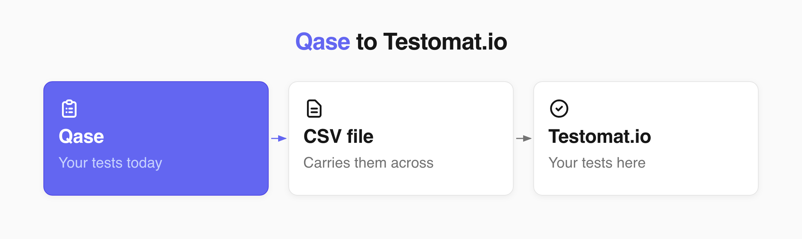
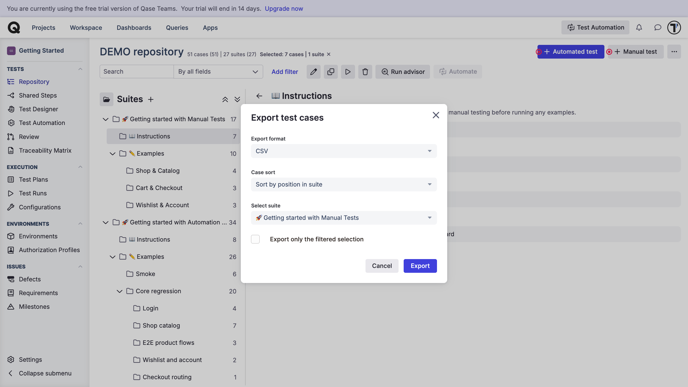
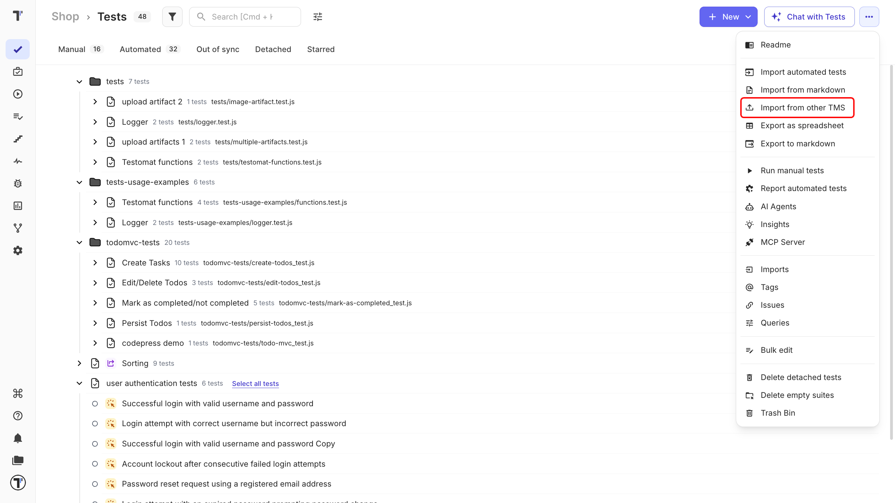
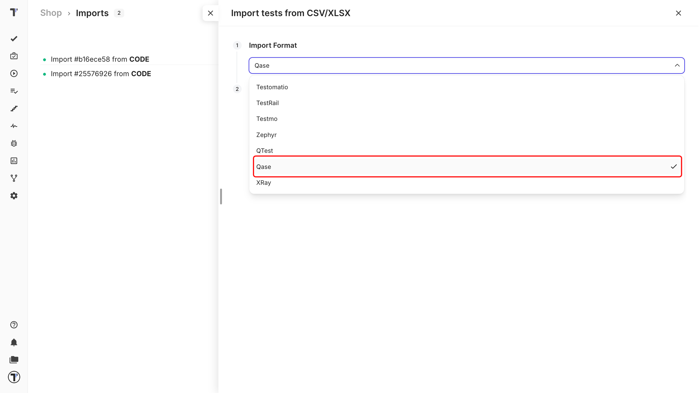
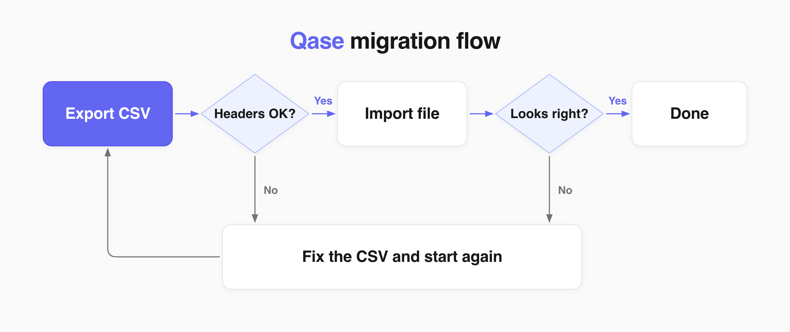
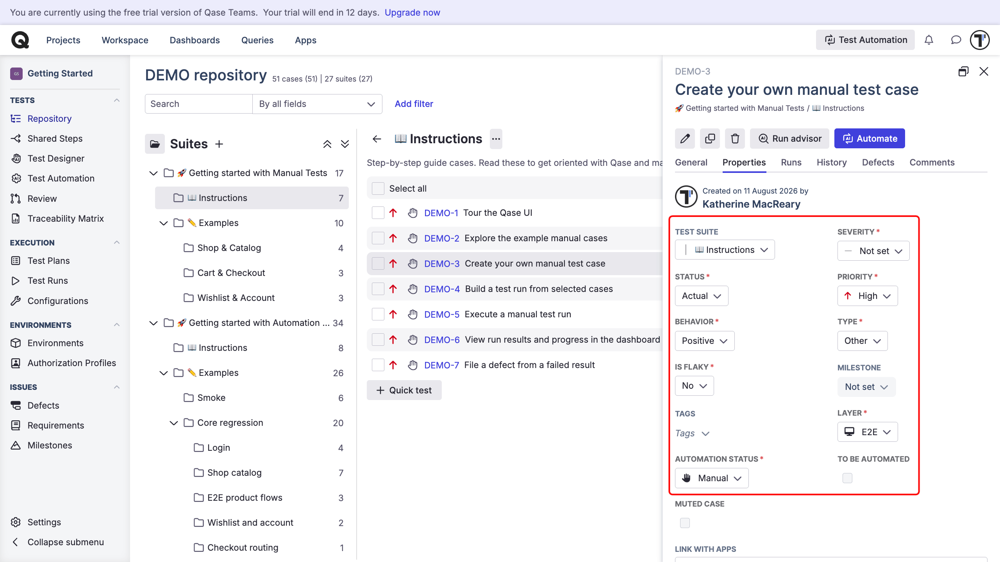
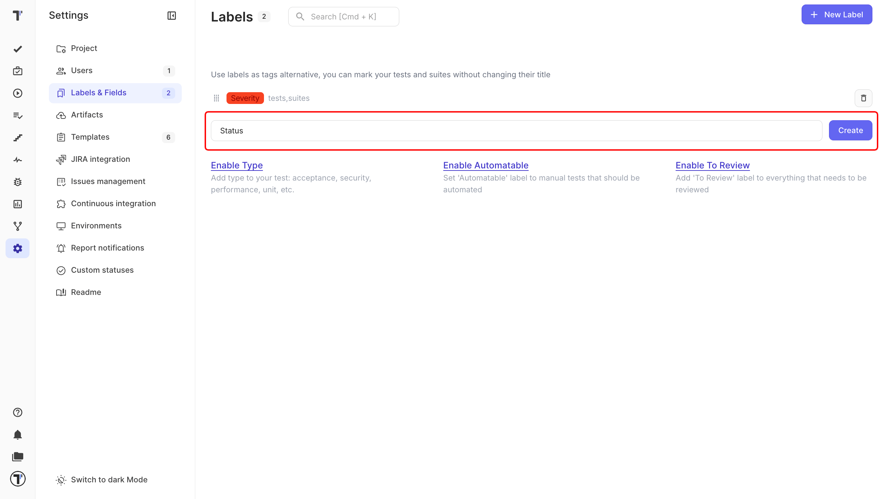
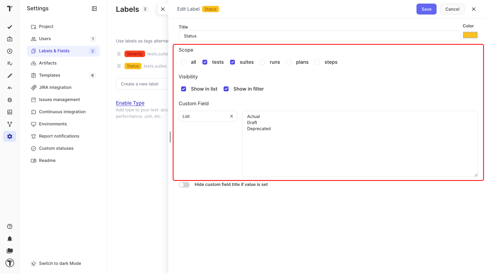
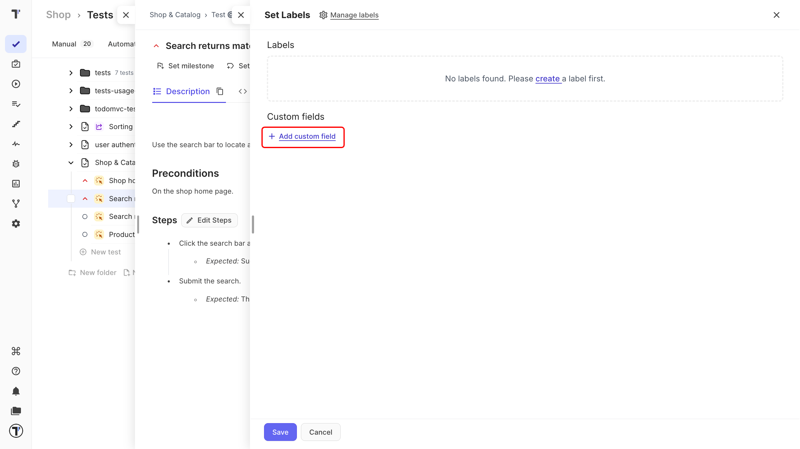

Welcome!

In this tutorial you will export your cases from Qase as a CSV file, import that file, and check that everything works correctly. Qase and Testomat.io store same things, so a migration is simple.

## Export from Qase

First, get your test cases out of Qase as a file.

1. Open your project in Qase.
2. Export your test cases as a **CSV** file.
3. Save the file on your computer.

Open the file and check the first row. It should hold column names like Title and Folder - that is how Testomat.io knows what each column means.

:::note

Not sure yours looks right? Download the [sample Qase CSV](https://testomatio-artifacts.ams3.cdn.digitaloceanspaces.com/documentation/Qase.csv) and compare. Every column is explained in [Import from CSV/XLSX](https://docs.testomat.io/project/import-export/import/import-tests-from-csv-xlsx/).

:::

## Import into Testomat.io

Now you upload a **CSV** file. 

1. Open your project and go to the **Tests** tab.
2. In menu (`...`), click **Import from other TMS** and the **Imports** window will open.
3. Click **Import**.
4. Choose **Import from CSV**. **Import tests from CSV/XLSX** sidebar opens on the right.

Next, in the **Import tests from CSV/XLSX** sidebar:

1. Choose **Qase** from the dropdown.
2. Select the CSV file you exported.
3. Click **Create**.

After Testomat.io reads the file, your test cases appear on the **Tests** page.

You do not have to rebuild anything: you picked Qase in the dropdown, Testomat.io knows how your file is built. Your tests are in the same folders they were in Qase, and each test keeps its steps and expected results.

:::note

Your Qase tests are imported as classic test cases in Testomat.io.

:::

**If this doesn't work**

* **The import fails with an error.** A missing header row is the most common cause.
* **Your folders are flat.** Confirm you picked **Qase** in the dropdown - not another format.
* **Something is still off.** Contact [support](https://docs.testomat.io/support).

Something missing or in the wrong place? Fix it in your CSV file and import again. That is much faster than editing tests one by one.

## Import Qase fields

Test in Qase have their **Properties**. To migrate tests from Qase without losing any data, you must create custom fields in Testomat.io. A custom field can be created in the **Labes & Fields** tab. Each label = property in Qase test. 

A label in Testomat.io works as a keyword for test properties in Qase. To keep a value like `Status`, turn the label into a custom field. You create the label first, then set it up.

1. Go to Testomat.io.
2. Open your project and go to **Settings**.
3. Select **Labels & Fields**.
4. Enter a title, such as `Status`, and click **Create**.

Next, click the label you just created. To Edit:

1. Under **Scope**, pick **tests** and **suites**. Scope is the list of pages where the label can be used.
2. Under **Visibility**, pick **Show in filter** and **Show in list** to use it on the **Tests** page.
3. In the **Custom Field** dropdown choose **List**.
4. Add the Qase values, one per line (Actual, Draft, Deprecated and so on).
5. Click **Save**.

Open any test and click **Set labels**. In the new modal window, click **Add custom field** in the **Custom fields** section. All values appear in a dropdown.

:::note

Match the type to Qase fields: a Qase selectbox or multiselect becomes a **List**, a text field becomes a **String**, and a number field becomes a **Number**.

:::

## Next steps

* Moving from another tool? See [Import Tests From TestRail](https://docs.testomat.io/project/import-export/import/import-tests-from-testrail/), [Import Tests From QTest](https://docs.testomat.io/project/import-export/import/import-tests-from-qtest/), and [Import Tests From Testmo](https://docs.testomat.io/project/import-export/import/import-tests-from-testmo/).
* Connect automated tests in [Import Tests From Source Code](https://docs.testomat.io/project/import-export/import/import-tests-from-source-code/).
* Connect an AI assistant to your project with [MCP - Connect AI Assistant](https://docs.testomat.io/tutorials/mcp-connection).