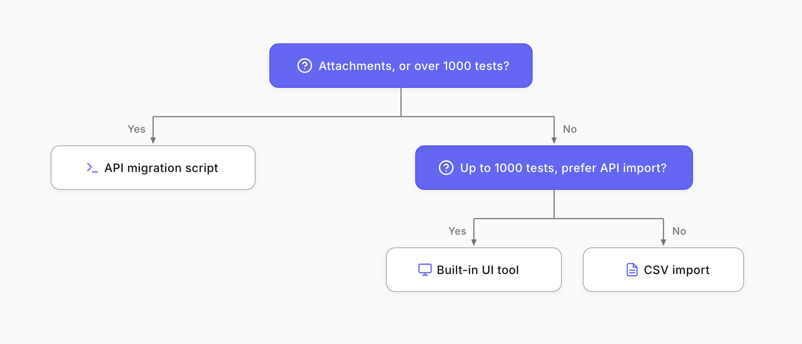
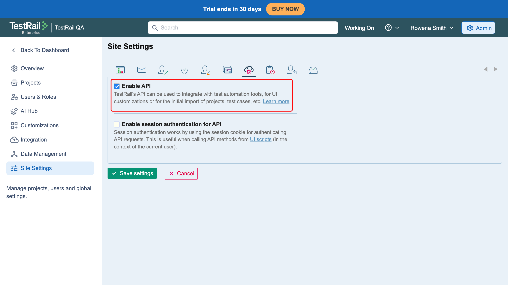
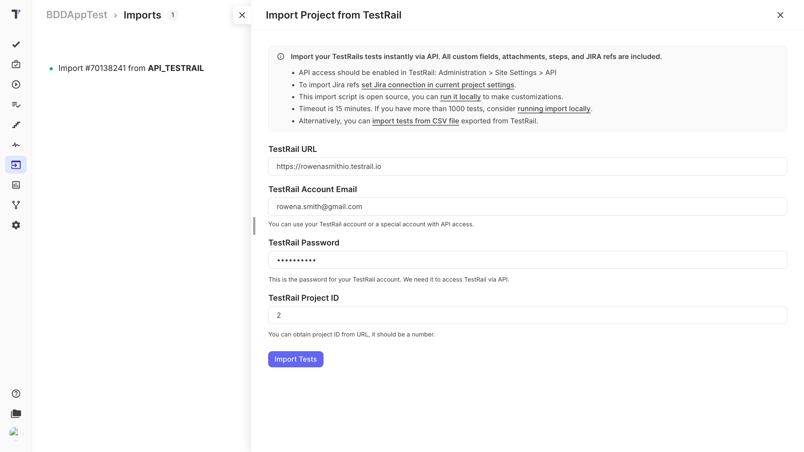
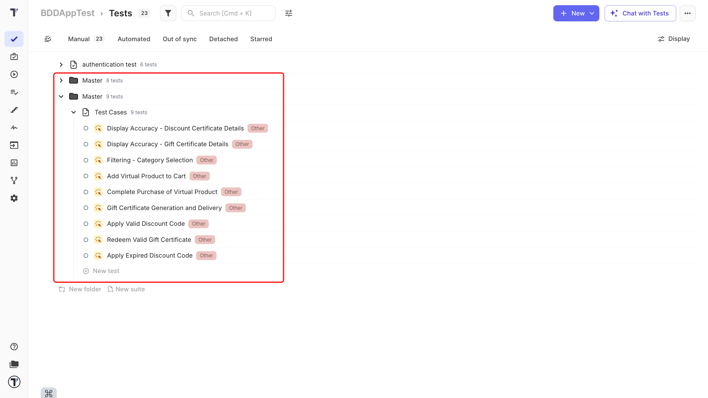

Welcome! 

This tutorial moves your test cases from TestRail into Testomat.io. You will export your tests from TestRail, import them, keep your structure and statuses intact, and check that everything landed correctly.

Testomat.io gives you three ways to import from TestRail. You pick one based on the size of your project and whether you need attachments.

What you will do:

1. Pick the right import method.
2. Export your tests from TestRail.
3. Import them into Testomat.io.
4. Check the structure and statuses.
5. Verify the result.

## Pick your method

Pick your import method by project size and whether you need attachments.

* **CSV import**. Quickest option, for straightforward migrations without attachments or extra metadata.
* **Built-in UI tool (via API)**. For small or medium projects, up to 1000 tests. Imports through the TestRail API.
* **API migration script**. For large projects over 1000 tests, or when you need attachments and more control.

:::note

Start with a smaller project to learn the process before you move your biggest one.

:::

## Export from TestRail API

For the [CSV method](https://docs.testomat.io/project/import-export/import/import-tests-from-csv-xlsx/#_top), export your test cases from TestRail as a CSV file. The built-in UI tool and the script pull data straight from TestRail instead, so for those you just need access.

If you plan to use the built-in UI tool, first enable the **TestRail API** in TestRail under **Administration**, **Site Settings**, **API**.

## Import into Testomat.io

Start the import from your Testomat.io project.

1. Open your project and click the Imports tab.
2. Click **Import From TestRail**.

## Keep your structure and statuses

Choosing TestRail as the source tells Testomat.io how to read your file, so your sections and suites come across as the same tree, with steps and expected results preserved.

If you want your imported cases as [BDD scenarios](https://docs.testomat.io/project/tests/bdd-test-case-editor/) instead of classic ones, Testomat.io can convert them: your Precondition becomes Given, each Step becomes When, and the Expected Result becomes Then.

## Verify the result

Once the import finishes, do a quick check so you can trust the migration.

1. Open the **Tests** page and confirm your suites and folders match TestRail.
2. Open a few test cases and check the steps, expected results, and any custom fields.
3. Compare the test count against TestRail to make sure nothing is missing.

## Next steps

* See other import options and formats in [Import Tests From Testmo](https://docs.testomat.io/project/import-export/import/import-tests-from-testmo/), [Import Tests From QTest](https://docs.testomat.io/project/import-export/import/import-tests-from-qtest/), and more.
* Have automated tests too? Connect them in [Import Tests From Source Code](https://docs.testomat.io/project/import-export/import/import-tests-from-source-code/).