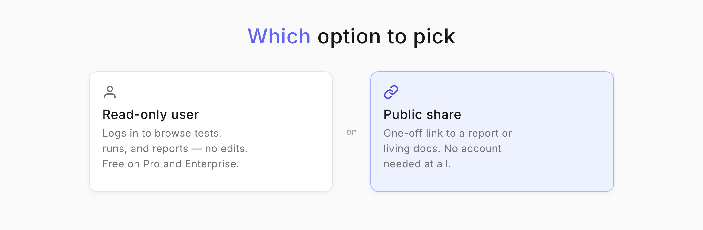
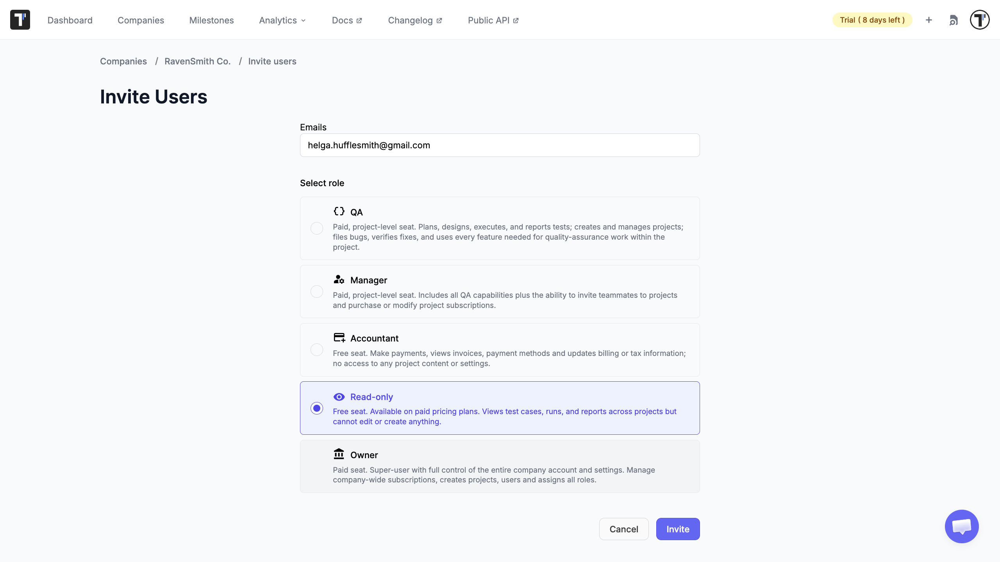
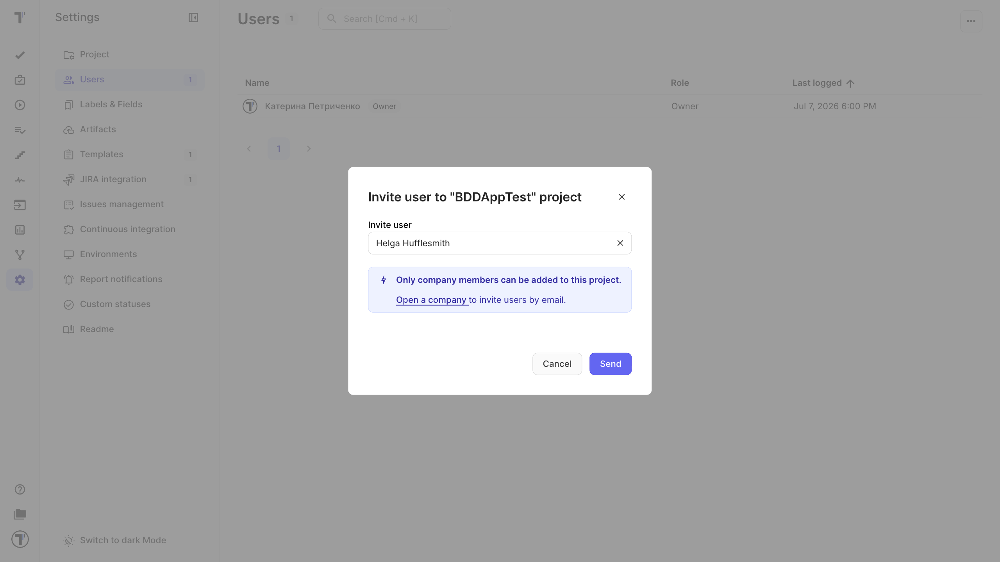
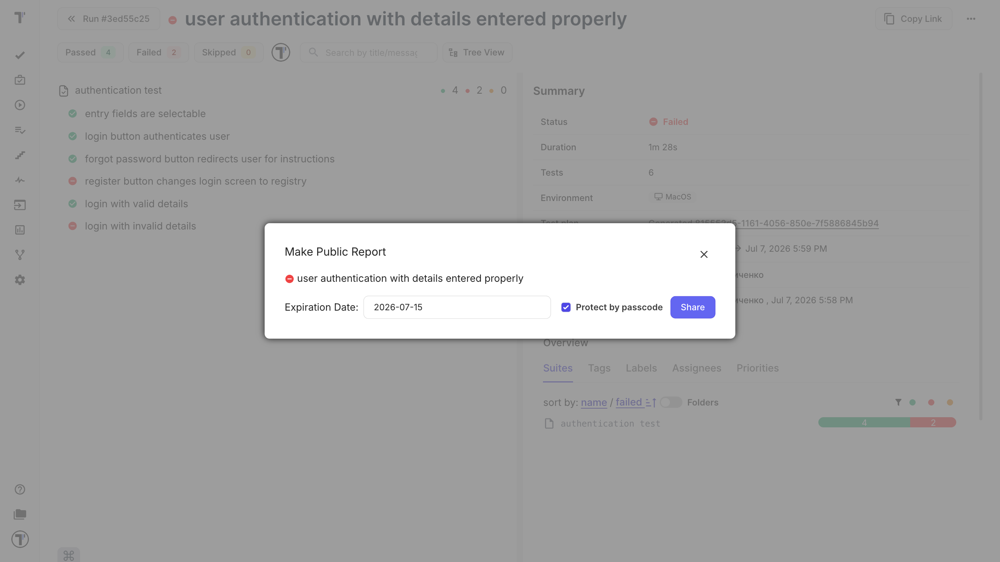

Welcome! 

This tutorial shows you how to give someone outside your team a safe, look-but-don't-touch view of your testing. That could be a client, an auditor, or a stakeholder who wants to follow progress without the risk of changing anything.

You have two ways to do this, and this tutorial covers both: add the person as a Read-only user, or share a single report or living documentation with them without an account at all.

## Which option to pick

* **Read-only user**. Best when the person needs ongoing access to browse tests, runs, and reports themselves. They log in but cannot change anything. It is free of charge on Professional and Enterprise plans.
* **Public share**. Best for a one-off. You send a link to a report or living docs, and they need no Testomat.io account at all.

## Invite an external user as Read-only

Users are managed at the Company level, so you invite them there first.

1. Open the **Companies** page and select your company.
2. Invite the user by email.
3. Assign the **Read-Only** role.

:::note

Read-only members can view information but cannot make any changes. See [Users and Access](https://docs.testomat.io/management/company/users-and-permissions/#_top) for what every role can do.

:::

## Add them to the right project

A company can hold several projects, so give the person access only to the one they need.

1. Open the project you want to share.
2. Go to **Settings**, then **Users**.
3. Click **Invite**.
4. Select the Read-only user and click **Send** to invite them to the project.

They can now sign in and browse that project, but every edit and run control stays locked for them.

## Or share without an account

If the person only needs to see one report or your living docs, skip the account and send a link.

To share a run report:

1. Open the run and click **Report**.
2. Click the actions menu (`...`).
3. Choose **Share Report by Email** to send it to specific people, or **Share Report Publicly** to create a link.
4. For a public link, set an expiration date the default is 7 days, and keep the passcode on for security.

:::note

Public sharing is a two-level switch. Turn it on at the **Company** level first, then in **Project Settings** under the **Sharing** section, or the option stays greyed out. 

:::

To share living documentation, open it from the project and send its link the same way. This gives stakeholders an always-current view of what your tests cover, with no login.

## Next steps

* Review what each role can do in [Users and Access](https://docs.testomat.io/management/company/users-and-permissions/#_top).
* Want stakeholders to follow coverage live? Share your [Living Documentation](https://docs.testomat.io/advanced/living-doc/#_top).
* Want to present particular results? Send a [run report](https://docs.testomat.io/project/runs/reports/#how-to-share-run-report).