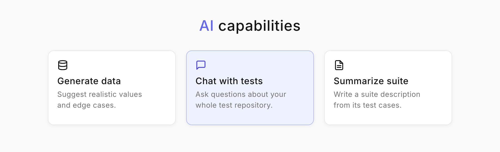
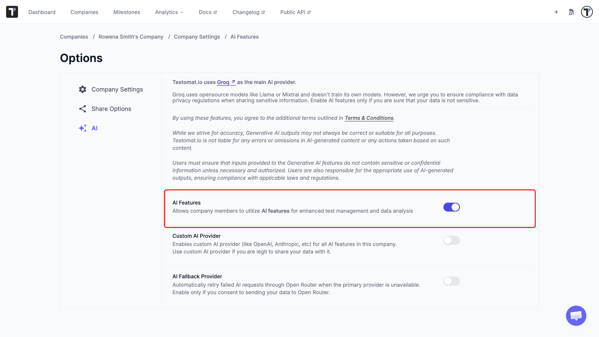
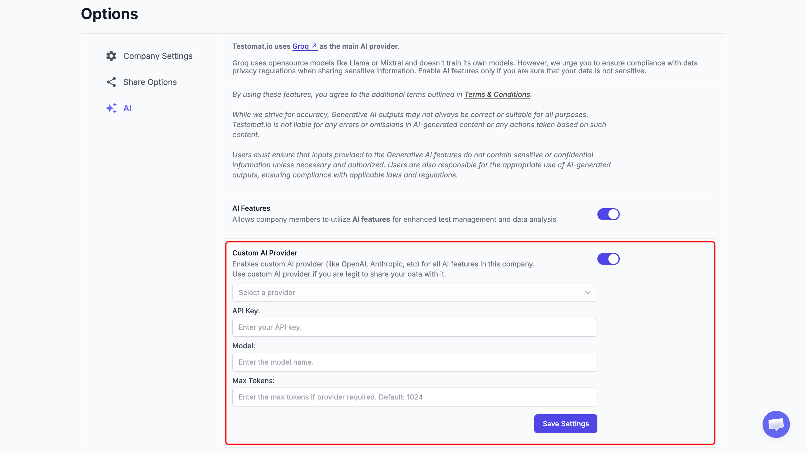
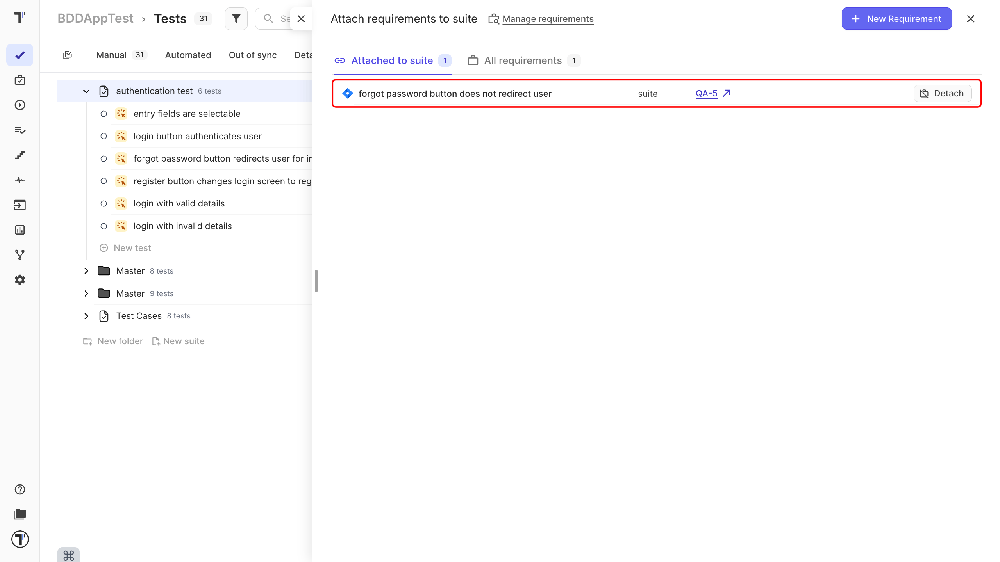
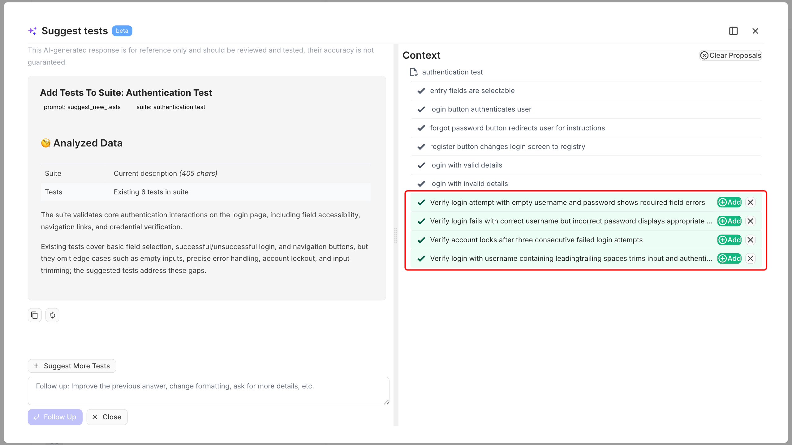
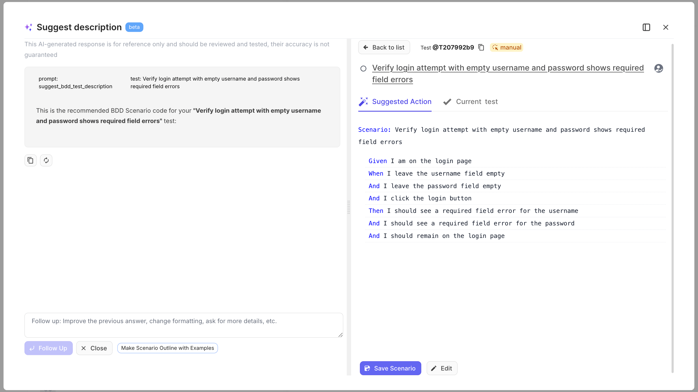

Welcome! 

This tutorial turns on Testomat.io's AI features and walks them through a full testing cycle: you start from a requirement, generate tests from it, describe them, then analyze the run and question your analytics. AI here is a helper that saves you typing and digging, not a replacement for your judgment.

What you will do:

1. Enable AI for your company.
2. Add a requirement to your project.
3. Generate tests from the requirement.
4. Generate a test description.
5. Analyze a run with AI.
6. Chat with Analytics.

## Before you start

AI features are off by default. A Company Owner turns them on, and only your company's chosen AI provider sees the content you send.

:::note

Only enable AI if your test data is not sensitive. The AI provider processes the text you send it, so check your data privacy rules first.

:::

## Enable AI

To integrate and begin working with AI features in your Testomat.io account, follow these steps:

1. Open **Company Settings**.
2. Go to the **Administration** section.
3. Turn on the **AI Features**.

Once enabled, the AI actions appear across your project. See [AI settings](https://docs.testomat.io/management/company/administration/#ai) for the details.

### Use your own AI provider

If your company prefers an AI provider it already trusts, Testomat.io can connect to a third-party service such as OpenAI, Anthropic, and others. You keep all the same AI features while choosing the provider that fits your security and compliance rules.

1. In the AI settings, turn on the **Custom AI Provider** option.
2. Select a provider from the dropdown.
3. Enter the **API Key**.
4. Enter the **Model** name.
5. Enter **Max Tokens**, if your provider requires it.
6. Click **Save Settings**.

:::note

Once a custom provider is connected, every AI request runs through it. Testomat.io does not fall back to a shared provider — if your provider is unavailable, the request fails and you are notified. See [Custom AI Provider](https://docs.testomat.io/management/company/administration/#custom-ai-provider) for the full reference.

:::

## Add a requirement

Requirements are what your tests exist to cover, so the cycle starts here. Link one to your project and AI can generate tests from it.

First, set up the integration for your requirement source. See [Jira](https://docs.testomat.io/integrations/issues-management/jira/#connecting-to-jira-project) or [Confluence](https://docs.testomat.io/integrations/issues-management/confluence) for the steps. Then add the requirement:

1. Open the **Requirements** page.
2. Click **+ New Requirements** or **+ Add Requirement**.
3. Select your requirement source, for example Jira.
4. Enter the source identifier, such as the **Jira Issue ID**.
5. Click **Save**.

:::note

You can add a requirement to an ongoing project at any time using the same steps. See [AI-Requirements](https://docs.testomat.io/advanced/ai-powered-features/ai-requirements/) for other sources, including files and plain text.

:::

## Generate tests from the requirement

With the requirement linked, AI reads it and proposes the test cases that cover it, so you start from a draft instead of a blank suite.

1. Open the **Requirements** page and click your requirement.
2. On the **Summary** tab, click **Analyze Requirement**.
3. Click **Add tests to {Suite_name} Suite**.
4. Review the suggested cases and click **Add** on the ones you want.

Click **Suggest More Tests** if you need extra cases, and double-click any suggested title to edit it before adding.

:::note

Nothing is added automatically. You always choose which cases to keep.

:::

## Generate a test description

A test name tells you what to check, but not how. AI writes the description from the name, or improves the one you already have.

1. Open a test case.
2. Click **Suggest Description**.
3. Review the result, edit it if needed, then save.

:::note

This works the same way in BDD projects. On the **Scenario description** tab, click **Suggest Description** and AI turns your Given/When/Then steps into a readable overview.

:::

## Analyze a run with AI

Once your tests have run, AI groups the failures so you read a handful of causes instead of a wall of errors.

1. Go to the **Runs** page.
2. Open a finished automated run.
3. Click **Clusterize Errors**.

:::note

**Clusterize Errors** appears only on finished automated runs with 5 or more failures.

:::

## Chat with Analytics

Analytics answers questions you already know to ask. Chat with Analytics lets you ask in plain language instead of hunting through dashboards.

1. Go to the **Analytics** page.
2. Open **Chat with Analytics**.
3. Ask your question and send it.

Ask things like which tests are most unstable, which areas fail most often, or how execution trends changed over time.

:::note

Metrics are calculated over a 30-day window unless you specify a different range.

:::

## Next steps

* Want to expand your AI capabilities? Try setting up [AI Agents](https://docs.testomat.io/advanced/ai-powered-features/ai-agents/).
* See every generative feature across suites, tests, and code in [AI-Powered Features](https://docs.testomat.io/advanced/ai-powered-features/ai-powered-features/).
* Drive your test design from product requirements with [AI-Requirements](https://docs.testomat.io/advanced/ai-powered-features/ai-requirements/).