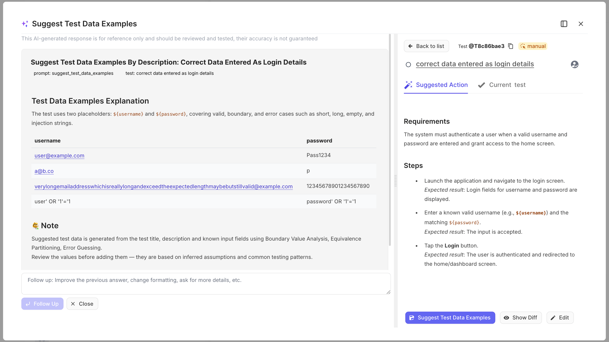
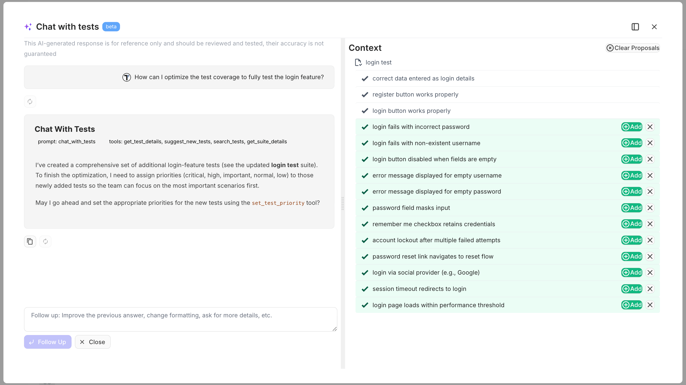
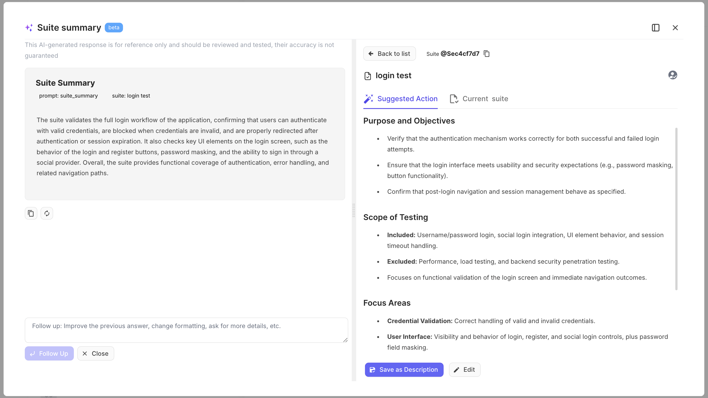

Welcome! 

This tutorial turns on Testomat.io's AI features and shows you the practical ones you will use most: generating test data on a test, chatting with your tests to explore them, and summarizing a suite. AI here is a helper that saves you typing and digging, not a replacement for your judgment.

What you will do:

1. Enable AI for your company.
2. Generate test data on a test.
3. Chat with your tests.
4. Summarize a suite from its tests.

## Before you start

AI features are off by default. A Company Owner turns them on, and only your company's chosen AI provider sees the content you send.

:::note

Only enable AI if your test data is not sensitive. The AI provider processes the text you send it, so check your data privacy rules first.

:::

## Enable AI

To integrate and begin working with AI features in your Testomat.io account, follow these steps:

1. Open **Company Settings**.
2. Go to the **Administration** section.
3. Turn on the **AI Features**.

Once enabled, the AI actions appear across your project. See [AI settings](https://docs.testomat.io/management/company/administration/#ai) for the details.

### Use your own Amazon Bedrock models

If your team wants more control over which model runs, Testomat.io supports Amazon Bedrock as a custom AI provider. You point Testomat.io at your own configured Bedrock models and still use all the same AI features. This gives you more flexibility over AI-driven workflows while staying compatible with Testomat.io's AI capabilities.

1. In the AI settings, toggle the **Custom AI Provider** switch.
2. Select **Bedrock** as the provider.
3. Add your Bedrock configuration.
4. Click **Save Settings**.

## Generate test data on a test

Instead of creating input values by hand, let AI generate realistic test data based on the test's description. This widens your coverage, surfaces edge cases you might miss, cuts preparation time, and improves both manual and automated scenarios. 

1. Open a test that has a description.
2. Access the AI actions menu (next to the **Improve Description** button).
3. Select **Suggest Test Data Examples**.
4. Review the suggested values, and keep the ones you want.

:::note

AI-generated data can be used as-is or modified before you run. For how parameters work, see [Parameters](https://docs.testomat.io/advanced/living-doc/#tests-parameters).

:::

## Chat with your tests

Chat with Tests is an assistant that reads your test repository and answers questions about it, so you can understand a large set of tests without clicking through every one.

1. Go to the **Tests** page.
2. Click the **Chat with Tests** button in the header.
3. Type your prompt and click **Send**.

You can also run this on a single folder. Select the folder first, then click **Chat with Tests** to focus the answer on just that folder.

## Summarize a suite

AI can write a suite description for you by reading the test cases inside it, which saves you documenting suites by hand.

1. Go to the **Tests** page.
2. Select a suite that has test cases.
3. Click **Summarize**.

Review the suggested summary, then copy it, regenerate it, or refine it with the follow-up field until it reads right.

:::note

The **Summarize** button appears only when the suite already contains tests.

:::

## Next steps

* Want to expand your AI capabilities? Try setting up [AI Agents](https://docs.testomat.io/advanced/ai-powered-features/ai-agents/).