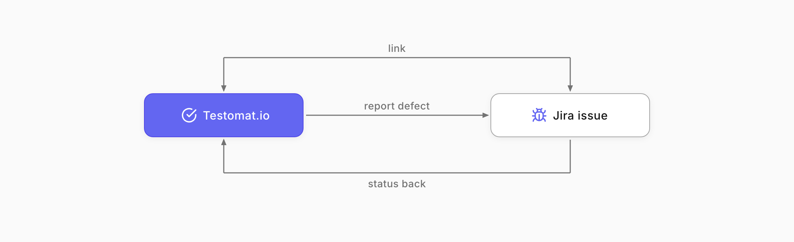
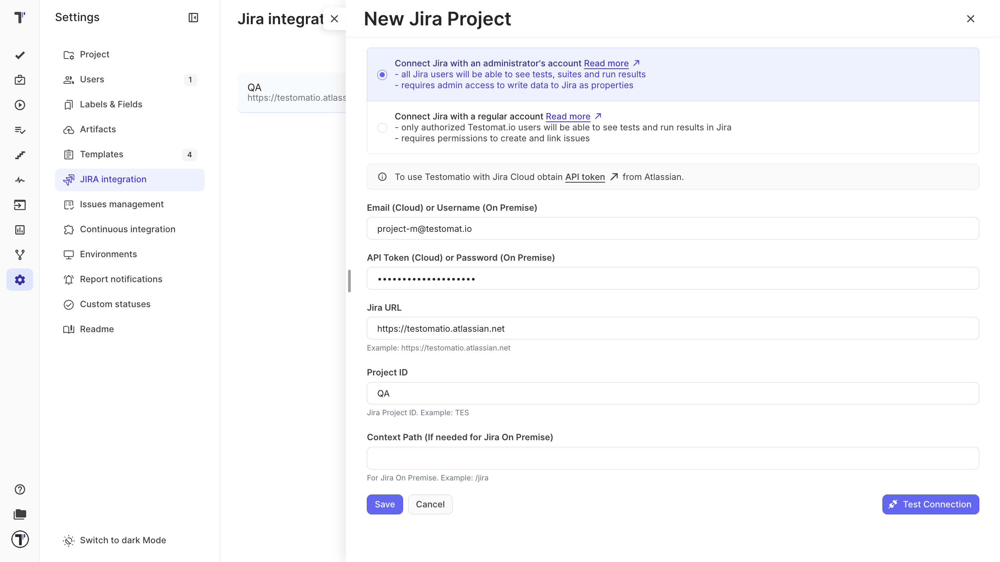
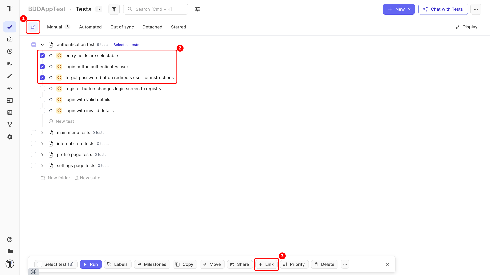
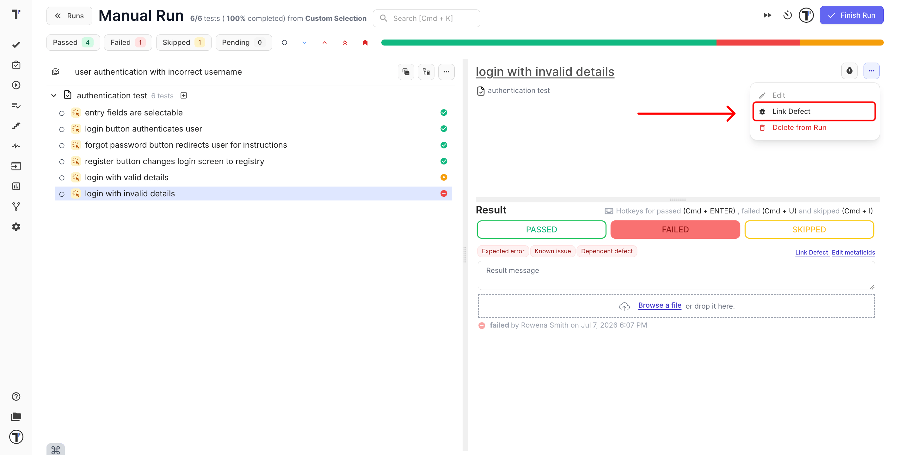
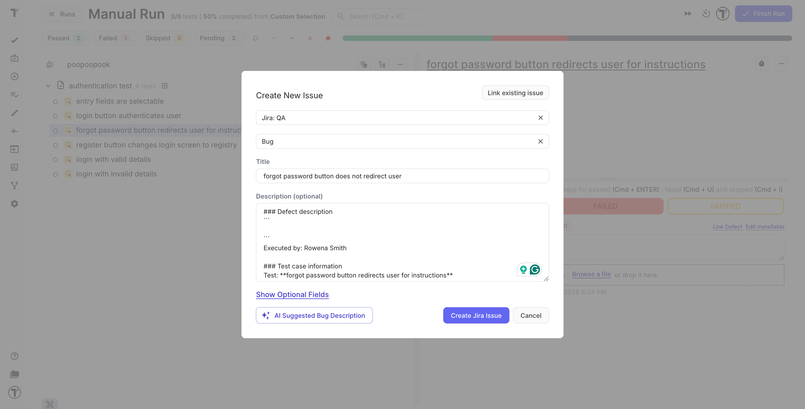
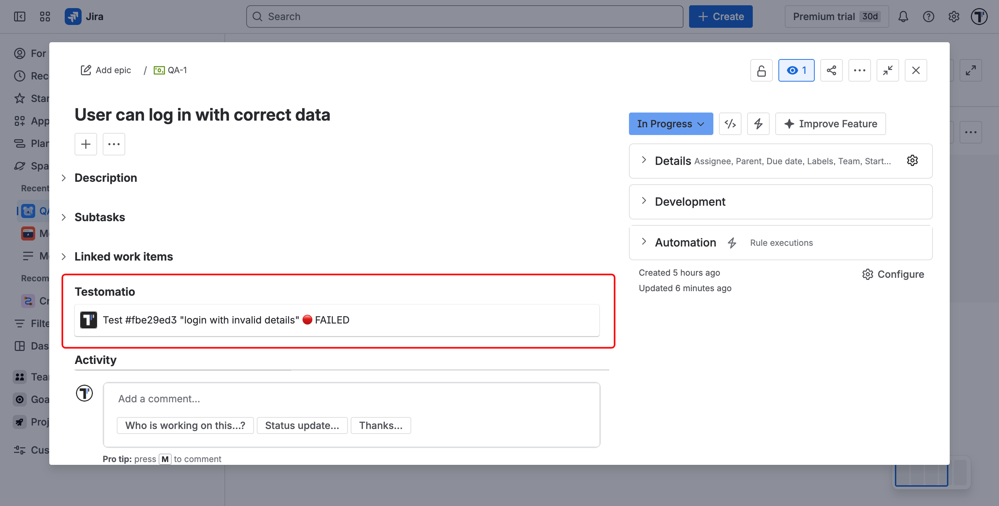
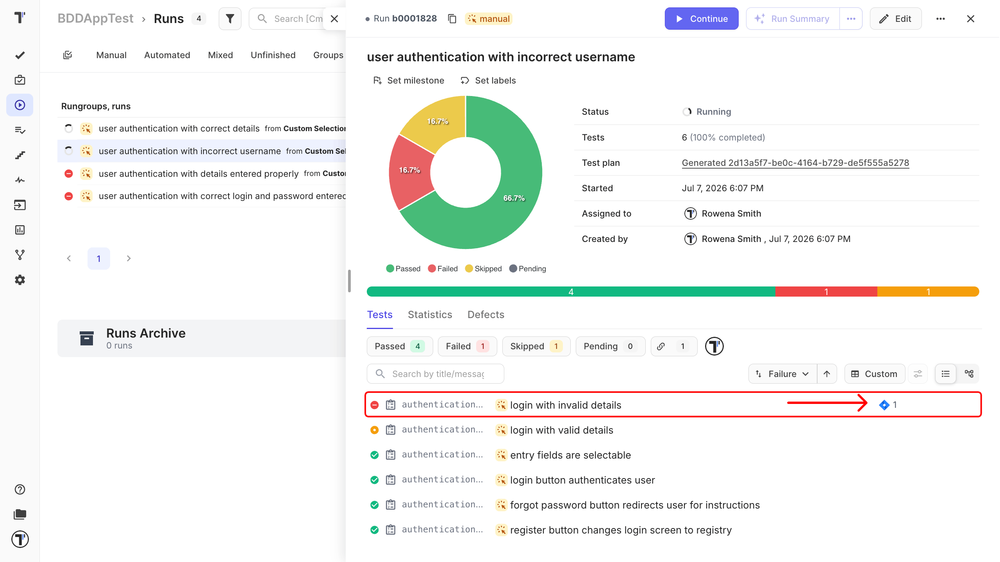

Welcome! 

This tutorial connects Testomat.io to Jira and walks you through the everyday flow: link a test to a Jira issue, report a defect from a run, and see testing status back in Jira. Once this is set up, tests and Jira issues stay tied together, so the team can see what is tested and what is failing.

What you will do:

1. Connect your Jira project.
2. Link a test to a Jira issue.
3. Report a defect from a run.
4. See the status synced back in Jira.

## Before you start

Make sure you have:

* Jira profile access, with administrator rights in the Jira workspace.
* A Manager or Owner role in your Testomat.io project.
* The [Testomat.io Jira Plugin](https://docs.testomat.io/advanced/jira-plugin/) is installed in Jira.

:::note

Connecting requires Jira admin rights. The person who sets up the integration in Project Settings must have them, or the project cannot be connected. See [Integrations](https://docs.testomat.io/integrations/issues-management/jira) for the full reference.

:::

## Connect your Jira project

1. In your Testomat.io project, open **Settings** in the sidebar.
2. Click **Jira Integration**.
3. Click **Add Jira project**.
4. In the **New Jira project** panel, select the connection type and enter the details.

Pick the connection type based on who should see testing data in Jira:

| The account type | Tests and results are visible to |
|---|---|
| **Administrator account** | Linked tests and results are visible to all Jira users through the plugin, while editing and running still require a Testomat.io login.  Use this if you want everyone in Jira to see coverage. |
| **Regular account** | Linked tests and results are visible only to logged-in Testomat.io users.  Use this if you need to restrict access. |

Once saved, your Jira project is connected and ready.

## Link a test to a Jira issue

Linking ties a test to the story or bug it covers, so coverage shows on both sides.

1. Select the test, or several tests, on the Tests page.
2. Click **Link**.
3. Type in the Jira issue to link them to.

The link now appears on both the test and the Jira issue. You can also link a test to the Jira issue by hovering over the test and clicking the link icon.

:::note

You can also link tests from inside Jira. The [Jira Plugin](https://docs.testomat.io/advanced/jira-plugin/) lets you link and unlink tests, suites, and plans to an issue without leaving Jira.

:::

## Report a defect from a run

When a test fails during a run, you can create a Jira bug without leaving Testomat.io.

1. In the run, open the failed test.
2. Choose to report a defect and enter the Jira issue link.
3. If needed, you can create a new issue and link the defect to it:
    1. Click **Create new issue**.
    2. Select **Jira profile** and **Jira Issue type**.
    3. Enter the issue **Title** and **Description**.

4. Click **Create Jira issue**. The new issue has been created in Jira and linked to the test.

:::note

To prefill the bug summary and description, set up a Defect template first. See [Templates](https://docs.testomat.io/management/project/templates/#applying-templates-to-defects).

:::

## See the status synced back in Jira

With the plugin in place, your Jira issues show the linked tests and their latest results, so a product owner can open an issue and see whether it passed or failed.

1. Open the linked issue in Jira.
2. View the Testomat.io panel to see linked tests, coverage, and the latest run status.

With the [Jira Plugin](https://docs.testomat.io/advanced/jira-plugin/) in place, your Jira issues show the linked tests and their latest results, so a product owner can open an issue and see whether it passed or failed.

If something looks out of date, use [Synchronize with Jira](https://docs.testomat.io/integrations/issues-management/jira/#how-to-connect-to-jira-project) from the integration to refresh the link.

The link between the test and the Jira issue can be viewed in the run next to the reported defect.

## Next steps

* Want cleaner bug reports? Set up a [Defect](https://docs.testomat.io/management/project/templates/#applying-templates-to-defects) template in Templates.
* Setting up other tools? See [Integrations](https://docs.testomat.io/integrations/issues-management/).
* Working mostly inside Jira? See the [Jira Plugin](https://docs.testomat.io/advanced/jira-plugin/) for running tests and managing suites without leaving Jira.