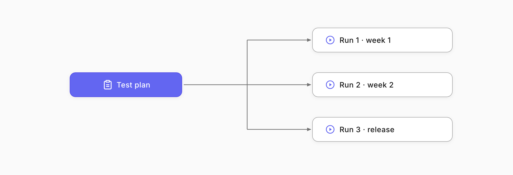
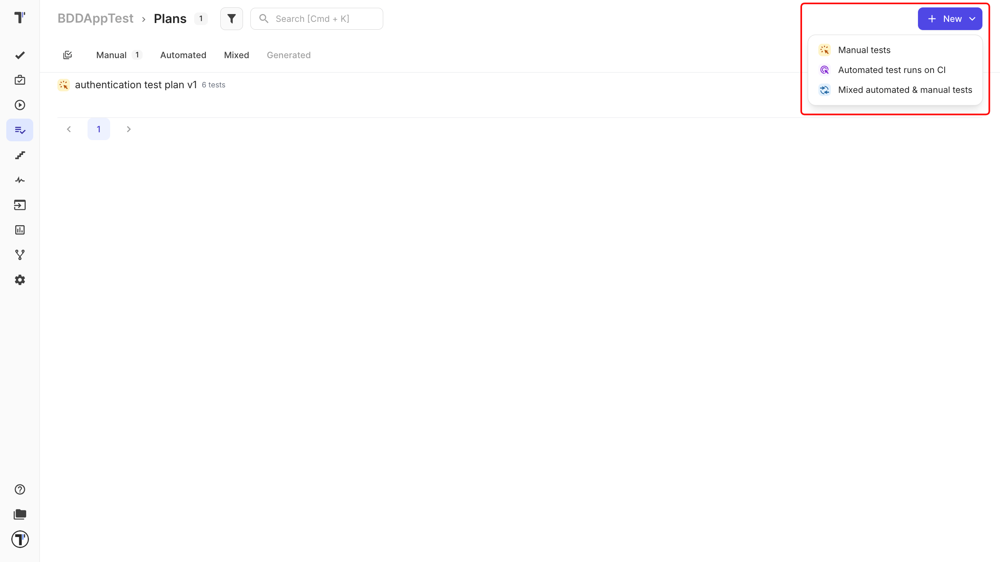
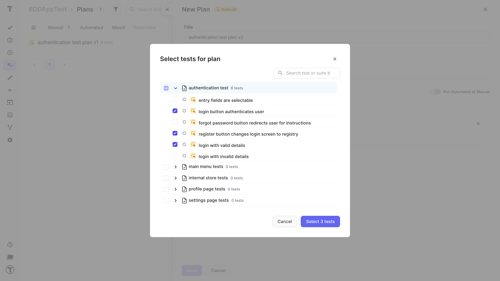
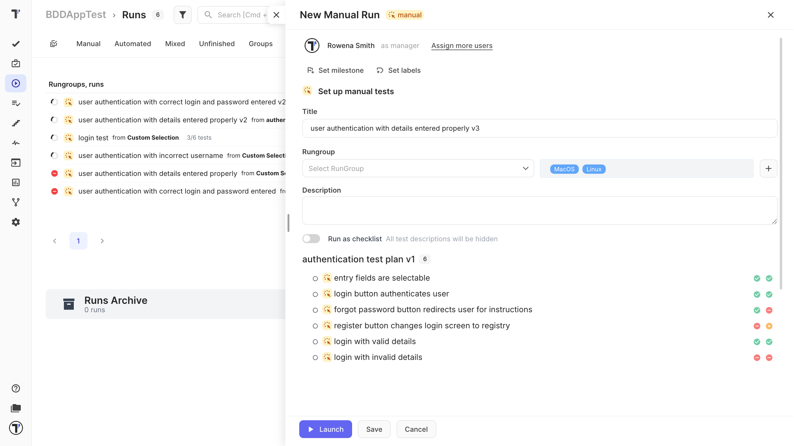

Welcome! 

A test plan is a saved set of tests you can run again and again without picking them each time. It's great for the runs you repeat, like a regression pass before every release or a weekly smoke check.

What you will do:

1. Create a plan.
2. Add tests to it.
3. Launch a run from the plan.

## Create a plan
1. Open the **Plans** tab in the sidebar.
2. Click **+ New** in the top right corner.
3. Choose the plan type. Select **Manual** to run tests manually. (Automated and Mixed plans also exist, for tests run through CI.)
4. Give the plan a clear name, like "Release regression."

## Add tests to the plan

Now choose which tests belong in this plan.

1. Pick tests from the tree by selecting folders and suites, or use a filter to grab tests by tag or priority.
2. Save the plan.

Your plan is now saved and ready to reuse. The next time you need this same set, you won't have to pick the tests again.

## Launch a run from the plan

1. Open your plan and start a manual run from it.
2. Work through the run, marking each test Passed, Failed, or Skipped, then click Finish Run.

For the full run walkthrough, see [Run Manual Tests](https://docs.testomat.io/getting-started/#run-manual-tests).

:::note

For [Automated](https://docs.testomat.io/getting-started/#run-automated-tests) or [Mixed](https://docs.testomat.io/project/runs/running-manual-and-automated-tests/#how-to-launch-mixed-runs) plans, the Launch button only works once [Continuous Integration](https://docs.testomat.io/integrations/continuous-integration/#_top) is set up. Manual plans have no such requirement.

:::

## Next steps

* See [Plans page](https://docs.testomat.io/project/plans) for more information.
* Run your plan whenever you need it in [Run Manual Tests](https://docs.testomat.io/getting-started/#run-manual-tests) and [Run Automated Tests](https://docs.testomat.io/getting-started/#run-automated-tests).
* Prepare a plan run to start later with [Scheduled Runs](https://docs.testomat.io/project/runs/managing-runs/#scheduled-runs).
* Keep plans tidy with labels, see [Tags & Labels](https://docs.testomat.io/project/runs/managing-runs/#tags-and-labels-on-manual-run-page).