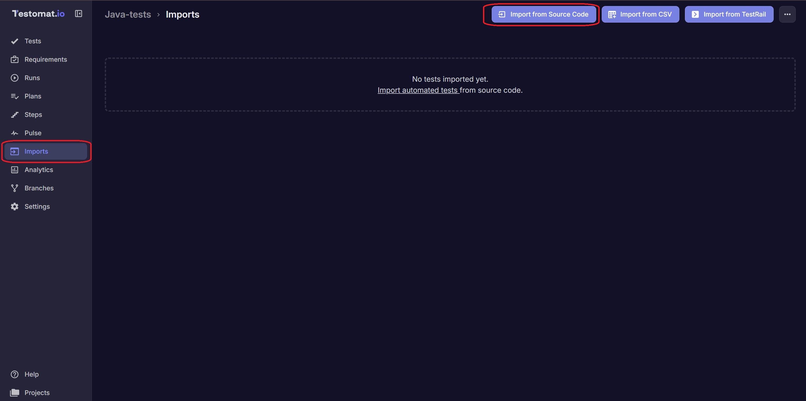
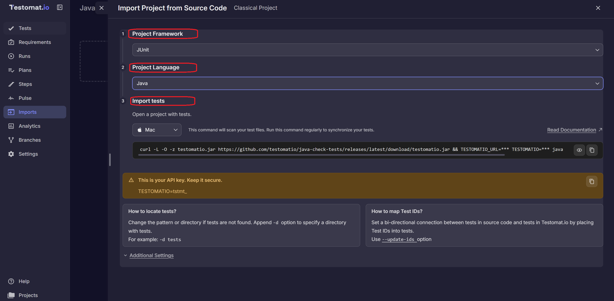
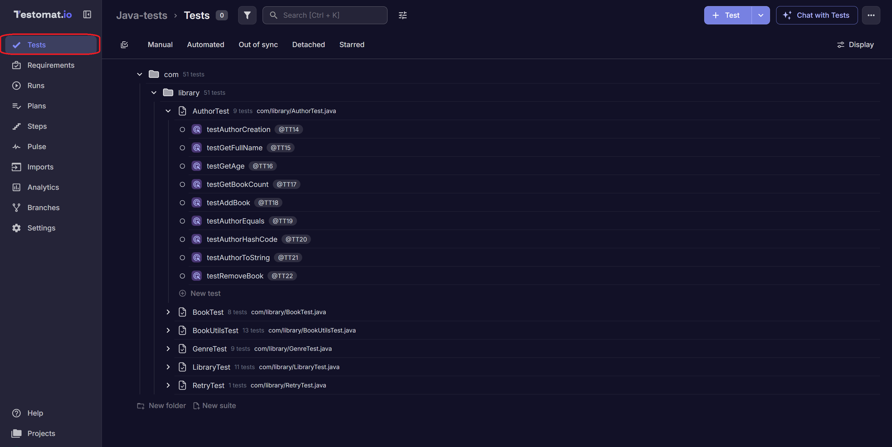
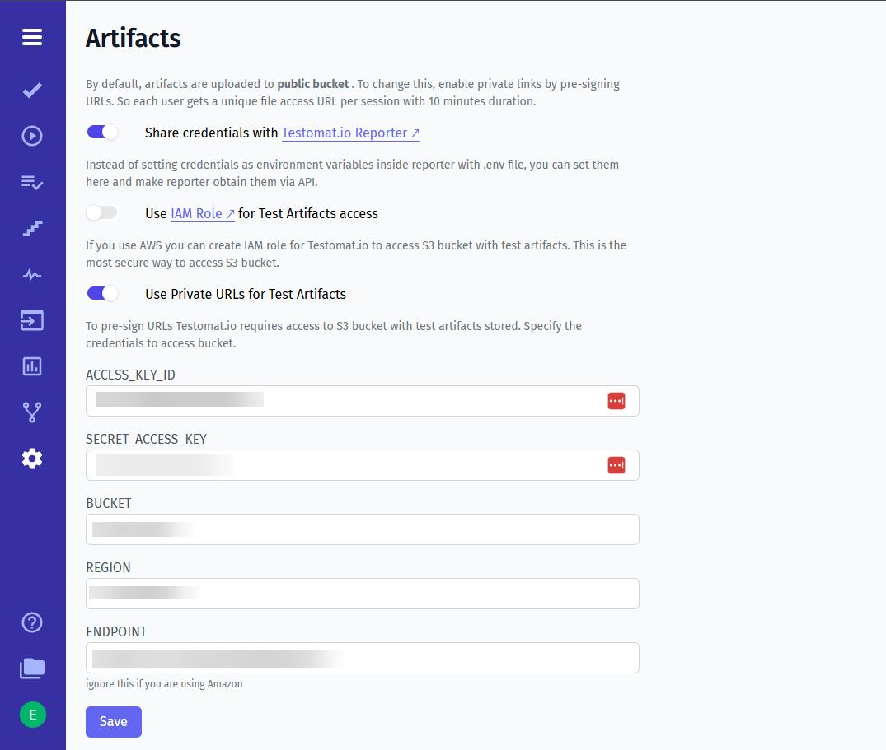

<!--
    ## Importing Tests
        - JUnit 5 support
        - TestNG support
        - parameterized tests
        - auto-assign test IDs
        - source code synchronization

    ## Reporting Tests
        - report execution results
        - local execution
        - artifacts
        - S3 integration
        - logs
        - CI/CD reporting
        - Gradle integration
        - Maven integration

    ## Advanced
        - parallel execution
        - run title configuration
-->

# Java Integration with Testomat.io

Testomat.io supports Java test automation projects built with popular testing frameworks such as JUnit 5, TestNG. This integration allows teams to import automated tests, synchronize test IDs, track execution results, and consolidate reports from local and CI environments.

In this guide, you'll learn how to use Testomat.io with Java-based test automation projects.

---

## Supported Frameworks

Currently, the following Java testing frameworks are supported:

- JUnit 5
- TestNG

---

## Importing Java Tests

You can import your Java tests into Testomat.io on the **Imports** page.



### Steps to Import Your Tests

1. **Select Framework**: In the **Project Framework** field, choose `TestNg, JUnit`.
2. **Choose Language**: Select `Java` as your project language.
3. **Select OS**: Choose your operating system (`Mac`, `Linux`, or `Windows`) under **Import tests**.



### Additional Import Options

- **Auto assign IDs**: Automatically assigns unique IDs to each test.
- **Purge Old IDs**: Removes previously assigned IDs.
- **Disable Detached Tests**: Disables tests marked as detached.
- **Prefer Source Code Structure**: Maintains your project's source code structure in the test hierarchy.

After setting up, copy the generated command and run it in your project's terminal.

Your tests will then appear on the **Tests** page in Testomat.io.



> **Example Project**: Try importing using the Testomat.io Java example project.

For more details, refer to the [Import Tests from Source Code documentation](https://docs.testomat.io/getting-started/import-tests-from-source-code/).

---

## JUnit Example

Example JUnit 5 test:

```java
@ParameterizedTest(name = "Create user {0}")
@ValueSource(strings = {"John", "Kate", "Mike"})
void createUser(String userName) {
    assertNotNull(userName);
}

@Test
void userShouldBeFine() {
    assertEquals("fine", user.getStatus());
}
```

Imported tests appear in Testomat.io and can be linked to automated executions.

---

## TestNG Example

Example TestNG test:

```java
@Test(dataProvider = "users")
public void createUser(String userName) {
    Assert.assertNotNull(userName);
}

@DataProvider
public Object[][] users() {
    return new Object[][]{
        {"John"},
        {"Kate"},
        {"Mike"}
    };
}
    
@Test
public void userShouldBeFine() {
    Assert.assertEquals(user.getStatus(), "fine");
}
```

TestNG tests are imported and managed the same way as JUnit tests.
Testomat.io displays parameterized executions together with their parameter values.

---

## Auto assigning Test IDs

When importing tests, enable **Auto assign IDs** (`--update-ids`) to track changes without creating duplicate tests as your project grows.

Before:

```java
@Test
void userShouldBeFine() {
    assertEquals("fine", user.getStatus());
}
```

After:

```java
@Test
@TestId("T12345678")
void userShouldBeFine() {
    assertEquals("fine", user.getStatus());
}
```

Test IDs help Testomat.io identify tests even when test names, packages, or source files change.

---

## Reporting Test Steps

Testomat.io can display execution steps inside test results, making it easier to understand what happened during a test run and quickly identify the exact step where a failure occurred.

```java
@Test
void userShouldBeFine() {
    Testomatio.step("Check user status", 
        () -> assertEquals("fine", user.getStatus()));
}
```

Annotated steps:

```java
import io.testomat.core.annotation.Step;


@Step("Check user status")
private void checkUserStatus() {
    assertEquals("fine", user.getStatus());
}

@Test
void userShouldBeFine() {
    checkUserStatus();
}
```

### Using Allure Steps

If your project already uses Allure, Testomat.io can automatically import and display Allure steps.

```java
@Test
void userShouldBeFine() {
    Allure.step("Check user status", () -> {
        assertEquals("fine", user.getStatus());
    });
}
```

Annotated steps are also supported:

```java
import io.qameta.allure.Step;


@Step("Check user status")
private void checkUserStatus() {
    assertEquals("fine", user.getStatus());
}

@Test
void userShouldBeFine() {
    checkUserStatus();
}
```

When Allure integration is enabled step information is synchronized with Testomat.io and displayed as part of the test execution report.

---

## Reporting Test Results

Reports provide visibility into test execution results and the performance of your automation workflows.

After importing tests, execution results can be reported back to Testomat.io.

Provide your project API key using the `TESTOMATIO` environment variable.

### Gradle

```bash
TESTOMATIO=<API_KEY> ./gradlew test
```

### Maven

```bash
TESTOMATIO=<API_KEY> mvn test
```

Execution results will automatically be associated with the corresponding tests in Testomat.io.

---

## Artifacts with Testomat.io Reporter and S3

Artifacts such as logs, screenshots, reports, videos, and other generated files are essential for debugging test failures.

With the Testomat.io reporter, artifacts can be automatically uploaded to an S3 bucket and linked to test results in the Testomat.io dashboard.

[Read more about Artifacts](https://docs.testomat.io/usage/test-artifacts/)



### Supported Artifacts

Artifacts may include:

- Execution logs
- HTML reports
- Screenshots
- Videos
- Generated files
- Custom attachments

### Setting Up Artifacts

1. Configure artifact generation in your test framework or build tool.
2. Set up an S3 bucket.
3. Configure S3 integration in Testomat.io.
4. Run your tests.
5. Open a test result in Testomat.io to access uploaded artifacts.

### Viewing Attachments

View attachments by clicking on a test in a Test Run and selecting the artifact you want to inspect.

Artifacts can be downloaded or viewed directly from the Testomat.io interface.

---

## Reporting Test Attachments

Testomat.io can display attachments inside test results, making it easier to investigate failures and review logs, screenshots, API responses, and other execution artifacts.

### Using Testomat.io Attachments

Java projects can attach files directly to Testomat.io reports.

```java
@Test
void userShouldBeFine() {
    Testomatio.artifact("build/logs/test.log");
}
```

Attached files are displayed in the test result and can be downloaded or viewed directly from the Testomat.io interface.

### Using Step Attachments

Attachments can also be linked to a specific test step.

```java
@Test
void userShouldBeFine() {
    Testomatio.step("Check user status", () -> {
        Testomatio.stepArtifact("screenshots/status.png");
        assertEquals("fine", user.getStatus());
    });
}
```

Step attachments are displayed within the corresponding step, making it easier to understand the context of failures and review screenshots, logs, and other files related to a specific action.

### Using Allure Attachments

If your project already uses Allure, Testomat.io can automatically import and display Allure attachments.

```java
Allure.addAttachment("Log File", 
    Files.newInputStream(Path.of("logs/test.log"));
);
```

Annotated attachments are supported as well:

```java
import io.qameta.allure.Attachment;

@Attachment(
    value = "Screenshot",
    type = "image/png"
)
private byte[] screenshot() {
    return Files.readAllBytes(
        Path.of("screenshot.png")
    );
}

@Test
void userShouldBeFine() {
    screenshot();
}
```

When Allure integration is enabled, attachment information is synchronized with Testomat.io and displayed as part of the test execution report.

---

## Parallel Execution Reporting

To report parallel test executions to the same Testomat.io run, assign a shared title to all parallel runs and set the `TESTOMATIO_SHARED_RUN` environment variable.

```bash
TESTOMATIO_TITLE="{TITLE}" TESTOMATIO_SHARED_RUN=1 <actual run command>
```

---

## Running Tests with Gradle

Run all tests:

```bash
./gradlew test
```

Run a specific test class:

```bash
./gradlew test --tests UserTests
```

Run a specific test method:

```bash
./gradlew test --tests UserTests.userShouldBeFine
```

---

## Running Tests with Maven

Run all tests:

```bash
mvn test
```

Run a specific test class:

```bash
mvn -Dtest=UserTests test
```

Run a specific test method:

```bash
mvn -Dtest=UserTests#userShouldBeFine test
```

---

## CI Integration

### GitHub Actions

```yaml
- name: Run Tests
  run: ./gradlew test
  env:
    TESTOMATIO: ${{ secrets.TESTOMATIO }}
```

### Jenkins

```groovy
withEnv(["TESTOMATIO=${TESTOMATIO}"]) {
    sh './gradlew test'
}
```

### GitLab CI

```yaml
test:
  script:
    - ./gradlew test
  variables:
    TESTOMATIO: $TESTOMATIO
```

---

### Setting Up the Reporter

The easiest way to configure reporting for your Java project is to use the **Reporter Setup Skill**.

The Reporter Setup Skill automatically detects your testing framework and build tool, installs the required dependencies, and generates the configuration needed to report test results to Testomat.io.

To use it:

1. Open your Testomat.io project.
2. Navigate to **Skills**.
3. Select **Reporter Setup**.
4. Follow the generated instructions for your project.

The skill supports Java projects using JUnit, TestNG as well as both Maven and Gradle build systems.

> The Reporter Setup Skill is the recommended way to configure Testomat.io reporting for new projects.

---

## Related Repositories

### java-reporter

Official Java reporter for Testomat.io.
Use it to report test execution results, steps, and artifacts from JUnit and TestNG projects.

[java-reporter](https://github.com/testomatio/java-reporter)

### java-check-tests

Utility for importing Java tests, synchronizing test IDs, and maintaining test metadata in Testomat.io.

[java-check-tests](https://github.com/testomatio/java-check-tests)