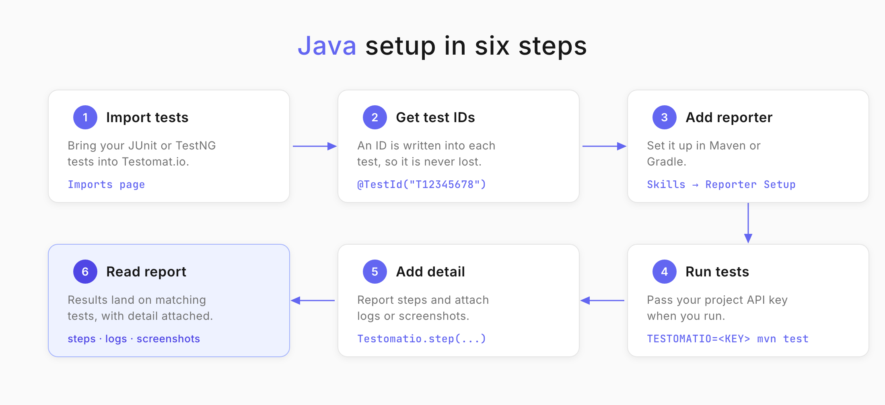
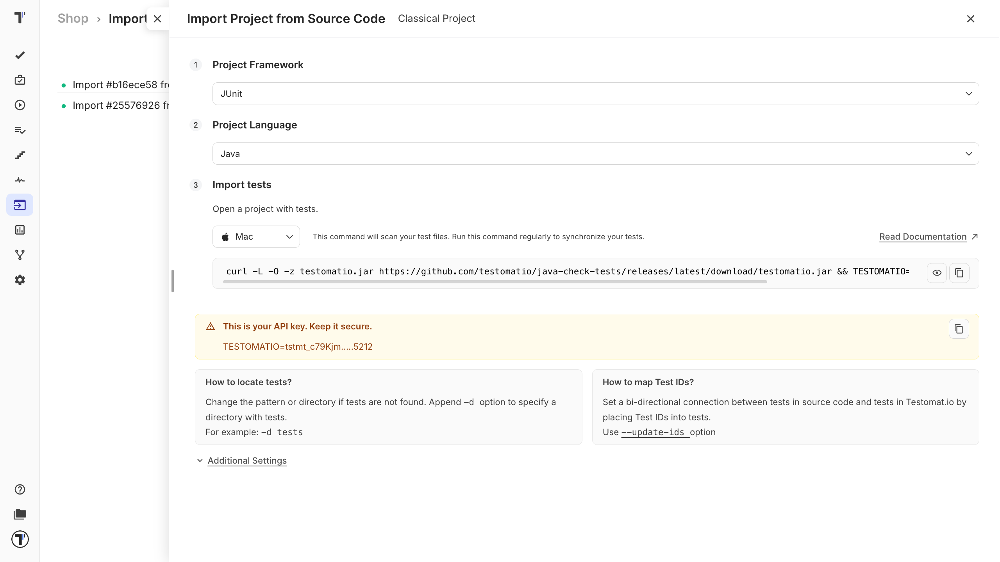
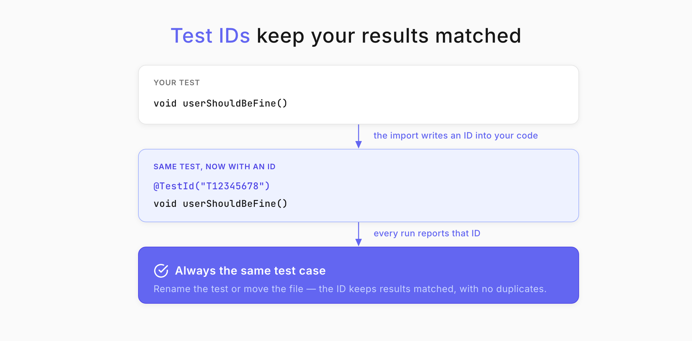

<!--
    ## Importing Tests
        - JUnit 5 support
        - TestNG support
        - parameterized tests
        - auto-assign test IDs
        - source code synchronization

    ## Reporting Tests
        - report execution results
        - local execution
        - artifacts
        - S3 integration
        - logs
        - CI/CD reporting
        - Gradle integration
        - Maven integration

    ## Advanced
        - parallel execution
        - run title configuration
-->

Welcome!

This tutorial walks you through connecting a Java test automation project to Testomat.io. You already have tests that run with **JUnit 5** or **TestNG** - now you will bring them into one place where you can plan them, report on them, and dig into failures.

You will have:

* Your Java tests imported into Testomat.io.
* Test IDs synced between your code and your project.
* Run reports with steps, logs, and screenshots attached.
* Parallel jobs reporting into a single run.

## Before you start

Make sure you have:

* A JDK installed, with Maven or Gradle set up for your project.
* A Java project with at least one JUnit 5 or TestNG test.
* A Testomat.io project you can sign in to, and its API key.

**No Java project handy?** Import the[ Testomat.io Java example project](https://github.com/testomatio/examples) and follow along with that.

## Import your tests

Importing brings your existing tests into Testomat.io so you can plan, run, and report on them. Everything starts on the **Imports** page.




On the **Imports** page:

1. Select **TestNG** or **JUnit** in the **Project Framework** field.
2. Select **Java** in the **Project Language** field.
3. Select your operating system under **Import tests** - Mac, Linux, or Windows.
4. Copy the command that Testomat.io generates for you.



Now open a terminal, navigate to your project, and run the command you copied.

When the import finishes, you will see a report of how many tests were found. That message means it worked - your tests are now on the **Tests** page.

:::note

For the full set of options, see the Testomat.io[ Import Tests from Source Code](https://docs.testomat.io/project/import-export/import/import-tests-from-source-code/) documentation.

:::

### Choose your import options

You can change how tests are imported:

| Option | Description |
|---|---|
| **Auto-assign Ids** | Assigns a unique ID to each test. |
| **Purge Old Ids** | Removes previously set IDs from tests. |
| **Disable Detached Tests** | Disables tests marked as detached. |
| **Prefer Source Code Structure** | Keeps your source code structure in the test hierarchy. |

### What gets imported from JUnit 5

Both plain and parameterized JUnit tests come across:

```java
@ParameterizedTest(name = "Create user {0}")
@ValueSource(strings = {"John", "Kate", "Mike"})
void createUser(String userName) {
    assertNotNull(userName);
}

@Test
void userShouldBeFine() {
    assertEquals("fine", user.getStatus());
}
```

### What gets imported from TestNG

TestNG tests are imported and managed the same way:

```java
@Test(dataProvider = "users")
public void createUser(String userName) {
    Assert.assertNotNull(userName);
}

@DataProvider
public Object[][] users() {
    return new Object[][]{
        {"John"},
        {"Kate"},
        {"Mike"}
    };
}
```

Testomat.io displays parameterized executions together with their parameter values.

## Sync test IDs

A test ID links a test in your code to its test case in Testomat.io. With IDs in place, Testomat.io tracks changes to a test instead of creating a duplicate every time your project grows.



Enable **Auto assign Ids** (`--update-ids`) during import, and Testomat.io writes an ID into each test for you.

Your test before the import:

```java
@Test
void userShouldBeFine() {
    assertEquals("fine", user.getStatus());
}
```

And after:

```java
@Test
@TestId("T12345678")
void userShouldBeFine() {
    assertEquals("fine", user.getStatus());
}
```

Your tests now carry the same IDs in your code and in your project.

Test IDs let Testomat.io identify a test even when its name, package, or source file changes.

## Set up the reporter

Before results can reach Testomat.io, your project needs the reporter. The quickest way is the **Reporter Setup Skill**, which detects your testing framework and build tool, installs the dependencies, and generates the configuration for you.

1. Go Testomat.io [skills repository](https://github.com/testomatio/skills/blob/master/skills/qa-e2e-tests-reporting/SKILL.md).
2. Follow the instructions to install the reporter.
3. Use the generated instructions for your project.

The skill supports JUnit and TestNG with both Maven and Gradle.

The Reporter Setup Skill is the recommended way to configure reporting for a new project.

## Report your results

Reports tell you what passed, what failed, and why. Pass your project API key in the `TESTOMATIO` environment variable when you run your tests.

With Gradle:

```shell
TESTOMATIO=<API_KEY> ./gradlew test
```

With Maven:

```shell
TESTOMATIO=<API_KEY> mvn test
```

Your results now appear in Testomat.io, associated with their matching test cases.

### Run only some of your tests

You don't have to run the whole suite. With Gradle:

```shell
./gradlew test --tests UserTests
./gradlew test --tests UserTests.userShouldBeFine
```
With Maven:

```shell
mvn -Dtest=UserTests test
mvn -Dtest=UserTests#userShouldBeFine test
```

## Report test steps

Steps show what happened inside a test, so you can see exactly where it failed.

Wrap a step inline:

```java
@Test
void userShouldBeFine() {
    Testomatio.step("Check user status",
        () -> assertEquals("fine", user.getStatus()));
}
```

Or annotate a method:

```java
import io.testomat.core.annotation.Step;

@Step("Check user status")
private void checkUserStatus() {
    assertEquals("fine", user.getStatus());
}

@Test
void userShouldBeFine() {
    checkUserStatus();
}
```

### If you already use Allure

Testomat.io imports and displays your existing Allure steps - you don't need to rewrite them.

```java
@Test
void userShouldBeFine() {
    Allure.step("Check user status", () -> {
        assertEquals("fine", user.getStatus());
    });
}
```

Annotated steps work too:

```java
import io.qameta.allure.Step;

@Step("Check user status")
private void checkUserStatus() {
    assertEquals("fine", user.getStatus());
}

```

With Allure integration enabled, step information is synchronized with Testomat.io and shown in the execution report.

## Attach artifacts

Logs, screenshots, videos, and reports make a failure much faster to diagnose. The Testomat.io reporter uploads these artifacts to your own S3 bucket and links them to the matching test results.


You can attach execution logs, HTML reports, screenshots, videos, generated files, and custom attachments.

1. Configure artifact generation in your test framework or build tool.
2. [Set Up S3 Bucket](https://docs.testomat.io/test-reporting/artifacts/#set-up-s3-bucket).
3. Configure the S3 integration in Testomat.io.
4. Run your tests.
5. Open a test result to view or download its artifacts.

:::note

S3 is only required for artifacts. Your test results - tests, statuses, and steps - sync to Testomat.io without it. Read more about [Artifacts](https://docs.testomat.io/usage/artifacts/).

:::

### Attach a file to a test

Attach a file directly to the test result:

```java
@Test
void userShouldBeFine() {
    Testomatio.artifact("build/logs/test.log");
}
```

The file appears in the test result, ready to view or download.

### Attach a file to a step

Attach a file to one specific step instead, so it sits in context:

```java
@Test
void userShouldBeFine() {
    Testomatio.step("Check user status", () -> {
        Testomatio.stepArtifact("screenshots/status.png");
        assertEquals("fine", user.getStatus());
    });
}
```

The attachment is displayed within that step, making it clear which action produced it.

### Attach files with Allure

Existing Allure attachments are imported automatically:

```java
Allure.addAttachment("Log File",
    Files.newInputStream([Path.of](Path.of)("logs/test.log")));
```

Annotated attachments are supported as well:

```java
import io.qameta.allure.Attachment;

@Attachment(value = "Screenshot", type = "image/png")
private byte[] screenshot() {
    return Files.readAllBytes(Path.of("screenshot.png"));
}
```

## Report parallel runs as one run

When you split tests across parallel jobs, each job reports separately by default. To collect them into a single run, give every job the same title and set `TESTOMATIO_SHARED_RUN`:

```bash
TESTOMATIO_TITLE="{TITLE}" TESTOMATIO_SHARED_RUN=1 <actual run command>
```

All parallel jobs now report into one run in Testomat.io.

Use a build or commit identifier as the title, so each set of parallel jobs maps to one identifiable run.

## Run your tests in CI

Store your API key as a secret, then pass it to your test command.

GitHub Actions:

```yaml
- name: Run Tests
  run: ./gradlew test
  env:
    TESTOMATIO: ${{ secrets.TESTOMATIO }}
```

Jenkins:

```groovy
withEnv(["TESTOMATIO=${TESTOMATIO}"]) {
    sh './gradlew test'
}
```

GitLab CI:

```yaml
test:
  script:
    - ./gradlew test
  variables:
    TESTOMATIO: $TESTOMATIO
```
Your pipeline now automatically reports every run to Testomat.io.

## Next Steps

* For more frameworks setup, see [Testomat.io Java Reporter](Testomat.io).
* Spot unstable and slow tests across your runs in[ Analytics](https://docs.testomat.io/project/analytics/).
* Group the tests that run together with[ Test Plans](https://docs.testomat.io/project/plans/).
* Get failures explained from your logs with[ AI-Powered Features](https://docs.testomat.io/advanced/ai-powered-features/ai-powered-features/).

## Related repositories

* [java-reporter](https://github.com/testomatio/java-reporter) - reports execution results, steps, and artifacts from JUnit and TestNG projects. 
* [java-check-tests](https://github.com/testomatio/java-check-tests) - imports Java tests, synchronizes test IDs, and maintains test metadata. 